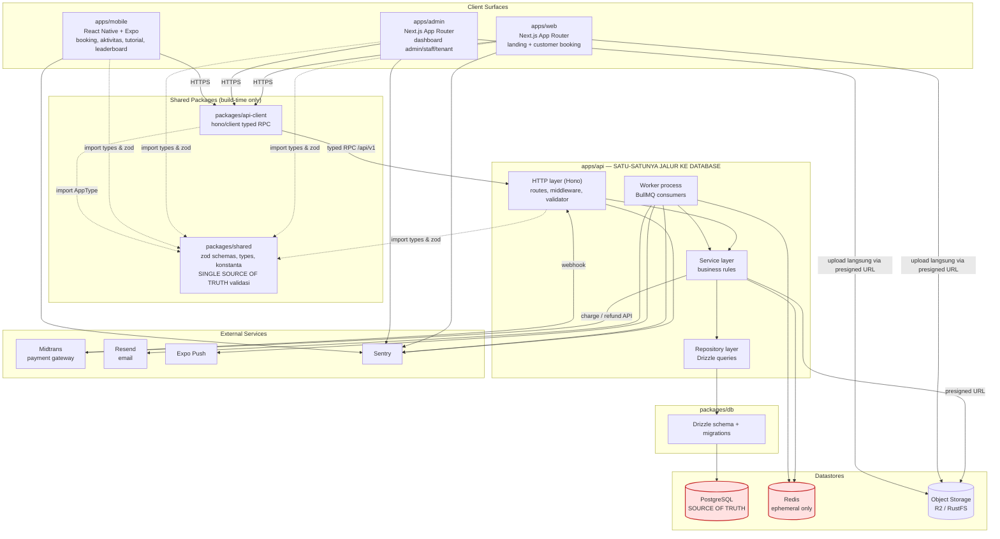
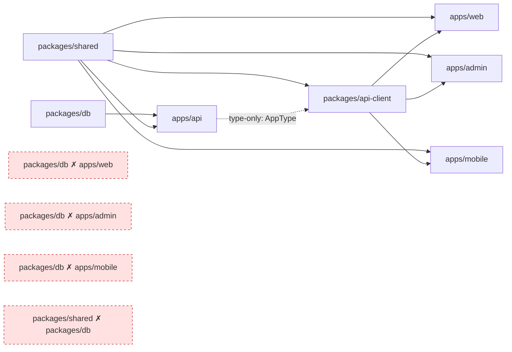
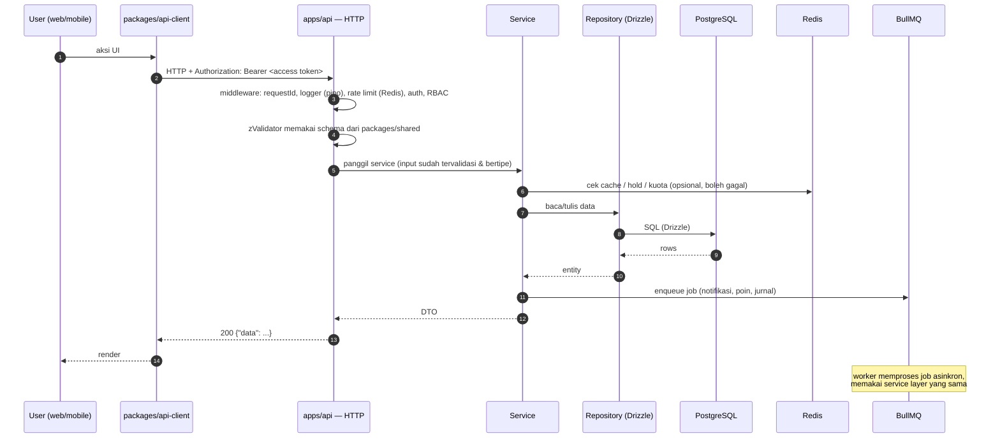
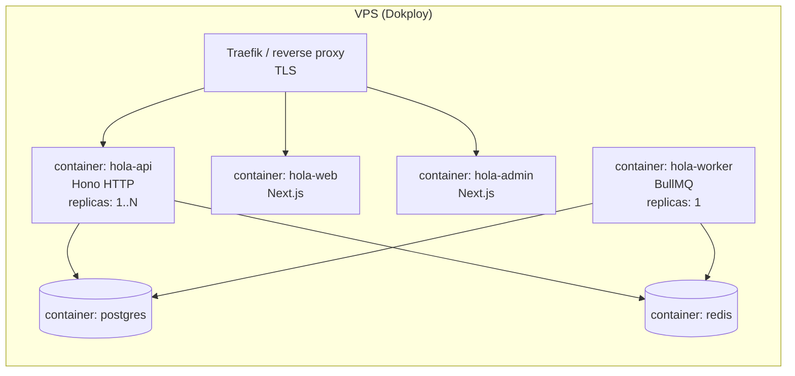

# 01 — ARCHITECTURE

> Prasyarat: [00-OVERVIEW.md](00-OVERVIEW.md).
> Terkait: [02-INFRASTRUCTURE.md](02-INFRASTRUCTURE.md) (deployment & runtime),
> [16-CONVENTIONS.md](16-CONVENTIONS.md) (struktur folder di dalam tiap app).

Semua keputusan di dokumen ini **sudah final**. Bagian "Alasan" ada supaya AI/developer
berikutnya tidak mengusulkan ulang alternatif yang sudah dipertimbangkan.

---

## 1. Diagram Arsitektur Tingkat Atas

**Cara membaca diagram:** garis penuh = komunikasi runtime; garis putus-putus = dependensi
build-time (import TypeScript). Kotak merah = datastore yang **hanya** boleh disentuh
`apps/api` (proses HTTP maupun worker).

---

## 2. Aturan Keras: Semua Akses Database Lewat `apps/api`

### Aturan

1. Hanya `apps/api` yang boleh membuka koneksi ke PostgreSQL dan Redis.
2. `apps/web`, `apps/admin`, `apps/mobile` **tidak boleh** meng-import `@hola/db`.
3. Next.js Server Component / Server Action / Route Handler di `apps/web` dan `apps/admin`
   **tidak boleh** query database. Mereka boleh melakukan server-side fetch ke `apps/api`
   (memakai `packages/api-client`) — itu tetap melewati HTTP dan lolos aturan.
4. `packages/shared` dan `packages/api-client` **tidak boleh** punya dependensi ke
   `packages/db` atau ke driver database apa pun.
5. Migration hanya dijalankan dari `apps/api` (atau script di `packages/db`) — bukan dari app
   frontend.

### Cara aturan ini ditegakkan (bukan sekadar imbauan)

| Mekanisme | Detail |
|---|---|
| Dependency boundary | `apps/web/package.json`, `apps/admin/package.json`, `apps/mobile/package.json` **tidak mencantumkan** `@hola/db`, `drizzle-orm`, `pg`, `postgres`, `ioredis`, `bullmq` sebagai dependency. |
| Lint rule | Biome `noRestrictedImports` di config masing-masing frontend app: pola terlarang `@hola/db`, `drizzle-orm`, `postgres`, `pg`, `ioredis`, `bullmq`. |
| CI check | Job `guard-db-boundary` di GitHub Actions: `grep -R` atas pola terlarang di `apps/web/src`, `apps/admin/src`, `apps/mobile/src` → gagal jika ada match. |
| Env boundary | `DATABASE_URL` dan `REDIS_URL` **tidak pernah** dimasukkan ke env app frontend (termasuk tidak sebagai `NEXT_PUBLIC_*`). Lihat [02 § Env Vars](02-INFRASTRUCTURE.md#8-daftar-environment-variable-per-app). |

### Alasan

- **Satu tempat penegakan aturan bisnis.** Anti double-booking, kuota promo, dan pipeline
  harga hanya benar kalau ada satu pintu. Kalau `apps/admin` boleh insert `bookings` sendiri,
  invariant `slot_claims` bisa dilanggar tanpa terdeteksi.
- **Mobile tidak punya pilihan lain.** React Native tidak bisa akses PostgreSQL. Jika kita
  izinkan web memakai jalur lain, kita berakhir dengan dua implementasi rule yang berbeda.
- **Audit & observability terpusat.** Semua mutasi lewat satu proses → satu tempat untuk
  `audit_logs`, rate limiting, dan tracing.
- **Kesiapan skala.** API dapat di-scale horizontal terpisah dari frontend.

---

## 3. Batas Tanggung Jawab per App & Package

### 3.1 `apps/api` — Hono + Drizzle

| Bertanggung jawab atas | TIDAK bertanggung jawab atas |
|---|---|
| Seluruh business rule & validasi server-side | Rendering UI |
| Satu-satunya akses PostgreSQL, Redis, object storage (server-side) | Menyimpan state UI |
| Autentikasi, penerbitan & rotasi token, RBAC | Menyimpan token di client |
| Integrasi payment gateway + penerimaan webhook | Menampilkan halaman pembayaran (dilakukan Snap di client) |
| Enqueue & consume BullMQ job | — |
| Penerbitan presigned URL untuk upload | Menerima byte file upload (client upload langsung ke storage) |
| Ekspor `AppType` (tipe route Hono) untuk `packages/api-client` | — |

Dua entry point, **satu codebase**:

| Proses | Entry | Isi |
|---|---|---|
| `api` (HTTP server) | `apps/api/src/index.ts` | Hono app, listen port. Boleh **enqueue** job, tidak boleh memproses job. |
| `worker` (BullMQ consumer) | `apps/api/src/worker.ts` | Semua BullMQ `Worker` + `QueueScheduler`. Memakai service layer yang sama. |

Alasan satu codebase, dua proses: service layer & repository dipakai bersama, tapi worker
tidak boleh mati/restart bersama HTTP server, dan resource-nya di-scale berbeda.

### 3.2 `apps/web` — Next.js App Router (customer)

| Bertanggung jawab | TIDAK |
|---|---|
| Landing page, halaman lapangan, harga, event publik | Business rule |
| Alur booking customer: pilih slot → checkout → redirect Snap → halaman status | Hitung harga sendiri (harga selalu dari `POST /bookings/quote`) |
| SEO (metadata, sitemap, OG image) | Akses DB |
| Session client (menyimpan access token di memori, refresh via cookie) | Menyimpan refresh token di localStorage |

### 3.3 `apps/admin` — Next.js App Router (back-office)

| Bertanggung jawab | TIDAK |
|---|---|
| Dashboard admin & staff: jadwal, booking manual, harga, promo, event, turnamen, tenant, CRM, HRIS, finance | Business rule |
| Portal tenant (role `tenant`): lihat kontrak & tagihan sendiri, unggah bukti bayar | Akses DB |
| Tabel data besar dengan filter + pagination offset | Perhitungan laporan (dihitung API) |

Satu app dengan dua pengalaman berdasarkan role, bukan dua app. Alasan: tenant hanya punya
3–4 halaman; app terpisah tidak sebanding dengan biaya maintenance.

### 3.4 `apps/mobile` — React Native (Expo)

| Bertanggung jawab | TIDAK |
|---|---|
| Booking, riwayat booking, pencatatan aktivitas olahraga, tutorial, leaderboard, daftar event & turnamen, push notification | Fungsi admin apa pun |
| Penyimpanan refresh token di `expo-secure-store` | Akses DB |
| Cache read-only untuk offline (lihat [15 § Offline](15-MOBILE.md#8-offline-behavior)) | Menulis offline selain queue aktivitas |

### 3.5 `packages/db`

Hanya berisi: schema Drizzle, relasi, enum, migration SQL, seed script, dan tipe hasil
inferensi (`InferSelectModel` / `InferInsertModel`). **Tidak** berisi business logic, tidak
berisi query kompleks (itu milik repository di `apps/api`).

Konsumen: hanya `apps/api`.

### 3.6 `packages/shared`

Single source of truth untuk validasi & konstanta lintas app.

Isi:
- Zod schema request/response per modul (`bookingCreateSchema`, `promoApplySchema`, dst.)
- Tipe domain turunan zod (`z.infer`)
- Enum & konstanta: status booking, status payment, `RATE_CLASS`, `POINT_RULE_CODE`,
  `ERROR_CODE`, nama queue & job BullMQ, nama Redis key builder (fungsi pure pembentuk string)
- Helper pure tanpa I/O: format rupiah, format tanggal WITA, validator alignment slot

Larangan: **tanpa** dependensi ke Node-only API (`fs`, `pg`, `ioredis`), karena dipakai di
React Native. Tanpa `process.env`.

### 3.7 `packages/api-client`

Typed RPC client berbasis `hono/client`, meng-import `AppType` dari `apps/api`.

Isi: factory `createHolaClient({ baseUrl, getAccessToken, onUnauthorized })`, logika refresh
token otomatis (single-flight), pemetaan error response ke `HolaApiError`.

Larangan: tanpa business rule, tanpa cache. Caching adalah tanggung jawab masing-masing app
(TanStack Query).

---

## 4. Diagram Dependensi Package

Aturan penting: `packages/api-client` → `apps/api` adalah **type-only import**
(`import type { AppType }`). Tidak ada runtime code `apps/api` yang masuk bundle frontend.
Ini dijaga dengan `verbatimModuleSyntax: true` di tsconfig.

---

## 5. Alur Request Standar

Aturan turunan:
- **Redis boleh gagal.** Setiap pemanggilan Redis di service dibungkus sehingga kegagalan
  (timeout, connection refused) tidak menggagalkan request — kecuali rate limiter, yang
  **fail-open** (izinkan request, catat warning). Detail: [02 § Aturan Redis](02-INFRASTRUCTURE.md#4-aturan-penggunaan-redis).
- **Enqueue job dilakukan setelah transaksi DB commit**, bukan di dalamnya. Kalau job harus
  dijamin terkirim, pola yang dipakai adalah: tulis baris "outbox" ke PostgreSQL dalam
  transaksi yang sama, lalu job periodik memindahkannya ke queue. Di v1 pola outbox **hanya**
  dipakai untuk jurnal keuangan (`finance.postJournalEntries`) dan pemberian poin
  (`gamification.awardPoints`), karena keduanya tidak boleh hilang. Notifikasi boleh
  best-effort tanpa outbox.

---

## 6. Keputusan Teknis & Alasannya

| # | Keputusan | Alasan | Alternatif yang ditolak & mengapa |
|---|---|---|---|
| A-01 | **Monorepo pnpm workspaces + Turborepo** | Tipe end-to-end dari DB → API → client tanpa publish package; satu PR bisa mengubah schema + API + UI secara atomik. Turborepo memberi cache task & graph dependency. | Polyrepo: sinkronisasi tipe jadi manual, versi drift. Nx: lebih berat dari kebutuhan. |
| A-02 | **Hono untuk API** | Ringan, berjalan di Node maupun edge, punya RPC client bertipe (`hono/client`) yang memberi type-safety ke frontend tanpa codegen, middleware ergonomis, `zValidator` menyatu dengan zod. | NestJS: boilerplate & decorator berat untuk tim kecil. Express: tanpa type-safe RPC, typing middleware lemah. tRPC: bagus untuk internal, tapi kita butuh REST publik untuk webhook gateway & kemungkinan integrasi pihak ketiga. |
| A-03 | **Drizzle ORM** | SQL-first: query yang dihasilkan mudah diprediksi (penting untuk index & partial unique index yang kita andalkan), tipe diturunkan dari schema, migration berbasis SQL yang bisa direview. Mendukung `ON CONFLICT`, partial index, dan raw SQL dengan aman. | Prisma: engine biner, kontrol SQL/partial-index lebih terbatas, migration shadow-DB merepotkan di Docker. TypeORM: pola aktif-record & maintenance kurang cocok. Kysely: bagus tapi tanpa migration/schema story yang setara. |
| A-04 | **PostgreSQL sebagai source of truth tunggal** | Butuh transaksi multi-tabel (booking + slot_claims + payment + promo redemption), constraint unik parsial untuk anti double-booking, dan jurnal keuangan berpasangan debit/kredit. Semua ini butuh ACID. | MySQL: partial/filtered index tidak didukung → anti double-booking harus akal-akalan. MongoDB: transaksi multi-dokumen mahal & constraint unik kondisional tidak ada. |
| A-05 | **Redis hanya untuk data yang boleh hilang** | Menghindari dua source of truth. Semua fungsi Redis (hold, cache, rate limit, idempotency cepat, leaderboard) punya jalur rekonstruksi dari PostgreSQL. | Menyimpan hold hanya di Redis: satu kali flush → double booking. Ditolak. |
| A-06 | **BullMQ untuk job** | Sudah butuh Redis; BullMQ memberi retry dengan backoff, repeatable/cron job, delayed job, dan dashboard. Semua job dirancang **idempoten** sehingga kehilangan/duplikasi Redis job tidak merusak data. | pg-boss (queue di PostgreSQL): mengurangi ketergantungan Redis, tapi Redis tetap dibutuhkan untuk hold & leaderboard, jadi tidak mengurangi komponen; ekosistem repeatable job BullMQ lebih matang. Cron OS: tanpa retry, tanpa visibilitas. |
| A-07 | **Next.js App Router untuk web & admin** | Web butuh SEO & rendering server (landing page, halaman event publik). Admin butuh routing & layout bertingkat serta streaming untuk tabel besar. Satu framework untuk dua app menekan biaya belajar. | Vite SPA untuk admin: mempercepat build, tapi menambah stack kedua. Ditolak untuk menjaga keseragaman. |
| A-08 | **Expo (managed) untuk mobile** | OTA update (EAS Update) untuk perbaikan cepat tanpa review store, Expo Push tanpa kelola sertifikat, expo-secure-store untuk refresh token, expo-notifications & expo-image siap pakai. | React Native bare: kontrol lebih besar, biaya ops jauh lebih tinggi untuk fitur v1. Flutter: bahasa berbeda, tidak bisa pakai `packages/shared`. |
| A-09 | **`packages/shared` sebagai satu-satunya sumber zod** | Aturan validasi tidak boleh berbeda antara client dan server. Frontend memakai schema yang sama untuk form validation → error yang sama persis. | Duplikasi schema per app: pasti drift. Codegen dari OpenAPI: langkah build ekstra, kehilangan refinement zod. |
| A-10 | **Uang sebagai `bigint` rupiah utuh** | IDR tidak memakai sen dalam praktik; Midtrans `gross_amount` untuk IDR wajib integer. Menghindari galat floating point sepenuhnya. | `numeric(12,2)`: aman tapi memaksa konversi string di JS dan tidak dibutuhkan karena tidak ada desimal. `float`: dilarang. |
| A-11 | **Timestamp `timestamptz`, disimpan UTC, ditampilkan WITA** | Menghindari ambiguitas saat perhitungan durasi & job cron. Konversi presentasi dilakukan di ujung (formatter di `packages/shared`). | Menyimpan waktu lokal tanpa zona: rusak saat server berubah TZ. |
| A-12 | **ID = UUID v7 dibuat di aplikasi** | Terurut waktu (index-friendly, mirip serial untuk B-tree), aman diekspos di URL, bisa dibuat client-side untuk idempotency (mis. queue aktivitas offline mobile). | `serial`/`bigserial`: membocorkan volume bisnis & tidak bisa dibuat client. UUID v4: buruk untuk locality index. |
| A-13 | **Kode manusia terpisah dari ID** (`booking_code`, `invoice_number`) | Staff dan customer butuh referensi pendek yang bisa dibacakan lewat telepon. Dibuat dari sequence PostgreSQL + prefix, bukan random. | Memakai UUID di komunikasi: tidak praktis. |
| A-14 | **Satu app admin untuk 3 role** (admin/staff/tenant) | Volume halaman tenant kecil; RBAC per route sudah cukup memisahkan. | App tenant terpisah: 4 app untuk dipelihara tanpa manfaat sebanding. |
| A-15 | **Upload file langsung ke object storage via presigned URL** | API tidak jadi bottleneck bandwidth; tidak ada file besar melewati proses Node. Baris `media_files` dibuat lebih dulu (status `pending`) lalu dikonfirmasi. | Upload lewat API: memory & timeout risk, terutama untuk poster event & video. |
| A-16 | **Docker + Dokploy di VPS** | Satu VPS cukup untuk skala satu gedung; Dokploy memberi deploy via webhook, env management, dan reverse proxy tanpa biaya PaaS. | Vercel + Neon + Upstash: nyaman tapi biaya berulang lebih tinggi dan latensi ke Indonesia lebih buruk; juga memecah operasional ke banyak vendor. Kubernetes: overkill. |
| A-17 | **Pola Service / Repository di API** | Business rule bisa diuji tanpa HTTP, dan worker memakai service yang sama dengan route. Repository mengisolasi Drizzle sehingga transaksi bisa dikomposisi. | Logic di route handler: tidak bisa dipakai worker, sulit dites. |
| A-18 | **Biome menggantikan ESLint + Prettier** | Satu tool, cepat, satu file config untuk monorepo, cukup untuk aturan yang kita butuhkan (termasuk `noRestrictedImports`). | ESLint + Prettier: dua config, lebih lambat di CI. |
| A-19 | **Vitest untuk semua test** | Satu runner untuk API, packages, dan komponen web/admin; cepat, kompatibel ESM. | Jest: konfigurasi ESM/TS lebih berat. |
| A-20 | **Versi API di path (`/api/v1`)** | Mobile app terpasang di perangkat user dan tidak bisa dipaksa update. Versi di path membuat breaking change bisa hidup berdampingan. | Header versioning: lebih sulit di-debug dan di-cache. |

---

## 7. Pemisahan Proses & Skala

Aturan:
- `hola-worker` **replicas: 1** di v1. Job repeatable (cron) BullMQ aman dengan >1 replica,
  tetapi `booking.releaseExpiredHolds`, `cafe.generateMonthlyInvoices`, dan
  `gamification.closeLeaderboardPeriod` mengandalkan idempotency, bukan single-instance-lock.
  Tetap dibatasi 1 replica agar log mudah dibaca dan beban DB terkendali. Jika kelak >1,
  wajib pastikan setiap job punya kunci idempotency di PostgreSQL (sudah dirancang demikian).
- `hola-api` boleh di-scale karena stateless (token JWT, tanpa session in-memory).
- Migration dijalankan sebagai **release step sebelum container baru menerima traffic**, satu
  kali per deploy. Detail: [02 § Deployment](02-INFRASTRUCTURE.md#3-alur-deployment).

---

## 8. Aturan Penempatan Kode (di mana logika baru ditulis)

| Jenis logika | Lokasi | Contoh |
|---|---|---|
| Validasi bentuk input (shape, tipe, range) | `packages/shared` (zod) | `starts_at` harus ISO datetime; `quantity` 1..8 |
| Aturan bisnis (butuh data/DB) | `apps/api/src/modules/<modul>/*.service.ts` | slot tidak boleh diklaim dua kali; kuota promo |
| Query | `apps/api/src/modules/<modul>/*.repository.ts` | ambil slot terklaim per court per tanggal |
| Kalkulasi harga | `apps/api/src/modules/pricing/` — **satu-satunya** implementasi pipeline [07](07-MODULE-PAYMENT.md#3-pricing-pipeline-satu-satunya-sumber-perhitungan-harga) | base → rate class → promo → total |
| Klaim slot | `apps/api/src/modules/slots/` — **satu-satunya** implementasi klaim [03 § Slot Ownership](03-DATA-MODEL.md#8-slot-ownership-mekanisme-terpadu) | dipakai booking, event, match, maintenance |
| Definisi job & handler | `apps/api/src/jobs/<queue>/<jobName>.job.ts` | `booking.releaseExpiredHolds` |
| Nama queue/job, error code, konstanta status | `packages/shared/src/constants/` | `QUEUE.BOOKING`, `JOB.BOOKING_RELEASE_EXPIRED_HOLDS` |
| Format tampilan (rupiah, tanggal) | `packages/shared/src/format/` | `formatIDR`, `formatWita` |
| State UI, data fetching, cache | app masing-masing (TanStack Query) | — |

Prinsip: **kalau sebuah aturan bisa diakali dengan memanggil endpoint lain, aturan itu ada di
tempat yang salah.** Pindahkan ke service layer.

---

## 9. Yang TIDAK Ada di Arsitektur v1

Ditulis eksplisit agar tidak ditambahkan "sekalian". Lihat juga [17-NON-GOALS.md](17-NON-GOALS.md).

- Tidak ada API gateway / BFF terpisah. `packages/api-client` sudah cukup.
- Tidak ada microservice. `apps/api` adalah satu service modular (modular monolith).
- Tidak ada GraphQL.
- Tidak ada event bus eksternal (Kafka/NATS/RabbitMQ). BullMQ cukup.
- Tidak ada websocket/realtime push ke browser di v1. Ketersediaan slot memakai polling +
  invalidasi cache (lihat [06 § Ketersediaan](06-MODULE-BOOKING.md#5-pembacaan-ketersediaan--caching)).
- Tidak ada multi-tenancy (satu instance = satu badan usaha Hola).
- Tidak ada feature flag service eksternal; flag disimpan di `app_settings` + env.
- Tidak ada read replica PostgreSQL.
- Tidak ada CDN kustom di depan Next.js selain yang disediakan Cloudflare untuk asset R2.
