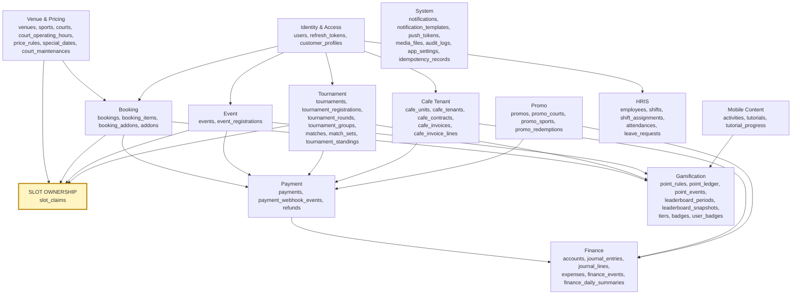
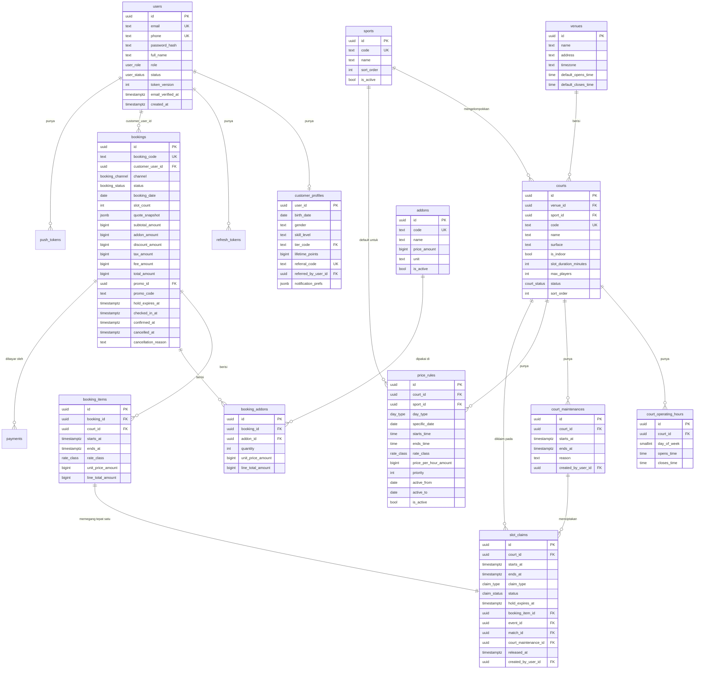
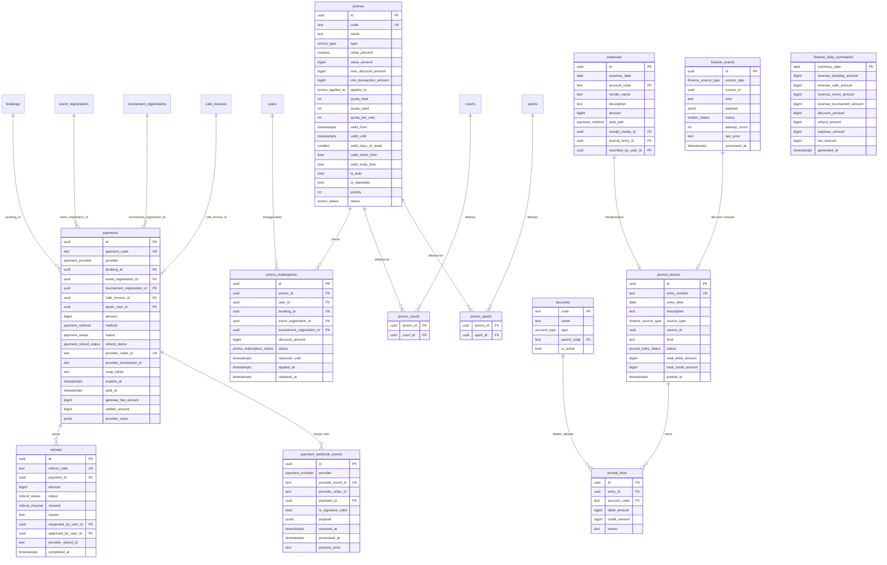
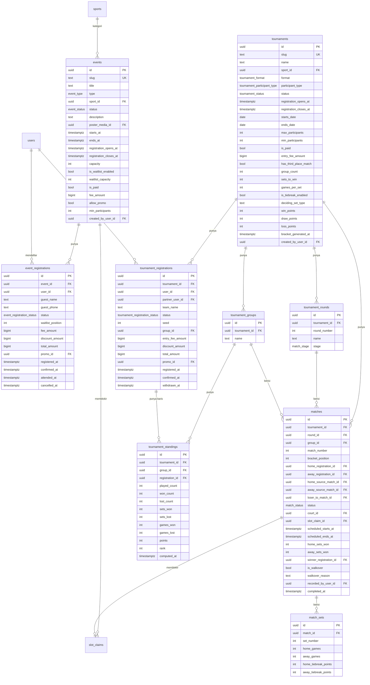
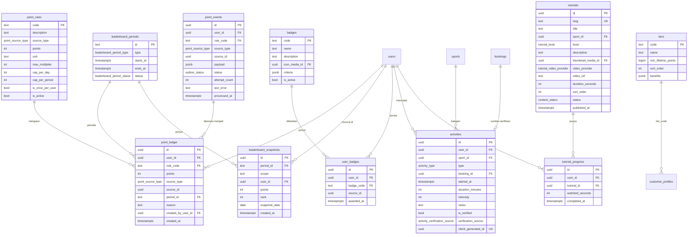
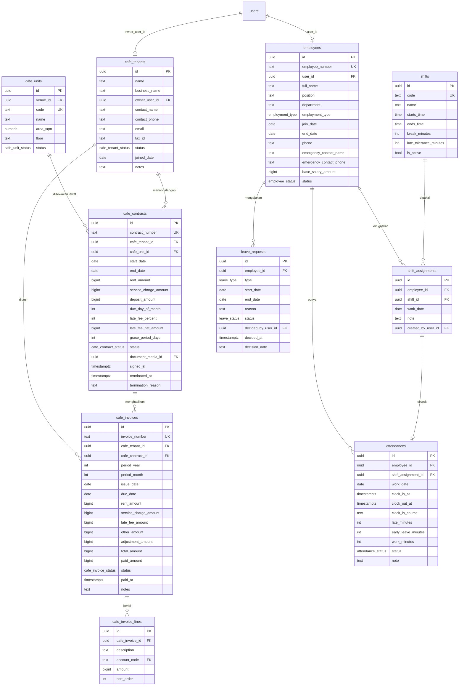
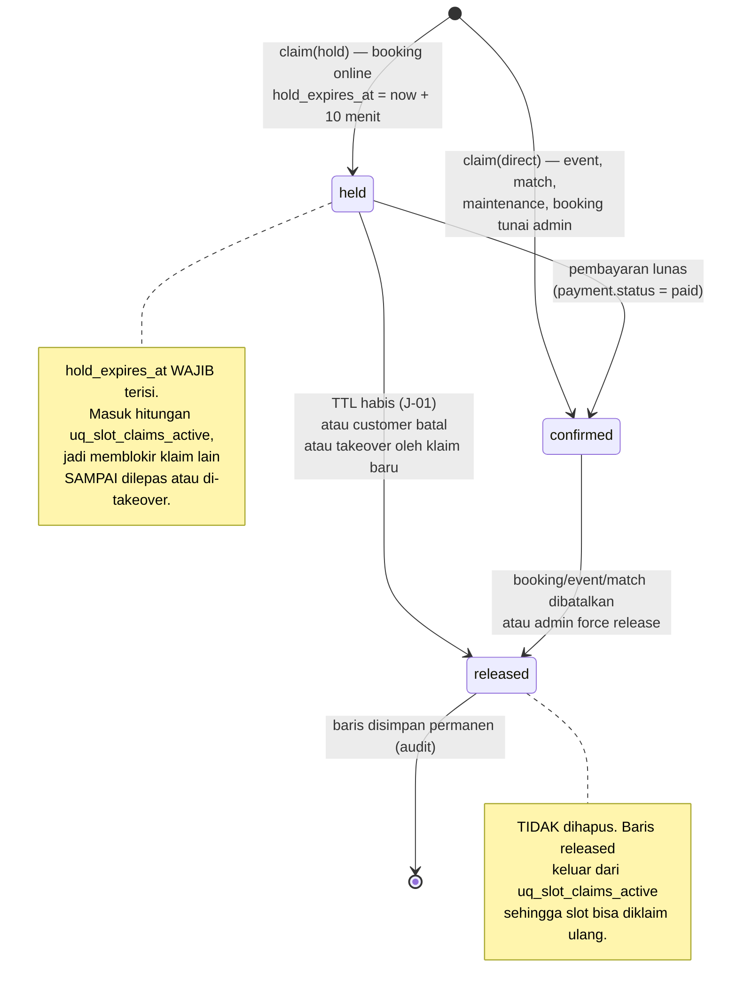
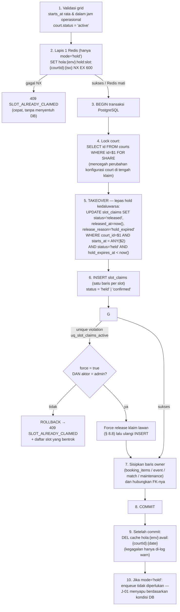

# 03 — DATA MODEL

> Prasyarat: [00-OVERVIEW.md](00-OVERVIEW.md), [01-ARCHITECTURE.md](01-ARCHITECTURE.md).
> Dokumen ini adalah **kontrak nama**. Nama tabel, kolom, dan enum di sini wajib dipakai
> identik di `packages/db`, `packages/shared`, dan seluruh API.
> Bagian terpenting: [§ 8 Slot Ownership](#8-slot-ownership-mekanisme-terpadu) — baca sebelum
> menyentuh booking, event, atau match.

---

## 1. Aturan Umum & Konvensi Penamaan

| Aturan | Ketentuan | Contoh benar | Contoh salah |
|---|---|---|---|
| Nama tabel | `snake_case`, **plural**, bahasa Inggris | `booking_items`, `cafe_invoices` | `BookingItem`, `booking_item` |
| Nama kolom | `snake_case`, bahasa Inggris | `starts_at`, `total_amount` | `startsAt`, `totalAmt` |
| Primary key | selalu kolom bernama `id`, tipe `uuid` | `id uuid PRIMARY KEY` | `booking_id` sebagai PK |
| Foreign key | `<tabel_singular>_id` | `court_id`, `cafe_tenant_id` | `courtId`, `fk_court` |
| Boolean | prefiks `is_`, `has_`, atau `allow_` | `is_active`, `has_waitlist`, `allow_promo` | `active`, `enabled` |
| Timestamp | suffiks `_at`, tipe `timestamptz` | `created_at`, `paid_at`, `cancelled_at` | `create_time`, `date_paid` |
| Tanggal (tanpa jam) | suffiks `_date`, tipe `date` | `due_date`, `work_date` | `due_at` untuk tanggal murni |
| Waktu jam saja | suffiks `_time`, tipe `time` | `opens_time`, `closes_time`, `starts_time` | `opens_at` (suffiks `_at` khusus `timestamptz`) |
| Uang | suffiks `_amount`, tipe `bigint` (rupiah utuh) | `total_amount`, `rent_amount` | `price` (ambigu), `total_price_idr` |
| Persen | suffiks `_percent`, tipe `numeric(5,2)` | `revenue_share_percent` | `share` |
| Jumlah/hitungan | suffiks `_count` atau `_quantity` | `slot_count`, `quantity` | `qty`, `num` |
| Durasi | suffiks `_minutes` / `_seconds` / `_days` | `slot_duration_minutes` | `duration` |
| Enum | tipe PostgreSQL enum, dinamai `<konteks>_<hal>` | `booking_status`, `claim_type` | `status_enum` |
| Kolom status | selalu bernama `status`, bertipe enum | `bookings.status` | `booking_state`, `state` |
| JSON | suffiks `_snapshot`, `_prefs`, `_config`, `_meta`, tipe `jsonb` | `quote_snapshot` | `data` |
| Kode manusia | suffiks `_code` (alfanumerik pendek) atau `_number` (bernomor urut) | `booking_code`, `invoice_number` | `ref`, `no` |
| Tabel join | `<tabel_a>_<tabel_b>` alfabetis | `promo_courts`, `user_badges` | `court_promo_map` |
| Index | `idx_<tabel>_<kolom...>` | `idx_bookings_customer_user_id` | — |
| Unique index | `uq_<tabel>_<kolom...>` | `uq_slot_claims_active` | — |
| Check constraint | `ck_<tabel>_<aturan>` | `ck_slot_claims_single_owner` | — |
| Foreign key constraint | `fk_<tabel>_<kolom>` | `fk_booking_items_booking_id` | — |

### Larangan

1. **Tidak ada kolom `tenant_id` untuk isolasi data.** Hola adalah aplikasi single-tenant.
   Kata "tenant" di produk ini berarti **penyewa ruang cafe** dan hanya muncul sebagai
   `cafe_tenant_id`. Lihat glossary di [00](00-OVERVIEW.md#3-glossary-istilah-domain).
2. **Tidak ada `float`/`double` untuk uang.** Hanya `bigint`.
3. **Tidak ada `timestamp without time zone`.** Selalu `timestamptz`.
4. **Tidak ada kolom bertipe teks bebas untuk status.** Selalu enum.
5. **Tidak ada hard delete** pada: `bookings`, `payments`, `refunds`, `journal_entries`,
   `journal_lines`, `point_ledger`, `cafe_invoices`, `audit_logs`, `payment_webhook_events`.
   Gunakan status (`cancelled`, `voided`, `released`) atau baris pembalik.
6. **Tidak ada relasi polimorfik berbasis `(type, id)` tanpa FK.** Pola yang dipakai adalah
   **kolom FK nullable + CHECK "tepat satu tidak null"** sehingga integritas referensial tetap
   dijaga PostgreSQL. Berlaku untuk `slot_claims` dan `payments`.

---

## 2. Konvensi Tipe Data & Kolom Standar

### Kolom standar yang ada di hampir semua tabel

| Kolom | Tipe | Default | Keterangan |
|---|---|---|---|
| `id` | `uuid` | dibuat aplikasi (**UUID v7**) | Terurut waktu; jangan pakai `gen_random_uuid()` (v4) kecuali untuk tabel yang tidak pernah di-range-scan |
| `created_at` | `timestamptz` | `now()` | — |
| `updated_at` | `timestamptz` | `now()` | Di-update aplikasi (repository base) pada setiap UPDATE |

Kolom audit tambahan pada tabel yang dimutasi manusia:

| Kolom | Tipe | Keterangan |
|---|---|---|
| `created_by_user_id` | `uuid` NULL FK `users.id` | NULL berarti dibuat sistem/job |
| `updated_by_user_id` | `uuid` NULL FK `users.id` | — |

### Aturan tipe

| Konsep | Tipe PostgreSQL | Catatan |
|---|---|---|
| Uang | `bigint` | Rupiah utuh, tanpa desimal. `150000` = Rp 150.000. Tidak boleh negatif kecuali disebut eksplisit (mis. `journal_lines`, `point_ledger`) |
| Waktu kejadian | `timestamptz` | Disimpan UTC. Presentasi WITA dilakukan di ujung |
| Tanggal bisnis | `date` | Selalu tanggal dalam zona `Asia/Makassar`. Konversi dilakukan **satu kali** oleh helper di `packages/shared` |
| Jam operasional | `time` | Tanpa zona; dipasangkan dengan `date` + zona venue saat dihitung |
| Persentase | `numeric(5,2)` | `12.50` = 12,5% |
| Teks pendek berkode | `text` + CHECK atau enum | Tidak memakai `varchar(n)`; batas panjang divalidasi zod |
| Teks panjang | `text` | — |
| Data semi-struktur | `jsonb` | Wajib punya zod schema di `packages/shared` yang memvalidasi bentuknya |
| Daftar hari dalam minggu | `smallint[]` | `0`=Minggu … `6`=Sabtu (mengikuti `EXTRACT(DOW)` PostgreSQL) |

### Format kode manusia

| Kode | Format | Sumber | Contoh |
|---|---|---|---|
| `bookings.booking_code` | `HB-{YYMMDD}-{seq4}` | sequence harian `seq_booking_code` | `HB-260728-0042` |
| `payments.payment_code` | `HP-{YYMMDD}-{seq4}` | sequence `seq_payment_code` | `HP-260728-0031` |
| `cafe_invoices.invoice_number` | `INV-{YYYYMM}-{seq3}` | sequence bulanan | `INV-202607-004` |
| `refunds.refund_code` | `HR-{YYMMDD}-{seq3}` | sequence | `HR-260728-002` |
| `journal_entries.entry_number` | `JE-{YYYYMM}-{seq5}` | sequence bulanan | `JE-202607-00128` |
| `employees.employee_number` | `EMP-{seq4}` | sequence | `EMP-0007` |
| `courts.code` | manual, huruf besar | admin | `PDL-01` |
| `cafe_units.code` | manual, huruf besar | admin | `U-01` |

Aturan: kode dibuat **di dalam transaksi** yang membuat barisnya, memakai PostgreSQL sequence
(bukan `count(*) + 1`). Kolomnya UNIQUE.

---

## 3. Daftar Enum

Semua enum didefinisikan sebagai tipe enum PostgreSQL **dan** sebagai konstanta di
`packages/shared/src/constants/enums.ts`. Nilainya wajib identik.

**Total: 53 enum.** Tabel di bawah adalah daftar lengkapnya — tidak ada enum lain di v1.
Menambah enum berarti menambah barisnya di sini lebih dulu, lalu di `enums.ts`, lalu di
migration. Dua test menjaga ketiganya tetap sinkron: satu unit test membandingkan `enums.ts`
dengan tabel ini, satu test integrasi membandingkan `enums.ts` dengan `pg_enum` di database uji.

| Nama enum | Nilai | Dipakai di |
|---|---|---|
| `user_role` | `customer`, `admin`, `staff`, `tenant` | `users.role` |
| `user_status` | `active`, `suspended`, `deleted` | `users.status` |
| `court_status` | `active`, `maintenance`, `inactive` | `courts.status` |
| `rate_class` | `peak`, `offpeak`, `special` | `price_rules.rate_class`, `booking_items.rate_class` |
| `day_type` | `weekday`, `weekend`, `holiday`, `specific_date` | `price_rules.day_type` |
| `claim_type` | `booking`, `event`, `match`, `maintenance` | `slot_claims.claim_type` |
| `claim_status` | `held`, `confirmed`, `released` | `slot_claims.status` |
| `booking_status` | `pending_payment`, `confirmed`, `completed`, `cancelled`, `expired`, `no_show` | `bookings.status` |
| `booking_channel` | `web`, `mobile`, `admin`, `walk_in` | `bookings.channel` |
| `payment_status` | `pending`, `paid`, `expired`, `failed`, `cancelled` | `payments.status` |
| `payment_refund_status` | `none`, `pending`, `partial`, `full` | `payments.refund_status` |
| `payment_method` | `qris`, `gopay`, `shopeepay`, `bank_transfer_va`, `credit_card`, `cash`, `manual_transfer` | `payments.method` |
| `payment_provider` | `midtrans`, `manual` | `payments.provider` |
| `refund_status` | `requested`, `approved`, `processing`, `completed`, `rejected`, `failed` | `refunds.status` |
| `refund_channel` | `gateway`, `manual_transfer`, `cash` | `refunds.channel` |
| `promo_type` | `percent`, `fixed`, `free_slot` | `promos.type` |
| `promo_applies_to` | `booking`, `event`, `tournament`, `all` | `promos.applies_to` |
| `promo_status` | `draft`, `active`, `paused`, `expired`, `archived` | `promos.status` |
| `promo_redemption_status` | `reserved`, `applied`, `released` | `promo_redemptions.status` |
| `event_type` | `open_play`, `coaching_clinic`, `community_gathering`, `other` | `events.type` |
| `event_status` | `draft`, `published`, `registration_open`, `registration_closed`, `ongoing`, `completed`, `cancelled` | `events.status` |
| `event_registration_status` | `pending_payment`, `confirmed`, `waitlisted`, `cancelled`, `attended`, `no_show` | `event_registrations.status` |
| `tournament_format` | `knockout`, `round_robin` | `tournaments.format` |
| `tournament_status` | `draft`, `registration_open`, `registration_closed`, `seeding`, `ongoing`, `completed`, `cancelled` | `tournaments.status` |
| `tournament_participant_type` | `single`, `double`, `team` | `tournaments.participant_type` |
| `tournament_registration_status` | `pending_payment`, `confirmed`, `withdrawn`, `disqualified` | `tournament_registrations.status` |
| `match_stage` | `group`, `knockout` | `tournament_rounds.stage` |
| `match_status` | `pending_schedule`, `scheduled`, `ongoing`, `completed`, `walkover`, `cancelled` | `matches.status` |
| `point_source_type` | `booking`, `match`, `tournament`, `event`, `activity`, `manual`, `referral`, `profile` | `point_ledger.source_type` |
| `leaderboard_period_type` | `monthly`, `seasonal`, `alltime` | `leaderboard_periods.type` |
| `leaderboard_period_status` | `upcoming`, `active`, `closed` | `leaderboard_periods.status` |
| `activity_type` | `match`, `practice`, `training`, `other` | `activities.type` |
| `activity_verification_source` | `booking`, `checkin`, `manual`, `none` | `activities.verification_source` |
| `tutorial_level` | `beginner`, `intermediate`, `advanced` | `tutorials.level` |
| `tutorial_video_provider` | `youtube`, `r2`, `stream` | `tutorials.video_provider` |
| `content_status` | `draft`, `published`, `archived` | `tutorials.status` |
| `cafe_unit_status` | `available`, `occupied`, `maintenance` | `cafe_units.status` |
| `cafe_tenant_status` | `prospect`, `active`, `suspended`, `terminated` | `cafe_tenants.status` |
| `cafe_contract_status` | `draft`, `active`, `expiring`, `ended`, `terminated` | `cafe_contracts.status` |
| `cafe_invoice_status` | `draft`, `issued`, `partially_paid`, `paid`, `overdue`, `void` | `cafe_invoices.status` |
| `account_type` | `asset`, `liability`, `equity`, `revenue`, `contra_revenue`, `expense` | `accounts.type` |
| `journal_entry_status` | `draft`, `posted`, `voided` | `journal_entries.status` |
| `finance_source_type` | `booking`, `cafe_invoice`, `cafe_contract`, `event_registration`, `tournament_registration`, `payment`, `refund`, `expense`, `manual` | `journal_entries.source_type`, `finance_events.source_type` |
| `employment_type` | `fulltime`, `parttime`, `contract`, `intern` | `employees.employment_type` |
| `employee_status` | `active`, `inactive`, `resigned`, `terminated` | `employees.status` |
| `attendance_status` | `present`, `late`, `absent`, `leave`, `holiday`, `day_off` | `attendances.status` |
| `leave_type` | `annual`, `sick`, `unpaid`, `other` | `leave_requests.type` |
| `leave_status` | `pending`, `approved`, `rejected`, `cancelled` | `leave_requests.status` |
| `notification_channel` | `email`, `push`, `whatsapp`, `inapp` | `notifications.channel` |
| `notification_status` | `queued`, `sent`, `failed`, `skipped` | `notifications.status` |
| `media_status` | `pending`, `ready`, `deleted` | `media_files.status` |
| `media_kind` | `court_photo`, `event_poster`, `tutorial_thumbnail`, `avatar`, `contract_document`, `payment_proof`, `expense_receipt` | `media_files.kind` |
| `outbox_status` | `pending`, `processing`, `done`, `failed` | `point_events.status`, `finance_events.status` |

---

## 4. Peta Domain & ERD

ERD dipecah per domain agar terbaca. Tabel yang muncul di lebih dari satu diagram adalah tabel
yang sama.

### 4.1 Peta domain



`slot_claims` adalah **hub**: empat domain berbeda mengklaim waktu lapangan melalui satu tabel
ini. Itulah inti [§ 8](#8-slot-ownership-mekanisme-terpadu).

### 4.2 ERD — Identity, Venue, Slot, Booking



### 4.3 ERD — Payment, Promo, Finance



### 4.4 ERD — Event, Tournament, Match



### 4.5 ERD — Gamification & Mobile



### 4.6 ERD — Cafe Tenant & HRIS



---

## 5. Entitas: Identity & Access

Detail aturan auth ada di [05-AUTH.md](05-AUTH.md).

### `users`

| Kolom | Tipe | Null | Keterangan |
|---|---|---|---|
| `id` | uuid | ✗ | PK |
| `role` | `user_role` | ✗ | Satu role per user. Tidak ada multi-role di v1 |
| `email` | text | ✓ | UNIQUE (case-insensitive, disimpan lowercase). NULL diizinkan untuk customer yang mendaftar via nomor HP |
| `phone` | text | ✓ | UNIQUE. Format E.164 (`+62812…`) |
| `password_hash` | text | ✓ | argon2id. NULL untuk user yang hanya login OTP |
| `full_name` | text | ✗ | — |
| `avatar_media_id` | uuid FK `media_files` | ✓ | — |
| `status` | `user_status` | ✗ | Default `active` |
| `token_version` | int | ✗ | Default 0. Dinaikkan untuk mencabut semua access token user |
| `email_verified_at` | timestamptz | ✓ | — |
| `phone_verified_at` | timestamptz | ✓ | — |
| `last_login_at` | timestamptz | ✓ | — |
| `created_at`, `updated_at` | timestamptz | ✗ | — |

Constraint: `ck_users_identifier` — `email IS NOT NULL OR phone IS NOT NULL`.

### `refresh_tokens`

| Kolom | Tipe | Null | Keterangan |
|---|---|---|---|
| `id` | uuid | ✗ | PK. Dipakai sebagai `jti` refresh |
| `user_id` | uuid FK | ✗ | — |
| `token_hash` | text | ✗ | SHA-256 dari token opaque. Token mentah **tidak pernah** disimpan |
| `family_id` | uuid | ✗ | Rantai rotasi. Reuse token lama → seluruh family dicabut |
| `parent_id` | uuid FK self | ✓ | — |
| `device_label` | text | ✓ | Mis. `iPhone 14 — Expo` |
| `ip_address` | text | ✓ | — |
| `user_agent` | text | ✓ | — |
| `expires_at` | timestamptz | ✗ | — |
| `revoked_at` | timestamptz | ✓ | — |
| `revoked_reason` | text | ✓ | `rotated`, `logout`, `reuse_detected`, `admin_revoke` |
| `last_used_at` | timestamptz | ✓ | — |

UNIQUE `token_hash`. Index `(user_id, revoked_at)`.

### `customer_profiles`

PK = `user_id` (relasi 1:1 dengan `users` untuk role `customer`).

| Kolom | Tipe | Null | Keterangan |
|---|---|---|---|
| `user_id` | uuid PK FK | ✗ | — |
| `birth_date` | date | ✓ | — |
| `gender` | text | ✓ | `male` \| `female` \| `undisclosed` |
| `skill_level` | text | ✓ | `beginner` \| `intermediate` \| `advanced` — dilaporkan sendiri |
| `preferred_sport_id` | uuid FK `sports` | ✓ | — |
| `tier_code` | text FK `tiers` | ✗ | Default `bronze` |
| `lifetime_points` | bigint | ✗ | Default 0. Agregat dari `point_ledger` (poin positif sepanjang waktu). Dihitung ulang oleh J-24 |
| `referral_code` | text | ✗ | UNIQUE, 6 karakter alfanumerik |
| `referred_by_user_id` | uuid FK `users` | ✓ | — |
| `notification_prefs` | jsonb | ✗ | Default `{"push":true,"email":true,"whatsapp":false}` |
| `internal_notes` | text | ✓ | CRM — hanya terlihat admin/staff |

---

## 6. Entitas: Venue, Court, Pricing

### `venues`
Satu baris di v1. Kolom: `id`, `name`, `address`, `city`, `timezone` (default `Asia/Makassar`),
`default_opens_time`, `default_closes_time`, `phone`, `map_url`, `created_at`, `updated_at`.

### `sports`
`id`, `code` (UNIQUE, mis. `padel`), `name`, `icon_media_id`, `sort_order`, `is_active`.

### `courts`

| Kolom | Tipe | Null | Keterangan |
|---|---|---|---|
| `id` | uuid | ✗ | — |
| `venue_id` | uuid FK | ✗ | — |
| `sport_id` | uuid FK | ✗ | — |
| `code` | text | ✗ | UNIQUE, mis. `PDL-01` |
| `name` | text | ✗ | Nama tampilan, mis. "Padel Court 1" |
| `description` | text | ✓ | — |
| `surface` | text | ✓ | Mis. `artificial_grass`, `vinyl` |
| `is_indoor` | bool | ✗ | — |
| `slot_duration_minutes` | int | ✗ | Default 60. Nilai yang diizinkan: 30, 60, 90, 120 (CHECK) |
| `min_slots_per_booking` | int | ✗ | Default 1 |
| `max_slots_per_booking` | int | ✗ | Default 4 |
| `max_players` | int | ✓ | Padel = 4 |
| `status` | `court_status` | ✗ | Default `active` |
| `sort_order` | int | ✗ | — |

### `court_operating_hours`
`id`, `court_id`, `day_of_week` (smallint 0–6), `opens_time`, `closes_time`.
UNIQUE `(court_id, day_of_week)` — satu rentang per hari di v1. Rentang terpisah (mis. tutup
siang) **tidak** didukung v1; gunakan `court_maintenances` untuk penutupan berulang.

### `court_maintenances`
`id`, `court_id`, `starts_at`, `ends_at`, `reason`, `created_by_user_id`, `cancelled_at`.
Membuat baris `slot_claims` bertipe `maintenance` untuk setiap slot dalam rentang.

### `special_dates`
`id`, `date` (UNIQUE), `name`, `day_type_override` (`holiday` \| `weekend` \| `weekday`),
`is_closed` (bool — venue tutup total). Dipakai pipeline harga & generator slot grid.

### `price_rules`

Aturan harga per jam. Resolusi memakai **priority tertinggi yang cocok**.

| Kolom | Tipe | Null | Keterangan |
|---|---|---|---|
| `id` | uuid | ✗ | — |
| `court_id` | uuid FK | ✓ | NULL = berlaku untuk semua court dalam `sport_id` |
| `sport_id` | uuid FK | ✓ | Wajib jika `court_id` NULL |
| `day_type` | `day_type` | ✗ | `weekday` \| `weekend` \| `holiday` \| `specific_date` |
| `specific_date` | date | ✓ | Wajib jika `day_type = 'specific_date'` |
| `starts_time` | time | ✗ | Inklusif |
| `ends_time` | time | ✗ | Eksklusif |
| `rate_class` | `rate_class` | ✗ | Label untuk ditampilkan & dicatat di `booking_items` |
| `price_per_hour_amount` | bigint | ✗ | Rupiah per jam |
| `priority` | int | ✗ | Default 0. Lebih besar menang |
| `active_from` | date | ✓ | — |
| `active_to` | date | ✓ | — |
| `is_active` | bool | ✗ | Default true |

Constraint:
- `ck_price_rules_scope`: `(court_id IS NOT NULL) OR (sport_id IS NOT NULL)`
- `ck_price_rules_specific_date`: `day_type <> 'specific_date' OR specific_date IS NOT NULL`
- `ck_price_rules_time_range`: `starts_time < ends_time`

Aturan resolusi lengkap: [07 § 3](07-MODULE-PAYMENT.md#3-pricing-pipeline-satu-satunya-sumber-perhitungan-harga).

### `addons`
`id`, `code` (UNIQUE), `name`, `price_amount`, `unit` (mis. `per_item`, `per_hour`),
`is_active`, `sort_order`. Contoh: sewa raket, tabung bola, handuk.

---

## 7. Entitas: Booking

### `bookings`

| Kolom | Tipe | Null | Keterangan |
|---|---|---|---|
| `id` | uuid | ✗ | — |
| `booking_code` | text | ✗ | UNIQUE, format `HB-{YYMMDD}-{seq4}` |
| `customer_user_id` | uuid FK `users` | ✓ | NULL hanya untuk booking walk-in tanpa akun |
| `guest_name`, `guest_phone` | text | ✓ | Wajib jika `customer_user_id` NULL |
| `channel` | `booking_channel` | ✗ | — |
| `status` | `booking_status` | ✗ | State machine: [06 § 8](06-MODULE-BOOKING.md#8-state-machine-status-booking) |
| `booking_date` | date | ✗ | Tanggal bisnis (WITA). Semua `booking_items` wajib pada tanggal ini |
| `slot_count` | int | ✗ | Jumlah `booking_items` (denormalisasi untuk laporan) |
| `quote_snapshot` | jsonb | ✗ | Hasil pipeline harga, **immutable** |
| `subtotal_amount` | bigint | ✗ | Total slot sebelum addon/diskon |
| `addon_amount` | bigint | ✗ | Default 0 |
| `discount_amount` | bigint | ✗ | Default 0, nilai positif (pengurang) |
| `tax_amount` | bigint | ✗ | Default 0 (D-06) |
| `fee_amount` | bigint | ✗ | Default 0 (D-07) |
| `total_amount` | bigint | ✗ | Hasil akhir pipeline |
| `promo_id` | uuid FK `promos` | ✓ | Promo yang dipakai (maks satu, D-02) |
| `promo_code` | text | ✓ | Disimpan denormal untuk audit meski promo dihapus |
| `hold_expires_at` | timestamptz | ✓ | Batas waktu pembayaran; sama dengan `slot_claims.hold_expires_at` item-itemnya |
| `checked_in_at` | timestamptz | ✓ | Diisi staff saat customer datang |
| `confirmed_at` | timestamptz | ✓ | — |
| `completed_at` | timestamptz | ✓ | — |
| `cancelled_at` | timestamptz | ✓ | — |
| `cancelled_by_user_id` | uuid FK | ✓ | — |
| `cancellation_reason` | text | ✓ | — |
| `customer_note` | text | ✓ | Dari customer |
| `internal_note` | text | ✓ | Dari staff |
| `created_by_user_id` | uuid FK | ✓ | Staff yang membuat (channel `admin`/`walk_in`) |

Constraint: `ck_bookings_customer_or_guest` —
`customer_user_id IS NOT NULL OR (guest_name IS NOT NULL AND guest_phone IS NOT NULL)`.

Index: `(customer_user_id, created_at DESC)`, `(status, hold_expires_at)`, `(booking_date)`.

### `booking_items`

| Kolom | Tipe | Null | Keterangan |
|---|---|---|---|
| `id` | uuid | ✗ | — |
| `booking_id` | uuid FK | ✗ | ON DELETE CASCADE **tidak** dipakai (booking tidak pernah dihapus); FK biasa |
| `court_id` | uuid FK | ✗ | — |
| `starts_at` | timestamptz | ✗ | Rata terhadap slot grid court |
| `ends_at` | timestamptz | ✗ | `starts_at + slot_duration_minutes` |
| `rate_class` | `rate_class` | ✗ | Hasil resolusi `price_rules` saat quote |
| `price_rule_id` | uuid FK | ✓ | Rule yang menang (audit) |
| `unit_price_amount` | bigint | ✗ | Harga slot ini (sudah disesuaikan durasi) |
| `line_total_amount` | bigint | ✗ | = `unit_price_amount` di v1 (quantity selalu 1) |

UNIQUE `(booking_id, court_id, starts_at)`.
Relasi ke `slot_claims`: **satu `booking_items` memiliki tepat satu `slot_claims`** dengan
`slot_claims.booking_item_id = booking_items.id` (UNIQUE di sisi `slot_claims`).

### `booking_addons`
`id`, `booking_id`, `addon_id`, `quantity`, `unit_price_amount`, `line_total_amount`.
UNIQUE `(booking_id, addon_id)`.

---

## 8. Slot Ownership: Mekanisme Terpadu

> **Ini adalah bagian paling penting di dokumen ini.** Ada **satu** mekanisme klaim waktu
> lapangan untuk **semua** pemakai: booking customer, event, jadwal pertandingan, dan
> maintenance. Jangan membuat mekanisme kedua. Jangan menambahkan kolom "blocked" di `courts`.
> Jangan mengandalkan pencarian tumpang-tindah `bookings` untuk mengecek ketersediaan.

### 8.1 Masalah yang dipecahkan

Empat sumber berbeda dapat menguasai satu slot lapangan:

| Sumber | Contoh |
|---|---|
| Booking customer | Andi menyewa PDL-01 Sabtu 19:00–20:00 |
| Event | Open Play memakai PDL-01 & PDL-02 Sabtu 07:00–10:00 |
| Jadwal pertandingan turnamen | Semifinal Padel Cup di PDL-03 Minggu 16:00–17:00 |
| Maintenance/penutupan | PDL-04 dicuci Senin 06:00–08:00 |

Kalau masing-masing dicek dengan cara sendiri (query overlap ke `bookings`, ke `events`, ke
`matches`), maka: (a) ada 4 tempat bug double-booking bisa muncul, (b) tidak ada satu
constraint database yang bisa menjamin eksklusivitas, (c) query ketersediaan harus menggabung
4 tabel dan pasti melambat serta salah pada suatu titik.

Solusinya: **satu tabel `slot_claims` adalah satu-satunya pemegang kebenaran "slot ini
terpakai"**, dan siapa pemakainya diwakili kolom FK.

### 8.2 Definisi slot & grid

- Identitas slot = pasangan **`(court_id, starts_at)`**.
- Panjang slot = `courts.slot_duration_minutes` (v1: 60 menit).
- `starts_at` **wajib rata (aligned)** terhadap grid court:
  `starts_at = (tanggal WITA + court_operating_hours.opens_time) + n × slot_duration_minutes`,
  dengan `n` bilangan bulat ≥ 0, dan `ends_at ≤ closes_time` pada hari itu.
- Permintaan dengan `starts_at` tidak rata grid ditolak `422 SLOT_NOT_ALIGNED`.
- `ends_at` **selalu** `starts_at + slot_duration_minutes` dan disimpan (bukan dihitung
  on-the-fly) supaya query rentang bisa memakai index.

Konsekuensi penting: karena slot selalu rata grid dan panjangnya seragam per court, **cukup
membandingkan `starts_at`** untuk menentukan tumpang-tindih. Kita tidak butuh
`tstzrange` + `EXCLUDE` constraint (yang butuh `btree_gist`). Ini menyederhanakan constraint
menjadi satu partial unique index biasa.

> Jika kelak dibutuhkan durasi bebas (bukan grid), mekanismenya berubah menjadi
> `EXCLUDE USING gist (court_id WITH =, tstzrange(starts_at, ends_at) WITH &&) WHERE (...)`.
> Itu **di luar scope v1** dan wajib diputuskan eksplisit, bukan diselipkan.

### 8.3 Tabel `slot_claims`

| Kolom | Tipe | Null | Keterangan |
|---|---|---|---|
| `id` | uuid | ✗ | PK |
| `court_id` | uuid FK `courts` | ✗ | — |
| `starts_at` | timestamptz | ✗ | Rata grid |
| `ends_at` | timestamptz | ✗ | `starts_at + court.slot_duration_minutes` |
| `slot_date` | date | ✗ | Tanggal bisnis WITA dari `starts_at`. Disimpan untuk index & invalidasi cache |
| `claim_type` | `claim_type` | ✗ | `booking` \| `event` \| `match` \| `maintenance` |
| `status` | `claim_status` | ✗ | `held` \| `confirmed` \| `released` |
| `hold_expires_at` | timestamptz | ✓ | **Wajib** jika `status='held'`, **wajib NULL** selainnya |
| `booking_item_id` | uuid FK `booking_items` | ✓ | Terisi ⇔ `claim_type='booking'` |
| `event_id` | uuid FK `events` | ✓ | Terisi ⇔ `claim_type='event'` |
| `match_id` | uuid FK `matches` | ✓ | Terisi ⇔ `claim_type='match'` |
| `court_maintenance_id` | uuid FK `court_maintenances` | ✓ | Terisi ⇔ `claim_type='maintenance'` |
| `released_at` | timestamptz | ✓ | Diisi saat `status → released` |
| `release_reason` | text | ✓ | `hold_expired`, `booking_cancelled`, `event_cancelled`, `match_rescheduled`, `maintenance_cancelled`, `admin_force_release` |
| `created_by_user_id` | uuid FK `users` | ✓ | — |
| `created_at`, `updated_at` | timestamptz | ✗ | — |

### 8.4 Constraint (inti mekanisme)

```sql
-- 1) Kepemilikan tunggal: tepat satu FK owner terisi, dan konsisten dengan claim_type.
ALTER TABLE slot_claims ADD CONSTRAINT ck_slot_claims_single_owner CHECK (
  (booking_item_id IS NOT NULL)::int
  + (event_id IS NOT NULL)::int
  + (match_id IS NOT NULL)::int
  + (court_maintenance_id IS NOT NULL)::int = 1
);

ALTER TABLE slot_claims ADD CONSTRAINT ck_slot_claims_owner_matches_type CHECK (
  (claim_type = 'booking'     AND booking_item_id       IS NOT NULL) OR
  (claim_type = 'event'       AND event_id              IS NOT NULL) OR
  (claim_type = 'match'       AND match_id              IS NOT NULL) OR
  (claim_type = 'maintenance' AND court_maintenance_id  IS NOT NULL)
);

-- 2) hold_expires_at hanya ada pada status 'held'.
ALTER TABLE slot_claims ADD CONSTRAINT ck_slot_claims_hold_expiry CHECK (
  (status = 'held'  AND hold_expires_at IS NOT NULL) OR
  (status <> 'held' AND hold_expires_at IS NULL)
);

-- 3) Satu booking_item hanya boleh punya satu klaim.
CREATE UNIQUE INDEX uq_slot_claims_booking_item
  ON slot_claims (booking_item_id) WHERE booking_item_id IS NOT NULL;

-- 4) ★ PENJAGA FINAL ANTI DOUBLE-BOOKING ★
--    Satu court + satu starts_at hanya boleh punya SATU klaim aktif.
CREATE UNIQUE INDEX uq_slot_claims_active
  ON slot_claims (court_id, starts_at)
  WHERE status IN ('held', 'confirmed');
```

**Index nomor 4 adalah satu-satunya jaminan anti double-booking.** Redis, validasi aplikasi,
dan pengecekan ketersediaan semuanya hanyalah lapisan kenyamanan di atasnya. Jika keempat
lapisan lain gagal, index ini tetap menjaga kebenaran data.

Index pendukung:

```sql
CREATE INDEX idx_slot_claims_court_date        ON slot_claims (court_id, slot_date)
  WHERE status IN ('held','confirmed');
CREATE INDEX idx_slot_claims_expiring_holds    ON slot_claims (hold_expires_at)
  WHERE status = 'held';
CREATE INDEX idx_slot_claims_event             ON slot_claims (event_id)  WHERE event_id IS NOT NULL;
CREATE INDEX idx_slot_claims_match             ON slot_claims (match_id)  WHERE match_id IS NOT NULL;
```

### 8.5 State machine klaim



Aturan transisi:
- `held → confirmed`: hanya dari service payment saat pembayaran `paid`. Set
  `hold_expires_at = NULL` dalam UPDATE yang sama (dijaga CHECK).
- `held → released`: oleh J-01 `booking.releaseExpiredHolds`, oleh pembatalan customer, atau
  oleh **takeover** (§ 8.7).
- `confirmed → released`: pembatalan booking/event/match atau force release admin.
- `released` adalah **terminal**. Untuk mengklaim slot yang sama lagi, buat **baris baru**.
  Jangan pernah `released → held`.

### 8.6 Prosedur klaim (satu fungsi untuk semua pemakai)

Satu service: `slots.claim(input)` di `apps/api/src/modules/slots/`. Semua modul memakainya.

```
slots.claim({
  courtId, startsAtList[], claimType, ownerRef, mode: 'hold' | 'direct',
  holdTtlSeconds?, actorUserId, force?: boolean
})
```

Urutan operasi (**wajib dalam urutan ini**):



Catatan penting:
- **Redis bukan syarat.** Jika langkah 2 gagal karena Redis mati, prosedur lanjut ke langkah 3.
  Kebenaran tetap dijaga langkah 5–6.
- **Takeover (langkah 5) wajib ada.** Predikat partial unique index tidak dapat memakai
  `now()` (bukan fungsi immutable), sehingga hold yang sudah kedaluwarsa **masih** memblokir
  index. Tanpa takeover, slot yang hold-nya sudah basi tetap tidak bisa dijual sampai J-01
  jalan. Dengan takeover, penjualan tidak pernah tertahan lebih dari nol detik.
- Langkah 6 memakai INSERT biasa (bukan `ON CONFLICT DO NOTHING`) karena kita **butuh** error
  unique untuk mendeteksi konflik dan melaporkan slot mana yang bentrok.

### 8.7 Prosedur pelepasan

`slots.release({ claimIds | ownerRef, reason, actorUserId })`:

```sql
UPDATE slot_claims
   SET status = 'released', hold_expires_at = NULL,
       released_at = now(), release_reason = $reason
 WHERE id = ANY($ids)
   AND status IN ('held','confirmed');
```

Kondisional (`AND status IN (...)`) membuatnya idempoten: pemanggilan kedua tidak mengubah
apa pun. Setelah commit, hapus cache ketersediaan tanggal terdampak dan (jika ada) hapus key
Redis hold agar tidak menahan slot sampai TTL habis.

### 8.8 Force release (hanya admin)

Kadang event atau turnamen harus memakai slot yang sudah dipesan customer. Ini keputusan
bisnis, bukan bug, dan harus punya jalur eksplisit.

Aturan:
1. Hanya role `admin` (bukan `staff`) boleh `force = true`.
2. Hanya boleh menimpa klaim `claim_type = 'booking'`. Klaim `event`/`match`/`maintenance`
   **tidak** bisa saling menimpa — bentrok antar-internal harus diselesaikan admin secara
   manual (`409 SLOT_ALREADY_CLAIMED`).
3. Efek berantai yang **wajib** dijalankan dalam transaksi yang sama:
   - `slot_claims` lawan → `released`, `release_reason='admin_force_release'`
   - `bookings` terdampak → `cancelled`, `cancellation_reason` diisi teks yang diberikan admin
   - Jika booking sudah dibayar → buat `refunds` berstatus `requested` senilai **100%**
     (tanpa potongan apa pun — pembatalan berasal dari pihak Hola), lalu jalankan
     J-08 `payment.processRefund`
   - Poin yang sudah diberikan atas booking itu → J-20 `gamification.reversePoints`
   - Notifikasi ke customer (email + push) dengan template `booking.force_cancelled`
   - Baris `audit_logs` dengan `action='slot.force_release'` berisi id klaim lama & baru
4. Endpoint yang memakainya wajib meminta konfirmasi eksplisit (body `{ "confirm": true }`),
   dan response mengembalikan daftar booking yang dibatalkan.

### 8.9 Cara membaca ketersediaan (satu query untuk semua)

Ketersediaan **tidak pernah** dihitung dengan menggabung `bookings`, `events`, dan `matches`.
Selalu:

```sql
-- slot yang TIDAK tersedia untuk satu court pada satu tanggal
SELECT starts_at, claim_type, status
  FROM slot_claims
 WHERE court_id = $1
   AND slot_date = $2
   AND status IN ('held','confirmed')
   AND (status = 'confirmed' OR hold_expires_at > now());   -- ← hold basi dianggap tersedia
```

Baris terakhir sangat penting: **hold yang sudah kedaluwarsa diperlakukan sebagai tersedia**
walaupun J-01 belum menjalankan pelepasan. Ini membuat sistem tetap menjual slot meskipun
worker mati (lihat [02 § E-3](02-INFRASTRUCTURE.md#12-edge-cases-infrastruktur)).

Grid slot yang mungkin dibentuk dari `court_operating_hours` + `special_dates`, lalu
dikurangi hasil query di atas. Detail penyajian & caching: [06 § 5](06-MODULE-BOOKING.md#5-pembacaan-ketersediaan--caching).

### 8.10 Tabel ringkas: siapa mengklaim bagaimana

| Pemakai | `claim_type` | `mode` | `status` awal | Kapan diklaim | Kapan dilepas |
|---|---|---|---|---|---|
| Booking online (web/mobile) | `booking` | `hold` | `held` | Saat `POST /bookings` (mulai checkout) | Bayar → `confirmed`; TTL habis / batal → `released` |
| Booking tunai oleh staff | `booking` | `direct` | `confirmed` | Saat staff menyimpan booking | Booking dibatalkan |
| Event | `event` | `direct` | `confirmed` | Saat admin menetapkan jadwal & court event (boleh saat event masih `draft`) | Event `cancelled` atau jadwal diubah |
| Pertandingan turnamen | `match` | `direct` | `confirmed` | Saat admin menjadwalkan match ke court + waktu | Match `cancelled` / dijadwalkan ulang |
| Maintenance / penutupan | `maintenance` | `direct` | `confirmed` | Saat admin membuat `court_maintenances` | Maintenance dibatalkan |

> **Mengapa event & match langsung `confirmed`, bukan `held`?** Karena tidak ada pembayaran
> yang perlu ditunggu; slot langsung menjadi milik Hola. Membuatnya `held` berarti harus
> mengisi `hold_expires_at`, dan slot bisa lepas sendiri — bahaya untuk jadwal internal.
> Event berstatus `draft` **tetap** boleh mengunci slot; ini disengaja agar admin bisa
> mengamankan lapangan sebelum event dipublikasikan.

### 8.11 Edge Cases (Slot Ownership)

| # | Kondisi | Perilaku |
|---|---|---|
| S-1 | Dua customer klik checkout slot sama dalam 200 ms | Yang pertama menang di Redis NX (lapis 1). Jika Redis mati, keduanya sampai ke DB; yang kedua gagal `uq_slot_claims_active` → `409 SLOT_ALREADY_CLAIMED`. Tidak pernah dobel. |
| S-2 | Hold kedaluwarsa tapi J-01 belum jalan | Query ketersediaan (§ 8.9) sudah menganggapnya tersedia; klaim baru melakukan takeover (§ 8.6 langkah 5). Tidak ada slot yang tertahan. |
| S-3 | J-01 dan klaim baru berjalan bersamaan pada slot yang sama | Keduanya melakukan `UPDATE ... WHERE status='held' AND hold_expires_at < now()`; PostgreSQL menyerialkan lewat row lock. Salah satu tidak mengubah baris. Insert klaim baru tetap sukses. |
| S-4 | Admin mengubah `slot_duration_minutes` court dari 60 → 90 | Klaim lama tetap valid (punya `starts_at`/`ends_at` sendiri) tetapi **grid berubah**, sehingga slot lama bisa tidak rata grid baru. Aturan: perubahan `slot_duration_minutes` **ditolak** (`422 COURT_HAS_FUTURE_CLAIMS`) jika ada klaim aktif dengan `starts_at >= today`. Admin harus melepas/menyelesaikan klaim mendatang lebih dulu. |
| S-5 | Admin memundurkan `closes_time` sehingga slot yang sudah terjual berada di luar jam operasional | Klaim tetap sah dan **tetap ditampilkan** di jadwal admin. Booking tidak dibatalkan otomatis. Validasi jam operasional hanya berlaku saat klaim **baru** dibuat. UI admin menandainya "di luar jam operasional". |
| S-6 | Event dijadwalkan menabrak booking berbayar | Default: `409` dengan daftar booking yang bentrok. Admin dapat memilih force release (§ 8.8) yang membatalkan booking + refund 100%. |
| S-7 | Match dijadwalkan menabrak event | `409 SLOT_ALREADY_CLAIMED`. Tidak ada force antar-klaim internal. Admin memindahkan salah satunya secara manual. |
| S-8 | Booking dibatalkan lalu customer ingin memesan slot yang sama | Klaim lama `released`; klaim baru = baris baru. Riwayat kedua klaim tersimpan. |
| S-9 | Klaim untuk court berstatus `maintenance` | Ditolak `422 COURT_NOT_BOOKABLE` untuk `claim_type='booking'`. Untuk `event`/`match`/`maintenance` diizinkan (admin mungkin memang ingin memakainya). |
| S-10 | Slot di masa lalu | Klaim `booking` ditolak `422 SLOT_IN_PAST`. Klaim `maintenance` di masa lalu diizinkan (pencatatan retroaktif). Klaim `event`/`match` di masa lalu diizinkan hanya oleh `admin` (pencatatan hasil pertandingan yang sudah terjadi). |
| S-11 | Venue tutup (`special_dates.is_closed = true`) | Klaim `booking` ditolak `422 VENUE_CLOSED`. Klaim internal diizinkan. |
| S-12 | Baris `released` menumpuk | Tidak dihapus (audit). Partial index hanya mengindeks baris aktif, jadi ukuran index tidak tumbuh karena baris `released`. Volume tabel dikelola dengan partisi **hanya jika** > 5 juta baris — di luar v1. |

---

## 9. Entitas: Payment & Refund

Aturan bisnis: [07-MODULE-PAYMENT.md](07-MODULE-PAYMENT.md).

### `payments`

| Kolom | Tipe | Null | Keterangan |
|---|---|---|---|
| `id` | uuid | ✗ | — |
| `payment_code` | text | ✗ | UNIQUE |
| `provider` | `payment_provider` | ✗ | `midtrans` \| `manual` (tunai/transfer dicatat staff) |
| `booking_id` | uuid FK | ✓ | — |
| `event_registration_id` | uuid FK | ✓ | — |
| `tournament_registration_id` | uuid FK | ✓ | — |
| `cafe_invoice_id` | uuid FK | ✓ | — |
| `payer_user_id` | uuid FK `users` | ✓ | NULL untuk pembayaran tunai guest |
| `amount` | bigint | ✗ | Yang ditagih |
| `method` | `payment_method` | ✓ | Diketahui setelah customer memilih di Snap |
| `status` | `payment_status` | ✗ | — |
| `refund_status` | `payment_refund_status` | ✗ | Default `none` |
| `refunded_amount` | bigint | ✗ | Default 0 |
| `provider_order_id` | text | ✓ | UNIQUE. `order_id` yang dikirim ke Midtrans |
| `provider_transaction_id` | text | ✓ | `transaction_id` dari Midtrans |
| `snap_token` | text | ✓ | Token Snap (jangan di-log) |
| `snap_redirect_url` | text | ✓ | — |
| `expires_at` | timestamptz | ✓ | — |
| `paid_at` | timestamptz | ✓ | — |
| `failed_at` | timestamptz | ✓ | — |
| `failure_reason` | text | ✓ | — |
| `gateway_fee_amount` | bigint | ✗ | Default 0. Diisi dari data settlement |
| `settled_amount` | bigint | ✗ | Default 0. `amount − gateway_fee_amount` |
| `provider_meta` | jsonb | ✓ | Ringkasan response provider (sudah disanitasi) |
| `recorded_by_user_id` | uuid FK | ✓ | Staff yang mencatat pembayaran manual |
| `idempotency_key` | text | ✓ | UNIQUE jika tidak NULL |

Constraint `ck_payments_single_payable`: tepat satu dari empat FK payable tidak NULL.
Index: `(status, expires_at)`, `(booking_id)`, `(cafe_invoice_id)`, `(paid_at)`.

### `payment_webhook_events`

| Kolom | Tipe | Null | Keterangan |
|---|---|---|---|
| `id` | uuid | ✗ | — |
| `provider` | `payment_provider` | ✗ | — |
| `provider_event_id` | text | ✗ | **UNIQUE bersama `provider`** — inilah jaminan idempotency durabel |
| `provider_order_id` | text | ✓ | — |
| `payment_id` | uuid FK | ✓ | NULL jika payment tidak ditemukan (tetap dicatat!) |
| `is_signature_valid` | bool | ✗ | — |
| `payload` | jsonb | ✗ | Payload mentah, disanitasi dari `signature_key` |
| `received_at` | timestamptz | ✗ | — |
| `processed_at` | timestamptz | ✓ | NULL = belum diproses |
| `process_error` | text | ✓ | — |
| `attempt_count` | int | ✗ | Default 0 |

UNIQUE `(provider, provider_event_id)`. Untuk Midtrans, `provider_event_id` dibentuk dari
`{order_id}:{transaction_status}:{status_code}:{transaction_time}` — lihat
[07 § 5](07-MODULE-PAYMENT.md#5-webhook-handling--idempotency).

### `refunds`
Kolom: `id`, `refund_code` (UNIQUE), `payment_id`, `amount`, `status` (`refund_status`),
`channel` (`refund_channel`), `reason`, `policy_applied` (text — snapshot aturan yang dipakai,
mis. `tier_gt_48h_100pct`), `requested_by_user_id`, `approved_by_user_id`, `approved_at`,
`provider_refund_id`, `provider_meta` (jsonb), `completed_at`, `failure_reason`,
`destination_bank_name`, `destination_account_number`, `destination_account_name` (untuk
`manual_transfer`), `created_at`, `updated_at`.

CHECK `ck_refunds_amount_positive`: `amount > 0`.
Aturan agregat: `SUM(refunds.amount WHERE status='completed') ≤ payments.amount`, ditegakkan
di service (bukan constraint, karena butuh agregasi).

### `idempotency_records`
Untuk `Idempotency-Key` pada POST dari client (bukan webhook).
`id`, `key` (UNIQUE), `scope` (text, mis. `booking.create`), `user_id`, `request_hash`,
`response_status`, `response_body` (jsonb), `created_at`, `expires_at`.
Redis adalah fast path; tabel ini yang durabel. Dibersihkan J-31.

---

## 10. Entitas: Promo

Aturan bisnis: [08-MODULE-PROMO.md](08-MODULE-PROMO.md).

### `promos`

| Kolom | Tipe | Null | Keterangan |
|---|---|---|---|
| `id` | uuid | ✗ | — |
| `code` | text | ✓ | UNIQUE (uppercase). NULL ⇔ `is_auto = true` |
| `name` | text | ✗ | Ditampilkan ke customer |
| `description` | text | ✓ | — |
| `type` | `promo_type` | ✗ | `percent` \| `fixed` \| `free_slot` |
| `value_percent` | numeric(5,2) | ✓ | Wajib jika `type='percent'` |
| `value_amount` | bigint | ✓ | Wajib jika `type='fixed'` |
| `free_slot_count` | int | ✓ | Wajib jika `type='free_slot'` |
| `max_discount_amount` | bigint | ✓ | Batas atas diskon (penting untuk `percent`) |
| `min_transaction_amount` | bigint | ✗ | Default 0 |
| `min_slot_count` | int | ✓ | Mis. minimal 2 slot |
| `applies_to` | `promo_applies_to` | ✗ | — |
| `quota_total` | int | ✓ | NULL = tak terbatas |
| `quota_used` | int | ✗ | Default 0. **Hanya** diubah lewat UPDATE atomik bersyarat |
| `quota_per_user` | int | ✓ | NULL = tak terbatas |
| `valid_from` | timestamptz | ✗ | — |
| `valid_until` | timestamptz | ✗ | — |
| `valid_days_of_week` | smallint[] | ✓ | NULL = semua hari |
| `valid_starts_time` | time | ✓ | Batasan jam **slot yang dibooking**, bukan jam transaksi |
| `valid_ends_time` | time | ✓ | — |
| `valid_rate_classes` | rate_class[] | ✓ | NULL = semua. Mis. hanya `offpeak` |
| `is_auto` | bool | ✗ | Default false |
| `is_stackable` | bool | ✗ | Default **false** (D-02) |
| `priority` | int | ✗ | Default 0. Untuk memilih di antara beberapa auto promo |
| `is_new_customer_only` | bool | ✗ | Default false |
| `min_tier_code` | text FK `tiers` | ✓ | Batasan tier minimum |
| `status` | `promo_status` | ✗ | — |
| `created_by_user_id` | uuid FK | ✓ | — |

CHECK: `ck_promos_value` memastikan kolom nilai yang sesuai `type` terisi;
`ck_promos_code_or_auto`: `(code IS NOT NULL AND is_auto = false) OR (code IS NULL AND is_auto = true)`;
`ck_promos_validity`: `valid_from < valid_until`.

### `promo_courts` / `promo_sports`
Tabel join pembatas. `(promo_id, court_id)` / `(promo_id, sport_id)` sebagai PK komposit.
Tidak ada baris = tidak ada pembatasan.

### `promo_redemptions`

| Kolom | Tipe | Null | Keterangan |
|---|---|---|---|
| `id` | uuid | ✗ | — |
| `promo_id` | uuid FK | ✗ | — |
| `user_id` | uuid FK | ✓ | NULL untuk guest walk-in |
| `booking_id` | uuid FK | ✓ | — |
| `event_registration_id` | uuid FK | ✓ | — |
| `tournament_registration_id` | uuid FK | ✓ | — |
| `discount_amount` | bigint | ✗ | Diskon yang benar-benar diberikan |
| `status` | `promo_redemption_status` | ✗ | `reserved` → `applied` \| `released` |
| `reserved_until` | timestamptz | ✓ | Wajib saat `reserved`; sama dengan hold booking |
| `applied_at` | timestamptz | ✓ | — |
| `released_at` | timestamptz | ✓ | — |
| `release_reason` | text | ✓ | — |

CHECK: tepat satu FK target tidak NULL.
UNIQUE partial: `uq_promo_redemptions_booking` on `(promo_id, booking_id)`
`WHERE booking_id IS NOT NULL` — satu promo maksimal sekali per booking.

---

## 11. Entitas: Event

Aturan bisnis: [10-MODULE-EVENT.md](10-MODULE-EVENT.md). Kolom utama sudah di ERD § 4.4.

Tambahan yang tidak tampak di ERD:

| Tabel | Kolom tambahan |
|---|---|
| `events` | `capacity_note` (text), `cancelled_at`, `cancellation_reason`, `published_at`, `slot_claim_count` (int, denormalisasi untuk UI), `updated_by_user_id` |
| `event_registrations` | `checked_in_by_user_id`, `no_show_marked_at`, `cancellation_reason`, `promo_id`, `idempotency_key` |

Constraint:
- `events`: `ck_events_paid_fee` — `is_paid = false OR fee_amount > 0`;
  `ck_events_time_range` — `starts_at < ends_at`;
  `ck_events_registration_window` — `registration_opens_at < registration_closes_at AND registration_closes_at <= starts_at`.
- `event_registrations`: UNIQUE partial
  `uq_event_registrations_user` on `(event_id, user_id)`
  `WHERE user_id IS NOT NULL AND status <> 'cancelled'` — satu user satu registrasi aktif.
- `event_registrations`: `ck_event_registrations_participant` —
  `user_id IS NOT NULL OR (guest_name IS NOT NULL AND guest_phone IS NOT NULL)`.
- `event_registrations`: UNIQUE partial
  `uq_event_registrations_waitlist_position` on `(event_id, waitlist_position)`
  `WHERE status = 'waitlisted'`.

---

## 12. Entitas: Tournament & Match

Aturan bisnis: [11-MODULE-MATCH.md](11-MODULE-MATCH.md). Kolom utama di ERD § 4.4.

Constraint penting:

| Tabel | Constraint |
|---|---|
| `tournament_registrations` | UNIQUE partial `(tournament_id, user_id)` `WHERE status <> 'withdrawn'`; UNIQUE partial `(tournament_id, seed)` `WHERE seed IS NOT NULL AND status = 'confirmed'`; CHECK `partner_user_id <> user_id` |
| `tournament_rounds` | UNIQUE `(tournament_id, round_number)` |
| `tournament_groups` | UNIQUE `(tournament_id, name)` |
| `matches` | UNIQUE `(tournament_id, match_number)`; UNIQUE partial `(slot_claim_id)` `WHERE slot_claim_id IS NOT NULL`; CHECK `home_registration_id IS NULL OR away_registration_id IS NULL OR home_registration_id <> away_registration_id`; CHECK `winner_registration_id IS NULL OR winner_registration_id IN (home_registration_id, away_registration_id)`; CHECK `status <> 'completed' OR winner_registration_id IS NOT NULL` |
| `match_sets` | UNIQUE `(match_id, set_number)`; CHECK `home_games >= 0 AND away_games >= 0` |
| `tournament_standings` | Karena `group_id` nullable (turnamen tanpa grup), unique dibuat sebagai **dua index partial**: `uq_standings_with_group` on `(tournament_id, group_id, registration_id)` `WHERE group_id IS NOT NULL`, dan `uq_standings_no_group` on `(tournament_id, registration_id)` `WHERE group_id IS NULL`. Ini menghindari nilai sentinel palsu untuk `group_id` |

---

## 13. Entitas: Gamification

Aturan bisnis: [12-MODULE-GAMIFICATION.md](12-MODULE-GAMIFICATION.md). Kolom di ERD § 4.5.

Constraint penting:

| Tabel | Constraint |
|---|---|
| `point_ledger` | **UNIQUE `(user_id, rule_code, source_type, source_id)`** — jaminan idempotency pemberian poin. Untuk sumber yang boleh berulang (mis. aktivitas harian), `source_id` adalah id baris sumbernya sehingga tetap unik. CHECK `points <> 0` |
| `point_events` (outbox) | UNIQUE `(user_id, rule_code, source_type, source_id)` — mencegah outbox ganda |
| `leaderboard_snapshots` | UNIQUE `(period_id, scope, user_id, snapshot_date)` |
| `user_badges` | UNIQUE `(user_id, badge_code)` |
| `tiers` | UNIQUE `min_lifetime_points` |
| `leaderboard_periods` | `id` bertipe `text` (mis. `2026-07`, `alltime`); CHECK `starts_at < ends_at`; UNIQUE partial `WHERE status='active'` per `type` — memakai index `uq_leaderboard_periods_active` on `(type)` `WHERE status = 'active'` |

`point_ledger.period_id` diisi dari periode `monthly` yang aktif saat poin diberikan.
Poin `alltime` **tidak** disimpan sebagai baris terpisah; `lifetime_points` adalah agregat.

Kolom `point_rules` yang perlu dijelaskan (nilainya didefinisikan di
[12 § 3](12-MODULE-GAMIFICATION.md#3-tabel-aturan-poin)):

| Kolom | Arti |
|---|---|
| `points` | Poin **dasar** per unit |
| `unit` | `per_event` (sekali per kejadian) atau `per_slot` (dikalikan jumlah slot) |
| `max_multiplier` | Batas atas pengali untuk `unit='per_slot'`. NULL = tanpa batas |
| `cap_per_day` | Batas total poin dari rule ini per user per hari (WITA). NULL = tanpa batas |
| `cap_per_period` | Batas total poin dari rule ini per user per `leaderboard_periods` aktif |
| `is_once_per_user` | `true` = hanya boleh sekali sepanjang masa (mis. `PROFILE_COMPLETED`) |

`point_ledger.points` menyimpan poin **aktual** yang diberikan (setelah pengali dan cap),
sehingga bisa berbeda dari `point_rules.points`.

---

## 14. Entitas: CRM & HRIS

Scope minimal & pengecualian: [13-MODULE-CRM-HRIS.md](13-MODULE-CRM-HRIS.md).

CRM tidak punya tabel baru selain `customer_profiles` (§ 5) plus:

| Tabel | Kolom |
|---|---|
| `customer_tags` | `id`, `code` UNIQUE, `name`, `color`, `is_active` |
| `customer_tag_assignments` | `customer_user_id`, `tag_code`, `assigned_by_user_id`, `assigned_at` — PK `(customer_user_id, tag_code)` |
| `customer_notes` | `id`, `customer_user_id`, `body`, `created_by_user_id`, `created_at` |

HRIS: `employees`, `shifts`, `shift_assignments`, `attendances`, `leave_requests` (ERD § 4.6).

Constraint:
- `shift_assignments`: UNIQUE `(employee_id, work_date, shift_id)`
- `attendances`: UNIQUE `(employee_id, work_date)`
- `leave_requests`: CHECK `start_date <= end_date`
- `employees`: UNIQUE partial `(user_id)` `WHERE user_id IS NOT NULL`

---

## 15. Entitas: Cafe Tenant

Aturan bisnis: [09-MODULE-TENANT.md](09-MODULE-TENANT.md). Kolom di ERD § 4.6.

Constraint penting:

| Tabel | Constraint |
|---|---|
| `cafe_contracts` | CHECK `start_date < end_date`; CHECK `due_day_of_month BETWEEN 1 AND 28`; UNIQUE partial `(cafe_unit_id)` `WHERE status = 'active'` — satu unit hanya boleh punya satu kontrak aktif |
| `cafe_invoices` | **UNIQUE `(cafe_contract_id, period_year, period_month)`** — jaminan idempotency J-10; CHECK `period_month BETWEEN 1 AND 12`; CHECK `paid_amount >= 0 AND paid_amount <= total_amount + late_fee_amount`; CHECK `issue_date <= due_date` |
| `cafe_units` | UNIQUE `code` |
| `cafe_tenants` | UNIQUE partial `(owner_user_id)` `WHERE owner_user_id IS NOT NULL` |

---

## 16. Entitas: Finance

Aturan bisnis & chart of accounts: [14-MODULE-FINANCE.md](14-MODULE-FINANCE.md).
Kolom di ERD § 4.3.

Constraint penting:

| Tabel | Constraint |
|---|---|
| `journal_entries` | CHECK `total_debit_amount = total_credit_amount` (diisi service sebelum `posted`); UNIQUE `(source_type, source_id, kind)` — mencegah jurnal ganda dari sumber yang sama; UNIQUE `entry_number` |
| `journal_lines` | CHECK `(debit_amount > 0 AND credit_amount = 0) OR (credit_amount > 0 AND debit_amount = 0)` — satu baris tidak boleh debit dan kredit sekaligus |
| `accounts` | PK `code` (text, mis. `4-1100`); FK `parent_code` → `accounts.code`; CHECK `code <> parent_code` |
| `finance_events` | UNIQUE `(source_type, source_id, kind)` |
| `finance_daily_summaries` | PK `summary_date` |

`kind` pada `journal_entries` & `finance_events` adalah label jenis jurnal dari satu sumber,
karena satu sumber bisa menghasilkan beberapa jurnal. Nilai yang dipakai (definitif; template
jurnalnya ada di [14 § 5](14-MODULE-FINANCE.md#5-sumber-transaksi-otomatis)):

`revenue`, `settlement`, `accrual`, `accrual_late_fee`, `payment`, `refund_accrual`,
`refund_settlement`, `deposit`, `deposit_return`, `expense`, `write_off`, `reversal`.

> Catatan: diskon **tidak** punya `kind` sendiri. Ia muncul sebagai baris debit ke akun
> contra-revenue di dalam jurnal `kind='revenue'`, sehingga pendapatan bruto dan diskon selalu
> tercatat dalam satu entri yang seimbang.

---

## 17. Entitas: Notification, Media, System

### `notification_templates`
`code` (PK, mis. `booking.confirmed`), `channel`, `subject_template`, `body_template`,
`variables` (jsonb — daftar variabel yang wajib disediakan), `is_transactional` (bool — jika
true, preferensi user diabaikan), `is_active`.

### `notifications`
`id`, `user_id` (nullable — bisa ke email guest), `to_email`, `to_phone`, `to_push_token_id`,
`channel`, `template_code`, `payload` (jsonb), `dedupe_key` (text), `status`, `queued_at`,
`sent_at`, `failed_at`, `error`, `read_at`, `related_type`, `related_id`.

UNIQUE `(user_id, template_code, dedupe_key)` — **inti aturan dedupe** di
[02 § 7](02-INFRASTRUCTURE.md#7-notifikasi). Untuk penerima tanpa `user_id`, unique memakai
`(to_email, template_code, dedupe_key)` sebagai index partial kedua.

### `push_tokens`
`id`, `user_id`, `expo_push_token` (UNIQUE), `device_id`, `platform` (`ios`\|`android`),
`app_version`, `last_seen_at`, `revoked_at`, `revoked_reason`.

### `media_files`
`id`, `bucket`, `object_key` (UNIQUE), `kind` (`media_kind`), `status` (`media_status`),
`content_type`, `size_bytes`, `checksum`, `uploaded_by_user_id`, `related_type`,
`related_id`, `created_at`, `confirmed_at`, `deleted_at`.

### `audit_logs`
`id`, `actor_user_id` (nullable — NULL = sistem), `actor_role`, `action` (text, mis.
`booking.cancel`, `slot.force_release`, `promo.update`), `entity_type`, `entity_id`,
`before` (jsonb), `after` (jsonb), `ip_address`, `user_agent`, `request_id`, `created_at`.

Wajib dicatat untuk: perubahan harga, promo, force release slot, pembatalan booking oleh
staff, refund, perubahan kontrak/tagihan tenant, penyesuaian poin manual, perubahan role user,
perubahan `base_salary_amount`, void jurnal.

### `app_settings`
`key` (PK, text), `value` (jsonb), `description`, `updated_by_user_id`, `updated_at`.
Dipakai untuk nilai yang bisa diubah admin tanpa deploy: kebijakan refund aktif, jam quiet
hours, teks kebijakan pembatalan, flag fitur non-teknis.

Kunci yang dipakai modul (daftar kanonik, konstanta di
`packages/shared/src/constants/settings-keys.ts`):

| Kunci | Default | Dipakai oleh |
|---|---|---|
| `booking_horizon_days` | `60` | [06 BR-B-06](06-MODULE-BOOKING.md#3-business-rules-umum) |
| `max_confirmed_bookings_per_day` | `2` | [06 BR-B-15](06-MODULE-BOOKING.md#3-business-rules-umum) |
| `require_contiguous_slots` | `false` | [06 BR-B-09](06-MODULE-BOOKING.md#3-business-rules-umum) |
| `reschedule_min_hours_before` | `24` | [06 BR-B-51](06-MODULE-BOOKING.md#6-reschedule) |
| `reschedule_max_count` | `1` | [06 BR-B-51](06-MODULE-BOOKING.md#6-reschedule) |
| `refund_policy` | Opsi B (D-01) | [06 § 7](06-MODULE-BOOKING.md#7-kebijakan-pembatalan--refund-butuh-keputusan-client) |
| `cancellation_policy_text` | teks | [06 BR-B-71](06-MODULE-BOOKING.md#7-kebijakan-pembatalan--refund-butuh-keputusan-client) |
| `tax_rate` | `0` (D-06) | [07 § 3.3 P8](07-MODULE-PAYMENT.md#33-detail-per-step) |
| `refund_api_supported_methods` | daftar | [07 § 7.2](07-MODULE-PAYMENT.md#72-dukungan-refund-per-metode-pembayaran) |
| `event_waitlist_payment_window_minutes` | `60` | [10 BR-E-44](10-MODULE-EVENT.md#52-aturan-waitlist) |
| `cafe_invoice_auto_issue` | `true` | [09 BR-T-22](09-MODULE-TENANT.md#42-business-rules-tagihan) |
| `staff_expense_limit_amount` | `500000` | [14 BR-F-42](14-MODULE-FINANCE.md#6-pengeluaran-expenses) |
| `expense_receipt_required_above_amount` | `100000` | [14 BR-F-44](14-MODULE-FINANCE.md#6-pengeluaran-expenses) |
| `finance_locked_until_date` | `null` | [14 BR-F-60](14-MODULE-FINANCE.md#7-laporan) |
| `quiet_hours_start` / `quiet_hours_end` | `22:00` / `07:00` | [02 § 7](02-INFRASTRUCTURE.md#7-notifikasi) |
| `min_supported_mobile_version` | `1.0.0` | [15 § 10](15-MOBILE.md#10-rilis--versioning) |
| `max_total_discount_percent` | — (**tidak dipakai v1**) | Hanya relevan jika stacking promo diaktifkan, D-02 Opsi B ([08 § 4](08-MODULE-PROMO.md#4-aturan-stacking-butuh-keputusan-client)) |

### `otp_challenges`
Tantangan OTP untuk verifikasi nomor HP. **Disimpan di PostgreSQL, bukan Redis** — user yang
sedang menunggu OTP tidak boleh gagal tanpa penjelasan karena Redis di-flush
([05 § 8](05-AUTH.md#8-registrasi--login)).

`id`, `phone` (text), `code_hash` (text — hash OTP, **bukan** OTP mentah), `purpose`
(`login` \| `verify_phone`), `attempt_count` (int, default 0), `expires_at` (timestamptz),
`consumed_at` (timestamptz nullable), `ip_address`, `created_at`.

Index `(phone, created_at DESC)`. Baris kedaluwarsa dibersihkan J-31
`system.cleanupExpiredTokens`.

### `password_reset_tokens`
`id`, `user_id` FK, `token_hash` (text, UNIQUE — SHA-256 dari token acak 32 byte),
`expires_at` (timestamptz, TTL 1 jam), `consumed_at` (timestamptz nullable), `ip_address`,
`created_at`.

Sekali pakai: `consumed_at` diisi saat dipakai, dan reset berhasil mencabut semua
`refresh_tokens` user itu ([05 T-6](05-AUTH.md#5-siklus-hidup-token)). Dibersihkan J-31.

---

## 18. Index & Constraint yang Wajib Ada

Ringkasan constraint yang menjaga invariant bisnis. Kalau salah satu hilang, ada kelas bug
yang tidak bisa dicegah di level aplikasi.

| # | Constraint | Menjaga |
|---|---|---|
| C-1 | `uq_slot_claims_active` — UNIQUE `(court_id, starts_at)` WHERE `status IN ('held','confirmed')` | **Anti double-booking.** Satu-satunya jaminan final |
| C-2 | `ck_slot_claims_single_owner` + `ck_slot_claims_owner_matches_type` | Slot selalu punya tepat satu pemilik yang tipenya konsisten |
| C-3 | `ck_slot_claims_hold_expiry` | Tidak ada hold tanpa batas waktu (hold abadi = slot mati) |
| C-4 | `uq_slot_claims_booking_item` | Satu booking item tidak bisa memegang dua slot |
| C-5 | `ck_payments_single_payable` | Pembayaran selalu punya tepat satu objek yang dibayar |
| C-6 | UNIQUE `payment_webhook_events (provider, provider_event_id)` | **Idempotency webhook durabel** |
| C-7 | UNIQUE `payments.provider_order_id` | Satu order id gateway = satu payment |
| C-8 | UNIQUE `point_ledger (user_id, rule_code, source_type, source_id)` | **Poin tidak bisa diberikan dua kali** |
| C-9 | UNIQUE `cafe_invoices (cafe_contract_id, period_year, period_month)` | Tagihan bulanan tidak dobel |
| C-10 | UNIQUE partial `cafe_contracts (cafe_unit_id) WHERE status='active'` | Satu unit tidak disewakan ke dua tenant |
| C-11 | CHECK `journal_entries.total_debit_amount = total_credit_amount` | Jurnal selalu balance |
| C-12 | CHECK `journal_lines` debit XOR kredit | Baris jurnal tidak ambigu |
| C-13 | UNIQUE `journal_entries (source_type, source_id, kind)` | Satu sumber tidak menghasilkan jurnal ganda |
| C-14 | UNIQUE partial `event_registrations (event_id, user_id) WHERE status <> 'cancelled'` | Satu user tidak mendaftar dua kali |
| C-15 | UNIQUE partial `event_registrations (event_id, waitlist_position) WHERE status='waitlisted'` | Urutan waitlist deterministik |
| C-16 | UNIQUE partial `tournament_registrations (tournament_id, seed) WHERE seed IS NOT NULL AND status='confirmed'` | Seed tidak dobel |
| C-17 | UNIQUE `matches (tournament_id, match_number)` | Nomor match stabil untuk referensi manusia |
| C-18 | UNIQUE partial `matches (slot_claim_id) WHERE slot_claim_id IS NOT NULL` | Satu klaim slot tidak dipakai dua match |
| C-19 | UNIQUE `notifications (user_id, template_code, dedupe_key)` | Notifikasi tidak spam |
| C-20 | UNIQUE partial `promo_redemptions (promo_id, booking_id) WHERE booking_id IS NOT NULL` | Satu promo maksimal sekali per booking |
| C-21 | UNIQUE `attendances (employee_id, work_date)` | Satu absensi per hari per karyawan |
| C-22 | UNIQUE `idempotency_records.key` | POST idempoten |
| C-23 | UNIQUE `refresh_tokens.token_hash` | Token tidak tabrakan |
| C-24 | CHECK `courts.slot_duration_minutes IN (30,60,90,120)` | Grid slot selalu terdefinisi |

### Index untuk performa (minimal)

```
idx_slot_claims_court_date        (court_id, slot_date) WHERE status IN ('held','confirmed')
idx_slot_claims_expiring_holds    (hold_expires_at)     WHERE status = 'held'
idx_bookings_customer_created     (customer_user_id, created_at DESC)
idx_bookings_status_hold          (status, hold_expires_at)
idx_bookings_date                 (booking_date)
idx_booking_items_court_starts    (court_id, starts_at)
idx_payments_status_expires       (status, expires_at)
idx_payments_paid_at              (paid_at) WHERE status = 'paid'
idx_point_ledger_user_period      (user_id, period_id)
idx_point_ledger_period_points    (period_id, user_id) INCLUDE (points)
idx_event_registrations_event      (event_id, status)
idx_matches_tournament_round      (tournament_id, round_id, match_number)
idx_cafe_invoices_status_due      (status, due_date)
idx_journal_lines_account         (account_code, entry_id)
idx_notifications_status_created  (status, created_at) WHERE status = 'queued'
idx_activities_user_started       (user_id, started_at DESC)
idx_audit_logs_entity             (entity_type, entity_id, created_at DESC)
```

---

## 19. Aturan Migration

1. **Forward-only.** Tidak ada `down` migration di produksi.
2. Satu migration = satu tujuan. Jangan mencampur perubahan schema dan backfill data besar
   dalam satu file; backfill besar dilakukan job terpisah.
3. Menambah kolom `NOT NULL` ke tabel yang sudah ada: tambahkan sebagai nullable + default,
   backfill, baru set `NOT NULL` di migration berikutnya.
4. Membuat index pada tabel besar: gunakan `CREATE INDEX CONCURRENTLY` (di luar transaksi).
   Drizzle-kit tidak otomatis melakukan ini — tulis SQL manual di file migration.
5. Mengubah nilai enum: PostgreSQL hanya mendukung `ADD VALUE`. **Tidak boleh** menghapus atau
   mengubah nilai enum yang sudah dipakai. Kalau perlu menghapus, buat enum baru + migrasi
   kolom.
6. Setiap migration yang menambah constraint pada tabel berisi data wajib disertai query
   verifikasi di komentar file, yang dijalankan lebih dulu untuk memastikan data existing lolos.
7. Nama file migration: `NNNN_snake_case_deskripsi.sql` (dihasilkan drizzle-kit, jangan
   di-rename setelah di-commit).
8. Migration yang sudah masuk `main` **tidak boleh diedit**. Perbaikan = migration baru.

---

## 20. Edge Cases (Data Model)

| # | Kondisi | Perilaku |
|---|---|---|
| DM-1 | User dihapus | Tidak ada hard delete. `users.status = 'deleted'`, PII di-anonymize (`full_name = 'Pengguna Terhapus'`, `email = 'deleted+{id}@invalid'`, `phone = NULL`), `refresh_tokens` dicabut semua. Booking, payment, dan jurnal historisnya **tetap utuh** karena dibutuhkan akuntansi |
| DM-2 | Promo dihapus setelah dipakai | Promo hanya bisa `archived`, tidak dihapus. `bookings.promo_code` menyimpan kode secara denormal sebagai cadangan audit |
| DM-3 | Court dihapus | Hanya `status = 'inactive'`. Klaim & booking historis tetap merujuk court itu |
| DM-4 | Timezone: booking 23:00–00:00 melewati tengah malam | `slot_date` diambil dari `starts_at` dalam WITA, jadi slot 23:00 tetap masuk tanggal keberangkatannya. `court_operating_hours.closes_time` maksimum `23:59`; operasi lewat tengah malam **tidak didukung v1** (validasi menolak `ends_at` di tanggal berbeda) |
| DM-5 | `quote_snapshot` berisi harga lama karena `price_rules` berubah setelah booking dibuat | Ini disengaja. Snapshot immutable adalah bukti harga yang disepakati. Laporan keuangan memakai kolom `*_amount` di `bookings`, bukan menghitung ulang dari `price_rules` |
| DM-6 | Dua `price_rules` cocok dengan `priority` sama | Tie-break deterministik: `priority DESC`, lalu `court_id NOT NULL` di atas `court_id NULL`, lalu `day_type='specific_date' > 'holiday' > 'weekend' > 'weekday'`, lalu `created_at DESC`. Aturan lengkap: [07 § 3.3](07-MODULE-PAYMENT.md#33-detail-per-step) |
| DM-7 | `lifetime_points` tidak sinkron dengan `point_ledger` | `point_ledger` adalah source of truth. J-24 menghitung ulang harian. Endpoint admin menyediakan rekalkulasi manual |
| DM-8 | Pembayaran diterima untuk booking yang sudah `expired` | Ditangani di [07 § 8](07-MODULE-PAYMENT.md#8-edge-cases). Ringkas: payment tetap dicatat `paid`, booking **tidak** dihidupkan otomatis jika slotnya sudah diambil orang lain; dibuat `refunds` otomatis. Jika slot masih bebas, booking dipulihkan |
| DM-9 | Tenant cafe punya dua kontrak berurutan untuk unit yang sama | Diizinkan: kontrak lama `ended`, kontrak baru `active`. Constraint C-10 hanya melarang dua kontrak `active` bersamaan |
| DM-10 | Karyawan juga customer | Satu baris `users` bisa punya `employees` (via `employees.user_id`) sekaligus `customer_profiles`. Role tetap satu — jika perlu login admin dan booking sebagai customer, gunakan dua akun. Dicatat sebagai keterbatasan sadar |
| DM-11 | Turnamen dibatalkan setelah bracket dibuat | `tournaments.status='cancelled'`; semua `matches` → `cancelled`; semua `slot_claims` match → `released`; entry fee → refund 100% |
| DM-12 | Baris `journal_entries` salah | Tidak diedit. Buat entri pembalik (`kind='reversal'`) lalu entri koreksi; entri lama `status='voided'` dengan `voided_by_entry_id` |

---

## 21. Out of Scope (Data Model v1)

- Soft delete generik (`deleted_at`) di semua tabel. Hanya tabel yang disebut eksplisit.
- Tabel history/versioning otomatis (temporal tables, trigger audit per tabel). `audit_logs`
  manual sudah cukup.
- Partisi tabel (`slot_claims`, `audit_logs`). Dipertimbangkan setelah > 5 juta baris.
- Materialized view untuk laporan. Laporan memakai `finance_daily_summaries` +
  query agregat langsung.
- Full-text search (tsvector). Pencarian memakai `ILIKE` + index trigram jika perlu.
- Multi-currency. Hanya IDR.
- `EXCLUDE USING gist` untuk slot durasi bebas (lihat § 8.2).
- Row-level security PostgreSQL. Otorisasi di service layer.
- Kolom terenkripsi di level database. Data sensitif (`base_salary_amount`) dilindungi RBAC.
