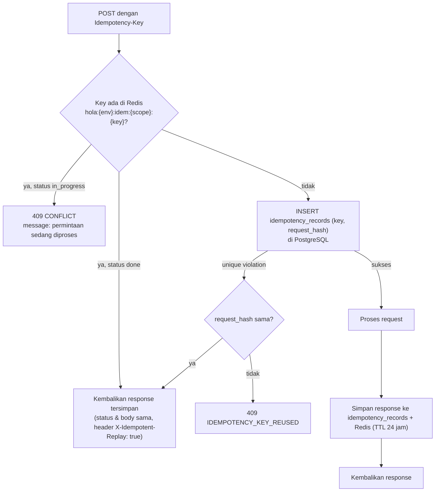

# 04 — API CONTRACT

> Prasyarat: [00-OVERVIEW.md](00-OVERVIEW.md), [01-ARCHITECTURE.md](01-ARCHITECTURE.md).
> Otorisasi per endpoint: [05-AUTH.md § RBAC Matrix](05-AUTH.md#6-rbac-matrix-per-endpoint).
> Nama entitas & field mengikuti [03-DATA-MODEL.md](03-DATA-MODEL.md).

---

## 1. Prinsip & Ruang Lingkup

1. **Satu API untuk semua client.** `apps/web`, `apps/admin`, dan `apps/mobile` memakai
   endpoint yang sama. Tidak ada endpoint khusus per platform.
2. **REST atas Hono, dikonsumsi sebagai RPC bertipe.** URL & metode mengikuti konvensi REST;
   `packages/api-client` membungkusnya dengan `hono/client` sehingga frontend mendapat
   type-safety tanpa codegen. Kontrak URL tetap harus benar sebagai REST karena webhook
   gateway dan alat debugging memakainya langsung.
3. **Validasi memakai zod dari `packages/shared`.** Setiap endpoint memakai `zValidator` pada
   `json`, `query`, atau `param`. Tidak ada validasi manual ad-hoc.
4. **Response selalu dibungkus envelope.** Tidak pernah mengembalikan array atau primitif di
   root body.
5. **Nama field di API memakai `snake_case`,** sama dengan nama kolom database. Alasan: satu
   kosakata dari DB → API → frontend; mengurangi lapisan pemetaan dan salah tulis. Frontend
   tetap boleh memakai `camelCase` untuk variabel lokalnya sendiri.
6. **Endpoint tidak membocorkan bentuk internal.** Kolom sensitif (`password_hash`,
   `token_version`, `internal_note` untuk customer, `base_salary_amount` untuk non-admin)
   tidak pernah masuk response.
7. **Semua timestamp di response adalah ISO 8601 dengan offset**, mis.
   `2026-07-28T19:00:00+08:00`. Server mengirim dalam offset WITA agar mudah dibaca manusia;
   client tetap harus mem-parse sebagai instant.
8. **Semua nilai uang adalah integer rupiah** (tanpa desimal, tanpa pemisah ribuan, tanpa
   string). Formatting dilakukan client memakai helper `packages/shared`.

---

## 2. Versioning

| Aturan | Ketentuan |
|---|---|
| Bentuk | Versi mayor di path: `/api/v1/...` |
| Versi aktif v1 | `v1` |
| Kapan naik ke `v2` | Hanya untuk **breaking change**: menghapus field, mengubah tipe field, mengubah arti field, menghapus nilai enum, mengubah struktur envelope, mengubah semantik status code |
| Bukan breaking (tetap `v1`) | Menambah field opsional di response, menambah endpoint baru, menambah nilai enum **yang client boleh abaikan**, menambah query param opsional, melonggarkan validasi |
| Menambah nilai enum | Diperbolehkan di `v1` **hanya** jika client sudah diwajibkan menangani nilai tak dikenal secara aman (fallback tampilan). Zod schema di `packages/shared` memakai `z.enum([...])` untuk **request** (ketat) dan tipe union yang toleran untuk **response** parsing di mobile |
| Masa hidup versi lama | Saat `v2` lahir, `v1` dipertahankan minimal **6 bulan** karena aplikasi mobile terpasang di perangkat user dan tidak bisa dipaksa update |
| Deprecation | Endpoint yang akan dihapus mengembalikan header `Deprecation: true` dan `Sunset: <RFC 1123 date>` selama minimal 3 bulan sebelum dihapus |
| Versi minimum client | Endpoint `GET /api/v1/config/public` mengembalikan `min_supported_mobile_version`. Mobile app yang lebih lama menampilkan layar "wajib update" |

Endpoint di luar versi (tidak pernah berubah bentuk):

| Path | Isi |
|---|---|
| `GET /healthz` | Liveness. `200 {"status":"ok"}` tanpa menyentuh DB |
| `GET /readyz` | Readiness. Cek PostgreSQL + Redis. `200 {"status":"ok"\|"degraded", "checks":{...}}`, `503` jika PostgreSQL mati |
| `GET /healthz/worker` | Umur heartbeat worker dari Redis. `200` jika < 120 s, `503` selainnya |
| `GET /internal/metrics` | Metrik format Prometheus. Dilindungi header `X-Internal-Token` |

---

## 3. Konvensi URL, Metode & Penamaan

### Bentuk URL

| Aturan | Contoh benar | Contoh salah |
|---|---|---|
| Resource = kata benda **plural**, `kebab-case` | `/api/v1/bookings`, `/api/v1/cafe-invoices` | `/api/v1/booking`, `/api/v1/getBookings` |
| Path param = id resource | `/api/v1/bookings/{booking_id}` | `/api/v1/bookings?id=` |
| Sub-resource untuk relasi milik | `/api/v1/events/{event_id}/registrations` | `/api/v1/event-registrations?event_id=` (kecuali untuk daftar lintas-event di admin) |
| Aksi non-CRUD = sub-path verba setelah id | `POST /api/v1/bookings/{id}/cancel` | `POST /api/v1/cancelBooking` |
| Resource milik pengguna sendiri diawali `/me` | `GET /api/v1/me/bookings` | `GET /api/v1/bookings?mine=true` |
| Area admin **tidak** memakai prefiks `/admin` | `GET /api/v1/bookings` (dibatasi RBAC) | `/api/v1/admin/bookings` |
| Pengecualian prefiks `/admin` | hanya untuk endpoint yang **tidak punya padanan** customer dan berisiko tinggi: `/api/v1/admin/settings`, `/api/v1/admin/audit-logs`, `/api/v1/admin/reports` | — |

**Alasan tidak memakai `/admin` secara umum:** kalau ada dua URL untuk resource yang sama,
aturan bisnis dan filter otorisasi akan diduplikasi dan pasti drift. Satu URL + RBAC + filter
kepemilikan lebih aman. Field yang hanya boleh dilihat admin difilter di serializer.

### Metode

| Metode | Semantik | Idempoten |
|---|---|---|
| `GET` | Baca. Tidak pernah mengubah state (kecuali sisi-efek log/metrik) | ✓ |
| `POST` | Buat resource, atau jalankan aksi | ✗ (kecuali dengan `Idempotency-Key`) |
| `PATCH` | Ubah sebagian. **Metode default untuk update** | ✓ (secara semantik) |
| `PUT` | Hanya dipakai untuk resource yang benar-benar diganti utuh (mis. `PUT /courts/{id}/operating-hours` mengganti seluruh set jadwal) | ✓ |
| `DELETE` | Menghapus resource. Untuk entitas yang tidak boleh dihapus, endpoint `DELETE` **tidak disediakan**; pakai aksi (`POST .../cancel`, `POST .../archive`) | ✓ |

### Status code

| Code | Kapan |
|---|---|
| `200` | Sukses dengan body |
| `201` | Resource dibuat. Wajib menyertakan header `Location` |
| `202` | Diterima untuk diproses asinkron (mis. `POST /refunds/{id}/process`) |
| `204` | Sukses tanpa body (jarang; hanya `DELETE`) |
| `400` | Body/query tidak dapat diparse (JSON rusak) |
| `401` | Tidak ada / tidak valid / kedaluwarsa access token |
| `403` | Terautentikasi tetapi tidak berhak (role atau bukan pemilik resource) |
| `404` | Resource tidak ada, **atau ada tapi tidak boleh diketahui pemanggil** (lihat § 11 E-3) |
| `409` | Konflik state: slot sudah diklaim, booking sudah dibayar, invoice sudah lunas, event penuh |
| `410` | Resource sudah tidak berlaku (hold kedaluwarsa, promo sudah expired) |
| `422` | Validasi bisnis/format gagal (zod, aturan domain) |
| `429` | Rate limit terlampaui. Wajib menyertakan `Retry-After` |
| `500` | Bug tak tertangani. Body tidak pernah membocorkan stack trace |
| `502` | Dependensi eksternal gagal (payment gateway, object storage) |
| `503` | PostgreSQL tidak tersedia atau app sedang shutdown |

> Perbedaan `422` vs `409`: `422` = permintaannya sendiri tidak sah (format salah, nilai di
> luar aturan). `409` = permintaannya sah, tetapi state saat ini tidak mengizinkan.

---

## 4. Format Response Sukses

### Objek tunggal

```json
{
  "data": {
    "id": "018f...",
    "booking_code": "HB-260728-0042",
    "status": "pending_payment",
    "total_amount": 250000,
    "created_at": "2026-07-28T19:03:11+08:00"
  }
}
```

### Koleksi

```json
{
  "data": [ { "id": "018f..." }, { "id": "018g..." } ],
  "meta": {
    "pagination": {
      "mode": "cursor",
      "limit": 20,
      "next_cursor": "eyJpZCI6IjAxOGciLCJ0cyI6MTc1...",
      "has_more": true
    }
  }
}
```

### Aksi yang tidak mengembalikan resource

```json
{ "data": { "success": true } }
```

### Aturan envelope

| Aturan | Ketentuan |
|---|---|
| Root selalu objek | Kunci `data` **selalu** ada pada response sukses |
| `meta` | Opsional. Berisi `pagination`, `generated_at`, `stale`, `warnings` |
| `warnings` | Array pesan non-fatal, mis. `[{"code":"PROMO_NOT_APPLIED","message":"Promo tidak berlaku untuk slot off-peak"}]`. Client wajib menampilkannya |
| Tidak ada `success: true` di root | Status HTTP sudah menyatakannya |
| Field kosong | Dikirim sebagai `null`, **tidak dihilangkan**. Alasan: client bertipe ketat lebih mudah menangani `null` daripada `undefined` |
| Relasi | Di-embed hanya jika hampir selalu dibutuhkan bersama (mis. `booking.items`). Selain itu kirim id + endpoint terpisah |
| Nama field relasi embed | Nama plural tanpa `_id`: `items`, `payments`, `registrations` |
| Field turunan | Diberi nama jelas & tidak menyerupai kolom DB, mis. `is_cancellable`, `refund_estimate_amount`, `available_slot_count` |

### Header response standar

| Header | Isi |
|---|---|
| `X-Request-Id` | ULID request; wajib disertakan saat melaporkan bug |
| `X-Cache` | `HIT` / `MISS` — hanya pada endpoint yang memakai cache Redis |
| `RateLimit-Limit`, `RateLimit-Remaining`, `RateLimit-Reset` | Pada semua endpoint yang dibatasi |
| `Deprecation`, `Sunset` | Pada endpoint yang akan dihapus |

---

## 5. Format Error

### Bentuk

```json
{
  "error": {
    "code": "SLOT_ALREADY_CLAIMED",
    "message": "Slot 19:00 di PDL-01 sudah dipesan orang lain.",
    "details": [
      { "court_id": "018f...", "starts_at": "2026-07-28T19:00:00+08:00", "claim_type": "booking" }
    ],
    "request_id": "01J3Q7..."
  }
}
```

Untuk kegagalan validasi zod, `details` berisi daftar per field:

```json
{
  "error": {
    "code": "VALIDATION_ERROR",
    "message": "Data yang dikirim tidak valid.",
    "details": [
      { "path": "items.0.starts_at", "code": "invalid_string", "message": "Format tanggal tidak valid" },
      { "path": "promo_code", "code": "too_big", "message": "Maksimal 20 karakter" }
    ],
    "request_id": "01J3Q7..."
  }
}
```

### Aturan error

1. `code` adalah `SCREAMING_SNAKE_CASE`, **stabil**, dan terdaftar di
   `packages/shared/src/constants/error-codes.ts`. Client bercabang berdasarkan `code`,
   **tidak pernah** berdasarkan `message`.
2. `message` berbahasa Indonesia, layak ditampilkan langsung ke user akhir, tanpa detail
   teknis. Untuk error 500, `message` selalu generik.
3. `details` opsional, bertipe array objek. Bentuknya konsisten per `code`.
4. `request_id` selalu ada.
5. Error tidak pernah memuat: stack trace, nama tabel, query SQL, nama file, isi env.
6. Satu response = satu `code`. Kalau ada beberapa masalah validasi, satu `code`
   (`VALIDATION_ERROR`) dengan banyak `details`.

### Katalog error code

#### Umum

| Code | HTTP | Arti |
|---|---|---|
| `VALIDATION_ERROR` | 422 | Input gagal validasi zod atau aturan format |
| `MALFORMED_REQUEST` | 400 | Body bukan JSON valid |
| `UNAUTHENTICATED` | 401 | Tidak ada token / token tidak valid |
| `TOKEN_EXPIRED` | 401 | Access token kedaluwarsa — client harus refresh |
| `TOKEN_REVOKED` | 401 | Token dicabut (logout, ganti password, `token_version` naik) |
| `FORBIDDEN` | 403 | Role tidak mengizinkan |
| `NOT_RESOURCE_OWNER` | 403 | Terautentikasi tapi bukan pemilik resource |
| `NOT_FOUND` | 404 | Resource tidak ada |
| `METHOD_NOT_ALLOWED` | 405 | — |
| `CONFLICT` | 409 | Konflik state generik (dipakai hanya jika tidak ada code spesifik) |
| `GONE` | 410 | Resource sudah tidak berlaku |
| `RATE_LIMITED` | 429 | Lihat header `Retry-After` |
| `IDEMPOTENCY_KEY_REUSED` | 409 | `Idempotency-Key` sama dengan body berbeda |
| `PRECONDITION_FAILED` | 409 | `If-Match`/`version` tidak cocok (optimistic locking) |
| `INTERNAL_ERROR` | 500 | Bug |
| `SERVICE_UNAVAILABLE` | 503 | PostgreSQL tidak tersedia / shutdown |
| `UPSTREAM_ERROR` | 502 | Dependensi eksternal gagal |
| `FEATURE_DISABLED` | 403 | Fitur dimatikan flag (mis. WhatsApp) |

#### Slot & Court

| Code | HTTP | Arti |
|---|---|---|
| `SLOT_ALREADY_CLAIMED` | 409 | Slot sudah di-hold/dikonfirmasi pihak lain. `details` = daftar slot bentrok |
| `SLOT_NOT_ALIGNED` | 422 | `starts_at` tidak rata terhadap slot grid court |
| `SLOT_OUTSIDE_OPERATING_HOURS` | 422 | Slot di luar jam operasional |
| `SLOT_IN_PAST` | 422 | Slot sudah lewat |
| `SLOT_TOO_FAR_AHEAD` | 422 | Melebihi batas horizon booking (default 60 hari) |
| `SLOTS_NOT_CONTIGUOUS` | 422 | Aturan booking mensyaratkan slot berurutan (jika diaktifkan per court) |
| `SLOT_COUNT_OUT_OF_RANGE` | 422 | Di luar `min_slots_per_booking`..`max_slots_per_booking` |
| `COURT_NOT_BOOKABLE` | 422 | `courts.status <> 'active'` |
| `COURT_HAS_FUTURE_CLAIMS` | 422 | Konfigurasi court tidak bisa diubah karena ada klaim mendatang |
| `VENUE_CLOSED` | 422 | Tanggal ditandai tutup di `special_dates` |
| `MIXED_BOOKING_DATE` | 422 | Semua item satu booking harus pada satu `booking_date` |

#### Pricing

| Code | HTTP | Arti |
|---|---|---|
| `PRICE_RULE_NOT_FOUND` | 422 | Tidak ada `price_rules` yang cocok untuk satu atau lebih slot. `details` memuat daftar slot bermasalah. **Tidak pernah** memakai harga default — lihat [07 § 3.3 P2](07-MODULE-PAYMENT.md#33-detail-per-step) |
| `QUOTE_ITEM_LIMIT_EXCEEDED` | 422 | Melebihi batas keras quote: 8 baris slot atau 10 baris addon per permintaan ([07 § 3.3 P0](07-MODULE-PAYMENT.md#33-detail-per-step)) |
| `ADDON_NOT_APPLICABLE` | 422 | Addon dikirim untuk `kind` selain `booking`, atau addon `is_active = false` |

#### Booking

| Code | HTTP | Arti |
|---|---|---|
| `BOOKING_HOLD_EXPIRED` | 410 | Hold habis; harus mulai checkout ulang |
| `BOOKING_NOT_CANCELLABLE` | 409 | Status tidak memungkinkan pembatalan |
| `BOOKING_ALREADY_PAID` | 409 | Sudah lunas |
| `BOOKING_ALREADY_CANCELLED` | 409 | — |
| `BOOKING_ALREADY_CHECKED_IN` | 409 | — |
| `BOOKING_NOT_CHECKED_IN` | 409 | Aksi butuh check-in lebih dulu |
| `GUEST_CONTACT_REQUIRED` | 422 | Booking tanpa akun wajib `guest_name` + `guest_phone` |

#### Payment & Refund

| Code | HTTP | Arti |
|---|---|---|
| `PAYMENT_NOT_PENDING` | 409 | Aksi hanya untuk payment `pending` |
| `PAYMENT_ALREADY_PAID` | 409 | — |
| `PAYMENT_EXPIRED` | 410 | — |
| `PAYMENT_AMOUNT_MISMATCH` | 422 | Jumlah tidak sama dengan yang ditagih |
| `PAYMENT_METHOD_UNSUPPORTED` | 422 | — |
| `WEBHOOK_SIGNATURE_INVALID` | 401 | `signature_key` tidak cocok |
| `WEBHOOK_UNKNOWN_ORDER` | 404 | `order_id` tidak dikenal (tetap dicatat di `payment_webhook_events`) |
| `REFUND_NOT_ALLOWED` | 409 | Kebijakan refund tidak mengizinkan |
| `REFUND_AMOUNT_EXCEEDS_PAYMENT` | 422 | Total refund > nilai payment |
| `REFUND_ALREADY_COMPLETED` | 409 | — |

#### Promo

| Code | HTTP | Arti |
|---|---|---|
| `PROMO_NOT_FOUND` | 404 | Kode tidak ada |
| `PROMO_INACTIVE` | 422 | Status bukan `active` |
| `PROMO_NOT_STARTED` | 422 | Belum `valid_from` |
| `PROMO_EXPIRED` | 410 | Lewat `valid_until` |
| `PROMO_QUOTA_EXHAUSTED` | 409 | Kuota total habis |
| `PROMO_USER_QUOTA_EXHAUSTED` | 409 | Kuota per user habis |
| `PROMO_MIN_TRANSACTION_NOT_MET` | 422 | — |
| `PROMO_NOT_APPLICABLE` | 422 | Tidak cocok court/sport/jam/rate class/tier |
| `PROMO_NOT_STACKABLE` | 409 | Sudah ada promo lain di transaksi ini |
| `PROMO_NEW_CUSTOMER_ONLY` | 422 | — |

#### Event

| Code | HTTP | Arti |
|---|---|---|
| `EVENT_NOT_PUBLISHED` | 404 | Draft tidak terlihat publik |
| `EVENT_REGISTRATION_NOT_OPEN` | 409 | Di luar jendela pendaftaran |
| `EVENT_FULL` | 409 | Kuota penuh dan waitlist mati/penuh |
| `EVENT_WAITLIST_FULL` | 409 | — |
| `EVENT_ALREADY_REGISTERED` | 409 | — |
| `EVENT_REGISTRATION_NOT_CANCELLABLE` | 409 | — |
| `EVENT_HAS_REGISTRATIONS` | 409 | Tidak bisa dihapus/diubah drastis |
| `EVENT_SCHEDULE_REQUIRED` | 422 | Publikasi butuh jadwal & court |

#### Tournament & Match

| Code | HTTP | Arti |
|---|---|---|
| `TOURNAMENT_REGISTRATION_NOT_OPEN` | 409 | — |
| `TOURNAMENT_FULL` | 409 | — |
| `TOURNAMENT_ALREADY_REGISTERED` | 409 | — |
| `TOURNAMENT_MIN_PARTICIPANTS_NOT_MET` | 422 | Tidak cukup peserta untuk generate bracket |
| `TOURNAMENT_BRACKET_ALREADY_GENERATED` | 409 | — |
| `TOURNAMENT_BRACKET_NOT_GENERATED` | 409 | Aksi butuh bracket |
| `TOURNAMENT_FORMAT_UNSUPPORTED` | 422 | Hanya `knockout` & `round_robin` di v1 |
| `MATCH_NOT_SCHEDULABLE` | 409 | Peserta belum ditentukan (menunggu match sebelumnya) |
| `MATCH_ALREADY_COMPLETED` | 409 | — |
| `MATCH_SCORE_INVALID` | 422 | Skor tidak konsisten dengan konfigurasi set/game |
| `MATCH_PARTICIPANTS_INCOMPLETE` | 409 | Tidak bisa input skor jika salah satu sisi kosong |
| `MATCH_WALKOVER_REQUIRES_REASON` | 422 | — |

#### Gamification

| Code | HTTP | Arti |
|---|---|---|
| `POINT_RULE_NOT_FOUND` | 404 | — |
| `POINT_CAP_REACHED` | 409 | Cap harian/periodik tercapai |
| `POINT_ADJUSTMENT_REQUIRES_REASON` | 422 | Penyesuaian manual wajib beralasan |
| `LEADERBOARD_PERIOD_CLOSED` | 409 | — |

#### Cafe Tenant

| Code | HTTP | Arti |
|---|---|---|
| `CAFE_UNIT_OCCUPIED` | 409 | Unit sudah punya kontrak aktif |
| `CAFE_CONTRACT_NOT_ACTIVE` | 409 | — |
| `CAFE_INVOICE_ALREADY_PAID` | 409 | — |
| `CAFE_INVOICE_VOID` | 409 | — |
| `CAFE_PAYMENT_EXCEEDS_INVOICE` | 422 | — |

#### Finance & HRIS

| Code | HTTP | Arti |
|---|---|---|
| `JOURNAL_NOT_BALANCED` | 422 | Debit ≠ kredit |
| `JOURNAL_ALREADY_POSTED` | 409 | — |
| `JOURNAL_PERIOD_LOCKED` | 409 | Periode akuntansi sudah ditutup |
| `ACCOUNT_INACTIVE` | 422 | — |
| `ATTENDANCE_ALREADY_CLOCKED_IN` | 409 | — |
| `ATTENDANCE_NOT_CLOCKED_IN` | 409 | — |
| `SHIFT_ASSIGNMENT_CONFLICT` | 409 | Karyawan sudah punya shift bentrok pada tanggal itu |

#### Media

| Code | HTTP | Arti |
|---|---|---|
| `MEDIA_KIND_UNSUPPORTED` | 422 | — |
| `MEDIA_CONTENT_TYPE_UNSUPPORTED` | 422 | — |
| `MEDIA_TOO_LARGE` | 422 | — |
| `MEDIA_NOT_UPLOADED` | 409 | Konfirmasi dipanggil tapi objek tidak ada di storage |
| `STORAGE_UNAVAILABLE` | 502 | Object storage tidak dapat dihubungi |

### Katalog warning code (`meta.warnings`)

Warning **bukan** error. Ia dikirim pada response `2xx` di dalam `meta.warnings` sebagai array
`{ code, message, details? }`. **Client wajib menampilkannya** — beberapa di antaranya mengubah
angka yang dilihat user.

| Code | Muncul di | Arti & yang wajib dilakukan client |
|---|---|---|
| `PRICE_CHANGED` | `POST /bookings` | `total_amount` berbeda dari quote terakhir yang dilihat user. **Wajib** menampilkan harga baru untuk dikonfirmasi ulang sebelum lanjut ke pembayaran ([07 § 8 E-13](07-MODULE-PAYMENT.md#8-edge-cases)) |
| `PROMO_QUOTA_EXHAUSTED` | `POST /bookings`, `POST /bookings/quote` | Promo gagal direservasi; harga dikembalikan **tanpa** promo. Wajib konfirmasi ulang harga ([08 BR-PR-52](08-MODULE-PROMO.md#6-titik-integrasi-di-flow-checkout)) |
| `PROMO_NOT_FOUND` | `POST /bookings/quote` | Kode promo yang diketik tidak ada. Quote tetap dikembalikan tanpa promo |
| `PROMO_NOT_APPLICABLE` | `POST /bookings/quote` | Kode valid tetapi tidak memenuhi syarat. `details` memuat `reason_code` spesifik dari [08 § 3](08-MODULE-PROMO.md#3-aturan-validasi-promo-eligibility) |
| `PROMO_SUPERSEDED_BY_BETTER_OFFER` | `POST /bookings/quote`, `POST /bookings` | Kode manual valid, tetapi ada auto promo yang lebih besar dan itu yang dipakai. Kuota kode manual tidak terpakai ([08 § 4](08-MODULE-PROMO.md#4-aturan-stacking-butuh-keputusan-client)) |
| `DISCOUNT_CLAMPED` | `POST /bookings/quote`, `POST /bookings` | Diskon dipotong agar tidak melebihi subtotal + addon |
| `BEYOND_BOOKING_HORIZON` | `GET /courts/{id}/availability` | Tanggal melebihi horizon booking; semua slot `is_available: false`. UI menampilkan keterangan, bukan error |
| `COUNT_OMITTED_FOR_PERFORMANCE` | endpoint koleksi mode offset | `total_count` bernilai `null`; sembunyikan jumlah halaman total |
| `STANDINGS_NOT_APPLICABLE` | `GET /tournaments/{id}/standings` | Format turnamen `knockout`; `data` kosong. Sembunyikan tab klasemen ([11 BR-M-72](11-MODULE-MATCH.md#73-aturan-standings)) |
| `SLOT_OUTSIDE_OPERATING_HOURS` | jadwal admin | Klaim lama berada di luar jam operasional saat ini (jam operasional diubah setelah klaim dibuat). Tandai di kalender, jangan sembunyikan ([03 § 8.11 S-5](03-DATA-MODEL.md#811-edge-cases-slot-ownership)) |
| `TIE_UNRESOLVED` | `GET /tournaments/{id}/standings` | Ada peringkat yang seri sampai pemutus mekanis; butuh keputusan admin ([11 § 7.2](11-MODULE-MATCH.md#72-tiebreaker-urutan-definitif)) |
| `WORKER_DEGRADED` | `GET /readyz` | Heartbeat worker basi; job terjadwal mungkin tertunda |

Aturan: `code` warning memakai ruang nama yang **sama** dengan error code (satu konstanta
`ERROR_CODE` di `packages/shared`), sehingga satu kode tidak pernah berarti dua hal berbeda.

---

## 6. Pagination, Filter, Sorting

Dua mode. **Setiap endpoint koleksi wajib memilih satu dan menyatakannya** di katalog § 9.

### 6.1 Cursor (default untuk feed & daftar milik user)

Dipakai untuk daftar yang bertambah di ujung dan discroll tanpa henti: riwayat booking, feed
event, leaderboard, aktivitas, notifikasi.

| Query param | Tipe | Default | Keterangan |
|---|---|---|---|
| `limit` | int 1–100 | 20 | — |
| `cursor` | string (opaque base64url) | — | Dari `meta.pagination.next_cursor` |
| `direction` | `forward` \| `backward` | `forward` | — |

Response `meta.pagination`:
```json
{ "mode": "cursor", "limit": 20, "next_cursor": "eyJ...", "prev_cursor": null, "has_more": true }
```

Aturan:
- Cursor adalah base64url dari `{"k": [<nilai sort key>...], "id": "<uuid>"}` — **selalu**
  menyertakan `id` sebagai tie-breaker agar stabil.
- Cursor **opaque**: client tidak boleh mem-parse atau membuatnya.
- Cursor tidak valid / dari sort berbeda → `422 VALIDATION_ERROR`.
- **Tidak ada `total_count`** di mode cursor (mahal dan tidak dibutuhkan feed).

### 6.2 Offset (untuk tabel admin)

Dipakai di dashboard admin yang butuh nomor halaman & total: daftar booking admin, tagihan
tenant, karyawan, jurnal.

| Query param | Tipe | Default |
|---|---|---|
| `page` | int ≥ 1 | 1 |
| `per_page` | int 1–100 | 25 |

Response `meta.pagination`:
```json
{ "mode": "offset", "page": 1, "per_page": 25, "total_count": 137, "total_pages": 6 }
```

Aturan: `total_count` dihitung dengan `COUNT(*)` atas filter yang sama. Jika `total_count`
melewati 100.000, server mengembalikan `total_count: null` dan `meta.warnings` berisi
`COUNT_OMITTED_FOR_PERFORMANCE` — client menampilkan "banyak hasil" tanpa nomor halaman total.

### 6.3 Filter

| Aturan | Contoh |
|---|---|
| Nama param = nama kolom | `?status=confirmed`, `?court_id=018f...` |
| Nilai ganda = dipisah koma | `?status=confirmed,completed` |
| Rentang tanggal = `_from` / `_to` (inklusif, tanggal WITA) | `?booking_date_from=2026-07-01&booking_date_to=2026-07-31` |
| Rentang waktu presisi | `?created_at_from=2026-07-01T00:00:00+08:00` |
| Pencarian teks bebas | `?q=andi` — kolom yang dicari didefinisikan per endpoint di § 9 |
| Boolean | `?is_paid=true` |
| Filter tak dikenal | **Ditolak** `422 VALIDATION_ERROR` (bukan diabaikan). Alasan: filter yang salah tulis dan diabaikan diam-diam menampilkan data yang lebih luas dari yang dimaksud — berbahaya untuk data keuangan |

### 6.4 Sorting

| Aturan | Contoh |
|---|---|
| Param `sort`, format `field` atau `-field` (minus = descending) | `?sort=-created_at` |
| Hanya field yang di-allowlist per endpoint | didefinisikan di § 9 |
| Multi-sort dipisah koma | `?sort=-booking_date,court_id` |
| Sort default | didefinisikan per endpoint; selalu ada tie-breaker `id` |

---

## 7. Autentikasi & Header

Detail strategi: [05-AUTH.md](05-AUTH.md).

### Header request

| Header | Wajib | Isi |
|---|---|---|
| `Authorization` | untuk endpoint terproteksi | `Bearer <access_token>` (JWT, TTL 15 menit) |
| `Content-Type` | untuk body | `application/json` |
| `Idempotency-Key` | untuk POST tertentu | ULID/UUID buatan client. Lihat § 8 |
| `X-Client-Platform` | disarankan | `web` \| `admin` \| `mobile-ios` \| `mobile-android` |
| `X-Client-Version` | disarankan | Versi app. Dipakai untuk gate `min_supported_mobile_version` |
| `Accept-Language` | opsional | `id` (default) — v1 hanya Indonesia |
| `If-Match` | untuk update yang butuh optimistic locking | Nilai dari field `version` resource |

### Refresh token

- **Web & admin:** refresh token dikirim sebagai cookie `HttpOnly; Secure; SameSite=Lax;
  Domain=.hola.id; Path=/api/v1/auth`. Client memanggil `POST /auth/refresh` **tanpa body**.
- **Mobile:** refresh token disimpan di `expo-secure-store` dan dikirim di body
  `POST /auth/refresh` `{ "refresh_token": "..." }`.
- Response refresh selalu mengembalikan access token **dan** refresh token baru (rotasi).

### Konteks yang tersedia di setiap handler

Middleware auth mengisi context Hono:

| Field | Isi |
|---|---|
| `user_id` | uuid |
| `role` | `customer` \| `admin` \| `staff` \| `tenant` |
| `cafe_tenant_id` | Hanya untuk role `tenant` — dipakai memfilter data miliknya |
| `employee_id` | Jika user tertaut ke `employees` |
| `request_id` | ULID |

### CORS

| Aturan | Ketentuan |
|---|---|
| Origin diizinkan | Dari env `CORS_ORIGINS` (web + admin). Tidak ada wildcard |
| `credentials` | `true` (dibutuhkan cookie refresh) |
| Mobile | Tidak melewati CORS (native fetch); tetap harus melewati auth |
| Webhook | Endpoint `/webhooks/*` tidak memakai CORS dan tidak memakai auth Bearer — divalidasi signature |

---

## 8. Idempotency & Concurrency

### Idempotency-Key

Wajib didukung server pada endpoint berikut (client **wajib** mengirimnya):

| Endpoint | Alasan |
|---|---|
| `POST /bookings` | Double-submit checkout tidak boleh membuat dua booking + dua hold |
| `POST /payments` | Tidak boleh dua transaksi gateway |
| `POST /events/{id}/registrations` | Tidak boleh dobel daftar |
| `POST /tournaments/{id}/registrations` | idem |
| `POST /me/activities` | Mobile bisa mengirim ulang setelah offline |
| `POST /cafe-invoices/{id}/payments` | Pencatatan pembayaran manual tidak boleh dobel |
| `POST /refunds` | — |

Perilaku:



Aturan:
- `scope` = nama operasi (`booking.create`, `payment.create`, …) sehingga key yang sama untuk
  operasi berbeda tidak bertabrakan.
- `request_hash` = SHA-256 dari body ternormalisasi. Key sama + body berbeda →
  `409 IDEMPOTENCY_KEY_REUSED`.
- Masa simpan 24 jam.
- **Redis hanya fast path.** Jika Redis hilang, `idempotency_records` di PostgreSQL tetap
  menjamin idempotency.
- Endpoint yang tidak mendukung `Idempotency-Key` **mengabaikannya** (tidak error).

### Optimistic locking

Resource yang bisa diedit bersamaan oleh beberapa staff memiliki field `version` (int, naik
setiap update): `courts`, `price_rules`, `promos`, `events`, `tournaments`, `cafe_contracts`,
`matches`.

- Client mengirim `If-Match: <version>` pada `PATCH`.
- Tidak cocok → `409 PRECONDITION_FAILED` dengan `details` berisi `current_version`.
- `If-Match` tidak dikirim → update tetap dijalankan (last-write-wins). Admin UI **wajib**
  mengirimnya; ketiadaan header dicatat log `warn`.

---

## 9. Katalog Endpoint v1

Kolom **Pag** = mode pagination (`C` cursor, `O` offset, `—` bukan koleksi).
Kolom **Idem** = mendukung/mewajibkan `Idempotency-Key`.
Otorisasi lengkap ada di [05 § 6](05-AUTH.md#6-rbac-matrix-per-endpoint).

### 9.1 Auth & Session

| Metode | Path | Pag | Idem | Ringkas |
|---|---|---|---|---|
| POST | `/auth/register` | — | — | Daftar customer (email/phone + password) |
| POST | `/auth/login` | — | — | Login → access token + refresh token |
| POST | `/auth/refresh` | — | — | Rotasi token |
| POST | `/auth/logout` | — | — | Cabut refresh token saat ini |
| POST | `/auth/logout-all` | — | — | Naikkan `token_version`, cabut semua sesi |
| POST | `/auth/otp/request` | — | — | Kirim OTP ke nomor HP |
| POST | `/auth/otp/verify` | — | — | Verifikasi OTP → token |
| POST | `/auth/password/forgot` | — | — | Kirim email reset |
| POST | `/auth/password/reset` | — | — | Reset dengan token email |
| POST | `/auth/password/change` | — | — | Ganti password (butuh password lama) |
| POST | `/auth/email/verify/request` | — | — | Kirim ulang email verifikasi |
| POST | `/auth/email/verify` | — | — | Verifikasi email |
| GET | `/auth/sessions` | C | — | Daftar sesi aktif milik sendiri |
| DELETE | `/auth/sessions/{session_id}` | — | — | Cabut satu sesi |

### 9.2 Konfigurasi Publik

| Metode | Path | Pag | Ringkas |
|---|---|---|---|
| GET | `/config/public` | — | `midtrans_client_key`, `min_supported_mobile_version`, timezone, teks kebijakan, flag fitur aktif |

### 9.3 Katalog Lapangan & Ketersediaan (publik)

| Metode | Path | Pag | Ringkas |
|---|---|---|---|
| GET | `/sports` | — | Daftar olahraga aktif |
| GET | `/courts` | O | Filter: `sport_id`, `status`, `is_indoor`. Sort: `sort_order`, `code` |
| GET | `/courts/{court_id}` | — | Detail + foto + jam operasional |
| GET | `/courts/{court_id}/availability` | — | **Endpoint inti booking.** Query tepat salah satu: `date`, atau `date_from`+`date_to` (maks 14 hari). Response stabil `data.days[]`: grid slot + `is_available` + `rate_class` + `price_amount`. Memakai cache Redis per hari (`X-Cache`) |
| GET | `/availability` | — | Ketersediaan lintas court. Query: `date` (wajib), `sport_id`, `starts_time`, `ends_time`, `slot_count`. Untuk halaman "cari lapangan kosong" |
| GET | `/addons` | — | Daftar addon aktif |
| GET | `/pricing/preview` | — | Harga per rate class untuk satu court & tanggal (tanpa membuat quote) |

### 9.4 Booking

| Metode | Path | Pag | Idem | Ringkas |
|---|---|---|---|---|
| POST | `/bookings/quote` | — | — | **Tidak** membuat data. Hitung harga memakai pipeline [07 § 3](07-MODULE-PAYMENT.md#3-pricing-pipeline-satu-satunya-sumber-perhitungan-harga). Body: items, addons, `promo_code?` |
| POST | `/bookings` | — | wajib | Buat booking + hold slot 10 menit. Response `201` berisi booking + `hold_expires_at` |
| GET | `/bookings` | O | — | Daftar booking (admin/staff). Filter: `status`, `booking_date_from/to`, `court_id`, `customer_user_id`, `channel`, `q` (booking_code, nama, telepon). Sort: `-created_at`, `booking_date` |
| GET | `/bookings/{booking_id}` | — | — | Detail + items + addons + payments |
| GET | `/me/bookings` | C | — | Riwayat booking sendiri. Filter: `status`, `upcoming=true` |
| POST | `/bookings/{id}/cancel` | — | — | Batalkan. Body: `reason`. Response menyertakan `refund_estimate_amount` |
| POST | `/bookings/{id}/check-in` | — | — | Staff menandai customer datang |
| POST | `/bookings/{id}/no-show` | — | — | Staff menandai tidak datang |
| PATCH | `/bookings/{id}` | — | — | Ubah `internal_note`, `customer_note` saja. Perubahan slot/harga **tidak** lewat sini |
| POST | `/bookings/{id}/reschedule` | — | wajib | Pindah slot. Melepas klaim lama & mengklaim baru dalam satu transaksi. Aturan: [06 § 6](06-MODULE-BOOKING.md#6-reschedule) |
| GET | `/bookings/{id}/receipt` | — | — | Data struk (untuk render PDF di client) |

### 9.5 Payment

| Metode | Path | Pag | Idem | Ringkas |
|---|---|---|---|---|
| POST | `/payments` | — | wajib | Buat transaksi gateway untuk satu payable. Response: `snap_token`, `snap_redirect_url`, `expires_at` |
| GET | `/payments/{payment_id}` | — | — | Status pembayaran |
| GET | `/payments` | O | — | Admin. Filter: `status`, `method`, `paid_at_from/to`, `provider_order_id`, `q` |
| POST | `/payments/{id}/cancel` | — | — | Batalkan transaksi `pending` |
| POST | `/payments/{id}/sync` | — | — | Paksa tarik status dari gateway (untuk staff saat customer mengeluh) |
| POST | `/payments/manual` | — | wajib | Catat pembayaran tunai/transfer manual (staff). Body: payable, `amount`, `method`, `paid_at`, `proof_media_id?` |
| POST | `/webhooks/midtrans` | — | — | **Publik**, divalidasi signature. Selalu balas `200` cepat |
| GET | `/refunds` | O | — | Filter: `status`, `payment_id` |
| POST | `/refunds` | — | wajib | Ajukan refund. Body: `payment_id`, `amount`, `reason`, `channel` |
| GET | `/refunds/{refund_id}` | — | — | — |
| POST | `/refunds/{id}/approve` | — | — | Admin menyetujui → enqueue J-08. Body `{}` atau tiga field rekening tujuan `manual_transfer`; ketiganya wajib diisi bersama |
| POST | `/refunds/{id}/reject` | — | — | Body: `reason` |
| POST | `/refunds/{id}/mark-completed` | — | — | Untuk `channel=manual_transfer`/`cash`: staff menandai sudah dibayarkan. Body: `proof_media_id?` |

### 9.6 Promo

| Metode | Path | Pag | Ringkas |
|---|---|---|---|
| POST | `/promos/validate` | — | Validasi kode terhadap konteks transaksi. **Tidak** mereservasi kuota. Response: `is_valid`, `discount_amount`, `reason_code?` |
| GET | `/promos/available` | C | Promo otomatis & publik yang berlaku untuk user saat ini |
| GET | `/promos` | O | Admin. Filter: `status`, `is_auto`, `applies_to`, `q` (code, name) |
| POST | `/promos` | — | Admin buat promo |
| GET | `/promos/{promo_id}` | — | Detail + statistik pemakaian |
| PATCH | `/promos/{promo_id}` | — | Butuh `If-Match` |
| POST | `/promos/{id}/pause` | — | — |
| POST | `/promos/{id}/activate` | — | — |
| POST | `/promos/{id}/archive` | — | — |
| GET | `/promos/{id}/redemptions` | O | Riwayat pemakaian |

### 9.7 Event

| Metode | Path | Pag | Idem | Ringkas |
|---|---|---|---|---|
| GET | `/events` | C | — | Publik: hanya status `published`, `registration_open`, `registration_closed`, `ongoing`. Admin melihat semua. Filter: `type`, `sport_id`, `status`, `starts_at_from/to`, `is_paid` |
| GET | `/events/{event_id_or_slug}` | — | — | Detail + kuota terisi + `is_registration_open` |
| POST | `/events` | — | — | Admin buat event (status `draft`) |
| PATCH | `/events/{id}` | — | — | Butuh `If-Match` |
| POST | `/events/{id}/schedule` | — | — | Tetapkan court + rentang waktu → klaim slot (`claim_type='event'`). Body: `courts[]`, `starts_at`, `ends_at`, `force?` |
| POST | `/events/{id}/publish` | — | — | `draft → published` |
| POST | `/events/{id}/open-registration` | — | — | — |
| POST | `/events/{id}/close-registration` | — | — | — |
| POST | `/events/{id}/cancel` | — | — | Body: `reason`. Melepas slot + refund peserta berbayar |
| POST | `/events/{id}/registrations` | — | wajib | Daftar. Response menyatakan `confirmed` / `pending_payment` / `waitlisted` |
| GET | `/events/{id}/registrations` | O | — | Admin/staff. Filter: `status` |
| GET | `/me/event-registrations` | C | — | Milik sendiri |
| POST | `/event-registrations/{id}/cancel` | — | — | Membebaskan kuota → J-15 promosi waitlist |
| POST | `/event-registrations/{id}/check-in` | — | — | Staff |
| POST | `/event-registrations/{id}/promote` | — | — | Admin promosikan dari waitlist manual |

### 9.8 Tournament & Match

| Metode | Path | Pag | Idem | Ringkas |
|---|---|---|---|---|
| GET | `/tournaments` | C | — | Filter: `status`, `sport_id`, `format` |
| GET | `/tournaments/{id_or_slug}` | — | — | Detail + jumlah peserta |
| POST | `/tournaments` | — | — | Admin |
| PATCH | `/tournaments/{id}` | — | — | Butuh `If-Match` |
| POST | `/tournaments/{id}/registrations` | — | wajib | Daftar peserta |
| GET | `/tournaments/{id}/registrations` | O | — | — |
| PATCH | `/tournament-registrations/{id}` | — | — | Admin set `seed`, `group_id`, `status` |
| POST | `/tournament-registrations/{id}/withdraw` | — | — | — |
| POST | `/tournaments/{id}/close-registration` | — | — | — |
| POST | `/tournaments/{id}/generate-bracket` | — | — | Enqueue J-17. `202` |
| GET | `/tournaments/{id}/bracket` | — | — | Struktur bracket (rounds + matches) untuk render |
| GET | `/tournaments/{id}/standings` | — | — | Klasemen (round-robin) |
| GET | `/tournaments/{id}/matches` | O | — | Filter: `round_id`, `status`, `court_id`, `scheduled_starts_at_from/to` |
| GET | `/matches/{match_id}` | — | — | Detail + set |
| POST | `/matches/{id}/schedule` | — | — | Tetapkan court + waktu → klaim slot (`claim_type='match'`). Body: `court_id`, `starts_at`, `force?` |
| POST | `/matches/{id}/unschedule` | — | — | Lepas klaim slot |
| POST | `/matches/{id}/start` | — | — | `scheduled → ongoing` |
| POST | `/matches/{id}/score` | — | — | Input skor final. Body: `sets[]`. Staff/admin saja |
| POST | `/matches/{id}/walkover` | — | — | Body: `winner_registration_id`, `reason` |
| POST | `/matches/{id}/reopen` | — | — | Admin membuka match `completed` untuk koreksi skor |
| GET | `/me/matches` | C | — | Pertandingan sendiri |

### 9.9 Gamification

| Metode | Path | Pag | Ringkas |
|---|---|---|---|
| GET | `/leaderboard` | C | Query: `period_id?` (default periode aktif), `scope` (`global` \| `sport:{code}`), `limit`. Response menyertakan `meta.stale` jika dibaca dari snapshot |
| GET | `/me/points` | C | Riwayat `point_ledger` sendiri |
| GET | `/me/points/summary` | — | Poin periode aktif, `lifetime_points`, tier, peringkat, progres ke tier berikutnya |
| GET | `/me/badges` | — | — |
| GET | `/badges` | — | Katalog badge + kriteria |
| GET | `/tiers` | — | Katalog tier + benefit |
| GET | `/leaderboard-periods` | — | Daftar periode |
| GET | `/point-rules` | — | Aturan poin (transparansi ke user) |
| POST | `/admin/points/adjust` | — | Admin menambah/mengurangi poin manual. Body: `user_id`, `points`, `reason` (wajib) |
| POST | `/admin/leaderboard/rebuild` | — | Enqueue J-22. `202` |

### 9.10 Mobile: Aktivitas & Tutorial

| Metode | Path | Pag | Idem | Ringkas |
|---|---|---|---|---|
| POST | `/me/activities` | — | wajib | Catat aktivitas. Body menyertakan `client_generated_id` |
| GET | `/me/activities` | C | — | Filter: `sport_id`, `started_at_from/to` |
| GET | `/me/activities/summary` | — | — | Agregat mingguan/bulanan (durasi, jumlah sesi, streak) |
| PATCH | `/me/activities/{id}` | — | — | Ubah catatan/durasi (hanya milik sendiri, ≤7 hari) |
| DELETE | `/me/activities/{id}` | — | — | Hapus (memicu J-20 jika sudah dapat poin) |
| GET | `/tutorials` | C | — | Publik. Filter: `sport_id`, `level`, `q` |
| GET | `/tutorials/{id_or_slug}` | — | — | — |
| POST | `/tutorials/{id}/progress` | — | — | Body: `watched_seconds`, `is_completed` |
| POST | `/tutorials` | — | — | Admin |
| PATCH | `/tutorials/{id}` | — | — | Admin |

### 9.11 Cafe Tenant

| Metode | Path | Pag | Idem | Ringkas |
|---|---|---|---|---|
| GET | `/cafe-units` | O | — | — |
| POST | `/cafe-units` | — | — | Admin |
| PATCH | `/cafe-units/{id}` | — | — | Admin |
| GET | `/cafe-tenants` | O | — | Admin/staff. Filter: `status`, `q` |
| POST | `/cafe-tenants` | — | — | Admin |
| GET | `/cafe-tenants/{id}` | — | — | Admin/staff, atau tenant untuk dirinya sendiri |
| PATCH | `/cafe-tenants/{id}` | — | — | Admin |
| GET | `/cafe-contracts` | O | — | Filter: `cafe_tenant_id`, `status`, `end_date_to` |
| POST | `/cafe-contracts` | — | — | Admin |
| GET | `/cafe-contracts/{id}` | — | — | — |
| PATCH | `/cafe-contracts/{id}` | — | — | Butuh `If-Match` |
| POST | `/cafe-contracts/{id}/activate` | — | — | `draft → active` |
| POST | `/cafe-contracts/{id}/terminate` | — | — | Body: `reason`, `terminated_at` |
| GET | `/cafe-invoices` | O | — | Filter: `status`, `cafe_tenant_id`, `period_year`, `period_month`, `due_date_to` |
| GET | `/cafe-invoices/{id}` | — | — | Tenant hanya miliknya |
| POST | `/cafe-invoices` | — | — | Admin buat tagihan manual (di luar cron) |
| PATCH | `/cafe-invoices/{id}` | — | — | Ubah `adjustment_amount`, `notes` (hanya status `draft`/`issued`) |
| POST | `/cafe-invoices/{id}/issue` | — | — | `draft → issued` + kirim notifikasi |
| POST | `/cafe-invoices/{id}/void` | — | — | Body: `reason` |
| POST | `/cafe-invoices/{id}/payments` | — | wajib | Catat pembayaran (parsial diizinkan) |
| GET | `/me/cafe-invoices` | C | — | Untuk role `tenant` |
| POST | `/cafe-invoices/{id}/payment-proof` | — | — | Tenant unggah bukti transfer (`media_id`) |
| POST | `/admin/cafe/generate-invoices` | — | — | Jalankan J-10 manual untuk periode tertentu. `202` |

### 9.12 CRM

| Metode | Path | Pag | Ringkas |
|---|---|---|---|
| GET | `/customers` | O | Admin/staff. Filter: `tier_code`, `tag`, `created_at_from/to`, `q` (nama, email, telepon) |
| GET | `/customers/{user_id}` | — | Profil + ringkasan: total booking, total belanja, booking terakhir, poin, tier, badge |
| PATCH | `/customers/{user_id}` | — | Admin/staff ubah data profil & `internal_notes` |
| GET | `/customers/{user_id}/bookings` | O | — |
| GET | `/customers/{user_id}/payments` | O | — |
| GET | `/customers/{user_id}/notes` | C | — |
| POST | `/customers/{user_id}/notes` | — | — |
| GET | `/customer-tags` | — | — |
| POST | `/customer-tags` | — | Admin |
| PUT | `/customers/{user_id}/tags` | — | Ganti seluruh set tag |
| GET | `/me/profile` | — | Profil sendiri |
| PATCH | `/me/profile` | — | — |
| PUT | `/me/notification-prefs` | — | — |
| POST | `/me/push-tokens` | — | Registrasi Expo push token |
| DELETE | `/me/push-tokens/{id}` | — | — |
| GET | `/me/notifications` | C | Inbox in-app |
| POST | `/me/notifications/{id}/read` | — | — |
| POST | `/me/notifications/read-all` | — | — |

### 9.13 HRIS

| Metode | Path | Pag | Ringkas |
|---|---|---|---|
| GET | `/employees` | O | Filter: `status`, `department`, `employment_type`, `q` |
| POST | `/employees` | — | Admin |
| GET | `/employees/{id}` | — | `base_salary_amount` hanya untuk `admin` |
| PATCH | `/employees/{id}` | — | — |
| GET | `/shifts` | — | — |
| POST | `/shifts` | — | Admin |
| PATCH | `/shifts/{id}` | — | Admin |
| GET | `/shift-assignments` | O | Filter: `work_date_from/to`, `employee_id`, `shift_id` |
| POST | `/shift-assignments` | — | Bisa batch (body array, maks 200) |
| DELETE | `/shift-assignments/{id}` | — | — |
| GET | `/attendances` | O | Filter: `work_date_from/to`, `employee_id`, `status` |
| POST | `/attendances/clock-in` | — | Body: `employee_id` (staff/kiosk) |
| POST | `/attendances/clock-out` | — | — |
| PATCH | `/attendances/{id}` | — | Koreksi manual oleh admin (tercatat di `audit_logs`) |
| GET | `/leave-requests` | O | — |
| POST | `/leave-requests` | — | — |
| POST | `/leave-requests/{id}/decide` | — | Body: `status` (`approved`\|`rejected`), `decision_note` |

### 9.14 Finance

| Metode | Path | Pag | Ringkas |
|---|---|---|---|
| GET | `/accounts` | — | Chart of accounts |
| POST | `/accounts` | — | Admin |
| PATCH | `/accounts/{code}` | — | Admin |
| GET | `/journal-entries` | O | Filter: `entry_date_from/to`, `source_type`, `status`, `account_code`, `q` |
| GET | `/journal-entries/{id}` | — | Header + lines |
| POST | `/journal-entries` | — | Jurnal manual. Divalidasi balance |
| POST | `/journal-entries/{id}/post` | — | `draft → posted` |
| POST | `/journal-entries/{id}/void` | — | Body: `reason`. Membuat entri pembalik |
| GET | `/expenses` | O | Filter: `expense_date_from/to`, `account_code`, `q` |
| POST | `/expenses` | — | — |
| PATCH | `/expenses/{id}` | — | — |
| GET | `/admin/reports/revenue` | — | Query: `date_from`, `date_to`, `group_by` (`day`\|`week`\|`month`\|`source`) |
| GET | `/admin/reports/occupancy` | — | Tingkat pemakaian per court. Query: `date_from`, `date_to`, `court_id?` |
| GET | `/admin/reports/discounts` | — | Rekap diskon per promo |
| GET | `/admin/reports/tenant-ar` | — | Aging piutang tenant |
| GET | `/admin/reports/profit-loss` | — | Laba/rugi sederhana per periode |
| GET | `/admin/reports/cash-position` | — | Saldo kas/bank + dana gateway belum settle |
| GET | `/admin/reports/daily-summary` | O | Baris `finance_daily_summaries` |
| POST | `/admin/reports/{report}/export` | — | `202`, menghasilkan file CSV di `hola-private` + link presigned |

### 9.15 Admin: Court, Harga, Maintenance, Sistem

| Metode | Path | Pag | Ringkas |
|---|---|---|---|
| POST | `/courts` | — | — |
| PATCH | `/courts/{id}` | — | Butuh `If-Match`. Menolak perubahan `slot_duration_minutes` jika ada klaim mendatang (`COURT_HAS_FUTURE_CLAIMS`) |
| PUT | `/courts/{id}/operating-hours` | — | Ganti seluruh set (7 baris) |
| PUT | `/courts/{id}/photos` | — | Ganti urutan & daftar `media_id` |
| GET | `/price-rules` | O | Filter: `court_id`, `sport_id`, `day_type`, `is_active` |
| POST | `/price-rules` | — | — |
| PATCH | `/price-rules/{id}` | — | — |
| DELETE | `/price-rules/{id}` | — | Hanya jika belum pernah dipakai; selain itu `PATCH is_active=false` |
| GET | `/court-maintenances` | O | — |
| POST | `/court-maintenances` | — | Klaim slot `claim_type='maintenance'`. Body: `court_id`, `starts_at`, `ends_at`, `reason`, `force?` |
| POST | `/court-maintenances/{id}/cancel` | — | Melepas klaim |
| GET | `/special-dates` | — | — |
| POST | `/special-dates` | — | — |
| DELETE | `/special-dates/{id}` | — | — |
| GET | `/slot-claims` | O | **Read-only.** Filter: `court_id`, `slot_date_from/to`, `claim_type`, `status`. Untuk kalender admin & diagnosis. Tidak ada POST/DELETE — klaim hanya dibuat lewat modulnya |
| GET | `/admin/settings` | — | `app_settings` |
| PUT | `/admin/settings/{key}` | — | — |
| GET | `/admin/audit-logs` | O | Filter: `entity_type`, `entity_id`, `actor_user_id`, `action`, `created_at_from/to`; sort: `created_at`, `action`, `entity_type` (`-` untuk desc) |
| GET | `/admin/users` | O | Filter: `role`, `status`, `q` |
| POST | `/admin/users` | — | Buat user staff/admin/tenant |
| PATCH | `/admin/users/{id}` | — | Ubah role/status |
| POST | `/admin/users/{id}/revoke-sessions` | — | Naikkan `token_version` |
| GET | `/admin/jobs/summary` | — | Kedalaman queue & job gagal (ringkasan; detail di bull-board) |
| POST | `/admin/jobs/{job_name}/trigger` | — | Jalankan job manual. Allowlist job yang boleh dipicu |

### 9.16 Media

| Metode | Path | Ringkas |
|---|---|---|
| POST | `/media/presign` | Body: `kind`, `content_type`, `size_bytes`. Response: `media_id`, `upload_url`, `object_key` |
| POST | `/media/{media_id}/confirm` | Verifikasi objek ada di storage → `status='ready'` |
| GET | `/media/{media_id}` | Metadata + `url` (publik) atau presigned GET (privat, TTL 15 menit) |
| DELETE | `/media/{media_id}` | Soft delete (`status='deleted'`), API mencoba hapus objek segera; J-32 mengulang bila storage gagal |

### 9.17 Endpoint khusus development

Hanya aktif jika `APP_ENV=local`. Boot gagal keras jika terdaftar saat `APP_ENV=prod`.

| Metode | Path | Ringkas |
|---|---|---|
| POST | `/dev/simulate-webhook` | Bentuk payload Midtrans valid + signature benar, panggil handler webhook |
| POST | `/dev/time-travel` | Geser waktu logis untuk pengujian job (hanya mempengaruhi helper waktu, bukan DB) |
| POST | `/dev/reset-seed` | Reset database ke seed |

---

## 10. Konvensi Webhook

| Aturan | Ketentuan |
|---|---|
| Path | `POST /api/v1/webhooks/{provider}` — v1: hanya `midtrans` |
| Auth | **Bukan** Bearer token. Validasi `signature_key` (SHA-512 dari `order_id + status_code + gross_amount + server_key`) |
| Response | **Selalu `200`** untuk payload yang berhasil disimpan, termasuk untuk event duplikat atau `order_id` tak dikenal. Alasan: non-2xx memicu retry gateway tanpa henti untuk masalah yang tidak akan berubah |
| Kapan non-2xx | Hanya `401 WEBHOOK_SIGNATURE_INVALID` (payload palsu — jangan disimpan sebagai valid) dan `503` jika PostgreSQL mati (kita **ingin** retry) |
| Pola pemrosesan | Handler HTTP hanya: validasi signature → `INSERT payment_webhook_events` (ON CONFLICT DO NOTHING) → enqueue J-05 → balas `200`. **Tidak ada** logika bisnis di handler HTTP |
| Idempotency | UNIQUE `(provider, provider_event_id)`. Lihat [07 § 5](07-MODULE-PAYMENT.md#5-webhook-handling--idempotency) |
| Rate limit | Bucket `webhook-midtrans`, 600/menit. Tidak pernah menolak berdasarkan user |
| Logging | Payload disimpan penuh di kolom `payload` (tanpa `signature_key`), **tidak** di log aplikasi |
| Timeout | Handler harus selesai < 1 detik (hanya insert + enqueue) |

---

## 11. Edge Cases (API)

| # | Kondisi | Perilaku |
|---|---|---|
| E-1 | Client mengirim field yang tidak dikenal di body | **Ditolak** `422 VALIDATION_ERROR`. Zod memakai `.strict()` pada schema request. Alasan: typo field (`promoCode` vs `promo_code`) yang diabaikan diam-diam menghasilkan harga salah |
| E-2 | Client mengirim query param tidak dikenal | Ditolak `422` (lihat § 6.3) |
| E-3 | Customer meminta booking milik orang lain | `404 NOT_FOUND` (**bukan** `403`) — agar tidak membocorkan keberadaan resource. Untuk admin/staff yang kurang hak, dipakai `403 FORBIDDEN` karena keberadaan resource memang bukan rahasia bagi mereka |
| E-4 | Access token kedaluwarsa di tengah alur checkout | `401 TOKEN_EXPIRED`. `packages/api-client` melakukan refresh single-flight lalu mengulang request satu kali secara otomatis. Jika refresh gagal → `onUnauthorized` → redirect login. Hold slot tetap berjalan (tidak hilang karena logout) |
| E-5 | Dua tab browser mengirim `POST /bookings` dengan `Idempotency-Key` sama | Yang kedua menerima response tersimpan yang identik + header `X-Idempotent-Replay: true`. Hanya satu booking terbentuk |
| E-6 | Dua tab dengan `Idempotency-Key` berbeda, slot sama | Yang kedua `409 SLOT_ALREADY_CLAIMED` |
| E-7 | Client tidak mengirim `Idempotency-Key` pada endpoint yang mewajibkannya | `422 VALIDATION_ERROR` dengan `details` menunjuk header. Server **tidak** membuat sendiri — kalau server yang membuat, tidak ada gunanya |
| E-8 | Response koleksi sangat besar (mis. `per_page=100` × banyak relasi embed) | Endpoint koleksi **tidak** meng-embed relasi berat. `GET /bookings` mengembalikan ringkasan; `items` hanya ada di endpoint detail |
| E-9 | Nilai enum baru dikirim server ke mobile app lama | Client wajib punya fallback tampilan (label = nilai mentah, ikon default). Ini bagian kontrak, diuji di mobile |
| E-10 | Rentang tanggal terlalu lebar di endpoint laporan | Dibatasi maksimal **366 hari**; melebihi → `422 VALIDATION_ERROR` |
| E-11 | `GET /courts/{id}/availability` untuk tanggal > horizon booking | Tetap `200` dengan seluruh slot `is_available: false` dan `meta.warnings` berisi `BEYOND_BOOKING_HORIZON`. Alasan: kalender UI tidak boleh pecah karena user menggeser bulan |
| E-12 | Endpoint mengembalikan data dari cache yang basi | Header `X-Cache: HIT` + `meta.generated_at`. Untuk leaderboard yang dibaca dari snapshot: `meta.stale: true` |
| E-13 | Body request > 1 MB | `413` dengan `code: VALIDATION_ERROR` (batas dipasang di middleware). Upload file tidak pernah lewat API (§ 9.16) |
| E-14 | Client memanggil endpoint yang dihapus di masa depan | Selama masa deprecation: `200` + header `Deprecation`/`Sunset`. Setelah sunset: `410 GONE` dengan `message` yang menunjuk endpoint pengganti |
| E-15 | Waktu client tidak sinkron sehingga mengirim `starts_at` masa lalu | `422 SLOT_IN_PAST`. Response `GET /config/public` menyertakan `server_time` agar client bisa menghitung selisih dan menyesuaikan tampilan countdown hold |

---

## 12. Out of Scope (API v1)

- GraphQL atau BFF terpisah.
- API publik untuk pihak ketiga (partner), API key, atau OAuth client credentials.
- Webhook keluar dari Hola ke sistem lain.
- Bulk import/export via API (selain export laporan CSV di § 9.14).
- Field selection (`?fields=`) dan sparse fieldset.
- Include relasi dinamis (`?include=payments,items`). Bentuk response ditentukan server.
- Long polling, SSE, atau WebSocket.
- Batch request (beberapa operasi dalam satu HTTP call), kecuali `POST /shift-assignments`
  yang menerima array karena memang selalu dipakai per-minggu.
- Internasionalisasi response (`Accept-Language` hanya `id`).
- ETag caching untuk endpoint koleksi.
