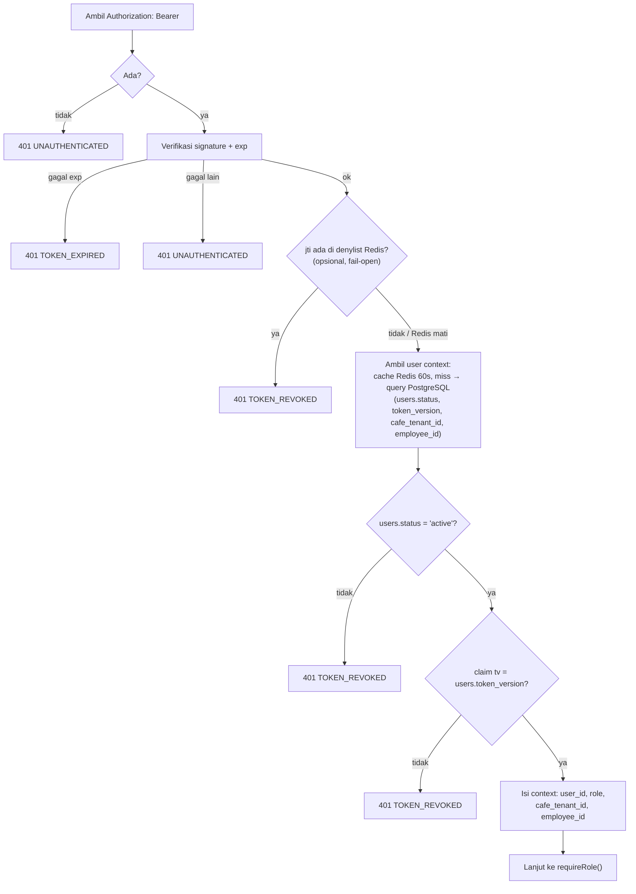
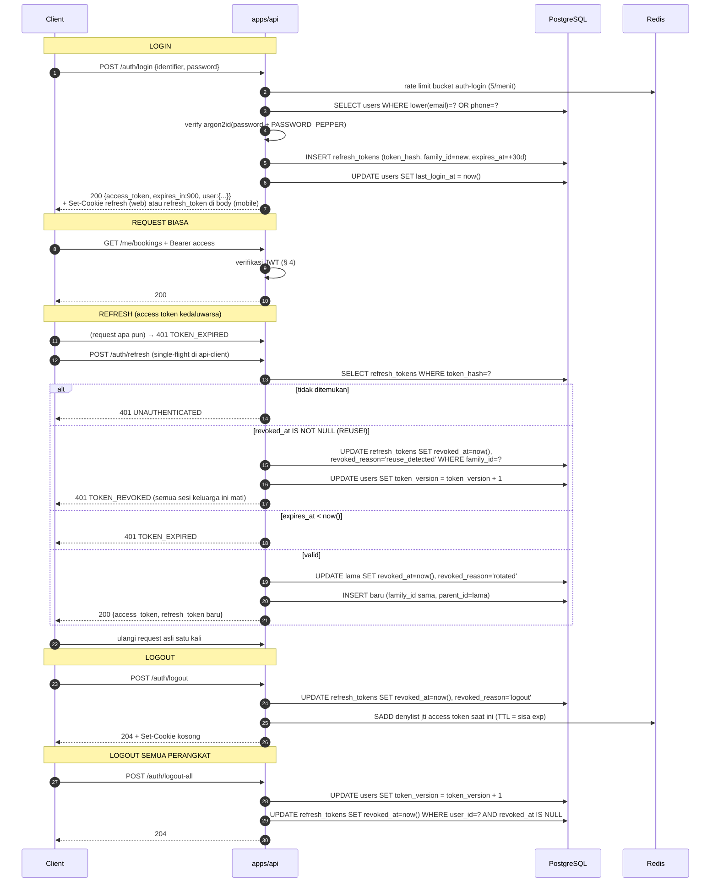

# 05 — AUTH & RBAC

> Prasyarat: [04-API-CONTRACT.md](04-API-CONTRACT.md), [03-DATA-MODEL.md](03-DATA-MODEL.md).
> Tabel terkait: `users`, `refresh_tokens`, `customer_profiles`, `cafe_tenants`, `employees`,
> `audit_logs`.

---

## 1. Prinsip

1. **Otentikasi dan otorisasi hanya terjadi di `apps/api`.** Guard di frontend (redirect,
   menyembunyikan menu) adalah UX, **bukan** keamanan. Setiap endpoint tetap memvalidasi
   sendiri.
2. **Satu role per user.** `users.role` bertipe enum dengan 4 nilai. Tidak ada tabel
   `user_roles`, tidak ada permission granular per user di v1.
3. **Dua lapis otorisasi.** (a) *Role check* — apakah role ini boleh menyentuh endpoint ini;
   (b) *Ownership/scope check* — apakah baris data ini miliknya. Keduanya wajib; lapis (a) saja
   tidak cukup.
4. **Default deny.** Endpoint tanpa deklarasi role eksplisit **tidak dapat diakses** siapa pun
   selain melalui middleware yang menyebut role-nya. Middleware `requireRole([...])` wajib ada
   pada setiap route kecuali route yang secara sengaja publik dan didaftarkan di allowlist
   publik.
5. **Tidak membocorkan keberadaan data.** Customer yang meminta resource orang lain menerima
   `404`, bukan `403` (lihat [04 § 11 E-3](04-API-CONTRACT.md#11-edge-cases-api)).
6. **Semua aksi sensitif tercatat.** Perubahan role, pencabutan sesi, force release slot,
   refund, penyesuaian poin, perubahan gaji → `audit_logs`.

---

## 2. Role & Definisi

| Role | Siapa | Surface | Cakupan data |
|---|---|---|---|
| `customer` | Pemain / penyewa lapangan | `apps/web`, `apps/mobile` | **Hanya data miliknya sendiri** + data katalog publik (court, harga, event, tutorial, leaderboard) |
| `staff` | Operasional harian: front desk, kasir, court marshal | `apps/admin` (subset) | Data operasional harian seluruh venue: booking, check-in, pembayaran manual, absensi diri, input skor match. **Tidak** boleh mengubah harga, promo, kontrak tenant, jurnal, atau data karyawan |
| `admin` | Pemilik & manajemen | `apps/admin` (penuh) | Semua data, semua aksi, termasuk yang bersifat keuangan dan destruktif (force release, void jurnal, refund approval) |
| `tenant` | Pemilik/PIC tenant cafe | `apps/admin` (portal terbatas) | **Hanya** data `cafe_tenants` miliknya: kontrak, tagihan, unggah bukti bayar. Tidak melihat data booking, customer, atau keuangan Hola |

### Aturan tambahan per role

| Aturan | Ketentuan |
|---|---|
| Tidak ada role `owner` | Fungsi owner dijalankan `admin`. Menambah role berarti menambah baris di seluruh RBAC matrix — keputusan sadar untuk tidak melakukannya di v1 |
| `staff` tidak bisa membuat `staff` | Pembuatan user staff/admin/tenant hanya oleh `admin` |
| Satu user tidak bisa dua role | Karyawan yang juga ingin memesan lapangan sebagai customer perlu **dua akun** (email berbeda). Keterbatasan sadar; dicatat di [03 § 20 DM-10](03-DATA-MODEL.md#20-edge-cases-data-model) |
| Tautan `tenant` → `cafe_tenants` | Lewat `cafe_tenants.owner_user_id`. Satu user `tenant` = satu cafe tenant. Middleware mengisi `cafe_tenant_id` di context; jika user berrole `tenant` **tanpa** baris `cafe_tenants` yang menaut, semua endpoint tenant mengembalikan `403 FORBIDDEN` |
| Tautan `staff`/`admin` → `employees` | Lewat `employees.user_id`, opsional. Dipakai untuk absensi diri. Ketiadaannya tidak memblokir akses admin |
| Suspend | `users.status='suspended'` → semua request `401 TOKEN_REVOKED`, refresh ditolak. Dicek di middleware auth setiap request (bukan hanya saat login) |

---

## 3. Session vs JWT: Rekomendasi & Alasan

### Rekomendasi final

> **Access token JWT berumur pendek (15 menit) + refresh token opaque yang disimpan &
> divalidasi di PostgreSQL, dengan rotasi dan deteksi reuse.**

Bukan JWT murni (tanpa server state), bukan session cookie murni. Hibrida.

### Perbandingan

| Kriteria | Session cookie (state di server) | JWT murni (stateless, panjang umur) | **Hibrida (rekomendasi)** |
|---|---|---|---|
| Mobile (Expo) | Buruk — cookie di React Native butuh penanganan khusus, tidak bisa `HttpOnly` bermakna, sulit di WebView | Baik | **Baik** — access token di header, refresh di `expo-secure-store` |
| Cross-origin (api.hola.id ↔ hola.id) | Butuh `SameSite=None; Secure` + CORS credentials; rapuh di beberapa browser & privacy mode | Tidak masalah | **Tidak masalah** untuk access token; refresh cookie tetap `SameSite=Lax` karena domain induk sama (`.hola.id`) |
| Revokasi instan | ✓ (hapus session) | ✗ — token tetap sah sampai kedaluwarsa | **≈** — access token maksimal hidup 15 menit setelah dicabut; refresh dicabut instan lewat DB |
| Beban database per request | 1 query per request | 0 query | **0 query** untuk verifikasi tanda tangan; **1 query ringan** untuk memeriksa `users.status` & `token_version` (di-cache 60 s di Redis, fail-open ke query DB) |
| Skala horizontal API | Butuh session store bersama (Redis) → Redis menjadi jalur kritis | ✓ | **✓** — API stateless; Redis hanya optimasi |
| Ketergantungan Redis | Tinggi (kehilangan Redis = semua logout) | Nol | **Nol** — sesuai aturan induk: Redis boleh hilang |
| Kompleksitas implementasi | Rendah | Rendah | Sedang (butuh rotasi + deteksi reuse) |
| Risiko token dicuri | Cookie `HttpOnly` cukup terlindungi dari XSS | Tinggi jika disimpan di `localStorage` | **Rendah** — access token hanya di memori (web) / secure store (mobile); refresh `HttpOnly` (web) |

### Alasan penentu

1. **Ada tiga client dengan kebutuhan berbeda.** Mobile tidak bisa mengandalkan cookie; web
   dan admin lebih aman dengan cookie `HttpOnly` untuk kredensial berumur panjang. Hibrida
   memenuhi keduanya tanpa dua sistem auth.
2. **Redis tidak boleh menjadi jalur kritis** (aturan induk di
   [02 § 4](02-INFRASTRUCTURE.md#4-aturan-penggunaan-redis)). Session store di Redis akan
   melanggarnya: flush Redis = semua user logout. Dengan refresh token di PostgreSQL,
   kehilangan Redis tidak mengeluarkan siapa pun.
3. **Butuh revokasi yang nyata.** Karyawan yang berhenti harus kehilangan akses. JWT murni
   berumur panjang tidak bisa memberi itu. Dengan access token 15 menit + `token_version`,
   jendela paparan maksimal 15 menit — dapat diterima untuk sistem ini, dan bisa dipersempit
   ke nol untuk kasus kritis lewat denylist `jti` di Redis (opsional, fail-open).
4. **API harus bisa di-scale tanpa sticky session.**

### Yang **tidak** dipakai dan mengapa

| Ditolak | Alasan |
|---|---|
| JWT berumur panjang (7 hari) tanpa refresh | Tidak bisa dicabut; sekali bocor, berlaku seminggu |
| Refresh token berbentuk JWT | Tidak memberi manfaat (tetap harus dicek DB untuk rotasi & reuse) tapi memperbesar ukuran & risiko salah verifikasi |
| Session di Redis | Melanggar aturan induk Redis |
| NextAuth / Auth.js | Auth harus hidup di `apps/api` (satu jalur), bukan di Next.js. Memakai Auth.js berarti dua tempat kebenaran sesi dan mobile tetap tidak terlayani |
| OAuth social login (Google/Apple) | Bukan v1. Lihat [17-NON-GOALS.md](17-NON-GOALS.md). Struktur `users` sudah mengizinkan penambahannya nanti (`password_hash` nullable) |

---

## 4. Bentuk Token

### Access token (JWT)

| Aspek | Nilai |
|---|---|
| Algoritma | `HS256` dengan `JWT_ACCESS_SECRET` (≥ 32 byte acak) |
| TTL | **15 menit** (`JWT_ACCESS_TTL`) |
| Transport | Header `Authorization: Bearer <token>` |
| Penyimpanan di client | **Web/admin:** hanya di memori (React state / TanStack Query context). **Tidak** di `localStorage`/`sessionStorage`. **Mobile:** `expo-secure-store` |

Claim:

| Claim | Isi |
|---|---|
| `sub` | `users.id` |
| `role` | `customer` \| `admin` \| `staff` \| `tenant` |
| `tv` | `users.token_version` saat token diterbitkan |
| `jti` | uuid token (untuk denylist opsional) |
| `iat`, `exp` | standar |
| `iss` | `hola-api` |
| `aud` | `hola-clients` |

**Tidak** dimasukkan ke claim: email, nama, `cafe_tenant_id`, `employee_id`, permission list.
Alasan: claim yang bisa berubah (mis. tenant dipindah, nama diedit) akan basi sampai token
kedaluwarsa. Data itu dibaca dari DB per request (murah, satu query yang di-cache).

### Verifikasi access token (middleware `authenticate`)

Jika Redis mati, langkah cache pada E jatuh ke query PostgreSQL langsung — auth tetap benar,
hanya lebih banyak query. Denylist `jti` yang hilang berarti token yang dicabut manual bisa
hidup ≤15 menit; diterima dan didokumentasikan.

### Refresh token (opaque)

| Aspek | Nilai |
|---|---|
| Bentuk | 32 byte acak (`crypto.randomBytes`) → base64url. **Bukan** JWT |
| Penyimpanan server | `refresh_tokens.token_hash` = SHA-256 dari token. Token mentah tidak pernah disimpan |
| TTL | **30 hari** (`REFRESH_TOKEN_TTL_DAYS`), diperpanjang setiap rotasi |
| Transport web/admin | Cookie `HttpOnly; Secure; SameSite=Lax; Domain=.hola.id; Path=/api/v1/auth; Max-Age=2592000` |
| Transport mobile | Body JSON pada `POST /auth/refresh`; disimpan di `expo-secure-store` |
| Rotasi | **Setiap** pemakaian menghasilkan refresh token baru; yang lama langsung `revoked_at` dengan `revoked_reason='rotated'` |

---

## 5. Siklus Hidup Token

### Aturan siklus hidup

| # | Aturan |
|---|---|
| T-1 | Access token TTL **15 menit**. Tidak boleh diperpanjang lewat konfigurasi produksi tanpa keputusan eksplisit |
| T-2 | Refresh token TTL **30 hari**, di-reset setiap rotasi. User aktif tidak pernah dipaksa login ulang |
| T-3 | **Rotasi wajib.** Satu refresh token hanya boleh dipakai sekali |
| T-4 | **Deteksi reuse.** Memakai refresh token yang sudah `revoked` = indikasi token dicuri → seluruh `family_id` dicabut **dan** `token_version` dinaikkan (mematikan access token yang beredar). User harus login ulang di semua perangkat |
| T-5 | Maksimal **10 refresh token aktif** per user. Melebihi → yang paling lama `last_used_at` dicabut otomatis (`revoked_reason='max_sessions'`) |
| T-6 | Ganti password → `token_version + 1` + cabut semua refresh token |
| T-7 | Admin menonaktifkan user (`status='suspended'`) → efektif pada request berikutnya (≤60 s karena cache user context) |
| T-8 | `POST /admin/users/{id}/revoke-sessions` → `token_version + 1` + cabut semua refresh token user itu |
| T-9 | J-31 `system.cleanupExpiredTokens` menghapus baris `refresh_tokens` yang kedaluwarsa/dicabut > 30 hari |
| T-10 | Refresh **tidak** memperpanjang sesi user yang `suspended`/`deleted` |
| T-11 | Refresh di-rate-limit (bucket `auth-refresh`, 30/menit per IP) untuk mencegah brute force |
| T-12 | `packages/api-client` melakukan refresh **single-flight**: beberapa request yang gagal `401` bersamaan hanya memicu satu `POST /auth/refresh`; sisanya menunggu hasilnya. Tanpa ini, rotasi akan memicu deteksi reuse palsu |

---

## 6. RBAC Matrix per Endpoint

Legenda:
- **✓** boleh
- **○** boleh, **tetapi dibatasi ke data miliknya sendiri** (lihat [§ 7](#7-otorisasi-berbasis-kepemilikan))
- **◐** boleh, dengan **field terbatas** (beberapa field disembunyikan atau read-only)
- **✗** tidak boleh (`403 FORBIDDEN`, atau `404` untuk customer sesuai § 1.5)
- **P** publik (tanpa autentikasi)

Path relatif terhadap `/api/v1`. Endpoint mengikuti katalog di
[04 § 9](04-API-CONTRACT.md#9-katalog-endpoint-v1).

### 6.1 Auth & Config

| Endpoint | P | customer | staff | admin | tenant |
|---|---|---|---|---|---|
| `POST /auth/register` | P | — | — | — | — |
| `POST /auth/login` | P | — | — | — | — |
| `POST /auth/refresh` | P | — | — | — | — |
| `POST /auth/otp/request`, `/auth/otp/verify` | P | — | — | — | — |
| `POST /auth/password/forgot`, `/auth/password/reset` | P | — | — | — | — |
| `POST /auth/logout`, `/auth/logout-all`, `/auth/password/change` | | ✓ | ✓ | ✓ | ✓ |
| `GET /auth/sessions`, `DELETE /auth/sessions/{id}` | | ○ | ○ | ○ | ○ |
| `GET /config/public` | P | — | — | — | — |

### 6.2 Katalog & Ketersediaan

| Endpoint | P | customer | staff | admin | tenant |
|---|---|---|---|---|---|
| `GET /sports`, `/courts`, `/courts/{id}` | P | ✓ | ✓ | ✓ | ✓ |
| `GET /courts/{id}/availability`, `/availability` | P | ✓ | ✓ | ✓ | ✓ |
| `GET /addons`, `/pricing/preview` | P | ✓ | ✓ | ✓ | ✓ |
| `POST /courts`, `PATCH /courts/{id}` | | ✗ | ✗ | ✓ | ✗ |
| `PUT /courts/{id}/operating-hours`, `/photos` | | ✗ | ✗ | ✓ | ✗ |
| `GET /price-rules` | | ✗ | ✓ | ✓ | ✗ |
| `POST /price-rules`, `PATCH`, `DELETE` | | ✗ | ✗ | ✓ | ✗ |
| `GET /court-maintenances` | | ✗ | ✓ | ✓ | ✗ |
| `POST /court-maintenances`, `POST .../cancel` | | ✗ | ✓ | ✓ | ✗ |
| `GET /special-dates` | P | ✓ | ✓ | ✓ | ✓ |
| `POST /special-dates`, `DELETE` | | ✗ | ✗ | ✓ | ✗ |
| `GET /slot-claims` | | ✗ | ✓ | ✓ | ✗ |

> `POST /court-maintenances` dengan `force=true` **hanya** `admin` (lihat
> [03 § 8.8](03-DATA-MODEL.md#88-force-release-hanya-admin)). `staff` boleh membuat maintenance
> yang tidak menabrak booking.

### 6.3 Booking

| Endpoint | P | customer | staff | admin | tenant |
|---|---|---|---|---|---|
| `POST /bookings/quote` | P | ✓ | ✓ | ✓ | ✗ |
| `POST /bookings` | | ✓ | ✓ | ✓ | ✗ |
| `GET /bookings` (daftar semua) | | ✗ | ✓ | ✓ | ✗ |
| `GET /bookings/{id}` | | ○ | ◐ | ✓ | ✗ |
| `GET /me/bookings` | | ○ | ○ | ○ | ✗ |
| `POST /bookings/{id}/cancel` | | ○ | ✓ | ✓ | ✗ |
| `POST /bookings/{id}/check-in`, `/no-show` | | ✗ | ✓ | ✓ | ✗ |
| `PATCH /bookings/{id}` (`customer_note`) | | ○ | ✗ | ✓ | ✗ |
| `PATCH /bookings/{id}` (`internal_note`) | | ✗ | ✓ | ✓ | ✗ |
| `POST /bookings/{id}/reschedule` | | ○ | ✓ | ✓ | ✗ |
| `GET /bookings/{id}/receipt` | | ○ | ✓ | ✓ | ✗ |

Catatan `◐` untuk `staff` pada `GET /bookings/{id}`: `staff` melihat semua booking tetapi
**tidak** melihat `payments[].provider_meta` dan `payments[].gateway_fee_amount`.

Batasan `customer` pada `POST /bookings`: hanya untuk dirinya sendiri (`customer_user_id`
dipaksa = `user_id` dari token; field itu diabaikan jika dikirim). `channel` dipaksa
`web`/`mobile` berdasarkan `X-Client-Platform`. `staff`/`admin` boleh menetapkan
`customer_user_id` lain atau `guest_name`+`guest_phone`, dan `channel` `admin`/`walk_in`.

Batasan `customer` pada `POST /bookings/{id}/cancel`: hanya booking miliknya, hanya status
`pending_payment` atau `confirmed`, dan tunduk kebijakan refund
([06 § 7](06-MODULE-BOOKING.md#7-kebijakan-pembatalan--refund-butuh-keputusan-client)).

### 6.4 Payment & Refund

| Endpoint | P | customer | staff | admin | tenant |
|---|---|---|---|---|---|
| `POST /payments` | | ○ | ✓ | ✓ | ○ |
| `GET /payments/{id}` | | ○ | ◐ | ✓ | ○ |
| `GET /payments` (daftar) | | ✗ | ◐ | ✓ | ✗ |
| `POST /payments/{id}/cancel` | | ○ | ✓ | ✓ | ✗ |
| `POST /payments/{id}/sync` | | ✗ | ✓ | ✓ | ✗ |
| `POST /payments/manual` | | ✗ | ✓ | ✓ | ✗ |
| `POST /webhooks/midtrans` | P | — | — | — | — |
| `GET /refunds`, `GET /refunds/{id}` | | ○ | ✓ | ✓ | ✗ |
| `POST /refunds` (mengajukan) | | ✗ | ✓ | ✓ | ✗ |
| `POST /refunds/{id}/approve`, `/reject` | | ✗ | ✗ | ✓ | ✗ |
| `POST /refunds/{id}/mark-completed` | | ✗ | ✓ | ✓ | ✗ |

`tenant` pada `POST /payments`: hanya untuk `cafe_invoice_id` milik `cafe_tenant_id`-nya.
`customer` tidak dapat mengajukan refund langsung; ia mengajukan **pembatalan booking**
(`POST /bookings/{id}/cancel`) dan sistem membuat `refunds` sesuai kebijakan.

### 6.5 Promo

| Endpoint | P | customer | staff | admin | tenant |
|---|---|---|---|---|---|
| `POST /promos/validate` | | ✓ | ✓ | ✓ | ✗ |
| `GET /promos/available` | | ✓ | ✓ | ✓ | ✗ |
| `GET /promos`, `GET /promos/{id}` | | ✗ | ◐ | ✓ | ✗ |
| `POST /promos`, `PATCH /promos/{id}` | | ✗ | ✗ | ✓ | ✗ |
| `POST /promos/{id}/pause`, `/activate`, `/archive` | | ✗ | ✗ | ✓ | ✗ |
| `GET /promos/{id}/redemptions` | | ✗ | ◐ | ✓ | ✗ |

`staff` `◐`: boleh melihat daftar & detail promo (untuk membantu customer di kasir) tetapi
tidak melihat statistik biaya (`total_discount_amount`) dan tidak bisa mengubah apa pun.

### 6.6 Event

| Endpoint | P | customer | staff | admin | tenant |
|---|---|---|---|---|---|
| `GET /events` (publik: status ≥ published) | P | ✓ | ✓ | ✓ | ✓ |
| `GET /events` (termasuk `draft`) | | ✗ | ✓ | ✓ | ✗ |
| `GET /events/{id_or_slug}` | P | ✓ | ✓ | ✓ | ✓ |
| `POST /events`, `PATCH /events/{id}` | | ✗ | ✗ | ✓ | ✗ |
| `POST /events/{id}/schedule` | | ✗ | ✗ | ✓ | ✗ |
| `POST /events/{id}/publish`, `/open-registration`, `/close-registration` | | ✗ | ✗ | ✓ | ✗ |
| `POST /events/{id}/cancel` | | ✗ | ✗ | ✓ | ✗ |
| `POST /events/{id}/registrations` | | ✓ | ✓ | ✓ | ✗ |
| `GET /events/{id}/registrations` | | ✗ | ✓ | ✓ | ✗ |
| `GET /me/event-registrations` | | ○ | ○ | ○ | ✗ |
| `POST /event-registrations/{id}/cancel` | | ○ | ✓ | ✓ | ✗ |
| `POST /event-registrations/{id}/check-in` | | ✗ | ✓ | ✓ | ✗ |
| `POST /event-registrations/{id}/promote` | | ✗ | ✗ | ✓ | ✗ |

`POST /events/{id}/schedule` dengan `force=true`: hanya `admin`.

### 6.7 Tournament & Match

| Endpoint | P | customer | staff | admin | tenant |
|---|---|---|---|---|---|
| `GET /tournaments`, `/{id}`, `/{id}/bracket`, `/{id}/standings`, `/{id}/matches` | P | ✓ | ✓ | ✓ | ✓ |
| `GET /matches/{id}` | P | ✓ | ✓ | ✓ | ✓ |
| `POST /tournaments`, `PATCH` | | ✗ | ✗ | ✓ | ✗ |
| `POST /tournaments/{id}/registrations` | | ✓ | ✓ | ✓ | ✗ |
| `GET /tournaments/{id}/registrations` | | ✗ | ✓ | ✓ | ✗ |
| `PATCH /tournament-registrations/{id}` (seed, group) | | ✗ | ✗ | ✓ | ✗ |
| `POST /tournament-registrations/{id}/withdraw` | | ○ | ✓ | ✓ | ✗ |
| `POST /tournaments/{id}/close-registration`, `/generate-bracket` | | ✗ | ✗ | ✓ | ✗ |
| `POST /matches/{id}/schedule`, `/unschedule` | | ✗ | ✓ | ✓ | ✗ |
| `POST /matches/{id}/start` | | ✗ | ✓ | ✓ | ✗ |
| `POST /matches/{id}/score` | | ✗ | ✓ | ✓ | ✗ |
| `POST /matches/{id}/walkover` | | ✗ | ✓ | ✓ | ✗ |
| `POST /matches/{id}/reopen` | | ✗ | ✗ | ✓ | ✗ |
| `GET /me/matches` | | ○ | ○ | ○ | ✗ |

**Peserta tidak boleh menginput skor.** Hanya `staff`/`admin` (lihat
[11 § 6](11-MODULE-MATCH.md#6-input-skor--siapa-yang-berhak)). `POST /matches/{id}/schedule`
dengan `force=true`: hanya `admin`.

### 6.8 Gamification

| Endpoint | P | customer | staff | admin | tenant |
|---|---|---|---|---|---|
| `GET /leaderboard`, `/leaderboard-periods`, `/badges`, `/tiers`, `/point-rules` | P | ✓ | ✓ | ✓ | ✓ |
| `GET /me/points`, `/me/points/summary`, `/me/badges` | | ○ | ○ | ○ | ✗ |
| `POST /admin/points/adjust` | | ✗ | ✗ | ✓ | ✗ |
| `POST /admin/leaderboard/rebuild` | | ✗ | ✗ | ✓ | ✗ |

### 6.9 Mobile: Aktivitas & Tutorial

| Endpoint | P | customer | staff | admin | tenant |
|---|---|---|---|---|---|
| `POST /me/activities`, `GET /me/activities`, `/summary`, `PATCH`, `DELETE` | | ○ | ○ | ○ | ✗ |
| `GET /tutorials`, `/tutorials/{id}` | P | ✓ | ✓ | ✓ | ✓ |
| `POST /tutorials/{id}/progress` | | ○ | ○ | ○ | ✗ |
| `POST /tutorials`, `PATCH /tutorials/{id}` | | ✗ | ✗ | ✓ | ✗ |

### 6.10 Cafe Tenant

| Endpoint | P | customer | staff | admin | tenant |
|---|---|---|---|---|---|
| `GET /cafe-units` | | ✗ | ✓ | ✓ | ✗ |
| `POST /cafe-units`, `PATCH` | | ✗ | ✗ | ✓ | ✗ |
| `GET /cafe-tenants` | | ✗ | ◐ | ✓ | ✗ |
| `GET /cafe-tenants/{id}` | | ✗ | ◐ | ✓ | ○ |
| `POST /cafe-tenants`, `PATCH` | | ✗ | ✗ | ✓ | ✗ |
| `GET /cafe-contracts`, `GET /cafe-contracts/{id}` | | ✗ | ◐ | ✓ | ○ |
| `POST /cafe-contracts`, `PATCH`, `/activate`, `/terminate` | | ✗ | ✗ | ✓ | ✗ |
| `GET /cafe-invoices` | | ✗ | ✓ | ✓ | ✗ |
| `GET /cafe-invoices/{id}` | | ✗ | ✓ | ✓ | ○ |
| `POST /cafe-invoices`, `PATCH`, `/issue`, `/void` | | ✗ | ✗ | ✓ | ✗ |
| `POST /cafe-invoices/{id}/payments` | | ✗ | ✓ | ✓ | ✗ |
| `GET /me/cafe-invoices` | | ✗ | ✗ | ✗ | ○ |
| `POST /cafe-invoices/{id}/payment-proof` | | ✗ | ✓ | ✓ | ○ |
| `POST /admin/cafe/generate-invoices` | | ✗ | ✗ | ✓ | ✗ |

`staff` `◐` pada tenant/kontrak: melihat nama, unit, kontak (untuk keperluan operasional
gedung) tetapi **tidak** melihat `rent_amount`, `deposit_amount`, `revenue_share_percent`,
atau dokumen kontrak.
`tenant` `○`: hanya baris dengan `cafe_tenant_id` = miliknya. Tenant **tidak** boleh mencatat
pembayaran (`POST /cafe-invoices/{id}/payments`) — ia hanya mengunggah bukti; staff yang
mencatat.

### 6.11 CRM

| Endpoint | P | customer | staff | admin | tenant |
|---|---|---|---|---|---|
| `GET /customers`, `GET /customers/{id}` | | ✗ | ◐ | ✓ | ✗ |
| `PATCH /customers/{id}` | | ✗ | ◐ | ✓ | ✗ |
| `GET /customers/{id}/bookings`, `/payments` | | ✗ | ✓ | ✓ | ✗ |
| `GET /customers/{id}/notes`, `POST .../notes` | | ✗ | ✓ | ✓ | ✗ |
| `GET /customer-tags` | | ✗ | ✓ | ✓ | ✗ |
| `POST /customer-tags`, `PUT /customers/{id}/tags` | | ✗ | ✗ | ✓ | ✗ |
| `GET /me/profile`, `PATCH /me/profile` | | ○ | ○ | ○ | ○ |
| `PUT /me/notification-prefs` | | ○ | ○ | ○ | ○ |
| `POST /me/push-tokens`, `DELETE /me/push-tokens/{id}` | | ○ | ○ | ○ | ○ |
| `GET /me/notifications`, `POST .../read`, `/read-all` | | ○ | ○ | ○ | ○ |

`staff` `◐` pada customer: melihat nama, telepon, email, riwayat booking, tier, dan poin.
**Tidak** melihat `birth_date` lengkap (hanya bulan/tanggal untuk ucapan ulang tahun) dan
tidak bisa mengubah `tier_code` atau `lifetime_points`.

### 6.12 HRIS

| Endpoint | P | customer | staff | admin | tenant |
|---|---|---|---|---|---|
| `GET /employees` | | ✗ | ◐ | ✓ | ✗ |
| `GET /employees/{id}` | | ✗ | ◐ | ✓ | ✗ |
| `POST /employees`, `PATCH /employees/{id}` | | ✗ | ✗ | ✓ | ✗ |
| `GET /shifts` | | ✗ | ✓ | ✓ | ✗ |
| `POST /shifts`, `PATCH /shifts/{id}` | | ✗ | ✗ | ✓ | ✗ |
| `GET /shift-assignments` | | ✗ | ◐ | ✓ | ✗ |
| `POST /shift-assignments`, `DELETE` | | ✗ | ✗ | ✓ | ✗ |
| `GET /attendances` | | ✗ | ◐ | ✓ | ✗ |
| `POST /attendances/clock-in`, `/clock-out` | | ✗ | ○ | ✓ | ✗ |
| `PATCH /attendances/{id}` | | ✗ | ✗ | ✓ | ✗ |
| `GET /leave-requests` | | ✗ | ○ | ✓ | ✗ |
| `POST /leave-requests` | | ✗ | ○ | ✓ | ✗ |
| `POST /leave-requests/{id}/decide` | | ✗ | ✗ | ✓ | ✗ |

`staff` `◐` pada `employees`: melihat nama, posisi, telepon rekan kerja (direktori internal).
**`base_salary_amount` hanya `admin`** — difilter di serializer, tidak sekadar disembunyikan di
UI. `staff` `◐` pada `shift_assignments`/`attendances`: melihat jadwal seluruh tim (perlu untuk
koordinasi) tetapi absensinya sendiri saja yang bisa diubah, dan hanya lewat clock-in/out.

### 6.13 Finance

| Endpoint | P | customer | staff | admin | tenant |
|---|---|---|---|---|---|
| `GET /accounts` | | ✗ | ✗ | ✓ | ✗ |
| `POST /accounts`, `PATCH` | | ✗ | ✗ | ✓ | ✗ |
| `GET /journal-entries`, `GET /journal-entries/{id}` | | ✗ | ✗ | ✓ | ✗ |
| `POST /journal-entries`, `/post`, `/void` | | ✗ | ✗ | ✓ | ✗ |
| `GET /expenses` | | ✗ | ◐ | ✓ | ✗ |
| `POST /expenses` | | ✗ | ◐ | ✓ | ✗ |
| `PATCH /expenses/{id}` | | ✗ | ✗ | ✓ | ✗ |
| `GET /admin/reports/*` | | ✗ | ✗ | ✓ | ✗ |
| `POST /admin/reports/{report}/export` | | ✗ | ✗ | ✓ | ✗ |

`staff` `◐` pada `expenses`: boleh **mencatat** pengeluaran operasional kecil (kas kecil) dan
melihat pengeluaran yang ia catat sendiri, dengan batas nilai dari `app_settings.staff_expense_limit_amount`
(default Rp 500.000). Tidak melihat pengeluaran lain, tidak bisa mengubah/hapus.

### 6.14 Sistem & Media

| Endpoint | P | customer | staff | admin | tenant |
|---|---|---|---|---|---|
| `GET /admin/settings`, `PUT /admin/settings/{key}` | | ✗ | ✗ | ✓ | ✗ |
| `GET /admin/audit-logs` | | ✗ | ✗ | ✓ | ✗ |
| `GET /admin/users`, `POST`, `PATCH`, `/revoke-sessions` | | ✗ | ✗ | ✓ | ✗ |
| `GET /admin/jobs/summary`, `POST /admin/jobs/{name}/trigger` | | ✗ | ✗ | ✓ | ✗ |
| `POST /media/presign`, `/confirm` | | ○ | ✓ | ✓ | ○ |
| `GET /media/{id}` | | ○ | ✓ | ✓ | ○ |
| `DELETE /media/{id}` | | ○ | ✓ | ✓ | ○ |
| `GET /healthz`, `/readyz`, `/healthz/worker` | P | — | — | — | — |
| `GET /internal/metrics` | | ✗ | ✗ | ✗ | ✗ |
| `POST /dev/*` | P (hanya `APP_ENV=local`) | — | — | — | — |

`POST /media/presign` dibatasi per role melalui `kind`:

| `kind` | Siapa yang boleh |
|---|---|
| `avatar` | semua role (untuk dirinya sendiri) |
| `court_photo`, `event_poster`, `tutorial_thumbnail` | `admin` |
| `contract_document` | `admin` |
| `payment_proof` | `tenant` (untuk invoicenya), `staff`, `admin` |
| `expense_receipt` | `staff`, `admin` |

`GET /internal/metrics` tidak memakai role sama sekali — hanya header `X-Internal-Token`.

---

## 7. Otorisasi Berbasis Kepemilikan

Role check saja tidak cukup. Setiap `○` di matrix harus ditegakkan dengan **filter di query**,
bukan pemeriksaan setelah data diambil.

### Aturan implementasi

| # | Aturan |
|---|---|
| O-1 | **Filter di WHERE, bukan di JS.** `SELECT ... WHERE customer_user_id = $userId`, bukan ambil semua lalu `.filter()`. Mencegah kebocoran lewat pagination & count |
| O-2 | Repository menyediakan dua varian untuk resource ber-kepemilikan: `findByIdForUser(id, userId)` dan `findByIdAdmin(id)`. Service memilih berdasarkan role. Tidak ada `findById` generik yang dipakai route customer |
| O-3 | `customer_user_id` **tidak pernah** diambil dari body request. Selalu dari token, kecuali role `staff`/`admin` yang memang berhak menetapkannya |
| O-4 | `cafe_tenant_id` untuk role `tenant` selalu dari context (hasil lookup `cafe_tenants.owner_user_id = user_id`), tidak pernah dari request |
| O-5 | Resource yang tidak ditemukan **atau** bukan milik pemanggil customer → `404 NOT_FOUND` yang identik. Tidak ada perbedaan pesan atau waktu respons yang bisa dipakai membedakan |
| O-6 | Untuk `staff`/`admin`, akses ke resource yang ada tetapi di luar hak → `403 FORBIDDEN` (keberadaan resource bukan rahasia bagi mereka) |

### Tabel kepemilikan

| Resource | Pemilik `customer` | Pemilik `tenant` | Kolom penentu |
|---|---|---|---|
| `bookings` | ✓ | — | `customer_user_id` |
| `payments` | ✓ (lewat payable) | ✓ (lewat `cafe_invoice_id`) | join ke payable |
| `refunds` | ✓ (lewat `payment_id`) | — | join |
| `event_registrations` | ✓ | — | `user_id` |
| `tournament_registrations` | ✓ | — | `user_id`, `partner_user_id` |
| `matches` (`/me/matches`) | ✓ | — | via `tournament_registrations` |
| `activities` | ✓ | — | `user_id` |
| `tutorial_progress` | ✓ | — | `user_id` |
| `point_ledger` | ✓ | — | `user_id` |
| `user_badges` | ✓ | — | `user_id` |
| `notifications` | ✓ | ✓ | `user_id` |
| `push_tokens` | ✓ | ✓ | `user_id` |
| `refresh_tokens` (sessions) | ✓ | ✓ | `user_id` |
| `customer_profiles` (`/me/profile`) | ✓ | — | `user_id` |
| `cafe_tenants` | — | ✓ | `owner_user_id` |
| `cafe_contracts` | — | ✓ | `cafe_tenant_id` |
| `cafe_invoices` | — | ✓ | `cafe_tenant_id` |
| `media_files` | ✓ | ✓ | `uploaded_by_user_id`, atau publik jika `bucket = hola-media` |
| `attendances`, `leave_requests` | — | — | `employee_id` (untuk `staff`) |

### Field-level filtering (`◐`)

Diterapkan di **serializer** per role, bukan di frontend.

| Resource | Field | Terlihat oleh |
|---|---|---|
| `employees` | `base_salary_amount` | `admin` |
| `employees` | `emergency_contact_*` | `admin` |
| `customer_profiles` | `internal_notes` | `staff`, `admin` |
| `customer_profiles` | `birth_date` (tahun) | `admin` (staff hanya bulan-tanggal) |
| `payments` | `provider_meta`, `gateway_fee_amount`, `settled_amount` | `admin` |
| `cafe_contracts` | `rent_amount`, `service_charge_amount`, `deposit_amount`, `document_media_id` | `admin`, dan `tenant` untuk kontraknya sendiri |
| `promos` | `total_discount_amount` (statistik biaya) | `admin` |
| `bookings` | `internal_note` | `staff`, `admin` |
| `expenses` | semua kecuali yang dicatat sendiri | `admin` |

Implementasi: satu fungsi serializer per entitas dengan parameter `viewer: { role, userId }`.
**Tidak** memakai pendekatan "kirim semua, sembunyikan di UI".

---

## 8. Registrasi & Login

### Metode identifikasi

| Metode | Untuk | Alur |
|---|---|---|
| Email + password | customer, staff, admin, tenant | `POST /auth/register` (hanya customer) / dibuat admin (staff, admin, tenant) |
| Nomor HP + OTP | customer (mobile) | `POST /auth/otp/request` → SMS/WhatsApp OTP → `POST /auth/otp/verify` |
| Nomor HP + password | customer | Login dengan `identifier` = nomor HP |

Aturan:
- `POST /auth/register` **hanya** membuat user berrole `customer`. Role lain dibuat `admin`
  lewat `POST /admin/users`. Tidak ada cara mendaftar sendiri sebagai staff/admin/tenant.
- Registrasi memerlukan **salah satu** dari email atau phone (CHECK `ck_users_identifier`).
- Email diverifikasi asinkron; user boleh memesan sebelum verifikasi. Verifikasi wajib untuk:
  reset password dan menerima e-receipt.
- Nomor HP diverifikasi lewat OTP saat pertama dipakai login OTP.
- **Enumerasi akun dicegah:** `POST /auth/register` dengan email yang sudah ada tetap
  mengembalikan `200` dengan pesan generik ("Cek email untuk melanjutkan") dan mengirim email
  "akun sudah ada, ini link login". `POST /auth/password/forgot` selalu `200` terlepas dari
  email ada atau tidak.
- `POST /auth/login` untuk kredensial salah selalu `401 UNAUTHENTICATED` dengan pesan sama,
  baik email tidak ada maupun password salah.

### OTP

| Aspek | Nilai |
|---|---|
| Panjang | 6 digit numerik |
| TTL | 5 menit |
| Penyimpanan | Hash OTP di PostgreSQL (`otp_challenges`: `id`, `phone`, `code_hash`, `purpose`, `attempt_count`, `expires_at`, `consumed_at`). **Bukan** di Redis — kalau Redis flush, user yang sedang menunggu OTP tidak boleh gagal tanpa penjelasan |
| Maks percobaan verifikasi | 5, lalu challenge dibatalkan |
| Rate limit permintaan | 3 per 10 menit per nomor (bucket `auth-otp`) |
| Kanal pengiriman | WhatsApp jika `NOTIF_WHATSAPP_ENABLED=true`, selain itu SMS. Jika keduanya tidak tersedia (default v1), login OTP **dimatikan** dan endpoint mengembalikan `403 FEATURE_DISABLED`. Login v1 memakai email/phone + password |

> **Catatan penting untuk v1:** karena WhatsApp default off (D-04) dan tidak ada provider SMS
> yang diputuskan, **login OTP tidak aktif di v1**. Endpoint-nya tetap ada dan bertipe agar
> mobile tidak perlu diubah saat diaktifkan. Verifikasi nomor HP dilakukan staff secara manual
> saat customer datang, atau dilewati.

### Password

| Aturan | Ketentuan |
|---|---|
| Hashing | **argon2id**, `memoryCost=19456` (19 MB), `timeCost=2`, `parallelism=1` (mengikuti rekomendasi OWASP) |
| Pepper | Konstanta rahasia `PASSWORD_PEPPER` ditambahkan sebelum hashing. Rotasi pepper = rehash saat login berikutnya |
| Panjang minimum | 8 karakter |
| Aturan komposisi | **Tidak ada** persyaratan huruf besar/simbol. Yang divalidasi: panjang ≥ 8, tidak ada di daftar 10.000 password terlemah (list statis di `packages/shared`), tidak sama dengan email/nama |
| Maksimum | 128 karakter (batas argon2 aman) |
| Reset | Token acak 32 byte, hash disimpan di `password_reset_tokens`, TTL **1 jam**, sekali pakai. Reset → cabut semua sesi (T-6) |
| Ganti password | Butuh password lama. Ganti → cabut semua sesi **kecuali** sesi saat ini |

### Brute force & lockout

| Lapis | Mekanisme |
|---|---|
| Rate limit | Bucket `auth-login` 5/menit per (IP + email). Fail-open jika Redis mati |
| Progressive delay | Setelah 3 kegagalan berturut untuk satu email (dihitung dari kolom `users.failed_login_count`), setiap percobaan berikutnya ditunda 1 s, 2 s, 4 s (maks 8 s) |
| Lockout sementara | 10 kegagalan berturut → akun terkunci **15 menit** (`users.locked_until`). Login sukses mereset `failed_login_count` |
| Notifikasi | Lockout mengirim email "ada percobaan login gagal berulang" ke pemilik akun |
| Anti-Redis-dependency | Karena `failed_login_count` & `locked_until` di PostgreSQL, proteksi tetap bekerja saat Redis mati |

---

## 9. Keamanan Tambahan

| # | Aturan |
|---|---|
| S-1 | Semua traffic HTTPS. HSTS `max-age=31536000; includeSubDomains` diset Traefik |
| S-2 | Cookie refresh: `HttpOnly`, `Secure`, `SameSite=Lax`, `Path=/api/v1/auth`. `Path` sempit membatasi pengiriman cookie hanya ke endpoint auth |
| S-3 | CSRF: karena API memakai `Authorization` header untuk aksi bermutasi (bukan cookie), CSRF klasik tidak berlaku. Endpoint yang **memakai** cookie hanyalah `POST /auth/refresh` dan `POST /auth/logout` — keduanya memvalidasi header `Origin` terhadap `CORS_ORIGINS` dan menolak jika tidak cocok |
| S-4 | Header keamanan pada web & admin (Next.js): `Content-Security-Policy`, `X-Content-Type-Options: nosniff`, `Referrer-Policy: strict-origin-when-cross-origin`, `X-Frame-Options: DENY` |
| S-5 | Access token **tidak boleh** disimpan di `localStorage`/`sessionStorage` (rentan XSS). Web/admin menyimpannya di memori; refresh via cookie saat reload halaman |
| S-6 | Password, token, OTP, dan `snap_token` **tidak pernah** masuk log (redaction pino, lihat [02 § 9](02-INFRASTRUCTURE.md#9-observability)) |
| S-7 | Timing-safe comparison untuk verifikasi signature webhook dan token reset |
| S-8 | `bull-board` (`queue.hola.id`) dilindungi basic auth **dan** IP allowlist. Ia dapat melihat payload job |
| S-9 | Endpoint `/internal/metrics` tidak terekspos publik; hanya lewat jaringan internal Docker atau dengan `X-Internal-Token` |
| S-10 | Data pribadi karyawan (`base_salary_amount`, kontak darurat) dan dokumen kontrak tenant disimpan di bucket privat dan diakses lewat presigned URL TTL 15 menit — tidak pernah URL permanen |
| S-11 | Semua perubahan role, status user, dan pencabutan sesi wajib menghasilkan baris `audit_logs` |
| S-12 | Endpoint `/dev/*` memakai guard yang **melempar error saat boot** jika terdaftar dan `APP_ENV !== 'local'`. Bukan hanya `if` di runtime |

---

## 10. Edge Cases

| # | Kondisi | Perilaku |
|---|---|---|
| A-1 | User berrole `tenant` tanpa baris `cafe_tenants` yang menaut | Semua endpoint tenant `403 FORBIDDEN` dengan pesan "Akun tenant belum ditautkan". Admin diberi tahu lewat cek konsistensi di dashboard |
| A-2 | Role user diubah dari `staff` → `customer` saat ia sedang login | `token_version` dinaikkan otomatis oleh service (perubahan role **wajib** mencabut sesi). Request berikutnya `401 TOKEN_REVOKED` |
| A-3 | Customer memiliki booking, lalu akunnya dihapus | `users.status='deleted'` + PII di-anonymize. Booking & jurnal tetap utuh; nama pada laporan menjadi "Pengguna Terhapus". Booking mendatang yang masih `confirmed` dibatalkan + refund sesuai kebijakan |
| A-4 | Access token valid tetapi user `suspended` sedetik lalu | Cache user context 60 s bisa membuatnya lolos maksimal 60 s. Untuk suspend yang harus instan, endpoint suspend juga menaikkan `token_version` dan menambahkan `jti` aktif ke denylist Redis (best-effort) |
| A-5 | Refresh token dipakai bersamaan dari dua tab (race) | Satu menang, satu menerima token yang sudah `revoked` → dianggap **reuse** → seluruh family dicabut. Ini yang dicegah oleh single-flight (T-12) di `packages/api-client`. Kalau tetap terjadi, user login ulang — perilaku aman yang disengaja |
| A-6 | Refresh token dicuri dan dipakai penyerang sebelum korban | Penyerang mendapat token baru; saat korban memakai token lamanya → reuse terdeteksi → family dicabut → **keduanya** logout. Korban login ulang dan penyerang kehilangan akses |
| A-7 | `JWT_ACCESS_SECRET` dirotasi | Semua access token yang beredar langsung invalid (≤15 menit dampak). Refresh token tetap valid (tidak bergantung secret JWT), jadi client memulihkan sendiri tanpa login ulang. Ini alasan refresh token dibuat opaque |
| A-8 | Redis mati total | Auth tetap penuh berfungsi: verifikasi JWT tanpa Redis, user context query DB, rate limit fail-open, denylist `jti` kosong (token dicabut hidup ≤15 menit). Login/refresh/logout normal |
| A-9 | PostgreSQL mati | Login & refresh gagal `503 SERVICE_UNAVAILABLE`. Access token yang masih valid tetap lolos verifikasi signature, tetapi endpoint apa pun yang butuh data akan `503` |
| A-10 | User punya 15 perangkat | T-5 membatasi 10 refresh token aktif; perangkat terlama dikeluarkan otomatis |
| A-11 | Staff mencoba mengakses `/admin/reports/profit-loss` | `403 FORBIDDEN`. Menu-nya juga tidak dirender di UI, tapi itu bukan yang mengamankan |
| A-12 | Customer memanggil `GET /bookings` (daftar semua) | `403 FORBIDDEN` (bukan `404`) karena ini endpoint, bukan resource. Yang `404` adalah resource milik orang lain |
| A-13 | Token dikirim di query string (`?token=`) | **Tidak didukung.** Hanya header `Authorization`. Alasan: query string masuk log akses dan riwayat browser |
| A-14 | Dua user mendaftar dengan email yang sama secara bersamaan | UNIQUE `users.email` (lowercase) menolak yang kedua; service menerjemahkan menjadi respons generik anti-enumerasi yang sama |
| A-15 | Login berhasil tetapi `users.locked_until` masih di masa depan | `401 UNAUTHENTICATED` dengan pesan generik. Tidak memberi tahu bahwa akun terkunci (mencegah enumerasi), tetapi email notifikasi sudah dikirim ke pemilik saat lockout terjadi |

---

## 11. Out of Scope (Auth v1)

- Social login (Google, Apple, Facebook).
- Two-factor authentication / TOTP.
- Magic link login (passwordless via email).
- SSO / SAML / LDAP.
- Permission granular per user (custom role builder).
- Multi-role per user.
- Impersonation ("login as user") untuk admin.
- Device fingerprinting & risk-based authentication.
- Password expiry / rotasi paksa berkala (bertentangan dengan panduan NIST modern).
- Audit log yang bisa dilihat customer atas akunnya sendiri.
- Login OTP aktif (endpoint ada, provider belum diputuskan — lihat § 8).
- CAPTCHA (mengandalkan rate limit + lockout + Cloudflare).
