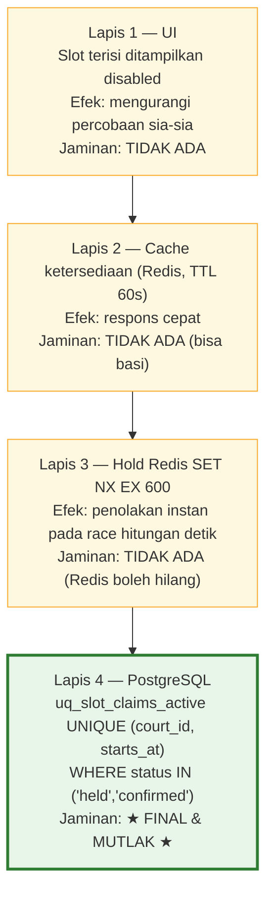
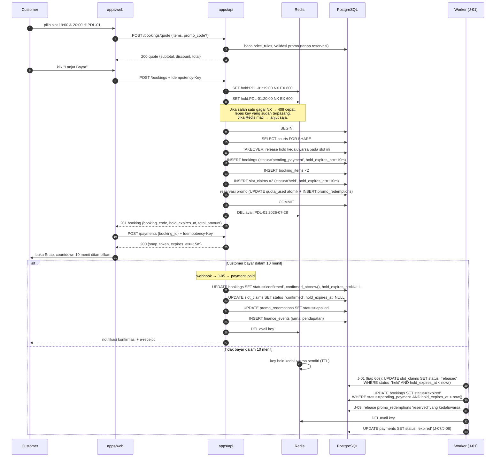
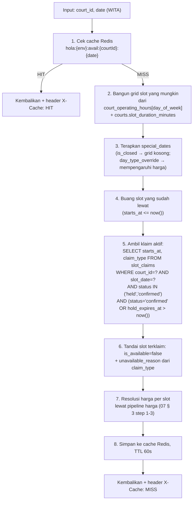
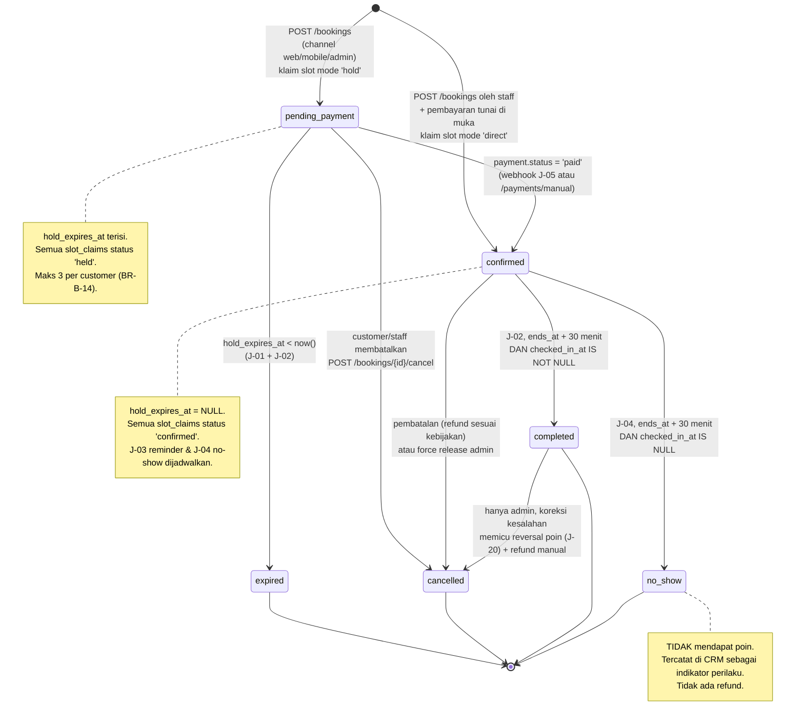

# 06 — MODULE: BOOKING LAPANGAN

> Prasyarat: [03-DATA-MODEL.md § 8 Slot Ownership](03-DATA-MODEL.md#8-slot-ownership-mekanisme-terpadu)
> — modul ini **tidak** punya mekanisme klaim slot sendiri.
> Harga: [07-MODULE-PAYMENT.md § 3 Pricing Pipeline](07-MODULE-PAYMENT.md#3-pricing-pipeline-satu-satunya-sumber-perhitungan-harga)
> — modul ini **tidak** menghitung harga sendiri.
> Endpoint: [04 § 9.4](04-API-CONTRACT.md#94-booking). Izin: [05 § 6.3](05-AUTH.md#63-booking).

---

## 1. Tujuan & Ruang Lingkup

Modul ini menangani penyewaan lapangan oleh customer, dari melihat ketersediaan sampai booking
selesai dipakai. Ini modul dengan volume transaksi tertinggi dan satu-satunya yang berlomba
memperebutkan sumber daya terbatas (slot), jadi aturannya paling ketat.

**Termasuk:** ketersediaan slot, quote harga, hold slot, pembuatan booking, pembayaran (delegasi
ke [07](07-MODULE-PAYMENT.md)), pembatalan, reschedule, check-in, no-show, penyelesaian booking,
booking manual oleh staff (tunai/walk-in).

**Tidak termasuk:** kalkulasi harga (→ [07](07-MODULE-PAYMENT.md)), validasi promo
(→ [08](08-MODULE-PROMO.md)), pemberian poin (→ [12](12-MODULE-GAMIFICATION.md)), pencatatan
jurnal (→ [14](14-MODULE-FINANCE.md)).

---

## 2. User Stories

### Customer

| # | Story | Kriteria penerimaan |
|---|---|---|
| C-1 | Sebagai customer, saya ingin melihat lapangan yang tersedia pada tanggal tertentu beserta harganya, agar bisa memilih jam yang cocok | Halaman menampilkan grid slot per court; setiap slot menunjukkan jam, status tersedia/terisi, `rate_class` (peak/off-peak), dan harga. Data ≤60 detik basi. Slot yang sedang di-hold orang lain tampak tidak tersedia |
| C-2 | Sebagai customer, saya ingin memesan 1–4 slot berurutan di satu lapangan | Sistem menerima 1..`max_slots_per_booking` slot; menolak jika di luar rentang (`SLOT_COUNT_OUT_OF_RANGE`) |
| C-3 | Sebagai customer, saya ingin tahu total yang harus dibayar **sebelum** menekan bayar, termasuk potongan promo | `POST /bookings/quote` mengembalikan rincian: subtotal per slot, addon, diskon, total. Rincian identik dengan yang ditagih |
| C-4 | Sebagai customer, saya ingin slot yang saya pilih tidak diambil orang lain selama saya membayar | Slot di-hold **10 menit** sejak booking dibuat; UI menampilkan countdown; slot tidak bisa diklaim pihak lain selama hold aktif |
| C-5 | Sebagai customer, saya ingin dibebaskan dari kewajiban kalau saya batal membayar | Hold otomatis lepas setelah 10 menit tanpa penalti apa pun. Booking menjadi `expired` |
| C-6 | Sebagai customer, saya ingin memakai kode promo saat checkout | Kode divalidasi saat quote dan dikunci saat booking dibuat. Jika promo menjadi tidak valid sebelum bayar, harga **tidak** berubah selama hold masih aktif |
| C-7 | Sebagai customer, saya ingin melihat riwayat dan booking mendatang saya | `GET /me/bookings` dengan filter `upcoming=true` |
| C-8 | Sebagai customer, saya ingin membatalkan booking dan tahu berapa yang dikembalikan | Response `POST /bookings/{id}/cancel` menyertakan `refund_estimate_amount` sesuai kebijakan (§ 7). Estimasi juga tersedia sebelum konfirmasi lewat field `is_cancellable` + `refund_estimate_amount` di detail booking |
| C-9 | Sebagai customer, saya ingin memindahkan jadwal booking tanpa harus batal-bayar-ulang | `POST /bookings/{id}/reschedule` (§ 6), sesuai batas kebijakan |
| C-10 | Sebagai customer, saya ingin diingatkan sebelum jadwal bermain | Push + email 2 jam sebelum `starts_at` (J-03) |
| C-11 | Sebagai customer, saya ingin bukti pembayaran | E-receipt via email setelah `paid`; data struk juga di `GET /bookings/{id}/receipt` |
| C-12 | Sebagai customer, saya ingin mendapat poin dari bermain | Poin diberikan saat booking `completed`, bukan saat dibayar (§ 10) |

### Staff

| # | Story | Kriteria penerimaan |
|---|---|---|
| S-1 | Sebagai staff, saya ingin membuat booking untuk customer yang datang langsung dan bayar tunai | `POST /bookings` dengan `channel='walk_in'`, mode klaim `direct` → status langsung `confirmed`; pembayaran dicatat `POST /payments/manual` dengan `method='cash'` |
| S-2 | Sebagai staff, saya ingin membuat booking atas nama customer yang menelepon | `channel='admin'`, boleh mengisi `customer_user_id` atau `guest_name`+`guest_phone`. Status `pending_payment` jika akan bayar transfer, `confirmed` jika bayar tunai di muka |
| S-3 | Sebagai staff, saya ingin melihat jadwal hari ini dalam bentuk kalender per lapangan | `GET /slot-claims?slot_date_from=&slot_date_to=` + `GET /bookings` |
| S-4 | Sebagai staff, saya ingin menandai customer sudah datang | `POST /bookings/{id}/check-in` |
| S-5 | Sebagai staff, saya ingin menandai customer tidak datang | `POST /bookings/{id}/no-show`, atau otomatis oleh J-04 |
| S-6 | Sebagai staff, saya ingin membatalkan booking atas permintaan customer di tempat | `POST /bookings/{id}/cancel` dengan `reason` |
| S-7 | Sebagai staff, saya ingin mencari booking dengan kode/nama/telepon | `GET /bookings?q=` mencari `booking_code`, nama customer/guest, dan telepon |

### Admin

| # | Story | Kriteria penerimaan |
|---|---|---|
| A-1 | Sebagai admin, saya ingin mengatur harga per jam dengan pembedaan peak/off-peak dan hari | Lewat `price_rules` ([07 § 3](07-MODULE-PAYMENT.md#3-pricing-pipeline-satu-satunya-sumber-perhitungan-harga)) |
| A-2 | Sebagai admin, saya ingin menutup lapangan untuk perawatan | `POST /court-maintenances` → klaim slot `claim_type='maintenance'` |
| A-3 | Sebagai admin, saya ingin melihat tingkat pemakaian lapangan | `GET /admin/reports/occupancy` |
| A-4 | Sebagai admin, saya ingin membatalkan booking customer untuk memberi jalan ke event/turnamen | Force release ([03 § 8.8](03-DATA-MODEL.md#88-force-release-hanya-admin)) — refund 100% otomatis |

---

## 3. Business Rules Umum

Setiap aturan di bawah punya nomor `BR-B-xx` dan **wajib** punya minimal satu test vitest.

| # | Aturan | Error jika dilanggar |
|---|---|---|
| BR-B-01 | Satu booking hanya boleh berisi slot pada **satu tanggal bisnis** (`booking_date`, zona WITA). Slot lintas tanggal → dua booking terpisah | `MIXED_BOOKING_DATE` (422) |
| BR-B-02 | Jumlah slot per booking harus `courts.min_slots_per_booking` ≤ n ≤ `courts.max_slots_per_booking` (default 1..4). Jika booking mencakup beberapa court, batas dihitung **per court** | `SLOT_COUNT_OUT_OF_RANGE` (422) |
| BR-B-03 | Setiap `starts_at` wajib rata terhadap slot grid court-nya | `SLOT_NOT_ALIGNED` (422) |
| BR-B-04 | Setiap slot wajib berada di dalam `court_operating_hours` untuk hari itu | `SLOT_OUTSIDE_OPERATING_HOURS` (422) |
| BR-B-05 | `starts_at` wajib > `now()`. Slot yang sedang berjalan **tidak** dapat dipesan | `SLOT_IN_PAST` (422) |
| BR-B-06 | Horizon booking: `starts_at` ≤ `now() + booking_horizon_days`. Default **60 hari**, disimpan di `app_settings.booking_horizon_days`. `staff`/`admin` dapat melewati batas ini | `SLOT_TOO_FAR_AHEAD` (422) |
| BR-B-07 | Court harus `status='active'` untuk booking customer | `COURT_NOT_BOOKABLE` (422) |
| BR-B-08 | Tanggal dengan `special_dates.is_closed = true` tidak dapat dipesan customer | `VENUE_CLOSED` (422) |
| BR-B-09 | Kontiguitas slot **tidak diwajibkan** secara default. Jika `app_settings.require_contiguous_slots = true`, semua slot dalam satu court harus berurutan tanpa celah | `SLOTS_NOT_CONTIGUOUS` (422) |
| BR-B-10 | Booking oleh `customer` selalu untuk dirinya sendiri; `customer_user_id` diambil dari token dan field di body **diabaikan** | — |
| BR-B-11 | Booking tanpa akun (guest) hanya boleh dibuat `staff`/`admin`, dan wajib `guest_name` + `guest_phone` | `GUEST_CONTACT_REQUIRED` (422) |
| BR-B-12 | Harga **selalu** dari pipeline [07 § 3](07-MODULE-PAYMENT.md#3-pricing-pipeline-satu-satunya-sumber-perhitungan-harga). Klien tidak boleh mengirim `total_amount`; jika dikirim, request ditolak (`.strict()` zod) | `VALIDATION_ERROR` (422) |
| BR-B-13 | `quote_snapshot` bersifat **immutable** setelah booking dibuat. Perubahan `price_rules` atau promo setelah itu tidak mengubah harga booking | — |
| BR-B-14 | Maksimum **3 booking berstatus `pending_payment`** per customer secara bersamaan. Tujuan: mencegah satu orang mengunci banyak slot tanpa membayar | `CONFLICT` (409), `message` menyebut batas |
| BR-B-15 | Maksimum **2 booking berstatus `confirmed`** per customer untuk satu tanggal yang sama (`booking_date`), kecuali dibuat `staff`/`admin`. Tujuan: anti-abuse poin & pemborong slot. Nilai di `app_settings.max_confirmed_bookings_per_day` | `CONFLICT` (409) |
| BR-B-16 | Booking `pending_payment` yang hold-nya habis menjadi `expired` — **bukan** `cancelled`. Membedakan keduanya penting untuk laporan (abandonment vs pembatalan sadar) | — |
| BR-B-17 | Booking yang `confirmed` dan waktunya sudah lewat menjadi `completed` otomatis oleh J-02, **30 menit setelah `ends_at`** | — |
| BR-B-18 | Booking yang `confirmed`, waktunya lewat, dan `checked_in_at IS NULL` menjadi `no_show` oleh J-04, **bukan** `completed`. `no_show` **tidak** mendapat poin | — |
| BR-B-19 | Satu booking boleh mencakup court dengan `slot_duration_minutes` berbeda; setiap item memakai durasi court-nya sendiri. Yang tetap wajib tunggal adalah `booking_date` (BR-B-01) | — |
| BR-B-20 | Booking tidak pernah dihapus. Hanya berubah status | — |
| BR-B-21 | `slot_count` di `bookings` selalu = jumlah `booking_items`. Dijaga di service, diverifikasi test | — |
| BR-B-22 | Sebuah `booking_items` **wajib** punya tepat satu `slot_claims` aktif atau `released` yang berpasangan. Booking tanpa klaim adalah data korup | — |

---

## 4. Hold Slot & Anti Double-Booking

Ini bagian paling kritis di seluruh sistem. Mekanismenya berlapis; **hanya lapis 4 yang
menjamin kebenaran.**

### 4.1 Empat lapisan



**Aturan turunan yang tidak boleh dilanggar:**

| # | Aturan |
|---|---|
| BR-B-30 | Kegagalan lapis 1–3 **tidak boleh** menyebabkan double booking. Semua test anti double-booking dijalankan **dengan Redis dimatikan** untuk memastikan lapis 4 berdiri sendiri |
| BR-B-31 | Kesuksesan lapis 3 (Redis NX berhasil) **tidak** menjadi izin untuk melewati lapis 4. Insert `slot_claims` selalu dilakukan |
| BR-B-32 | Lapis 2 **tidak pernah** menjadi dasar keputusan klaim. Cache hanya untuk tampilan |

### 4.2 Parameter hold

| Parameter | Nilai | Sumber | Catatan |
|---|---|---|---|
| Durasi hold | **10 menit (600 detik)** | `SLOT_HOLD_TTL_SECONDS` | Sama untuk semua channel |
| Kedaluwarsa pembayaran gateway | **15 menit** | `PAYMENT_EXPIRY_MINUTES` | Sengaja **lebih panjang** dari hold; lihat aturan BR-B-36 |
| Job pelepasan fallback | setiap **60 detik** | J-01 `booking.releaseExpiredHolds` | Bukan satu-satunya pelindung |
| Redis key hold | `hola:{env}:hold:slot:{courtId}:{startsAtIso}` | — | TTL 600 s |

### 4.3 Aturan hold

| # | Aturan |
|---|---|
| BR-B-33 | Slot di-hold maksimal **10 menit** sejak booking dibuat (`bookings.hold_expires_at = created_at + 600 s`). Semua `slot_claims` milik booking itu memakai `hold_expires_at` yang **identik** |
| BR-B-34 | Hold dilepas otomatis oleh **TTL Redis** (lapis 3) **dan** oleh **J-01 yang berjalan tiap menit** (lapis 4). Keduanya tidak saling menggantikan: TTL Redis melepas key cepat, J-01 mengubah baris `slot_claims` menjadi `released` |
| BR-B-35 | Karena predikat partial unique index tidak bisa memakai `now()`, hold kedaluwarsa **masih** memblokir index. Karena itu: (a) query ketersediaan memperlakukan hold kedaluwarsa sebagai tersedia; (b) prosedur klaim melakukan **takeover** ([03 § 8.6 langkah 5](03-DATA-MODEL.md#86-prosedur-klaim-satu-fungsi-untuk-semua-pemakai)). Efeknya: worker mati tidak pernah memblokir penjualan |
| BR-B-36 | Kedaluwarsa transaksi gateway (15 menit) **lebih panjang** dari hold (10 menit). Konsekuensi: pembayaran bisa masuk setelah hold lepas. Penanganan wajib: [§ 11 E-6](#11-edge-cases) — pembayaran tetap diterima, booking dipulihkan **jika slot masih bebas**, selain itu refund otomatis 100% |
| BR-B-37 | Hold **tidak** diperpanjang. Tidak ada endpoint "extend hold". Customer yang kehabisan waktu memulai checkout ulang |
| BR-B-38 | Booking yang dibuat `staff`/`admin` dengan pembayaran tunai memakai mode klaim `direct` (status `confirmed` langsung), **tanpa** hold |
| BR-B-39 | Promo yang dipakai booking juga direservasi selama hold (`promo_redemptions.status='reserved'`, `reserved_until = bookings.hold_expires_at`). Hold lepas → reservasi promo lepas (J-09). Lihat [08 § 5](08-MODULE-PROMO.md#5-validasi-kuota-race-condition-safe) |
| BR-B-40 | Satu customer tidak boleh memegang > 3 hold aktif (BR-B-14) |

### 4.4 Alur hold end-to-end



### 4.5 Test yang wajib ada

| # | Test | Cara |
|---|---|---|
| T-B-01 | Dua request bersamaan untuk slot sama → tepat satu sukses | `Promise.all` dua `POST /bookings` identik slot, beda idempotency key |
| T-B-02 | Idem, **dengan Redis dimatikan** → tetap tepat satu sukses | Mock Redis client agar melempar error |
| T-B-03 | Hold kedaluwarsa → slot bisa dipesan lagi tanpa menunggu J-01 | Set `hold_expires_at` ke masa lalu langsung di DB, lalu klaim |
| T-B-04 | J-01 idempoten → jalankan dua kali, hasil sama | — |
| T-B-05 | Booking `expired` tidak pernah menjadi `confirmed` tanpa jalur pemulihan eksplisit | — |
| T-B-06 | `quote_snapshot` tidak berubah setelah `price_rules` diubah | — |
| T-B-07 | `POST /bookings` dengan `Idempotency-Key` sama dua kali → satu booking, response identik | — |
| T-B-08 | Slot yang di-hold tampak `is_available: false` di `GET /courts/{id}/availability` | — |
| T-B-09 | Slot yang hold-nya kedaluwarsa tampak `is_available: true` | — |
| T-B-10 | BR-B-14 & BR-B-15 ditegakkan | — |

---

## 5. Pembacaan Ketersediaan & Caching

### 5.1 Cara menghitung ketersediaan



### 5.2 Bentuk response

`GET /courts/{court_id}/availability?date=2026-07-28` atau
`GET /courts/{court_id}/availability?date_from=2026-07-28&date_to=2026-07-30`

```json
{
  "data": {
    "court_id": "018f...",
    "days": [
      {
        "court_code": "PDL-01",
        "date": "2026-07-28",
        "slot_duration_minutes": 60,
        "day_type": "weekday",
        "slots": [
          {
            "starts_at": "2026-07-28T06:00:00+08:00",
            "ends_at": "2026-07-28T07:00:00+08:00",
            "is_available": true,
            "unavailable_reason": null,
            "rate_class": "offpeak",
            "price_amount": 150000
          },
          {
            "starts_at": "2026-07-28T19:00:00+08:00",
            "ends_at": "2026-07-28T20:00:00+08:00",
            "is_available": false,
            "unavailable_reason": "booking",
            "rate_class": "peak",
            "price_amount": 250000
          }
        ]
      }
    ]
  },
  "meta": { "generated_at": "2026-07-28T18:41:02+08:00" }
}
```

`days` selalu berupa array, termasuk ketika hanya satu `date` diminta. `date` tidak boleh dipakai
bersama `date_from`/`date_to`; range wajib lengkap dan maksimal 14 hari inklusif.

`unavailable_reason` ∈ `booking` | `event` | `match` | `maintenance` | `past` | `closed` |
`beyond_horizon`. Nilai terakhir membedakan tanggal yang memang tidak dapat dipesan karena
horizon dari lapangan yang tutup atau di luar jam operasional.

Aturan privasi: response ketersediaan **tidak** memuat identitas pemesan. Nama customer hanya
terlihat di endpoint booking (butuh role staff/admin).

### 5.3 Aturan caching

| # | Aturan |
|---|---|
| BR-B-41 | Key cache: `hola:{env}:avail:{courtId}:{yyyy-mm-dd}`, TTL **60 detik** |
| BR-B-42 | TTL bukan pengganti invalidasi. Sepuluh kejadian invalidasi eksplisit didefinisikan di [02 § 4.4](02-INFRASTRUCTURE.md#44-aturan-invalidasi-cache-ketersediaan) (I-1 … I-10) dan **wajib** diimplementasikan |
| BR-B-43 | Invalidasi dilakukan **setelah commit**, dan kegagalannya hanya di-log `warn` (tidak menggagalkan transaksi) |
| BR-B-44 | Cache **hanya** untuk `GET availability`. Endpoint klaim tidak pernah membacanya |
| BR-B-45 | Jika Redis mati: cache miss → hitung dari PostgreSQL. Latensi naik, kebenaran tidak berubah. `X-Cache: MISS` |
| BR-B-46 | `GET /availability` (lintas court) **tidak** di-cache sebagai satu kesatuan; ia menggabungkan hasil per court sehingga tetap memanfaatkan cache per court |
| BR-B-47 | Rentang `date_from`..`date_to` maksimal **14 hari** per request untuk membatasi biaya perhitungan |

---

## 6. Reschedule

Memindahkan booking `confirmed` ke slot lain tanpa membatalkan pembayaran.

### Aturan

| # | Aturan |
|---|---|
| BR-B-50 | Hanya booking berstatus `confirmed` yang bisa di-reschedule. `pending_payment` cukup dibatalkan & dibuat ulang | `BOOKING_NOT_CANCELLABLE` sebagai `409` dengan pesan spesifik |
| BR-B-51 | Customer boleh reschedule **satu kali** per booking, minimal **24 jam** sebelum `starts_at`. Batas di `app_settings.reschedule_min_hours_before` (default 24) dan `app_settings.reschedule_max_count` (default 1) |
| BR-B-52 | `staff`/`admin` boleh reschedule tanpa batas jumlah dan tanpa batas waktu |
| BR-B-53 | Slot baru wajib melewati semua validasi BR-B-01 … BR-B-09 |
| BR-B-54 | Pelepasan klaim lama dan klaim baru terjadi dalam **satu transaksi**. Jika klaim baru gagal (`409`), klaim lama tetap utuh — booking tidak pernah berakhir tanpa slot |
| BR-B-55 | **Selisih harga.** Customer hanya boleh reschedule ke slot dengan total **sama atau lebih murah**; slot yang lebih mahal ditolak `422 VALIDATION_ERROR` dengan pesan "pilih slot dengan harga sama atau lebih murah". Selisih yang lebih murah **tidak dikembalikan** di v1. Alasan menolak yang lebih mahal: menagih selisih berarti booking sempat berada di keadaan "sudah pindah slot tapi belum lunas", dan jika selisih tak dibayar, klaim lama sudah dilepas sehingga tidak bisa dipulihkan. Reschedule ke slot lebih mahal hanya boleh `staff`/`admin`, dengan menerbitkan payment tambahan manual |
| BR-B-56 | `quote_snapshot` **tidak** dihitung ulang. Booking menyimpan `reschedule_history` (jsonb array) berisi `{from_items, to_items, rescheduled_at, actor_user_id, reason}`. Harga tetap harga awal |
| BR-B-57 | Reschedule mencatat `audit_logs` dengan `action='booking.reschedule'` |
| BR-B-58 | Reschedule mengirim notifikasi ke customer, dan **membatalkan** J-03/J-04 lama lalu menjadwalkan yang baru (jobId lama di-remove) |
| BR-B-59 | Reschedule **tidak** mempengaruhi poin (poin baru diberikan saat `completed` seperti biasa) |

Kolom tambahan pada `bookings` untuk fitur ini: `reschedule_count` (int, default 0),
`reschedule_history` (jsonb, default `[]`).

---

## 7. Kebijakan Pembatalan & Refund `[BUTUH KEPUTUSAN CLIENT]`

Ini keputusan **D-01**. Sampai client memutuskan, sistem memakai **Opsi B** sebagai default,
dan nilainya dapat diubah admin lewat `app_settings.refund_policy` tanpa deploy.

### Opsi

| Opsi | Aturan | Kelebihan | Kekurangan |
|---|---|---|---|
| **A. Tanpa refund, hanya reschedule** | Booking tidak dapat di-refund. Customer boleh reschedule 1× gratis jika ≥24 jam sebelum jadwal. | Pendapatan paling terlindungi; operasional paling sederhana (tidak ada uang keluar) | Paling tidak ramah customer; berisiko ulasan buruk & sengketa; slot yang tidak dipakai tetap hilang bagi Hola |
| **B. Refund berjenjang** *(default)* | `> 48 jam` sebelum `starts_at` → **100%** dikurangi biaya gateway aktual; `24–48 jam` → **50%**; `< 24 jam` → **0%** (slot tetap milik customer, boleh dipakai) | Seimbang; standar industri di venue olahraga; memberi insentif membatalkan lebih awal sehingga slot bisa dijual ulang | Perlu penanganan biaya gateway (tidak dapat ditarik kembali dari Midtrans); butuh komunikasi jelas di UI |
| **C. Kredit ke saldo (wallet)** | Pembatalan menghasilkan kredit yang hanya bisa dipakai untuk booking berikutnya, berlaku 3 bulan. Tidak ada uang tunai keluar. | Kas tetap di Hola; mendorong retensi | **Membutuhkan modul wallet** (saldo, riwayat, kedaluwarsa, dan **liability keuangan** di [14](14-MODULE-FINANCE.md)) yang **bukan bagian v1** — lihat [17-NON-GOALS.md](17-NON-GOALS.md). Memilih opsi ini berarti menambah scope |

**Rekomendasi: Opsi B.** Alasannya bukan hanya keramahan customer: refund berjenjang membuat
customer membatalkan lebih awal, sehingga slot punya peluang dijual ulang. Opsi A membuat orang
diam saja dan slot pasti kosong. Opsi C secara akuntansi paling rumit dan menambah modul baru.

### Aturan pembatalan (berlaku untuk semua opsi)

| # | Aturan |
|---|---|
| BR-B-60 | Status yang dapat dibatalkan: `pending_payment` dan `confirmed`. Selainnya → `409 BOOKING_NOT_CANCELLABLE` |
| BR-B-61 | Membatalkan `pending_payment` **tidak** menghasilkan refund (belum ada uang masuk); melepas klaim + reservasi promo, status → `cancelled` (bukan `expired`, karena ini tindakan sadar) |
| BR-B-62 | Membatalkan `confirmed` yang sudah dibayar menghasilkan `refunds` berstatus `requested` sesuai kebijakan aktif. Nilai dihitung fungsi `computeRefundAmount(booking, policy, now)` yang **pure & tertest** |
| BR-B-63 | Refund senilai **Rp 0** tidak membuat baris `refunds`. Booking tetap `cancelled`, dan response menyatakan `refund_estimate_amount: 0` dengan `policy_applied` yang jelas |
| BR-B-64 | Refund selalu butuh persetujuan `admin` (`POST /refunds/{id}/approve`) sebelum dieksekusi. Tidak ada refund otomatis tanpa persetujuan, **kecuali** pembatalan yang berasal dari pihak Hola (force release, event dibatalkan, court rusak) yang otomatis 100% dan langsung `approved` |
| BR-B-65 | Biaya gateway (`payments.gateway_fee_amount`) **tidak** dapat ditarik kembali dari Midtrans. Pada Opsi B tier 100%, potongan biaya gateway ini dikurangkan dari refund dan dicatat sebagai beban `5-1400 Biaya Payment Gateway` |
| BR-B-66 | Pembatalan melepas klaim slot ([03 § 8.7](03-DATA-MODEL.md#87-prosedur-pelepasan)) dengan `release_reason='booking_cancelled'`, dan menginvalidasi cache ketersediaan |
| BR-B-67 | Pembatalan setelah poin diberikan (kasus jarang: booking `completed` lalu dibatalkan admin) memicu J-20 `gamification.reversePoints` |
| BR-B-68 | Pembatalan membatalkan job J-03 (reminder) dan J-04 (no-show) milik booking itu |
| BR-B-69 | Pembatalan mengirim notifikasi ke customer berisi nominal refund dan estimasi waktu (Midtrans: 3–14 hari kerja tergantung metode) |
| BR-B-70 | Semua pembatalan oleh staff/admin mencatat `audit_logs` dengan `action='booking.cancel'` dan `reason` wajib terisi |
| BR-B-71 | Teks kebijakan yang ditampilkan ke customer disimpan di `app_settings.cancellation_policy_text` agar dapat diubah tanpa deploy, dan **wajib** ditampilkan di halaman checkout sebelum pembayaran |

### Contoh perhitungan (Opsi B)

Booking Rp 500.000, dibayar QRIS, `gateway_fee_amount` Rp 3.500.

| Waktu pembatalan | Persentase | Refund | Catatan |
|---|---|---|---|
| 5 hari sebelum | 100% | Rp 496.500 | 500.000 − 3.500 biaya gateway |
| 36 jam sebelum | 50% | Rp 250.000 | Biaya gateway sudah tertutup potongan 50% |
| 6 jam sebelum | 0% | Rp 0 | Tidak ada baris `refunds`; slot tetap milik customer sampai `ends_at` |

---

## 8. State Machine Status Booking



### Tabel transisi

| Dari | Ke | Pemicu | Efek samping wajib |
|---|---|---|---|
| — | `pending_payment` | `POST /bookings` (hold) | Klaim slot `held`; reservasi promo; `hold_expires_at`; enqueue J-07 saat payment dibuat |
| — | `confirmed` | `POST /bookings` staff + tunai | Klaim slot `confirmed`; promo `applied`; `finance_events` pendapatan; J-03 & J-04 dijadwalkan |
| `pending_payment` | `confirmed` | Payment `paid` | Klaim `held → confirmed`; `hold_expires_at = NULL`; promo `reserved → applied`; `finance_events`; J-03 & J-04; notifikasi konfirmasi + e-receipt; invalidasi cache |
| `pending_payment` | `expired` | J-01/J-02 | Klaim → `released` (`hold_expired`); promo → `released` (J-09); payment → `expired` (J-06/J-07); invalidasi cache. **Tanpa** notifikasi (menghindari spam abandonment) |
| `pending_payment` | `cancelled` | Endpoint cancel | Sama seperti `expired`, **plus** notifikasi & `audit_logs` jika oleh staff |
| `confirmed` | `completed` | J-02 | `completed_at`; `point_events` untuk `BOOKING_COMPLETED`; `activities` otomatis dibuat jika belum ada (verifikasi = `booking`) |
| `confirmed` | `no_show` | J-04 | `no_show_at`; **tanpa** poin; catatan CRM |
| `confirmed` | `cancelled` | Endpoint cancel / force release | Klaim → `released`; `refunds` sesuai kebijakan; J-03/J-04 dibatalkan; notifikasi; `audit_logs` |
| `completed` | `cancelled` | Admin (koreksi) | J-20 reversal poin; refund manual; `audit_logs` wajib dengan `reason` |

### Transisi yang **dilarang**

| Dilarang | Alasan |
|---|---|
| `expired` → `confirmed` | Slot mungkin sudah dijual ke orang lain. Pemulihan hanya lewat jalur eksplisit di [§ 11 E-6](#11-edge-cases) yang memvalidasi ulang ketersediaan |
| `cancelled` → apa pun | Terminal. Buat booking baru |
| `no_show` → `completed` | Kalau staff salah menandai, admin memakai `PATCH` khusus yang mencatat `audit_logs`, bukan transisi state normal |
| `completed` → `confirmed` | Terminal ke arah maju |
| `confirmed` → `pending_payment` | Uang sudah masuk; tidak ada alasan mundur |

---

## 9. Check-in & No-show

| # | Aturan |
|---|---|
| BR-B-80 | Check-in hanya untuk booking `confirmed`. `POST /bookings/{id}/check-in` mengisi `checked_in_at`. Hanya `staff`/`admin` |
| BR-B-81 | Check-in diizinkan dari **30 menit sebelum** `starts_at` sampai `ends_at`. Di luar jendela itu → `409 CONFLICT` dengan pesan jelas (admin boleh memaksa dengan `force=true`) |
| BR-B-82 | Check-in dua kali → `409 BOOKING_ALREADY_CHECKED_IN` (idempoten dari sisi data: `checked_in_at` tidak berubah) |
| BR-B-83 | Check-in adalah **prasyarat poin**. Booking `confirmed` tanpa check-in menjadi `no_show` dan tidak berpoin. Ini pilar anti-abuse gamification ([12 § 8](12-MODULE-GAMIFICATION.md#8-anti-abuse)) |
| BR-B-84 | J-04 menandai `no_show` 30 menit setelah `ends_at`. Staff juga bisa menandainya manual lebih awal (`POST /bookings/{id}/no-show`). Menandai `no_show` **tidak** melepas slot — slot tetap milik customer sampai `ends_at`, karena ia sudah membayarnya. Melepas slot lebih awal agar bisa dijual ulang memerlukan **pembatalan**, bukan penandaan no-show |
| BR-B-85 | `no_show` dicatat di CRM. Jika seorang customer mencapai 3 `no_show` dalam 90 hari, sistem menambahkan tag `high_no_show` otomatis dan admin dapat mewajibkan pembayaran penuh di muka (tidak ada penalti otomatis di v1) |
| BR-B-86 | Booking `walk_in` dianggap check-in otomatis (`checked_in_at = created_at`) |

---

## 10. Integrasi ke Modul Lain

| Modul | Arah | Kontrak |
|---|---|---|
| [Slot Ownership](03-DATA-MODEL.md#8-slot-ownership-mekanisme-terpadu) | Booking → Slot | Memanggil `slots.claim({ claimType: 'booking', mode: 'hold' \| 'direct' })` dan `slots.release()`. **Tidak** menyentuh `slot_claims` langsung |
| [Payment](07-MODULE-PAYMENT.md) | Booking → Payment | Booking hanya menyediakan `payable`. Perhitungan harga & transaksi gateway milik modul payment. Transisi `pending_payment → confirmed` **dipicu** modul payment |
| [Pricing pipeline](07-MODULE-PAYMENT.md#3-pricing-pipeline-satu-satunya-sumber-perhitungan-harga) | Booking → Pricing | `POST /bookings/quote` dan `POST /bookings` keduanya memanggil `pricing.computeQuote()`. Hasilnya disimpan sebagai `quote_snapshot` |
| [Promo](08-MODULE-PROMO.md) | Booking → Promo | Reservasi kuota saat booking dibuat, `applied` saat dibayar, `released` saat batal/expired |
| [Gamification](12-MODULE-GAMIFICATION.md) | Booking → Points | Saat `completed`: `INSERT point_events` (outbox) dengan `rule_code='BOOKING_COMPLETED'`, `source_type='booking'`, `source_id=booking.id`. Idempoten lewat UNIQUE di `point_ledger` |
| [Finance](14-MODULE-FINANCE.md) | Booking → Finance | Saat pembayaran `paid`: `INSERT finance_events` dengan `source_type='booking'`, `kind='revenue'` dan (jika ada diskon) `kind='discount'` |
| [Mobile activity](15-MOBILE.md#4-modul-aktivitas-olahraga) | Booking → Activity | Booking `completed` membuat `activities` otomatis (`verification_source='booking'`, `is_verified=true`) jika user belum mencatat aktivitas untuk slot itu |
| [Event](10-MODULE-EVENT.md) & [Match](11-MODULE-MATCH.md) | Slot ← keduanya | Event & match memakai `slot_claims` yang sama, sehingga slot mereka otomatis tampak tidak tersedia di endpoint ketersediaan booking. **Tidak ada** kode integrasi khusus |
| [CRM](13-MODULE-CRM-HRIS.md) | Booking → CRM | Ringkasan (total booking, total belanja, no-show count) dihitung on-demand dari `bookings`, tidak didenormalisasi |

---

## 11. Edge Cases

| # | Kondisi | Perilaku yang diharapkan |
|---|---|---|
| E-1 | Dua customer memilih slot sama dan menekan bayar dalam 200 ms | Lapis 3 (Redis NX) menolak yang kedua secara instan. Jika Redis mati, lapis 4 menolak dengan `409 SLOT_ALREADY_CLAIMED` dan `details` berisi daftar slot bentrok |
| E-2 | Customer membuka dua tab, checkout slot berbeda | Kedua booking sah. Batas 3 hold aktif (BR-B-14) tetap berlaku |
| E-3 | Customer membuka dua tab, checkout slot **sama**, `Idempotency-Key` berbeda | Satu sukses, satu `409`. Frontend menampilkan pesan "slot baru saja diambil" + memuat ulang ketersediaan |
| E-4 | Customer refresh halaman saat hold berjalan | Booking `pending_payment` masih ada; `GET /bookings/{id}` mengembalikan `hold_expires_at`. UI melanjutkan countdown, tidak membuat hold baru |
| E-5 | Hold habis persis saat customer menekan "Bayar" di Snap | Payment yang dibuat sebelum hold habis tetap valid di Midtrans (TTL 15 menit). Jika pembayaran masuk setelah hold lepas → lihat E-6 |
| E-6 | **Pembayaran masuk setelah booking `expired`** | Jalur pemulihan wajib: (1) payment tetap dicatat `paid` — uang customer nyata; (2) service mencoba `slots.claim` ulang dengan mode `direct` untuk slot yang sama; (3a) **berhasil** → booking `expired → confirmed`, `audit_logs action='booking.recovered_after_expiry'`, notifikasi "pembayaran diterima, booking aktif"; (3b) **gagal** (slot sudah diambil) → booking tetap `expired`, dibuat `refunds` 100% berstatus `approved` otomatis (tanpa potongan, karena kesalahan timing bukan salah customer), notifikasi permintaan maaf + info refund. Transisi `expired → confirmed` **hanya** lewat jalur ini |
| E-7 | Pembayaran masuk dua kali untuk satu booking (double charge gateway) | UNIQUE `payments.provider_order_id` mencegah dua payment untuk satu order. Jika customer benar-benar terbayar dua kali (mis. lewat dua order id karena retry aplikasi), booking hanya menerima satu; payment kedua menghasilkan refund otomatis 100%. Terdeteksi J-06 |
| E-8 | Worker mati 2 jam | Hold kedaluwarsa **tidak** memblokir penjualan (BR-B-35): query ketersediaan menganggapnya tersedia dan klaim baru melakukan takeover. Efek nyata: booking `pending_payment` tidak berubah menjadi `expired` sampai worker hidup; reminder & no-show tertunda. Tidak ada kerusakan data |
| E-9 | Redis di-flush saat 50 hold aktif | Key hold hilang, tetapi baris `slot_claims` `held` masih ada dengan `hold_expires_at` → slot tetap terlindungi. Cache ketersediaan kosong → dihitung dari DB. Tidak ada dampak bisnis |
| E-10 | Admin mengubah harga saat ada 10 booking `pending_payment` | Booking existing memakai `quote_snapshot`-nya (BR-B-13). Semua cache `avail:*` diinvalidasi (I-7). Booking baru memakai harga baru |
| E-11 | Admin menutup lapangan (maintenance) pada jam yang sudah ada booking | `POST /court-maintenances` gagal `409 SLOT_ALREADY_CLAIMED` dengan daftar booking bentrok. Admin memilih force release (membatalkan booking + refund 100%) atau memilih jam lain |
| E-12 | Court diubah `status='maintenance'` saat ada booking `confirmed` mendatang | Diizinkan. Booking existing **tidak** dibatalkan; hanya booking baru yang diblokir (`COURT_NOT_BOOKABLE`). UI admin menampilkan peringatan berisi jumlah booking mendatang |
| E-13 | Customer membatalkan 5 menit sebelum jadwal (Opsi B: refund 0%) | Booking `cancelled`, refund Rp 0, tidak ada baris `refunds`, slot **dilepas** dan bisa dijual lagi. Customer diberi tahu bahwa tidak ada pengembalian dana |
| E-14 | Booking mencakup 4 slot; 1 slot menjadi tidak valid karena jam operasional berubah setelah booking dibuat | Booking tetap utuh (S-5 di [03 § 8.11](03-DATA-MODEL.md#811-edge-cases-slot-ownership)). Jadwal admin menandainya "di luar jam operasional" |
| E-15 | Customer tidak datang tetapi tidak dibatalkan | J-04 → `no_show`, tanpa refund, tanpa poin. Slot tercatat terpakai untuk laporan okupansi (dengan penanda `no_show` agar okupansi "efektif" bisa dibedakan) |
| E-16 | Staff salah membuat booking untuk tanggal yang salah | Staff melakukan reschedule (BR-B-52, tanpa batas) atau membatalkan lalu membuat ulang. Keduanya tercatat di `audit_logs` |
| E-17 | Customer memesan slot 23:00–00:00 | Ditolak jika `court_operating_hours.closes_time` ≤ 23:00. Operasi lewat tengah malam tidak didukung v1 ([03 § 20 DM-4](03-DATA-MODEL.md#20-edge-cases-data-model)) |
| E-18 | Booking dibuat, promo lalu di-pause admin sebelum dibayar | Reservasi promo yang sudah `reserved` tetap sah; harga booking tidak berubah. Promo yang di-pause hanya menolak reservasi **baru** |
| E-19 | `GET availability` dipanggil untuk tanggal 6 bulan ke depan | `200` dengan seluruh slot `is_available: false` dan `meta.warnings: [BEYOND_BOOKING_HORIZON]` ([04 § 11 E-11](04-API-CONTRACT.md#11-edge-cases-api)) |
| E-20 | Customer sudah punya 3 booking `pending_payment` lalu checkout lagi | `409 CONFLICT` dengan pesan "selesaikan pembayaran booking sebelumnya". UI menampilkan daftar booking tertunda + tombol lanjut bayar |
| E-21 | Booking `completed` lalu customer mengklaim tidak pernah bermain | Admin dapat membatalkan booking `completed` (transisi khusus) yang memicu reversal poin + refund manual, semuanya ber-`audit_logs` |
| E-22 | Dua staff mencatat pembayaran tunai untuk booking yang sama | `Idempotency-Key` wajib pada `POST /payments/manual`. Tanpa itu, aturan bisnis mencegah payment kedua: booking yang sudah `confirmed` menolak payment baru dengan `409 BOOKING_ALREADY_PAID` |
| E-23 | Jam sistem client mundur 10 menit sehingga countdown hold tampak lebih lama | `GET /config/public` menyediakan `server_time`; UI menghitung offset. Hold sebenarnya ditentukan server; UI yang salah hanya menampilkan angka salah, tidak memperpanjang hold |
| E-24 | Booking dengan addon (sewa raket) dibatalkan | Addon ikut dibatalkan; nilai addon masuk ke dasar perhitungan refund dengan persentase yang sama |

---

## 12. Out of Scope

- **Booking berulang (recurring)** — mis. "setiap Sabtu 19:00 selama 3 bulan". Kandidat v2.
- **Split payment antar pemain** — satu booking, beberapa pembayar.
- **Waitlist untuk slot lapangan** — jika slot penuh, customer tidak bisa masuk daftar tunggu.
  (Waitlist hanya ada untuk **event**, lihat [10](10-MODULE-EVENT.md).)
- **Dynamic pricing / surge** berbasis permintaan atau ML.
- **Booking lintas tanggal dalam satu transaksi.**
- **Membership/paket kuota jam** (mis. beli 10 jam, pakai kapan saja).
- **Booking untuk pihak ketiga dengan pembayaran terpisah** (corporate booking).
- **Deposit / pembayaran sebagian** untuk booking lapangan (hanya lunas atau tunai penuh).
- **QR code check-in mandiri oleh customer** — check-in dilakukan staff.
- **Notifikasi ke customer saat slot yang diinginkan menjadi tersedia.**
- **Perpanjangan hold** (BR-B-37).
- **Rating/ulasan lapangan.**
- **Perhitungan selisih harga otomatis saat reschedule ke slot lebih mahal** (BR-B-55).
