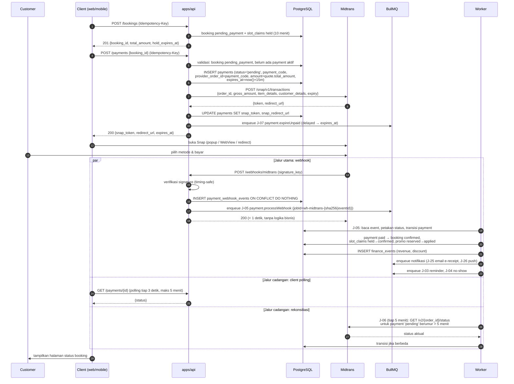
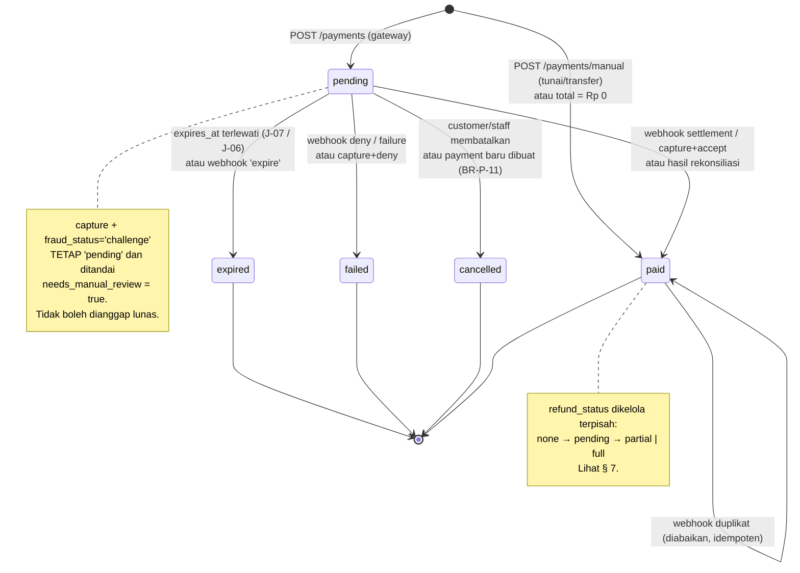
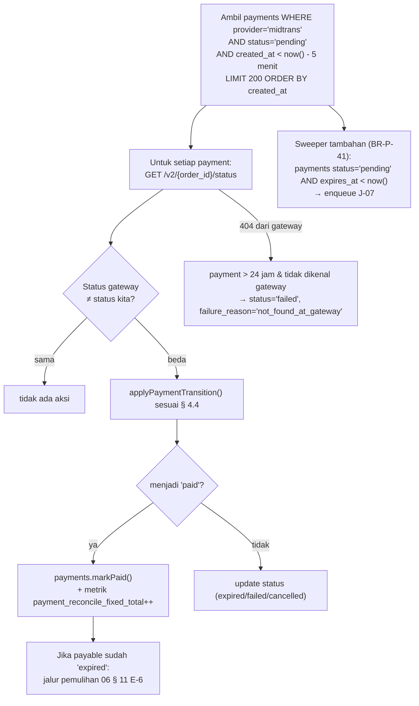
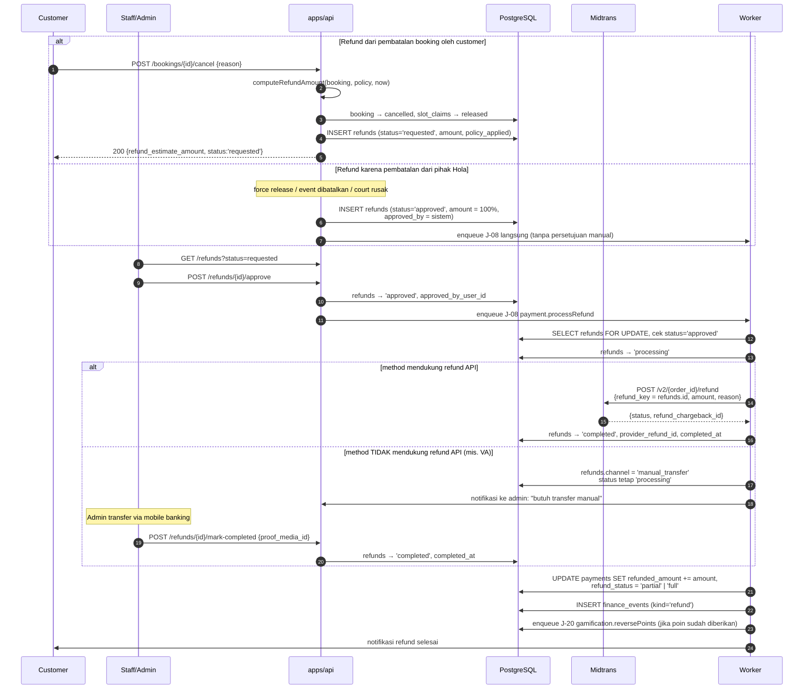

# 07 — MODULE: PAYMENT & PRICING

> Dokumen ini memuat **satu-satunya** definisi pipeline perhitungan harga di seluruh sistem
> ([§ 3](#3-pricing-pipeline-satu-satunya-sumber-perhitungan-harga)). Modul booking, event, dan
> turnamen **wajib** memanggilnya dan **tidak boleh** menghitung harga sendiri.
>
> Prasyarat: [03-DATA-MODEL.md](03-DATA-MODEL.md), [04-API-CONTRACT.md](04-API-CONTRACT.md).
> Endpoint: [04 § 9.5](04-API-CONTRACT.md#95-payment). Izin: [05 § 6.4](05-AUTH.md#64-payment--refund).

---

## 1. Tujuan & Ruang Lingkup

**Termasuk:** perhitungan harga final untuk semua jenis transaksi, pembuatan transaksi di
payment gateway, penerimaan & pemrosesan webhook, idempotency, rekonsiliasi status,
pembayaran manual (tunai/transfer), refund, dan pencatatan biaya gateway.

**Tidak termasuk:** aturan promo itu sendiri (→ [08](08-MODULE-PROMO.md)), klaim slot
(→ [03 § 8](03-DATA-MODEL.md#8-slot-ownership-mekanisme-terpadu)), pencatatan jurnal
(→ [14](14-MODULE-FINANCE.md)).

### Empat jenis payable

| `payable` | Kolom FK di `payments` | Sumber harga | Dokumen |
|---|---|---|---|
| Booking lapangan | `booking_id` | Pipeline § 3 dengan `kind='booking'` | [06](06-MODULE-BOOKING.md) |
| Pendaftaran event | `event_registration_id` | Pipeline § 3 dengan `kind='event_registration'` | [10](10-MODULE-EVENT.md) |
| Pendaftaran turnamen | `tournament_registration_id` | Pipeline § 3 dengan `kind='tournament_registration'` | [11](11-MODULE-MATCH.md) |
| Tagihan tenant cafe | `cafe_invoice_id` | **Tidak** memakai pipeline — nilainya dari kontrak ([09](09-MODULE-TENANT.md)) | [09](09-MODULE-TENANT.md) |

Tagihan tenant sengaja dikecualikan dari pipeline: harganya bukan hasil tarif/promo tetapi
angka kontrak yang sudah disepakati. Ia tetap memakai tabel `payments` yang sama sehingga
pencatatan pembayaran seragam.

---

## 2. Pemilihan Payment Gateway (Keputusan Final)

### Perbandingan Midtrans vs Xendit

| Kriteria | Midtrans | Xendit |
|---|---|---|
| Metode pembayaran lokal | QRIS, GoPay, ShopeePay, VA (BCA/BNI/BRI/Mandiri/Permata), kartu kredit, gerai (Indomaret/Alfamart), Akulaku/Kredivo | QRIS, OVO, DANA, LinkAja, ShopeePay, VA, kartu, retail |
| Checkout siap pakai | **Snap** — halaman/popup checkout lengkap, tinggal `snap_token` | Xendit Invoice — juga siap pakai, sedikit lebih generik |
| Kualitas SDK & dokumentasi | Baik; `midtrans-client` Node populer, contoh melimpah dalam bahasa Indonesia | **Lebih baik** untuk DX modern: OpenAPI resmi, tipe TypeScript, dokumen lebih rapi |
| Webhook | Notification URL + `signature_key` SHA-512. Ada tombol "resend" di dashboard | Callback + verification token. Ada retry & log yang jelas |
| Refund via API | Tergantung metode (lihat § 7.2). Kartu & e-wallet umumnya bisa; VA umumnya **tidak** | Cakupan refund/disbursement lebih luas, termasuk transfer keluar ke rekening bank |
| Disbursement / transfer keluar | Tidak menjadi kekuatan utama | **Kekuatan utama** — cocok untuk membayar/menagih tenant, bagi hasil, refund manual |
| Invoicing | Tidak ada fitur invoice bawaan | Ada produk Invoice & recurring |
| Biaya (indikatif, wajib konfirmasi ulang) | QRIS ~0,7%; VA ~Rp 4.000/transaksi; kartu ~2,9% + Rp 2.000; e-wallet ~1,5–2% | Kisaran serupa; QRIS ~0,7%; VA per transaksi; kartu ~2,9% |
| Onboarding | Perlu dokumen badan usaha; sandbox instan tanpa verifikasi | Serupa; sandbox instan |
| Settlement | H+1 hingga H+2 kerja tergantung metode | Serupa |

### Rekomendasi final

> **Midtrans (Snap) sebagai payment gateway v1**, dengan **`PaymentProvider` port interface**
> agar Xendit dapat ditambahkan tanpa mengubah modul pemanggil.

Alasan penentu:

1. **Snap mengurangi pekerjaan frontend paling banyak.** Kita punya tiga client (web, admin,
   mobile). Snap punya popup web, redirect URL, dan dapat dibuka di WebView mobile dengan satu
   `snap_token`. Membangun UI pemilihan metode pembayaran sendiri adalah pekerjaan yang tidak
   memberi nilai bisnis di v1.
2. **Cakupan QRIS + GoPay + VA sangat matang** dan itulah metode yang dominan untuk transaksi
   Rp 150.000–500.000 di pasar lokal.
3. **Dokumentasi & contoh berbahasa Indonesia melimpah**, memudahkan troubleshooting dengan
   pihak keuangan client.
4. **Kelemahan Midtrans (refund VA & disbursement) tidak menghalangi v1** karena: refund
   berjenjang punya jalur `manual_transfer` yang memang dibutuhkan apa pun gateway-nya (§ 7.2),
   dan penagihan tenant di v1 dicatat manual oleh staff.

**Kapan menambah Xendit:** ketika (a) tagihan tenant ingin dikirim sebagai invoice online
dengan pembayaran mandiri, atau (b) refund otomatis ke rekening bank menjadi kebutuhan rutin,
atau (c) muncul bagi hasil dengan tenant/pelatih yang perlu disbursement. Karena itu port
interface dibuat sejak awal.

### Kontrak port `PaymentProvider`

Modul lain **hanya** mengenal antarmuka ini, bukan Midtrans:

| Operasi | Input | Output |
|---|---|---|
| `createTransaction` | `{ payment_code, amount, items[], customer, expires_at, callback_urls }` | `{ provider_order_id, provider_token, redirect_url, expires_at }` |
| `getTransactionStatus` | `{ provider_order_id }` | `{ status, method, provider_transaction_id, paid_at, gross_amount, raw }` |
| `parseWebhook` | `{ headers, rawBody }` | `{ is_signature_valid, provider_event_id, provider_order_id, status, method, amount, raw }` |
| `createRefund` | `{ payment, amount, reason, refund_reference }` | `{ provider_refund_id, status, raw }` |
| `capabilities` | — | `{ supports_api_refund_by_method: Record<payment_method, boolean> }` |

Implementasi v1: `MidtransProvider`. Implementasi tambahan: `ManualProvider` (untuk
tunai/transfer manual yang dicatat staff — tidak memanggil API mana pun).

---

## 3. Pricing Pipeline: Satu-satunya Sumber Perhitungan Harga

> **ATURAN MUTLAK.** Setiap angka rupiah yang ditampilkan ke user atau ditagih ke gateway
> berasal dari fungsi ini. Tidak ada perhitungan harga di modul booking, event, turnamen,
> frontend, atau query SQL. Kalau kamu menemukan perkalian harga di luar
> `apps/api/src/modules/pricing/`, itu bug.

### 3.1 Kontrak fungsi

Lokasi: `apps/api/src/modules/pricing/pricing.service.ts`

```
pricing.computeQuote(input: QuoteInput): Promise<Quote>
```

**Input**

| Field | Tipe | Wajib | Keterangan |
|---|---|---|---|
| `kind` | `'booking'` \| `'event_registration'` \| `'tournament_registration'` | ✓ | Menentukan cabang step P1 |
| `at` | ISO datetime | ✓ | Waktu evaluasi (biasanya `now()`). Eksplisit agar fungsi dapat diuji deterministik |
| `actor` | `{ user_id?, role, tier_code? }` | ✓ | Untuk validasi promo & tier |
| `booking` | `{ items: [{ court_id, starts_at }], addons: [{ addon_id, quantity }] }` | jika `kind='booking'` | — |
| `event` | `{ event_id }` | jika `kind='event_registration'` | — |
| `tournament` | `{ tournament_id }` | jika `kind='tournament_registration'` | — |
| `promo_code` | string | ✗ | Kode manual dari user |
| `apply_auto_promo` | bool | ✗ | Default `true` |
| `reserve_promo` | bool | ✗ | Default `false`. `true` **hanya** dipanggil dari dalam transaksi pembuatan booking/registrasi |

**Output (`Quote`)** — inilah yang disimpan sebagai `quote_snapshot`:

| Field | Tipe | Keterangan |
|---|---|---|
| `kind` | string | — |
| `computed_at` | ISO datetime | — |
| `pipeline_version` | int | Dinaikkan setiap kali logika pipeline berubah. Wajib, agar snapshot lama bisa ditafsirkan |
| `lines` | array | Rincian per item: `{ type, ref_id, label, court_code?, starts_at?, ends_at?, rate_class?, price_rule_id?, quantity, unit_price_amount, line_total_amount }` |
| `subtotal_amount` | bigint | Jumlah `line_total_amount` untuk `type='slot'` / `'fee'` |
| `addon_amount` | bigint | Jumlah `line_total_amount` untuk `type='addon'` |
| `tier_discount_amount` | bigint | **Selalu 0 di v1** (lihat P6) |
| `promo` | objek \| null | `{ promo_id, code, name, type, discount_amount, reason_code? }` |
| `discount_amount` | bigint | `tier_discount_amount + promo.discount_amount` |
| `taxable_base_amount` | bigint | Dasar pengenaan pajak |
| `tax_rate` | numeric | Default `0` (D-06) |
| `tax_amount` | bigint | — |
| `fee_amount` | bigint | Biaya kanal pembayaran yang dibebankan ke customer. Default `0` (D-07) |
| `rounding_adjustment_amount` | bigint | Selisih akibat pembulatan (bisa negatif) |
| `total_amount` | bigint | **Yang ditagih.** ≥ 0 |
| `currency` | `'IDR'` | — |
| `warnings` | array | Mis. promo tidak berlaku beserta `reason_code` |

### 3.2 Diagram pipeline

```mermaid
flowchart TD
    IN["QuoteInput"] --> P0

    P0["P0 — Normalisasi & validasi input<br/>• parse waktu ke WITA<br/>• pastikan payable target ada & boleh dibayar<br/>• tolak duplikat item"]
    P0 --> P1

    P1["P1 — Ekspansi line items<br/>booking → satu line per slot<br/>event → satu line 'fee'<br/>tournament → satu line 'fee'"]
    P1 --> P2

    P2["P2 — Resolusi tarif dasar (hanya untuk slot)<br/>cocokkan price_rules → rate_class + price_per_hour_amount<br/>tie-break deterministik (§ 3.3 P2)"]
    P2 --> P3

    P3["P3 — Proporsi durasi<br/>unit_price = price_per_hour × slot_duration_minutes / 60<br/>dibulatkan ke Rp 100 terdekat"]
    P3 --> P4

    P4["P4 — Subtotal<br/>subtotal_amount = Σ line_total (slot / fee)"]
    P4 --> P5

    P5["P5 — Addon<br/>addon_amount = Σ (addon.price × quantity)"]
    P5 --> P6

    P6["P6 — Penyesuaian tier<br/>v1: tier_discount_amount = 0<br/>(tier hanya memberi benefit non-moneter)"]
    P6 --> P7

    P7["P7 — Diskon promo (maks SATU)<br/>delegasi ke promo.evaluate()<br/>lihat 08 § 4 & § 6"]
    P7 --> P8

    P8["P8 — Pajak<br/>taxable_base = subtotal + addon − discount<br/>tax_amount = round(taxable_base × tax_rate)<br/>v1: tax_rate = 0"]
    P8 --> P9

    P9["P9 — Biaya kanal pembayaran<br/>v1: fee_amount = 0 (diserap Hola)"]
    P9 --> P10

    P10["P10 — Pembulatan & total<br/>raw = subtotal + addon − discount + tax + fee<br/>total = max(0, roundTo100(raw))<br/>rounding_adjustment = total − raw"]
    P10 --> OUT["Quote"]

    classDef single fill:#e3f2fd,stroke:#1565c0,stroke-width:2px
    class P7 single
```



### 3.3 Detail per step

#### P0 — Normalisasi & validasi input

| Aturan | Detail |
|---|---|
| Zona waktu | Semua `starts_at` dikonversi ke WITA untuk pencocokan `day_of_week` dan `time`. Perbandingan waktu internal tetap memakai instant (UTC) |
| Deduplikasi | Item dengan `(court_id, starts_at)` yang sama muncul dua kali → `422 VALIDATION_ERROR` |
| Validasi keberadaan | Court/event/tournament harus ada dan tidak `inactive`/`cancelled` |
| Batas jumlah | **Batas keras API:** maks 8 baris slot dan 10 baris addon per quote → `422 QUOTE_ITEM_LIMIT_EXCEEDED`. Ini pelindung ukuran request, **bukan** aturan bisnis. Batas bisnis per court adalah `courts.max_slots_per_booking` (default 4) yang divalidasi modul booking ([06 BR-B-02](06-MODULE-BOOKING.md#3-business-rules-umum)). Batas 8 lebih besar karena satu booking boleh mencakup beberapa court |
| Determinisme | Fungsi tidak memanggil `Date.now()` sendiri; selalu memakai `input.at`. Ini prasyarat agar dapat diuji |

#### P1 — Ekspansi line items

| `kind` | Baris yang dihasilkan |
|---|---|
| `booking` | Satu baris `type='slot'` per item, ditambah baris `type='addon'` per addon (diproses di P5) |
| `event_registration` | Satu baris `type='fee'`, `label = events.title`, `unit_price_amount = events.fee_amount`, `quantity = 1`. Jika `events.is_paid = false` → `unit_price_amount = 0` |
| `tournament_registration` | Satu baris `type='fee'`, `unit_price_amount = tournaments.entry_fee_amount`, `quantity = 1` |

Catatan: event dan turnamen **tidak** memakai `price_rules`. Slot yang mereka blokir bukan
barang yang dijual — yang dijual adalah tiket/entry fee. Ini alasan pipeline bercabang di P1
dan bukan di level modul.

#### P2 — Resolusi tarif dasar

Hanya untuk baris `type='slot'`. Untuk setiap slot, cari `price_rules` yang **cocok**:

Kondisi cocok (semua harus benar):
1. `is_active = true`
2. `(court_id = slot.court_id)` **atau** `(court_id IS NULL AND sport_id = court.sport_id)`
3. `active_from IS NULL OR active_from <= slot_date` **dan** `active_to IS NULL OR active_to >= slot_date`
4. `starts_time <= slot_local_time < ends_time` (awal inklusif, akhir eksklusif)
5. `day_type` cocok dengan **tipe hari** slot, ditentukan sebagai berikut:

| Urutan penentuan tipe hari | Aturan |
|---|---|
| 1 | Jika ada `price_rules` dengan `day_type='specific_date'` dan `specific_date = slot_date` → tipe hari = `specific_date` |
| 2 | Jika `special_dates` punya baris untuk `slot_date` dengan `day_type_override` → pakai nilai itu |
| 3 | Jika `EXTRACT(DOW)` ∈ {0 (Minggu), 6 (Sabtu)} → `weekend` |
| 4 | Selain itu → `weekday` |

Jika beberapa rule cocok, **tie-break deterministik** dalam urutan berikut (ini definitif dan
harus punya test):

| Prioritas | Kriteria |
|---|---|
| 1 | `priority` **DESC** (angka besar menang) |
| 2 | Rule dengan `court_id IS NOT NULL` mengalahkan rule level sport (`court_id IS NULL`) |
| 3 | `day_type` dengan urutan spesifisitas: `specific_date` > `holiday` > `weekend` > `weekday` |
| 4 | Rentang waktu **lebih sempit** menang (`ends_time − starts_time` lebih kecil) |
| 5 | `created_at` **DESC** (rule terbaru menang) |
| 6 | `id` **ASC** (penentu terakhir agar 100% deterministik) |

Hasil: `rate_class`, `price_per_hour_amount`, `price_rule_id`.

**Jika tidak ada rule yang cocok:** `422 VALIDATION_ERROR` dengan `code` khusus
`PRICE_RULE_NOT_FOUND` dan `details` berisi slot yang bermasalah. **Tidak boleh** memakai harga
default 0 atau harga dari slot lain — harga yang salah lebih berbahaya daripada error.

#### P3 — Proporsi durasi

```
unit_price_amount = roundTo100(price_per_hour_amount × slot_duration_minutes / 60)
line_total_amount = unit_price_amount × 1        // quantity slot selalu 1
```

Contoh: `price_per_hour_amount = 250000`, `slot_duration_minutes = 90`
→ `250000 × 1.5 = 375000` → `roundTo100(375000) = 375000`.

Contoh pembulatan: `price_per_hour_amount = 150000`, `slot_duration_minutes = 30`
→ `75000`. `price_per_hour_amount = 175000`, `30` menit → `87500` → `roundTo100 = 87500`.

#### P4 — Subtotal

`subtotal_amount = Σ line_total_amount` untuk baris `type IN ('slot','fee')`.

#### P5 — Addon

Untuk setiap addon: `line_total_amount = addons.price_amount × quantity`.
`addon_amount = Σ` baris `type='addon'`.

Aturan: addon dengan `is_active = false` → `422`. `quantity` 1..20.
Addon hanya berlaku untuk `kind='booking'`; dikirim untuk kind lain → `422`.

#### P6 — Penyesuaian tier

**v1: `tier_discount_amount` selalu `0`.**

Alasan keputusan ini eksplisit: menambahkan diskon tier berarti ada **dua** sumber diskon
(tier + promo), yang langsung menimbulkan pertanyaan stacking dan memperumit
[08 § 4](08-MODULE-PROMO.md#4-aturan-stacking-butuh-keputusan-client). Di v1 benefit tier
bersifat **non-moneter**:

| Tier | Benefit v1 |
|---|---|
| Bronze | — |
| Silver | Badge profil |
| Gold | Badge + jendela booking lebih awal (horizon 90 hari vs 60) |
| Platinum | Badge + horizon 120 hari + prioritas waitlist event |

Field `tier_discount_amount` tetap ada di `Quote` supaya penambahan diskon tier di masa depan
tidak mengubah bentuk snapshot. Keputusan mengaktifkannya terkait **D-09**.

#### P7 — Diskon promo

Pipeline **tidak** mengimplementasikan aturan promo. Ia memanggil:

```
promo.evaluate({
  kind, subtotal_amount, addon_amount, lines, actor, at,
  promo_code?, apply_auto_promo, reserve?
}) -> { promo: {...} | null, warnings: [...] }
```

Aturan yang dijamin pipeline:
- **Maksimum satu promo per quote** (D-02, [08 § 4](08-MODULE-PROMO.md#4-aturan-stacking-butuh-keputusan-client)).
- `promo.discount_amount` **tidak boleh** melebihi `subtotal_amount + addon_amount`.
  Jika melebihi, dipotong (clamp) dan `warnings` diisi `DISCOUNT_CLAMPED`.
- Promo yang tidak berlaku **tidak** menggagalkan quote jika berasal dari auto promo
  (cukup diabaikan). Promo dari **kode manual yang salah/tidak berlaku** menghasilkan
  `warnings` berisi `reason_code` **dan** `promo: null` — bukan error 4xx — sehingga user tetap
  melihat total tanpa promo dan pesan penjelasan. Pengecualian: `POST /promos/validate` (yang
  memang untuk memeriksa kode) mengembalikan `is_valid: false` + `reason_code`.

`discount_amount = tier_discount_amount + (promo?.discount_amount ?? 0)`.

#### P8 — Pajak `[BUTUH KEPUTUSAN CLIENT]` (D-06)

```
taxable_base_amount = subtotal_amount + addon_amount − discount_amount
tax_amount = roundTo100(taxable_base_amount × tax_rate)
```

| Opsi | Aturan | Trade-off |
|---|---|---|
| **A. `tax_rate = 0`, harga dianggap tax-inclusive** *(default v1)* | Harga yang ditampilkan = harga yang dibayar. Kewajiban pajak (PPN/PB1 hiburan-olahraga jika berlaku) dihitung terpisah oleh akuntan dari laporan pendapatan | Paling sederhana & paling ramah UX. Pendapatan tercatat bruto; pemisahan pajak dilakukan di luar sistem |
| **B. PPN 11% ditambahkan di atas harga** | `tax_rate = 0.11`. Harga tampil Rp 250.000, ditagih Rp 277.500 | Transparan untuk faktur pajak, tetapi harga jadi tidak "bulat" dan customer merasa ada tambahan |
| **C. Pajak Barang & Jasa Tertentu daerah (PB1/PBJT)** | Tarif ditentukan Perda Balikpapan untuk jasa olahraga/rekreasi; disetel di `app_settings.tax_rate` | Perlu konfirmasi tarif & kewajiban dari konsultan pajak client. Sistem sudah siap |

**Rekomendasi: Opsi A untuk v1**, dengan `tax_rate` dibuat konfigurabel di
`app_settings.tax_rate` sehingga mengaktifkan pajak = mengubah satu setelan, bukan mengubah
kode. **Wajib dikonfirmasi ke akuntan/konsultan pajak client sebelum go-live.**

#### P9 — Biaya kanal pembayaran `[BUTUH KEPUTUSAN CLIENT]` (D-07)

| Opsi | Aturan | Trade-off |
|---|---|---|
| **A. Diserap Hola** *(default v1)* | `fee_amount = 0`. Biaya gateway dicatat sebagai beban `5-1400` | Harga bersih & sederhana; margin berkurang 0,7–2,9% |
| **B. Dibebankan ke customer** | `fee_amount` dihitung per metode setelah customer memilih. **Masalah:** metode baru diketahui **setelah** Snap dibuka, sedangkan `gross_amount` harus dikirim **sebelum** Snap dibuka. Konsekuensi teknis: butuh dua tahap (pilih metode di UI kita → baru buat transaksi), yang membatalkan manfaat Snap | Margin terjaga, tetapi menambah kerja frontend signifikan dan menurunkan konversi |
| **C. Biaya tetap flat** | `fee_amount = Rp 2.500` untuk semua metode, apa pun biaya aktualnya | Sederhana & dapat dilakukan sebelum Snap. Kadang untung, kadang rugi tipis. Butuh transparansi label "biaya layanan" |

**Rekomendasi: Opsi A untuk v1.** Jika margin menjadi masalah, Opsi C adalah kompromi yang
tidak merusak arsitektur. Opsi B sebaiknya dihindari selama Snap dipakai.

Biaya gateway **aktual** tetap dicatat di `payments.gateway_fee_amount` (dari data settlement)
apa pun opsinya, karena dibutuhkan laporan laba/rugi dan perhitungan refund (§ 7).

#### P10 — Pembulatan & total

```
raw_total   = subtotal_amount + addon_amount − discount_amount + tax_amount + fee_amount
total_amount = max(0, roundTo100(raw_total))
rounding_adjustment_amount = total_amount − raw_total
```

Aturan pembulatan (`roundTo100`):

| Aturan | Detail |
|---|---|
| Satuan | Kelipatan **Rp 100** |
| Metode | *Half up* — `roundTo100(x) = Math.round(x / 100) * 100` |
| Kapan diterapkan | Di P3 (harga per slot) **dan** di P10 (total). **Tidak** di setiap langkah antara, untuk menghindari akumulasi galat pembulatan |
| Nilai negatif | `total_amount` di-*floor* ke 0. Diskon tidak pernah menghasilkan tagihan negatif |
| Total Rp 0 | Diizinkan (event gratis, promo 100%). Tidak membuat transaksi gateway — lihat § 4.4 |

### 3.4 Contoh perhitungan lengkap

**Kasus:** Booking 2 slot padel Sabtu 1 Agustus 2026 (weekend) di PDL-01, jam 19:00 & 20:00.
Sewa 1 raket. Kode promo `HOLA20` (20%, maks Rp 50.000).

Data:
- `price_rules`: weekend 16:00–23:00 `peak` Rp 300.000/jam (priority 10, court-level)
- `courts.slot_duration_minutes = 60`
- `addons`: `RACKET` Rp 25.000 / item
- `tax_rate = 0`, `fee_amount = 0`

| Step | Perhitungan | Hasil |
|---|---|---|
| P1 | 2 baris `slot`, 1 baris `addon` | — |
| P2 | Slot 19:00 → weekend, 19:00 ∈ [16:00,23:00) → rule peak Rp 300.000/jam. Slot 20:00 → sama | `rate_class='peak'` |
| P3 | `roundTo100(300000 × 60/60)` = 300.000 per slot | 300.000 ×2 |
| P4 | `subtotal_amount` | **600.000** |
| P5 | `25.000 × 1` | `addon_amount` = **25.000** |
| P6 | v1 | `tier_discount_amount` = **0** |
| P7 | `HOLA20`: 20% × (600.000 + 25.000) = 125.000 → dibatasi `max_discount_amount` 50.000 | `promo.discount_amount` = **50.000**, `discount_amount` = **50.000** |
| P8 | `taxable_base` = 600.000 + 25.000 − 50.000 = 575.000; `tax_rate` 0 | `tax_amount` = **0** |
| P9 | Opsi A | `fee_amount` = **0** |
| P10 | `raw_total` = 600.000 + 25.000 − 50.000 + 0 + 0 = 575.000; `roundTo100` = 575.000 | **`total_amount` = 575.000**, `rounding_adjustment_amount` = 0 |

**Kasus 2:** Event `open_play` gratis, promo tidak dipakai.

| Step | Hasil |
|---|---|
| P1 | 1 baris `fee`, `unit_price_amount = 0` |
| P4 | `subtotal_amount = 0` |
| P10 | `total_amount = 0` → tidak ada transaksi gateway; registrasi langsung `confirmed` |

### 3.5 Aturan snapshot

| # | Aturan |
|---|---|
| BR-P-01 | Objek `Quote` disimpan **utuh** sebagai `bookings.quote_snapshot` (jsonb) beserta kolom ringkasan bertipe (`subtotal_amount`, `discount_amount`, `total_amount`, dst.). Kolom bertipe dipakai untuk agregasi/laporan; jsonb dipakai untuk audit & tampilan rincian |
| BR-P-02 | Snapshot **immutable**. Tidak ada UPDATE ke `quote_snapshot` setelah dibuat. Perubahan harga/promo/tarif setelahnya tidak mengubahnya |
| BR-P-03 | `pipeline_version` wajib disertakan. Jika logika pipeline berubah dengan cara yang mengubah hasil, versi dinaikkan dan test regresi terhadap snapshot lama dipertahankan |
| BR-P-04 | Nilai yang ditagih ke gateway **wajib** sama dengan `quote_snapshot.total_amount`. Perbedaan sekecil apa pun adalah bug; ada test yang membandingkan keduanya |
| BR-P-05 | `POST /bookings/quote` dan `POST /bookings` memanggil fungsi yang sama dengan input yang sama harus menghasilkan `total_amount` identik, **kecuali** promo yang kuotanya habis di antara kedua panggilan (menghasilkan `warnings` + harga tanpa promo) |
| BR-P-06 | `reserve_promo: true` hanya boleh dari dalam transaksi pembuatan booking/registrasi. `POST /bookings/quote` selalu `reserve_promo: false` |

---

## 4. Flow Pembayaran End-to-End

### 4.1 Sequence — pembayaran online (Snap)



### 4.2 Aturan pembuatan payment

| # | Aturan |
|---|---|
| BR-P-10 | `POST /payments` hanya untuk payable yang **belum lunas**. Booking `confirmed` → `409 BOOKING_ALREADY_PAID` |
| BR-P-11 | Satu payable boleh punya beberapa baris `payments`, tetapi **maksimal satu** berstatus `pending`. Membuat payment baru saat masih ada `pending` → payment lama dibatalkan (`status='cancelled'`) lalu payment baru dibuat, dalam satu transaksi. Alasan: customer yang menutup Snap dan mencoba lagi tidak boleh terjebak |
| BR-P-12 | `payments.amount` = `quote_snapshot.total_amount` payable, **tidak dihitung ulang** |
| BR-P-13 | `provider_order_id` = `payment_code` (mis. `HP-260728-0031`). Unik, dapat dibaca manusia, dan mudah dicari di dashboard Midtrans |
| BR-P-14 | `expires_at` = `now() + PAYMENT_EXPIRY_MINUTES` (default 15). Dikirim ke Midtrans sebagai `expiry` agar gateway juga menutup transaksinya |
| BR-P-15 | Kedaluwarsa payment (15 menit) **lebih lama** dari hold slot (10 menit) — konsekuensinya ditangani [06 § 11 E-6](06-MODULE-BOOKING.md#11-edge-cases) |
| BR-P-16 | `item_details` yang dikirim ke Midtrans dibangun dari `quote_snapshot.lines` sehingga jumlahnya **wajib** sama dengan `gross_amount`. Diskon dikirim sebagai baris `item_details` dengan harga negatif (didukung Midtrans) agar penjumlahan tetap cocok |
| BR-P-17 | `customer_details` hanya memuat nama, email, telepon. **Tidak** memuat alamat atau data lain |
| BR-P-18 | Total Rp 0 → **tidak** memanggil gateway. Payment tetap dibuat (agar jejak audit & jurnal seragam) dengan `provider='manual'`, `method='cash'`, `amount=0`, `status='paid'`, `paid_at=now()`, dan payable langsung dikonfirmasi |
| BR-P-19 | `snap_token` **tidak pernah** di-log dan tidak dikembalikan di endpoint daftar payment |

### 4.3 State machine payment



`refund_status` adalah dimensi **terpisah** dari `status`, bukan bagian dari state machine di
atas. Payment yang `paid` lalu di-refund penuh tetap `status='paid'` dengan
`refund_status='full'`. Alasan: uang **memang** pernah masuk; menghapusnya dari `status`
merusak laporan pendapatan dan rekonsiliasi settlement.

### 4.4 Pemetaan status Midtrans → `payment_status`

| `transaction_status` | `fraud_status` | `payment_status` | Aksi tambahan |
|---|---|---|---|
| `settlement` | apa pun | `paid` | Konfirmasi payable |
| `capture` | `accept` | `paid` | Konfirmasi payable |
| `capture` | `challenge` | `pending` | Set `needs_manual_review=true`; notifikasi admin; **tidak** mengonfirmasi payable |
| `capture` | `deny` | `failed` | `failure_reason='fraud_deny'` |
| `pending` | — | `pending` | Tidak ada |
| `deny` | — | `failed` | — |
| `cancel` | — | `cancelled` | — |
| `expire` | — | `expired` | Payable ikut `expired` jika masih `pending_payment` |
| `failure` | — | `failed` | — |
| `refund` | — | `paid` + `refund_status='full'` | Sinkronkan baris `refunds` |
| `partial_refund` | — | `paid` + `refund_status='partial'` | Sinkronkan `refunded_amount` |

Kolom tambahan pada `payments` untuk ini: `needs_manual_review` (bool, default false).

### 4.5 Pembayaran manual (tunai / transfer)

| # | Aturan |
|---|---|
| BR-P-20 | `POST /payments/manual` hanya `staff`/`admin`, wajib `Idempotency-Key` |
| BR-P-21 | `provider='manual'`, `method ∈ {cash, manual_transfer}`, `status='paid'` langsung, `recorded_by_user_id` wajib |
| BR-P-22 | `amount` boleh **lebih kecil** dari nilai payable **hanya** untuk `cafe_invoice_id` (pembayaran parsial tagihan tenant). Untuk booking/event/turnamen, `amount` wajib sama dengan sisa yang harus dibayar → `422 PAYMENT_AMOUNT_MISMATCH` |
| BR-P-23 | `paid_at` boleh diisi masa lalu (mis. transfer diterima kemarin), maksimal 30 hari ke belakang, dan mempengaruhi tanggal jurnal |
| BR-P-24 | Bukti transfer diunggah lebih dulu sebagai `media_files` (`kind='payment_proof'`) dan id-nya disertakan |
| BR-P-25 | Pembayaran manual mencatat `audit_logs` dengan `action='payment.manual_record'` |
| BR-P-26 | Pembayaran manual memicu transisi payable yang **sama persis** dengan pembayaran gateway (satu fungsi `payments.markPaid(paymentId)`), sehingga tidak ada dua jalur konfirmasi |

---

## 5. Webhook Handling & Idempotency

### 5.1 Pembagian tugas yang wajib

```mermaid
flowchart LR
    subgraph http["Handler HTTP (< 1 detik, TANPA logika bisnis)"]
        H1["1. Baca raw body"] --> H2["2. Verifikasi signature_key<br/>timing-safe"]
        H2 -->|invalid| HX["401 WEBHOOK_SIGNATURE_INVALID<br/>TIDAK disimpan sebagai valid"]
        H2 -->|valid| H3["3. Bentuk provider_event_id"]
        H3 --> H4["4. INSERT payment_webhook_events<br/>ON CONFLICT (provider, provider_event_id) DO NOTHING"]
        H4 --> H5["5. enqueue J-05<br/>jobId = wh-midtrans-{sha256(provider_event_id)}"]
        H5 --> H6["6. return 200"]
    end

    subgraph worker["Worker J-05 payment.processWebhook (semua logika bisnis)"]
        W1["1. SELECT payment_webhook_events FOR UPDATE"] --> W2{"processed_at IS NULL?"}
        W2 -->|tidak| WX["selesai (sudah diproses)"]
        W2 -->|ya| W3["2. Cari payments by provider_order_id"]
        W3 -->|tidak ada| W4["catat process_error='unknown_order'<br/>set processed_at, alert admin"]
        W3 -->|ada| W5["3. Verifikasi gross_amount == payments.amount"]
        W5 -->|beda| W6["catat error 'amount_mismatch'<br/>alert admin, JANGAN konfirmasi"]
        W5 -->|sama| W7["4. Petakan status (§ 4.4)"]
        W7 --> W8["5. Transisi payment lewat fungsi transisi<br/>yang menolak transisi tidak sah"]
        W8 --> W9["6. Jika paid → payments.markPaid():<br/>konfirmasi payable, slot_claims held→confirmed,<br/>promo applied, finance_events, notifikasi, job"]
        W9 --> W10["7. UPDATE processed_at = now()"]
    end

    H6 -.-> W1
```



### 5.2 Aturan idempotency

| # | Aturan |
|---|---|
| BR-P-30 | `provider_event_id` untuk Midtrans dibentuk dari: `{order_id}:{transaction_status}:{status_code}:{transaction_time}`. Alasan: Midtrans tidak menyediakan id event unik, tetapi kombinasi ini stabil untuk satu perubahan status. Notifikasi ulang untuk status yang sama menghasilkan id yang sama → tertolak UNIQUE |
| BR-P-31 | UNIQUE `(provider, provider_event_id)` di `payment_webhook_events` adalah **jaminan idempotency durabel**. Redis tidak dilibatkan |
| BR-P-32 | `jobId` BullMQ = `wh-midtrans-{sha256(provider_event_id)}`. Hash mempertahankan determinisme tanpa karakter `:` yang dilarang BullMQ v5; BullMQ menolak job dengan `jobId` yang masih ada, memberi lapisan kedua |
| BR-P-33 | Semua transisi status payment melalui fungsi `applyPaymentTransition(payment, next)` yang **menolak** transisi tidak sah (mis. `paid → pending`) dan mengembalikan "no-op" untuk transisi ke status yang sama. Ini yang membuat pemrosesan berulang aman |
| BR-P-34 | `payments.markPaid()` dijalankan dalam **satu transaksi** yang mencakup: payment → `paid`, payable → `confirmed`, `slot_claims` → `confirmed`, `promo_redemptions` → `applied`, `INSERT finance_events`. Enqueue notifikasi dilakukan **setelah** commit |
| BR-P-35 | `markPaid()` memeriksa `payments.status = 'pending'` di dalam UPDATE (`WHERE id = ? AND status = 'pending'`). Jika 0 baris ter-update, fungsi keluar tanpa efek — inilah idempotency di level SQL |
| BR-P-36 | Webhook dengan `order_id` tak dikenal **tetap disimpan** dengan `process_error='unknown_order'` dan `processed_at` terisi. Balasan HTTP tetap `200`. Alert dikirim ke admin karena ini bisa berarti data hilang atau ada transaksi dari lingkungan lain |
| BR-P-37 | `gross_amount` dari Midtrans berbentuk string desimal (`"575000.00"`). Perbandingan dilakukan setelah dikonversi ke integer rupiah; ketidakcocokan **tidak** mengonfirmasi pembayaran dan memicu alert prioritas tinggi (indikasi manipulasi atau bug harga) |
| BR-P-38 | Handler HTTP webhook **tidak** memakai autentikasi Bearer, **tidak** memakai CORS, dan **tidak** boleh melakukan panggilan jaringan keluar |
| BR-P-39 | Payload disimpan penuh di `payment_webhook_events.payload` setelah `signature_key` dibuang. Payload **tidak** masuk log aplikasi |
| BR-P-40 | Webhook duplikat setelah payment `paid` → J-05 keluar lebih awal, `processed_at` terisi, tidak ada notifikasi ganda karena dedupe `notifications` ([02 § 7](02-INFRASTRUCTURE.md#7-notifikasi)) |

### 5.3 Verifikasi signature

```
expected = SHA512( order_id + status_code + gross_amount + MIDTRANS_SERVER_KEY )
valid    = timingSafeEqual( hex(expected), payload.signature_key )
```

Aturan: perbandingan **wajib** timing-safe. `gross_amount` dipakai **apa adanya** dari payload
(string) untuk perhitungan hash — bukan hasil konversi kita.

---

## 6. Rekonsiliasi

Webhook bisa hilang (deploy, downtime, kesalahan konfigurasi URL). Rekonsiliasi adalah jaring
pengaman yang membuat sistem **tidak bergantung** pada webhook.

### 6.1 J-06 `payment.reconcilePending` (tiap 5 menit)



### 6.2 Aturan rekonsiliasi

| # | Aturan |
|---|---|
| BR-P-41 | J-06 juga bertugas sebagai **sweeper J-07** (lihat [02 § 5.3](02-INFRASTRUCTURE.md#53-ketahanan-job-terhadap-kehilangan-redis)): payment `pending` yang `expires_at` sudah lewat di-expire di situ, sehingga kehilangan job delayed tidak meninggalkan payment menggantung |
| BR-P-42 | Batas 200 payment per eksekusi, diurutkan `created_at` ASC, agar satu lonjakan tidak membanjiri API gateway |
| BR-P-43 | Rekonsiliasi **hanya** mengubah status ke arah yang sah. Ia tidak pernah "mengembalikan" payment `paid` menjadi `pending` |
| BR-P-44 | Metrik `payment_reconcile_fixed_total` dipantau. Nilai yang terus naik berarti webhook bermasalah — alert jika > 5 per jam |
| BR-P-45 | Rekonsiliasi **settlement & biaya gateway**: `gateway_fee_amount` dan `settled_amount` tidak tersedia di webhook awal. Di v1 keduanya diisi **manual oleh admin** dari laporan settlement Midtrans lewat `PATCH /payments/{id}` (field terbatas, hanya admin), atau dibiarkan 0. Impor otomatis file settlement adalah [Out of Scope](#9-out-of-scope) |
| BR-P-46 | Laporan harian (J-29) membandingkan total `payments` berstatus `paid` dengan total `journal_entries` bertipe pendapatan pada tanggal yang sama. Selisih ≠ 0 memicu alert — ini deteksi dini jurnal yang gagal terbentuk |

---

## 7. Refund Flow

### 7.1 Sequence

Untuk Phase 1, cabang gateway pada diagram berikut dinonaktifkan oleh ROADMAP A-4. J-08 hanya
memakai `cash` atau `manual_transfer`. Refund transfer tanpa rekening tujuan tetap `approved`
dan membuat tugas admin; setelah admin melengkapi rekening melalui endpoint `approve`, J-08
memindahkannya ke `processing` sampai bukti pembayaran ditandai selesai.



### 7.2 Dukungan refund per metode pembayaran

Kemampuan refund via API **berbeda per metode**. Sistem wajib memeriksa
`provider.capabilities()` dan mengarahkan ke `manual_transfer` bila perlu.

| `payment_method` | Refund via API Midtrans | Channel refund yang dipakai |
|---|---|---|
| `credit_card` | Ya (full & partial) | `gateway` |
| `gopay` | Ya | `gateway` |
| `shopeepay` | Ya | `gateway` |
| `qris` | Bergantung acquirer — **anggap tidak** kecuali diverifikasi | `manual_transfer` (default), `gateway` jika terverifikasi |
| `bank_transfer_va` | **Tidak** | `manual_transfer` |
| `cash` | — | `cash` (uang diserahkan langsung) |
| `manual_transfer` | — | `manual_transfer` |

> **Wajib dikonfirmasi ke Midtrans/PSP saat onboarding** mana metode yang benar-benar
> mendukung refund API untuk merchant Hola. Jangan berasumsi dari dokumentasi umum.
> Nilai kemampuan disimpan di `app_settings.refund_api_supported_methods` agar dapat
> disesuaikan tanpa deploy.

### 7.3 Aturan refund

| # | Aturan |
|---|---|
| BR-P-50 | Refund hanya untuk `payments.status='paid'`. `409 REFUND_NOT_ALLOWED` selainnya |
| BR-P-51 | `SUM(refunds.amount WHERE status IN ('approved','processing','completed'))` untuk satu payment **tidak boleh** melebihi `payments.amount` → `422 REFUND_AMOUNT_EXCEEDS_PAYMENT`. Divalidasi di dalam transaksi dengan `SELECT ... FOR UPDATE` pada baris payment |
| BR-P-52 | Setiap refund menyimpan `policy_applied` (mis. `tier_gt_48h_100pct`, `tier_24_48h_50pct`, `hola_fault_100pct`, `manual_admin`) sebagai jejak alasan nominalnya |
| BR-P-53 | Refund butuh persetujuan `admin`, **kecuali** refund yang berasal dari kesalahan/keputusan pihak Hola (force release, event dibatalkan, pembayaran masuk setelah slot hilang) yang langsung `approved` |
| BR-P-54 | Biaya gateway tidak dapat ditarik kembali. Pada refund 100%, `refunds.amount = payments.amount − payments.gateway_fee_amount`, **kecuali** refund karena kesalahan Hola yang memakai `refunds.amount = payments.amount` penuh (biaya gateway ditanggung Hola) |
| BR-P-55 | `refunds.status` hanya maju: `requested → approved → processing → completed`, dengan cabang `requested → rejected` dan `processing → failed`. `failed` dapat di-retry admin (kembali ke `approved`) |
| BR-P-56 | J-08 idempoten: `jobId='refund-{refundId}'` (BullMQ v5 melarang `:`). Phase 1 memakai jalur manual; saat ROADMAP A-4 diimplementasikan, `refund_key` gateway memakai `refunds.id` |
| BR-P-57 | Refund menghasilkan `finance_events` `kind='refund_accrual'` saat disetujui dan `kind='refund_settlement'` saat dibayar, sesuai katalog definitif [03 § 16](03-DATA-MODEL.md#16-entitas-finance) dan [14 § 5](14-MODULE-FINANCE.md#5-sumber-transaksi-otomatis) |
| BR-P-58 | Refund atas booking yang sudah `completed` dan berpoin memicu J-20 `gamification.reversePoints` |
| BR-P-59 | Refund parsial menyisakan `refund_status='partial'`; refund yang totalnya sama dengan `payments.amount` (atau `amount − gateway_fee` sesuai BR-P-54) menjadi `full` |
| BR-P-60 | Semua aksi refund (`requested`, `approved`, `rejected`, `completed`) mencatat `audit_logs` |
| BR-P-61 | Rekening tujuan untuk `manual_transfer` (`destination_bank_name`, `destination_account_number`, `destination_account_name`) wajib diisi sebelum status `processing`. Data ini **tidak** boleh muncul di log dan hanya terlihat `admin` |

---

## 8. Edge Cases

| # | Kondisi | Perilaku yang diharapkan |
|---|---|---|
| E-1 | Webhook datang dua kali untuk status yang sama | UNIQUE `(provider, provider_event_id)` menolak insert kedua; J-05 keluar lebih awal karena `processed_at` sudah terisi. Tidak ada notifikasi ganda |
| E-2 | Webhook datang **sebelum** response Snap disimpan (race) | `payments` sudah ada (dibuat sebelum memanggil Midtrans), jadi `provider_order_id` dapat ditemukan. Ini alasan urutan "INSERT payment dulu, baru panggil gateway" bersifat wajib |
| E-3 | Webhook `settlement` datang untuk payment yang sudah `expired` | `applyPaymentTransition` mengizinkan `expired → paid` **hanya** lewat jalur ini (uang nyata sudah masuk), lalu memicu pemulihan payable ([06 § 11 E-6](06-MODULE-BOOKING.md#11-edge-cases)): slot diklaim ulang jika bebas, kalau tidak → refund otomatis 100% |
| E-4 | Webhook tidak pernah datang | J-06 menemukannya dalam ≤5 menit. Client juga melakukan polling `GET /payments/{id}` selama 5 menit pertama |
| E-5 | Signature webhook tidak valid | `401`, **tidak** disimpan sebagai event valid. Tetap dicatat di `payment_webhook_events` dengan `is_signature_valid=false` untuk investigasi, dan **tidak** dienqueue ke J-05. Metrik `payment_webhook_total{result="invalid_signature"}` naik; > 10 per jam = alert (indikasi serangan atau salah konfigurasi key) |
| E-6 | `gross_amount` webhook ≠ `payments.amount` | Payment **tidak** dikonfirmasi. `process_error='amount_mismatch'`, alert prioritas tinggi, admin menyelidiki manual |
| E-7 | Customer membayar dua kali (dua `order_id` berbeda untuk satu booking) | BR-P-11 mencegah dua payment `pending` bersamaan. Jika tetap terjadi (mis. payment lama sudah `expired` lalu dibayar terlambat), payment kedua yang masuk saat payable sudah `confirmed` → dibuat `refunds` 100% otomatis berstatus `approved`, notifikasi ke customer & admin |
| E-8 | `capture` dengan `fraud_status='challenge'` | Payment tetap `pending` + `needs_manual_review=true`. Payable **tidak** dikonfirmasi, hold slot tetap berjalan dan bisa habis. Admin diberi notifikasi untuk memutuskan di dashboard Midtrans. Jika akhirnya `accept`, webhook berikutnya memicu jalur E-3 |
| E-9 | Midtrans tidak dapat dihubungi saat `POST /payments` | `502 UPSTREAM_ERROR`. Baris `payments` sudah dibuat sebelum panggilan gateway (E-2) dan **tetap** `pending` — sengaja tidak langsung ditandai `failed`, karena kegagalan bisa berupa timeout padahal transaksi berhasil dibuat di sisi Midtrans. J-06 menanyakan statusnya; jika gateway tetap tidak mengenalnya setelah 24 jam, payment ditandai `failed` dengan `failure_reason='not_found_at_gateway'`. Client dapat langsung mencoba `POST /payments` lagi, yang membatalkan payment menggantung itu (BR-P-11) |
| E-10 | Promo kuotanya habis antara `quote` dan `POST /bookings` | `POST /bookings` menghitung ulang quote dengan `reserve_promo: true`. Reservasi gagal → quote tanpa promo, booking dibuat dengan harga penuh, response menyertakan `meta.warnings: [PROMO_QUOTA_EXHAUSTED]`. **Client wajib menampilkan konfirmasi ulang harga** sebelum melanjutkan ke pembayaran. Alternatif yang **ditolak**: membuat booking dengan harga lama (merugikan Hola) atau menggagalkan booking (merugikan konversi) |
| E-11 | Tidak ada `price_rules` yang cocok untuk sebuah slot | `422 PRICE_RULE_NOT_FOUND` dengan daftar slot bermasalah. Slot itu **tidak** dijual. Admin diberi alert karena ini kesalahan konfigurasi harga |
| E-12 | Dua `price_rules` cocok dengan `priority` sama | Tie-break 6 tingkat di P2 menjamin hasil deterministik. Ada test yang membuat dua rule identik kecuali `id` dan memastikan hasilnya stabil |
| E-13 | Admin mengubah `price_rules` saat ada 20 quote aktif di browser customer | Quote di browser sudah basi. `POST /bookings` menghitung ulang; jika `total_amount` berbeda dari yang ditampilkan, response menyertakan `meta.warnings: [PRICE_CHANGED]` dan client **wajib** menampilkan harga baru untuk dikonfirmasi ulang. Field `expected_total_amount` opsional di body `POST /bookings`: jika dikirim dan tidak cocok → `409 CONFLICT` alih-alih membuat booking dengan harga berbeda dari yang dilihat user |
| E-14 | Total quote Rp 0 (event gratis / promo 100%) | Tidak ada transaksi gateway (BR-P-18). Payment `provider='manual'`, `amount=0`, `status='paid'`. Jurnal tetap dibuat: pendapatan 0 tidak dicatat, tetapi diskon 100% dicatat sebagai contra-revenue vs pendapatan bruto, sehingga laporan diskon tetap akurat |
| E-15 | Refund atas metode yang tidak mendukung API (VA) | Otomatis dialihkan ke `channel='manual_transfer'`; tanpa rekening tujuan tetap `approved` sambil admin diberi tugas, lalu berhenti di `processing` setelah rekening lengkap sampai admin mengunggah bukti |
| E-16 | Refund gagal di Midtrans (mis. saldo merchant tidak cukup) | `refunds.status='failed'`, `failure_reason` dari gateway, alert admin, dapat di-retry. Payment tetap `paid` dan `refunded_amount` **tidak** bertambah sampai `completed` |
| E-17 | Customer membatalkan booking, refund `requested`, lalu customer minta dibatalkan pembatalannya | Tidak didukung. Booking sudah `cancelled` (terminal) dan slot sudah dilepas. Customer membuat booking baru; admin dapat `POST /refunds/{id}/reject` jika refund belum diproses agar uang tidak keluar dua kali |
| E-18 | PostgreSQL mati saat webhook masuk | Handler gagal insert → `503`. Midtrans melakukan retry berjadwal. J-06 juga akan menemukannya. Tidak ada pembayaran hilang |
| E-19 | Redis mati saat pembayaran berlangsung | Webhook tidak dapat dienqueue ke BullMQ. Baris `payment_webhook_events` **tetap tersimpan** di PostgreSQL. Setelah Redis kembali, J-06 memproses status dari gateway; selain itu ada sweeper `system` yang mencari `payment_webhook_events` dengan `processed_at IS NULL` berumur > 5 menit dan mengenqueue ulang J-05 (bagian dari J-06) |
| E-20 | `pipeline_version` berubah, lalu booking lama dibuka | Snapshot lama tetap ditampilkan apa adanya karena berisi seluruh rincian. Tidak ada perhitungan ulang |
| E-21 | Customer membayar untuk booking yang slotnya sudah di-force-release admin | Booking sudah `cancelled` dan `refunds` 100% sudah dibuat oleh alur force release. Pembayaran yang masuk kemudian → payment `paid`, terdeteksi bahwa payable `cancelled` → refund tambahan 100% otomatis. Total yang dikembalikan tetap sesuai yang dibayar |
| E-22 | Nilai `payments.amount` berbeda dari `quote_snapshot.total_amount` | Tidak boleh terjadi. Ada test BR-P-04, dan J-29 memeriksa konsistensi harian; ketidakcocokan memicu alert |

---

## 9. Out of Scope

- **Xendit sebagai provider aktif** (port interface disiapkan, implementasi tidak dibangun v1).
- **Impor otomatis file settlement** dari Midtrans untuk mengisi `gateway_fee_amount` dan
  `settled_amount` (v1: manual oleh admin).
- **Split payment** — satu tagihan dibayar beberapa orang.
- **Pembayaran berjadwal / cicilan / recurring** (termasuk langganan membership).
- **Wallet / saldo customer** (top-up, kredit dari pembatalan). Ini prasyarat Opsi C kebijakan
  refund; menambahkannya berarti menambah liability keuangan.
- **Multi-currency.**
- **Pembayaran dibebani biaya kanal ke customer (Opsi B P9).**
- **Faktur pajak resmi (e-Faktur).** Sistem hanya menyediakan data pendapatan.
- **3DS/authorization flow kustom** untuk kartu kredit (ditangani Snap).
- **Refund otomatis tanpa persetujuan admin** untuk pembatalan biasa (hanya untuk kesalahan
  pihak Hola).
- **Dispute/chargeback management.** Ditangani manual lewat dashboard Midtrans.
- **Payout ke tenant / bagi hasil.**
