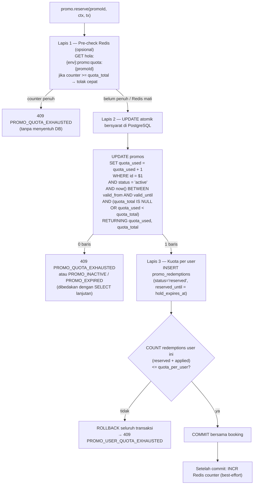
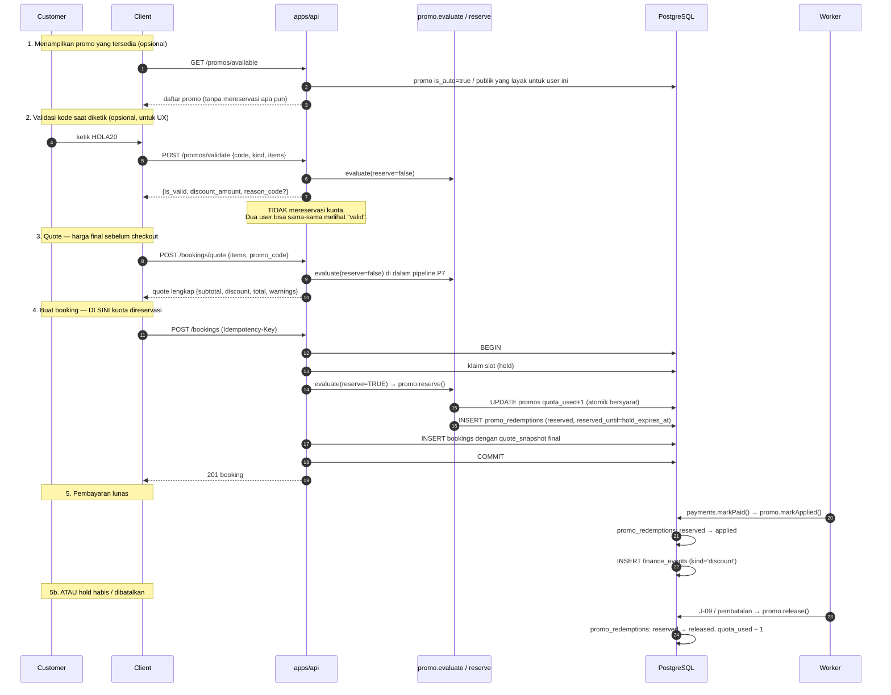

# 08 — MODULE: DISKON & PROMO

> Modul ini **tidak** menghitung total transaksi. Ia hanya menghasilkan satu angka
> `discount_amount` yang dikonsumsi step **P7** pipeline harga di
> [07 § 3](07-MODULE-PAYMENT.md#3-pricing-pipeline-satu-satunya-sumber-perhitungan-harga).
>
> Prasyarat: [03-DATA-MODEL.md § 10](03-DATA-MODEL.md#10-entitas-promo),
> [07-MODULE-PAYMENT.md](07-MODULE-PAYMENT.md).
> Endpoint: [04 § 9.6](04-API-CONTRACT.md#96-promo). Izin: [05 § 6.5](05-AUTH.md#65-promo).

---

## 1. Tujuan & Ruang Lingkup

**Termasuk:** definisi promo (kode manual & otomatis), aturan kelayakan (eligibility), aturan
stacking, kuota yang aman terhadap race condition, perhitungan nominal diskon, reservasi kuota
selama hold checkout, dan pencatatan pemakaian.

**Tidak termasuk:** perhitungan total (→ [07](07-MODULE-PAYMENT.md)), pencatatan diskon sebagai
contra-revenue (→ [14](14-MODULE-FINANCE.md)), diskon berbasis tier
(→ [07 § 3.3 P6](07-MODULE-PAYMENT.md#33-detail-per-step) — nol di v1).

### Kontrak yang diekspos

```
promo.evaluate(input) -> { promo: EvaluatedPromo | null, warnings: Warning[] }
promo.reserve(promoId, context, tx) -> { redemption_id } | throws
promo.markApplied(redemptionId, tx)
promo.release(redemptionId, reason, tx)
```

Hanya `promo.evaluate()` yang dipanggil pipeline harga. Tiga fungsi lain dipanggil modul
booking/event/turnamen di dalam transaksinya.

---

## 2. Jenis Diskon

| `promo_type` | Kolom nilai | Perhitungan dasar | Contoh |
|---|---|---|---|
| `percent` | `value_percent` (numeric 5,2) | `base × value_percent / 100`, lalu dibatasi `max_discount_amount` | `HOLA20` = 20%, maks Rp 50.000 |
| `fixed` | `value_amount` (bigint) | `value_amount` langsung | `POTONG50K` = Rp 50.000 |
| `free_slot` | `free_slot_count` (int) | Nilai `n` slot **termurah** dalam transaksi digratiskan | `GRATIS1JAM` = 1 slot gratis (berlaku jika beli ≥ 3 slot) |

### Aturan per jenis

| # | Aturan |
|---|---|
| BR-PR-01 | `percent`: `value_percent` 0,01–100,00. Wajib punya `max_discount_amount` **jika** `value_percent > 25`. Alasan: promo persen besar tanpa plafon adalah risiko finansial yang tidak terkendali. Divalidasi saat membuat promo (`422`) |
| BR-PR-02 | `fixed`: `value_amount > 0`. Diskon **tidak pernah** melebihi `subtotal_amount + addon_amount` (di-clamp di P7) |
| BR-PR-03 | `free_slot`: hanya berlaku untuk `applies_to ∈ {booking, all}`. `free_slot_count` ≥ 1. Wajib `min_slot_count > free_slot_count` (mis. "1 gratis" butuh minimal 2 slot) agar transaksi tidak menjadi Rp 0 |
| BR-PR-04 | `free_slot` memilih slot **termurah** (`unit_price_amount` ASC, tie-break `starts_at` ASC). Ini keputusan sadar untuk membatasi biaya promo. Ditulis di deskripsi promo agar tidak menyesatkan customer |
| BR-PR-05 | Diskon dihitung terhadap **`subtotal_amount + addon_amount`** kecuali dinyatakan lain. Untuk `free_slot`, dasar perhitungannya hanya baris `type='slot'` |
| BR-PR-06 | Nilai diskon selalu **dibulatkan ke Rp 100** (`roundTo100`) sebelum dikembalikan |

---

## 3. Aturan Validasi Promo (Eligibility)

`promo.evaluate()` memeriksa syarat berikut **dalam urutan ini**. Kegagalan menghasilkan
`reason_code` spesifik (bukan pesan bebas) agar client dapat menampilkan pesan yang tepat.

| # | Urutan | Syarat | `reason_code` | HTTP jika lewat `/promos/validate` |
|---|---|---|---|---|
| V-1 | 1 | Promo ada (untuk kode manual) | `PROMO_NOT_FOUND` | 404 |
| V-2 | 2 | `status = 'active'` | `PROMO_INACTIVE` | 422 |
| V-3 | 3 | `at >= valid_from` | `PROMO_NOT_STARTED` | 422 |
| V-4 | 4 | `at <= valid_until` | `PROMO_EXPIRED` | 410 |
| V-5 | 5 | `applies_to` cocok dengan `kind` transaksi (`all` cocok dengan semua) | `PROMO_NOT_APPLICABLE` | 422 |
| V-6 | 6 | `is_new_customer_only = false`, **atau** customer belum punya booking `completed` sebelumnya | `PROMO_NEW_CUSTOMER_ONLY` | 422 |
| V-7 | 7 | `min_tier_code` terpenuhi (urutan `tiers.sort_order`) | `PROMO_NOT_APPLICABLE` | 422 |
| V-8 | 8 | `subtotal_amount + addon_amount >= min_transaction_amount` | `PROMO_MIN_TRANSACTION_NOT_MET` | 422 |
| V-9 | 9 | Jumlah slot `>= min_slot_count` (jika diisi) | `PROMO_NOT_APPLICABLE` | 422 |
| V-10 | 10 | `promo_courts`: jika ada baris, minimal satu slot berada di court yang terdaftar | `PROMO_NOT_APPLICABLE` | 422 |
| V-11 | 11 | `promo_sports`: jika ada baris, minimal satu slot bersport yang terdaftar | `PROMO_NOT_APPLICABLE` | 422 |
| V-12 | 12 | `valid_days_of_week`: jika diisi, `booking_date` (WITA) harus termasuk | `PROMO_NOT_APPLICABLE` | 422 |
| V-13 | 13 | `valid_starts_time`/`valid_ends_time`: jika diisi, **semua** slot harus berada dalam rentang jam itu | `PROMO_NOT_APPLICABLE` | 422 |
| V-14 | 14 | `valid_rate_classes`: jika diisi, **semua** slot harus ber-`rate_class` yang terdaftar | `PROMO_NOT_APPLICABLE` | 422 |
| V-15 | 15 | Kuota per user: `COUNT(promo_redemptions WHERE promo_id, user_id, status IN ('reserved','applied')) < quota_per_user` | `PROMO_USER_QUOTA_EXHAUSTED` | 409 |
| V-16 | 16 | Kuota total: `quota_total IS NULL OR quota_used < quota_total` | `PROMO_QUOTA_EXHAUSTED` | 409 |
| V-17 | 17 | Stacking (§ 4): belum ada promo lain pada transaksi ini | `PROMO_NOT_STACKABLE` | 409 |

### Aturan penting tentang V-12, V-13, V-14

Batasan waktu promo mengacu pada **jam slot yang dipesan**, bukan jam saat transaksi dilakukan.

> Contoh: promo `HAPPYHOUR` dengan `valid_starts_time='06:00'`, `valid_ends_time='16:00'`
> berlaku untuk **slot** pukul 06:00–16:00, meskipun customer memesannya jam 21:00. Ini yang
> diinginkan bisnis: promo untuk mengisi jam sepi, bukan promo untuk orang yang belanja malam.

Untuk `kind='event_registration'` dan `kind='tournament_registration'`, V-9 sampai V-14
**dilewati** (tidak ada slot untuk diperiksa) — kecuali V-12 yang memakai tanggal
`events.starts_at`.

### Aturan tambahan

| # | Aturan |
|---|---|
| BR-PR-10 | Kode promo **case-insensitive** saat dicari, disimpan **uppercase**. `hola20` = `HOLA20` |
| BR-PR-11 | Kode promo tidak boleh mengandung karakter yang mudah tertukar saat dibacakan: `O`, `I`, `0`, `1` dihindari untuk kode yang di-generate sistem. Kode manual yang dibuat admin bebas (divalidasi hanya `^[A-Z0-9-]{3,20}$`) |
| BR-PR-12 | Guest (booking tanpa akun) **tidak dapat** memakai promo dengan `quota_per_user` atau `is_new_customer_only`, karena identitasnya tidak dapat dilacak. `reason_code='PROMO_NOT_APPLICABLE'` dengan pesan "promo ini hanya untuk pengguna terdaftar" |
| BR-PR-13 | Promo yang diterapkan `staff`/`admin` untuk booking walk-in tunduk aturan yang sama. Tidak ada bypass — jika perlu diskon manual, admin memakai promo khusus bertipe `fixed` dengan `quota_per_user=NULL` dan `is_auto=false`, bukan mengubah harga langsung |
| BR-PR-14 | Promo **tidak** berlaku untuk tagihan tenant cafe (`cafe_invoice`). `applies_to` tidak punya nilai untuk itu |

---

## 4. Aturan Stacking `[BUTUH KEPUTUSAN CLIENT]`

Ini keputusan **D-02**. Aturan v1 **wajib** eksplisit karena ambiguitas di sini langsung
menjadi kerugian uang.

### Keputusan v1 (default, berlaku sampai client memutuskan lain)

> **Maksimum SATU promo per transaksi.** Tidak ada penggabungan promo.

Kolom `promos.is_stackable` sudah ada di schema dengan default `false`, dan **v1 mengabaikan
nilainya** (selalu diperlakukan sebagai `false`). Kolomnya ada agar mengaktifkan stacking di
masa depan tidak butuh migration.

### Aturan pemilihan ketika beberapa promo layak

Karena hanya satu yang dipakai, harus ada aturan pemilihan yang deterministik dan bisa diuji:

| Prioritas | Aturan |
|---|---|
| 1 | **Kode manual yang valid selalu dipertimbangkan.** Jika customer mengetik kode dan kode itu layak, ia masuk kandidat |
| 2 | Kumpulkan semua **auto promo** yang layak (`is_auto = true`, `apply_auto_promo = true`) |
| 3 | Dari seluruh kandidat, pilih yang menghasilkan **`discount_amount` terbesar** |
| 4 | Jika seri (nominal sama): **kode manual menang** atas auto promo. Alasan: customer secara sadar mengetiknya; menolaknya terasa seperti kodenya tidak berfungsi |
| 5 | Jika masih seri (dua auto promo nominal sama): `priority` **DESC** |
| 6 | Jika masih seri: `valid_until` **ASC** (yang lebih cepat berakhir dipakai lebih dulu) |
| 7 | Jika masih seri: `created_at` **ASC**, lalu `id` **ASC** (penentu terakhir) |

Kandidat yang tidak terpilih **tidak** direservasi kuotanya, dan tidak muncul sebagai warning
kecuali kandidat itu berasal dari kode manual yang dimasukkan customer (agar ia tahu kodenya
valid tetapi ada promo lain yang lebih besar). Warning-nya: `PROMO_SUPERSEDED_BY_BETTER_OFFER`.

### Opsi untuk client

| Opsi | Aturan | Kelebihan | Kekurangan |
|---|---|---|---|
| **A. Tanpa stacking — maks 1 promo** *(default v1)* | Satu promo per transaksi; sistem memilih yang paling menguntungkan customer | Paling mudah dipahami customer & staff; biaya promo dapat diprediksi; implementasi & pengujian sederhana; tidak mungkin diskon berlipat tak sengaja | Kurang fleksibel untuk kampanye kombinasi (mis. "promo member + promo happy hour") |
| **B. Stacking terbatas — 1 auto + 1 manual** | Satu auto promo boleh digabung satu kode manual, dengan **plafon total diskon** `app_settings.max_total_discount_percent` (mis. 40% dari subtotal) | Fleksibel untuk kampanye berlapis; masih terkendali karena ada plafon | Perlu aturan urutan penerapan yang eksplisit (persen dihitung atas subtotal asli atau setelah diskon pertama?); UI harus menjelaskan dua potongan; pengujian jauh lebih rumit; risiko salah hitung meningkat |
| **C. Stacking penuh berbasis flag `is_stackable`** | Semua promo ber-`is_stackable=true` dapat digabung, dengan plafon total | Paling fleksibel untuk marketing | Risiko finansial tertinggi; kombinasi yang tidak diantisipasi bisa menghabiskan margin; sangat sulit diuji secara menyeluruh; sering menjadi sumber sengketa |

**Rekomendasi: Opsi A untuk v1.** Alasannya bukan hanya kesederhanaan implementasi: dengan
Opsi A, biaya promo maksimum per transaksi dapat dihitung pasti dari satu baris `promos`,
sehingga pemilik dapat menyetujui kampanye tanpa mensimulasikan kombinasi. Jika kelak
dibutuhkan, **Opsi B** adalah langkah berikut yang wajar; jika Opsi B dipilih, aturan berikut
**wajib** diputuskan bersamaan:

1. Urutan penerapan (rekomendasi: `fixed` lebih dulu, lalu `percent` atas sisa).
2. Dasar perhitungan persen (rekomendasi: atas `subtotal + addon` **sebelum** diskon lain,
   agar deterministik dan tidak bergantung urutan).
3. Plafon total diskon (rekomendasi: 40% dari `subtotal + addon`).
4. Apakah `free_slot` dapat digabung (rekomendasi: **tidak**, karena interaksinya dengan
   `percent` membingungkan).

### Aturan stacking yang berlaku apa pun opsinya

| # | Aturan |
|---|---|
| BR-PR-20 | `discount_amount` total **tidak pernah** melebihi `subtotal_amount + addon_amount`. Di-clamp dengan warning `DISCOUNT_CLAMPED` |
| BR-PR-21 | `total_amount` tidak pernah negatif (di-floor 0 di P10) |
| BR-PR-22 | Satu booking hanya boleh memiliki **satu** baris `promo_redemptions` per promo (UNIQUE partial C-20 di [03 § 18](03-DATA-MODEL.md#18-index--constraint-yang-wajib-ada)) |
| BR-PR-23 | `bookings.promo_id` bertipe tunggal (bukan array). Mengaktifkan stacking di masa depan berarti membaca dari `promo_redemptions`, bukan menambah kolom |

---

## 5. Validasi Kuota Race-Condition-Safe

Kuota promo adalah sumber daya terbatas yang diperebutkan, sama seperti slot. Perlakuannya
mengikuti prinsip yang sama: **PostgreSQL adalah penjaga final, Redis hanya percepatan.**

### 5.1 Mekanisme



### 5.2 Aturan kuota

| # | Aturan |
|---|---|
| BR-PR-30 | **`UPDATE ... WHERE quota_used < quota_total RETURNING` adalah satu-satunya jaminan kuota.** Ia atomik karena PostgreSQL mengambil row lock pada baris promo; dua transaksi bersamaan diserialkan dan yang kedua melihat `quota_used` yang sudah bertambah |
| BR-PR-31 | **Tidak boleh** memakai pola `SELECT quota_used → cek di aplikasi → UPDATE`. Itu race condition klasik dan akan menyebabkan over-redemption |
| BR-PR-32 | `promos.quota_used` **hanya** boleh diubah lewat: (a) `promo.reserve()` (+1 atomik bersyarat), (b) `promo.release()` (−1). Tidak ada UPDATE langsung dari endpoint admin. Admin yang ingin mengubah kuota mengubah `quota_total`, bukan `quota_used` |
| BR-PR-33 | Kuota per user diperiksa **setelah** insert `promo_redemptions`, di dalam transaksi yang sama, dengan `COUNT` atas baris `reserved` + `applied`. Urutan ini penting: menghitung dulu lalu insert adalah race condition. Dengan insert-dulu, dua request paralel dari user yang sama akan sama-sama terhitung dan salah satu di-rollback |
| BR-PR-34 | Reservasi kedaluwarsa (`reserved_until < now()`) dilepas J-09 `commerce.releaseExpiredPromoReservations` setiap 60 detik: `status='released'`, `release_reason='reservation_expired'`, dan `quota_used − 1` **dalam transaksi yang sama** |
| BR-PR-35 | `reserved_until` **selalu** = `bookings.hold_expires_at` (atau padanannya untuk registrasi event/turnamen). Keduanya lepas bersamaan sehingga tidak ada promo yang tertahan setelah slot lepas |
| BR-PR-36 | Redis counter (`hola:{env}:promo:quota:{promoId}`) bersifat **advisory**. Jika hilang: pre-check dilewati, semua permintaan sampai ke PostgreSQL, kebenaran tidak berubah. Jika **terlalu tinggi** (mis. karena release yang gagal DECR): promo tampak habis padahal masih ada — karena itu counter Redis di-*refresh* dari `promos.quota_used` setiap kali J-09 berjalan, sehingga penyimpangan terkoreksi dalam ≤60 detik |
| BR-PR-37 | Pre-check Redis **tidak pernah** menjadi satu-satunya penolakan untuk promo tanpa `quota_total` (unlimited) — key-nya tidak dibuat |
| BR-PR-38 | Promo dengan `quota_total = NULL` (tak terbatas) **tetap menaikkan** `quota_used`, karena kolom itu juga berfungsi sebagai statistik pemakaian untuk laporan. Yang berbeda hanya kondisi `WHERE`-nya: tanpa batas atas |
| BR-PR-39 | `promo_redemptions` **tidak pernah dihapus**. Transisi `reserved → applied` atau `reserved → released` |
| BR-PR-40 | Jumlah baris `promo_redemptions` berstatus `applied` **wajib** ≤ `promos.quota_total`. Ada query konsistensi harian (bagian J-29) yang memeriksa ini dan mengirim alert bila dilanggar |

### 5.3 Test yang wajib ada

| # | Test |
|---|---|
| T-PR-01 | Promo `quota_total = 1`, dua request bersamaan → tepat satu sukses, `quota_used = 1` |
| T-PR-02 | Idem **dengan Redis dimatikan** → hasil sama |
| T-PR-03 | Promo `quota_per_user = 1`, dua request bersamaan dari user yang sama → tepat satu sukses |
| T-PR-04 | Reservasi kedaluwarsa → J-09 mengembalikan `quota_used` ke nilai sebelumnya |
| T-PR-05 | J-09 idempoten: jalankan dua kali, `quota_used` tidak turun dua kali |
| T-PR-06 | Booking dibatalkan sebelum bayar → `quota_used` kembali |
| T-PR-07 | Booking dibayar → `promo_redemptions.status='applied'`, `quota_used` **tidak** berubah lagi |
| T-PR-08 | Pemilihan promo terbaik deterministik untuk 3 kandidat dengan nominal sama |
| T-PR-09 | `percent` dengan `max_discount_amount` benar-benar membatasi |
| T-PR-10 | `free_slot` memilih slot termurah |

---

## 6. Titik Integrasi di Flow Checkout



### Aturan integrasi

| # | Aturan |
|---|---|
| BR-PR-50 | `POST /promos/validate` dan `POST /bookings/quote` **tidak pernah** mereservasi kuota. Konsekuensi yang diterima: dua customer dapat melihat "kode valid" untuk promo berkuota 1, dan salah satunya gagal saat checkout. Ini sengaja — reservasi saat validasi akan membuat kuota habis oleh orang yang cuma mencoba-coba kode |
| BR-PR-51 | Reservasi terjadi **tepat satu kali**, di dalam transaksi pembuatan booking/registrasi. Bukan sebelum, bukan sesudah |
| BR-PR-52 | Jika reservasi gagal di dalam transaksi booking, sistem **tidak** membatalkan booking. Ia menghitung ulang quote **tanpa promo** dan melanjutkan, dengan `meta.warnings` berisi `reason_code`. Client wajib menampilkan konfirmasi harga baru sebelum lanjut ke pembayaran ([07 § 8 E-10](07-MODULE-PAYMENT.md#8-edge-cases)) |
| BR-PR-53 | Sekali `applied`, diskon **tidak dapat dibatalkan** tanpa membatalkan transaksinya. Tidak ada endpoint "hapus promo dari booking" |
| BR-PR-54 | `bookings.promo_code` disimpan denormal (teks) di samping `promo_id`, agar audit tetap terbaca meskipun promo di-archive |
| BR-PR-55 | Diskon dikirim ke Midtrans sebagai baris `item_details` berharga **negatif** agar penjumlahan `item_details` sama dengan `gross_amount` (BR-P-16) |
| BR-PR-56 | Diskon dicatat sebagai **contra-revenue** (akun `4-9000`), bukan sebagai pengurang langsung pendapatan. Pendapatan bruto tetap tercatat penuh. Lihat [14 § 5](14-MODULE-FINANCE.md#5-sumber-transaksi-otomatis) |
| BR-PR-57 | Refund atas transaksi berpromo **tidak** mengembalikan kuota promo. `promo_redemptions` tetap `applied`. Alasan: promo sudah "terpakai" secara ekonomi, dan mengembalikannya membuka celah abuse (pesan-pakai-promo-batalkan berulang) |

---

## 7. Promo Otomatis vs Kode Manual

| Aspek | Auto promo (`is_auto = true`) | Kode manual (`is_auto = false`) |
|---|---|---|
| `promos.code` | **NULL** (dijaga CHECK) | Wajib, UNIQUE, uppercase |
| Cara diterapkan | Otomatis dievaluasi setiap quote jika `apply_auto_promo = true` (default) | Hanya jika customer/staff mengirim `promo_code` |
| Terlihat di | `GET /promos/available` | Tidak dipublikasikan; disebar lewat kanal marketing |
| Kegunaan tipikal | Happy hour, diskon off-peak, promo pembukaan | Kampanye influencer, kompensasi keluhan, voucher komunitas |
| Kuota | Biasanya besar / unlimited | Biasanya terbatas |
| `priority` | Dipakai untuk memilih antar auto promo | Jarang dipakai |

### Aturan

| # | Aturan |
|---|---|
| BR-PR-60 | Auto promo yang tidak layak **tidak** menghasilkan error atau warning yang terlihat customer — ia hanya diabaikan. Menampilkan "promo happy hour tidak berlaku" untuk promo yang tidak pernah diminta customer hanya membingungkan |
| BR-PR-61 | Kode manual yang tidak layak **selalu** menghasilkan `warnings` dengan `reason_code`, dan quote tetap dikembalikan tanpa promo (bukan error 4xx), kecuali di `POST /promos/validate` |
| BR-PR-62 | `apply_auto_promo: false` dapat dikirim client untuk melihat harga tanpa promo (dipakai halaman admin saat membuat booking manual). Tidak tersedia untuk customer di UI |
| BR-PR-63 | Auto promo dengan `quota_total` yang habis berhenti berlaku senyap. Admin melihat statusnya di dashboard promo (`quota_used / quota_total`) |
| BR-PR-64 | Promo dapat di-`pause` (status `paused`) untuk menghentikannya sementara tanpa kehilangan riwayat. `paused` gagal V-2. Reservasi yang sudah ada tetap sah (BR-PR-65) |
| BR-PR-65 | Mem-pause atau meng-archive promo **tidak** membatalkan reservasi/aplikasi yang sudah terjadi. Booking yang sudah memegang reservasi tetap mendapat diskonnya |
| BR-PR-66 | Promo tidak dapat dihapus, hanya `archived` |
| BR-PR-67 | Perubahan pada promo yang sudah pernah dipakai (`quota_used > 0`) dibatasi: `type`, `value_percent`, `value_amount`, `free_slot_count`, dan `applies_to` **tidak dapat diubah** (`409 CONFLICT`). Alasan: mengubahnya membuat riwayat diskon tidak dapat ditafsirkan. Yang boleh diubah: `name`, `description`, `quota_total`, `valid_until`, `status`, `priority` |

---

## 8. Perhitungan Diskon

Fungsi pure, dapat diuji tanpa DB: `computeDiscount(promo, base, lines) -> bigint`.

### Algoritma

```
base = subtotal_amount + addon_amount

switch (promo.type):
  case 'percent':
    raw = base × promo.value_percent / 100
    if promo.max_discount_amount != null:
        raw = min(raw, promo.max_discount_amount)

  case 'fixed':
    raw = promo.value_amount

  case 'free_slot':
    slotLines = lines.filter(type == 'slot')
                     .sort(by unit_price_amount ASC, then starts_at ASC)
    raw = sum(slotLines.slice(0, promo.free_slot_count).unit_price_amount)

discount = roundTo100(raw)
discount = min(discount, base)          // clamp, warning DISCOUNT_CLAMPED
return max(0, discount)
```

### Contoh

| Kasus | `base` | Promo | Hasil |
|---|---|---|---|
| 1 | 625.000 | `percent` 20%, maks 50.000 | `625.000 × 0,2 = 125.000` → dibatasi **50.000** |
| 2 | 300.000 | `percent` 10%, tanpa plafon | **30.000** |
| 3 | 300.000 | `fixed` 50.000 | **50.000** |
| 4 | 40.000 | `fixed` 50.000 | `50.000` → clamp ke **40.000**, warning `DISCOUNT_CLAMPED` |
| 5 | 900.000 (3 slot: 300k, 300k, 300k) | `free_slot` 1 | **300.000** |
| 6 | 750.000 (3 slot: 150k off-peak, 300k, 300k) | `free_slot` 1 | slot termurah = 150k → **150.000** |
| 7 | 155.000 (1 slot 150.000 + addon 5.000) | `percent` 33% | `155.000 × 0,33 = 51.150` → `roundTo100` = **51.200** |

Catatan kasus 7: pembulatan *half up* ke kelipatan 100 dapat membuat diskon sedikit **lebih
besar** dari perhitungan matematis. Ini disengaja (menguntungkan customer, selisih maksimal
Rp 50) dan didokumentasikan agar tidak dianggap bug.

---

## 9. Edge Cases

| # | Kondisi | Perilaku yang diharapkan |
|---|---|---|
| E-1 | Dua customer memakai kode promo berkuota 1 secara bersamaan | Satu berhasil (`UPDATE ... RETURNING` mengembalikan baris), satu menerima `409 PROMO_QUOTA_EXHAUSTED` saat `POST /bookings`. Yang gagal **tidak** kehilangan slotnya — booking tetap dibuat dengan harga penuh + warning (BR-PR-52) |
| E-2 | Customer melihat "kode valid" lalu gagal saat checkout | Perilaku yang diterima (BR-PR-50). UI wajib menampilkan pesan "kuota promo baru saja habis" + harga baru untuk dikonfirmasi |
| E-3 | Redis counter promo hilang | Pre-check dilewati; kebenaran dijaga PostgreSQL. Counter dibangun ulang dari `promos.quota_used` oleh J-09 dalam ≤60 detik |
| E-4 | Redis counter promo **lebih tinggi** dari kenyataan (promo tampak habis padahal belum) | Terkoreksi J-09 (BR-PR-36) dalam ≤60 detik. Selama itu, promo ditolak di lapis 1 — kerugian sementara pada konversi, bukan kerugian uang. Jika masalahnya persisten, admin dapat menjalankan `POST /admin/jobs/commerce.releaseExpiredPromoReservations/trigger` |
| E-5 | Hold booking habis, promo tidak dilepas karena J-09 mati | `quota_used` tetap tinggi sehingga promo tampak habis lebih cepat dari seharusnya. **Tidak ada** kerugian uang (tidak ada over-redemption). Terpulihkan begitu worker hidup. Ini arah kegagalan yang dipilih sengaja: lebih baik promo terlalu ketat daripada terlalu longgar |
| E-6 | Customer mengetik kode promo dengan huruf kecil & spasi | Dinormalisasi: `trim()` + `toUpperCase()`. `" hola20 "` → `HOLA20` |
| E-7 | Kode promo tidak ada | `POST /promos/validate` → `404 PROMO_NOT_FOUND`. `POST /bookings/quote` → quote tanpa promo + warning `PROMO_NOT_FOUND` (bukan error) |
| E-8 | Promo `percent` 100% | `total_amount = 0` → tidak ada transaksi gateway ([07 BR-P-18](07-MODULE-PAYMENT.md#42-aturan-pembuatan-payment)). Payment `manual`/`cash`/`amount=0`, payable langsung `confirmed`. Jurnal tetap mencatat pendapatan bruto + contra-revenue penuh |
| E-9 | Promo `free_slot` dipakai untuk booking 1 slot | Ditolak oleh BR-PR-03 (`min_slot_count > free_slot_count`) saat promo dibuat; jika data lama melanggar, V-9 menolaknya dengan `PROMO_NOT_APPLICABLE` |
| E-10 | Booking mencakup slot peak dan off-peak, promo `valid_rate_classes = ['offpeak']` | V-14 mensyaratkan **semua** slot ber-rate-class yang terdaftar → promo **tidak** berlaku. Alternatif "berlaku sebagian" ditolak untuk v1 karena membuat perhitungan dan komunikasi ke customer rumit |
| E-11 | Booking dibatalkan setelah dibayar, promo sudah `applied` | Kuota **tidak** dikembalikan (BR-PR-57). Refund dihitung dari `total_amount` yang sudah terdiskon, bukan dari harga bruto |
| E-12 | Admin menaikkan `quota_total` untuk promo yang sudah habis | Promo hidup kembali otomatis (kondisi `quota_used < quota_total` kembali benar). Counter Redis dikoreksi J-09 |
| E-13 | Admin menurunkan `quota_total` di bawah `quota_used` | Diizinkan (mematikan promo secara efektif). `quota_used` tidak diubah. Validasi hanya memperingatkan di UI |
| E-14 | Promo kedaluwarsa saat booking masih `pending_payment` dengan reservasi | Reservasi tetap sah (BR-PR-65). Booking dibayar dengan diskon. Alasan: harga sudah dikunci di `quote_snapshot` |
| E-15 | Guest walk-in memakai promo `quota_per_user = 1` | Ditolak (BR-PR-12) karena identitas tidak dapat dilacak |
| E-16 | Staff mencoba memberi diskon manual di luar promo | Tidak mungkin — tidak ada field harga yang dapat ditulis client (BR-B-12). Staff harus memakai promo bertipe `fixed`. Ini keputusan sadar untuk menjaga jejak audit diskon |
| E-17 | Dua promo layak dengan nominal identik, satu manual satu auto | Manual menang (aturan pemilihan prioritas 4). Warning `PROMO_SUPERSEDED_BY_BETTER_OFFER` **tidak** dikirim karena manual yang menang |
| E-18 | Auto promo layak memberi diskon lebih besar dari kode manual yang diketik customer | Auto promo dipakai; warning `PROMO_SUPERSEDED_BY_BETTER_OFFER` dikirim agar customer tahu kodenya valid tetapi ada penawaran lebih baik. Kuota kode manual **tidak** dipakai |
| E-19 | `promo_redemptions` `applied` melebihi `quota_total` (data korup) | Terdeteksi query konsistensi harian (BR-PR-40) → alert. Tidak ada perbaikan otomatis (butuh keputusan manusia) |
| E-20 | Promo di-archive lalu kode yang sama dibuat lagi | Ditolak: UNIQUE `promos.code` berlaku untuk semua status termasuk `archived`. Admin memakai kode berbeda (mis. `HOLA20-2027`) |

---

## 10. Out of Scope

- **Stacking promo** (Opsi B & C § 4).
- **Diskon berbasis tier/membership** (`tier_discount_amount` selalu 0 di v1).
- **Voucher personal per user** (satu kode unik untuk satu orang, mis. hasil generate massal).
- **Referral reward berupa uang/diskon.** Referral hanya memberi **poin**
  ([12](12-MODULE-GAMIFICATION.md)).
- **Bundle / paket** (mis. "3 jam + sewa raket Rp 500.000").
- **Promo berbasis kode QR atau tautan afiliasi dengan pelacakan.**
- **Promo yang berlaku sebagian atas slot tertentu** dalam satu booking (E-10).
- **Kupon yang dapat dihadiahkan antar user.**
- **Diskon otomatis berbasis riwayat belanja / ML.**
- **A/B testing promo.**
- **Kartu hadiah (gift card) / prabayar.**
- **Mengembalikan kuota promo saat refund** (BR-PR-57).
