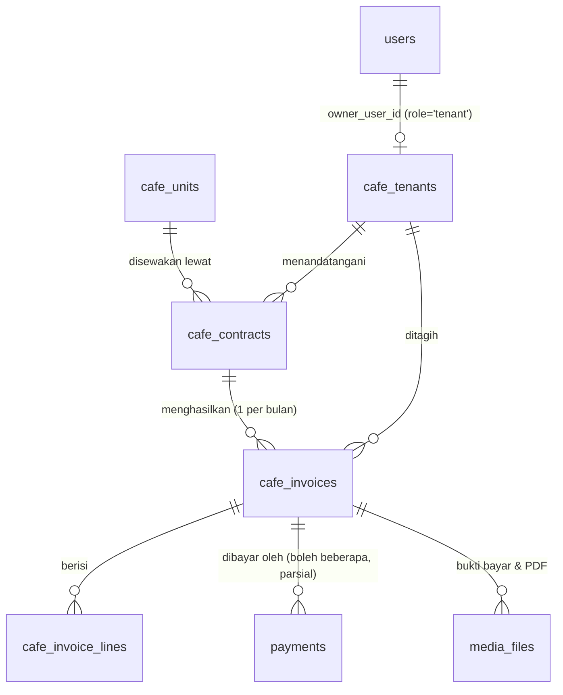
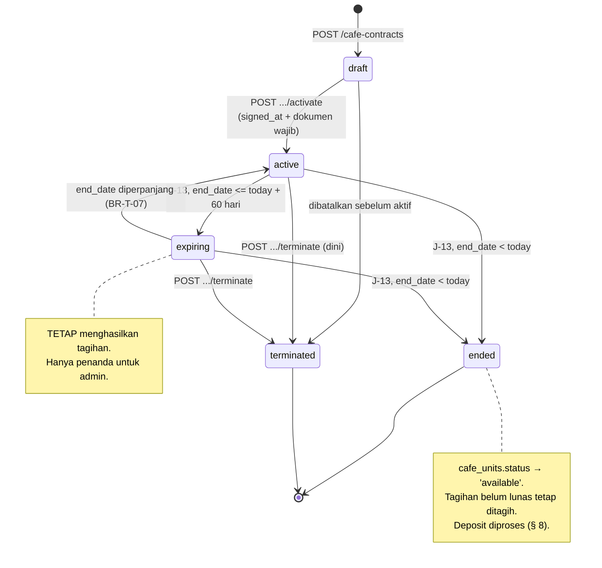
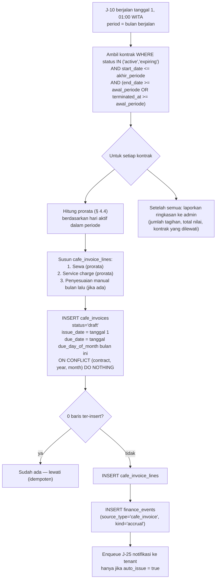
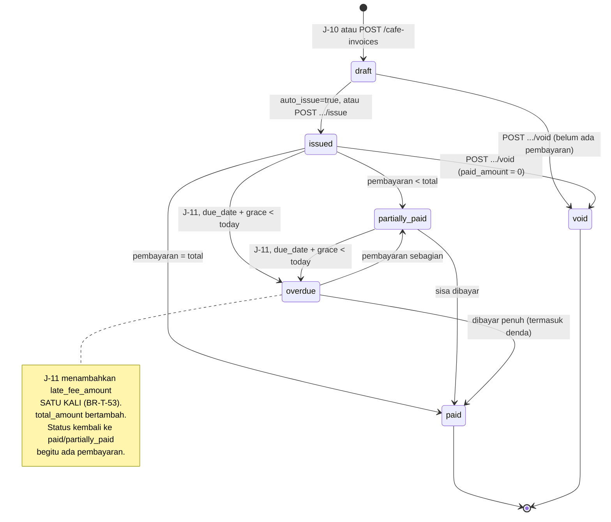

# 09 — MODULE: MANAJEMEN TENANT CAFE

> ⚠️ **"Tenant" di sini berarti penyewa ruang komersial (cafe) di dalam gedung Hola.**
> Ini **bukan** multi-tenancy SaaS. Tabelnya sengaja dinamai `cafe_*` agar tidak disalahartikan.
> Hola adalah aplikasi single-tenant; jangan pernah menambahkan `tenant_id` untuk isolasi data.
>
> Prasyarat: [03-DATA-MODEL.md § 15](03-DATA-MODEL.md#15-entitas-cafe-tenant),
> [07-MODULE-PAYMENT.md](07-MODULE-PAYMENT.md), [14-MODULE-FINANCE.md](14-MODULE-FINANCE.md).
> Endpoint: [04 § 9.11](04-API-CONTRACT.md#911-cafe-tenant). Izin: [05 § 6.10](05-AUTH.md#610-cafe-tenant).

---

## 1. Tujuan & Ruang Lingkup

**Termasuk:** inventaris ruang (`cafe_units`), data penyewa (`cafe_tenants`), kontrak sewa
(`cafe_contracts`), generasi tagihan bulanan otomatis (`cafe_invoices`), pencatatan pembayaran
(penuh & parsial), denda keterlambatan, penagihan & pengingat, portal tenant untuk melihat
tagihan dan mengunggah bukti bayar, serta integrasi ke jurnal keuangan.

**Tidak termasuk:** POS/kasir cafe, inventaris barang cafe, bagi hasil penjualan berbasis data
transaksi cafe, pembayaran online mandiri oleh tenant lewat gateway (v1: dicatat manual staff),
manajemen listrik/air per meter. Semua ada di [§ 10](#10-out-of-scope).

---

## 2. Entitas & Hubungan



| Entitas | Peran |
|---|---|
| `cafe_units` | Inventaris ruang fisik yang disewakan. Mis. `U-01`, 24 m², lantai 1 |
| `cafe_tenants` | Badan usaha/orang penyewa. Punya kontak & status |
| `cafe_contracts` | Perjanjian: unit mana, tenant mana, periode, nominal, tanggal jatuh tempo |
| `cafe_invoices` | Tagihan bulanan. **Satu per (kontrak, tahun, bulan)** — dijaga UNIQUE |
| `cafe_invoice_lines` | Rincian tagihan: sewa, service charge, denda, penyesuaian |
| `payments` | Memakai tabel yang sama dengan booking, dengan `cafe_invoice_id` terisi |

---

## 3. Kontrak Sewa

### 3.1 Field kunci

| Field | Arti | Aturan |
|---|---|---|
| `contract_number` | Nomor kontrak, UNIQUE | Format `HC-{YYYY}-{seq3}`, mis. `HC-2026-004` |
| `cafe_tenant_id`, `cafe_unit_id` | Siapa & ruang mana | Satu kontrak = satu unit. Satu tenant boleh punya beberapa kontrak (unit berbeda) |
| `start_date`, `end_date` | Periode sewa | `start_date < end_date` (CHECK) |
| `rent_amount` | Sewa pokok per bulan | bigint rupiah |
| `service_charge_amount` | Biaya layanan per bulan (listrik bersama, kebersihan, keamanan) | Default 0 |
| `deposit_amount` | Deposit/jaminan | Dibayar sekali di awal, lihat § 8 |
| `due_day_of_month` | Tanggal jatuh tempo setiap bulan | 1–28 (CHECK). **Bukan** 29/30/31 agar tidak ada bulan yang tidak punya tanggal itu |
| `grace_period_days` | Masa tenggang sebelum dianggap `overdue` | Default 3 |
| `late_fee_percent` | Denda keterlambatan (% dari total tagihan) | Default 0 |
| `late_fee_flat_amount` | Denda keterlambatan (nominal tetap) | Default 0 |
| `status` | `draft` \| `active` \| `expiring` \| `ended` \| `terminated` | Lihat § 3.3 |
| `document_media_id` | PDF kontrak yang ditandatangani | Bucket privat |
| `signed_at` | Tanggal tanda tangan | — |
| `version` | Optimistic locking | Wajib `If-Match` saat `PATCH` |

### 3.2 Business rules kontrak

| # | Aturan | Error |
|---|---|---|
| BR-T-01 | **Satu unit hanya boleh punya satu kontrak `active` pada satu waktu.** Dijaga UNIQUE partial `(cafe_unit_id) WHERE status='active'` (constraint C-10) | `409 CAFE_UNIT_OCCUPIED` |
| BR-T-02 | Kontrak baru untuk unit yang kontrak lamanya `ended`/`terminated` diizinkan. Riwayat kontrak lama tetap tersimpan | — |
| BR-T-03 | Kontrak dibuat dengan `status='draft'`. Hanya `active` yang menghasilkan tagihan | — |
| BR-T-04 | Aktivasi (`POST /cafe-contracts/{id}/activate`) mensyaratkan: `signed_at` terisi, `document_media_id` terisi, `rent_amount > 0`, dan unit tidak sedang punya kontrak `active` lain | `422 VALIDATION_ERROR` / `409 CAFE_UNIT_OCCUPIED` |
| BR-T-05 | Aktivasi mengubah `cafe_units.status → 'occupied'` dan `cafe_tenants.status → 'active'` dalam transaksi yang sama | — |
| BR-T-06 | `rent_amount`, `service_charge_amount`, `due_day_of_month`, `start_date` **tidak dapat diubah** setelah ada `cafe_invoices` berstatus selain `draft` untuk kontrak itu. Perubahan nominal sewa dilakukan dengan **kontrak baru** (amandemen), bukan mengedit kontrak lama | `409 CONFLICT` |
| BR-T-07 | `end_date` **dapat** diperpanjang kapan saja (perpanjangan kontrak) — ini pengecualian sadar terhadap BR-T-06, karena perpanjangan tanpa perubahan nominal adalah kasus paling umum dan tidak mengubah tafsir tagihan lampau |
| BR-T-08 | J-13 `commerce.flagExpiringContracts` (cron Senin 03:00) menandai kontrak `active` dengan `end_date <= today + 60 hari` menjadi `status='expiring'` dan mengirim notifikasi ke admin | — |
| BR-T-09 | Kontrak `expiring` **tetap** menghasilkan tagihan seperti `active`. `expiring` hanya penanda untuk admin, bukan penghenti penagihan | — |
| BR-T-10 | Kontrak yang `end_date < today` dan tidak diperpanjang: J-13 mengubahnya menjadi `status='ended'` dan `cafe_units.status → 'available'`. Tagihan yang belum lunas **tetap** harus dibayar | — |
| BR-T-11 | Terminasi dini (`POST /cafe-contracts/{id}/terminate`) wajib `reason` + `terminated_at`. Mengubah `status='terminated'`, `cafe_units.status='available'`. Tagihan bulan berjalan **tetap terbit** secara prorata (§ 4.4) | `422` jika `reason` kosong |
| BR-T-12 | Terminasi mencatat `audit_logs` dengan `action='cafe_contract.terminate'` |  |
| BR-T-13 | Semua nominal kontrak (`rent_amount`, `service_charge_amount`, `deposit_amount`) hanya terlihat `admin` dan `tenant` pemilik kontrak — **bukan** `staff` (field-level filtering, [05 § 7](05-AUTH.md#7-otorisasi-berbasis-kepemilikan)) | — |
| BR-T-14 | Satu `cafe_tenants` boleh ditautkan ke maksimal satu `users` berrole `tenant` (UNIQUE partial `owner_user_id`). Tenant tanpa akun tetap dapat dikelola admin; portal tenant hanya butuh akun bila diinginkan | — |

### 3.3 State machine kontrak



---

## 4. Siklus Tagihan Bulanan

### 4.1 Job J-10 `commerce.generateMonthlyInvoices`

| Aspek | Nilai |
|---|---|
| Trigger | `cron: 0 1 1 * *` — **tanggal 1 setiap bulan, 01:00 WITA** |
| Retry | 3 × exponential mulai 300 s |
| Idempotency | UNIQUE `(cafe_contract_id, period_year, period_month)` di `cafe_invoices` + `INSERT ... ON CONFLICT DO NOTHING` |
| Trigger manual | `POST /admin/cafe/generate-invoices` dengan body `{ period_year, period_month }` — memakai handler yang sama |



### 4.2 Business rules tagihan

| # | Aturan | Error |
|---|---|---|
| BR-T-20 | Tagihan dibuat **satu kali per (kontrak, tahun, bulan)**. Menjalankan J-10 dua kali tidak membuat tagihan ganda | — |
| BR-T-21 | Tagihan dibuat dengan `status='draft'`. `draft` **belum** terlihat tenant dan **belum** masuk piutang | — |
| BR-T-22 | Transisi `draft → issued` dilakukan: (a) otomatis jika `app_settings.cafe_invoice_auto_issue = true` (default **true**), atau (b) manual lewat `POST /cafe-invoices/{id}/issue`. Mode manual berguna di bulan-bulan awal ketika admin ingin memeriksa dulu | — |
| BR-T-23 | `issue_date` = tanggal 1 periode. `due_date` = `due_day_of_month` pada bulan periode. Jika `due_day_of_month` < tanggal saat generate (tidak mungkin karena generate tanggal 1), tetap dipakai apa adanya | — |
| BR-T-24 | `total_amount` = `rent_amount + service_charge_amount + other_amount + adjustment_amount + late_fee_amount`. `adjustment_amount` boleh negatif (kredit/koreksi) | — |
| BR-T-25 | Tagihan **tidak** memakai pipeline harga [07 § 3](07-MODULE-PAYMENT.md#3-pricing-pipeline-satu-satunya-sumber-perhitungan-harga). Nominalnya dari kontrak, bukan dari tarif/promo. Promo **tidak** berlaku untuk tagihan tenant (BR-PR-14) | — |
| BR-T-26 | `PATCH /cafe-invoices/{id}` hanya boleh mengubah `adjustment_amount`, `other_amount`, `notes`, dan hanya untuk status `draft` atau `issued` (belum ada pembayaran) | `409 CONFLICT` |
| BR-T-27 | Tagihan yang salah dan sudah `issued` **tidak diedit** setelah ada pembayaran — di-`void` (`POST /cafe-invoices/{id}/void` dengan `reason`) lalu dibuat manual yang benar (`POST /cafe-invoices`) | `409 CAFE_INVOICE_ALREADY_PAID` |
| BR-T-28 | `void` hanya boleh jika `paid_amount = 0`. Tagihan yang sudah dibayar sebagian harus di-refund lebih dulu | `409 CAFE_INVOICE_ALREADY_PAID` |
| BR-T-29 | Tagihan tidak pernah dihapus | — |
| BR-T-30 | Setiap tagihan `issued` menghasilkan `finance_events` yang menjadi jurnal piutang (`kind='accrual'`): debit `1-2100 Piutang Tenant`, kredit `4-1200 Pendapatan Sewa Tenant` | — |
| BR-T-31 | PDF tagihan **tidak** digenerate server di v1. Portal tenant & email berisi rincian HTML; tenant dapat mencetak dari browser. Generasi PDF server-side ada di [§ 10](#10-out-of-scope) |  |

### 4.3 Timeline satu siklus bulanan

Contoh: kontrak dengan `due_day_of_month = 10`, `grace_period_days = 3`.

```mermaid
gantt
    dateFormat YYYY-MM-DD
    axisFormat %d %b
    title Siklus tagihan Juli 2026 (due 10, grace 3)

    section Penerbitan
    J-10 generate + issue (01:00 WITA)      :milestone, m1, 2026-07-01, 0d
    Notifikasi tagihan baru ke tenant       :milestone, m2, 2026-07-01, 0d

    section Pengingat (J-12, harian 08:00)
    Reminder H-3 sebelum due                :milestone, m3, 2026-07-07, 0d
    Reminder hari-H due                     :milestone, m4, 2026-07-10, 0d

    section Jatuh tempo & tenggang
    Masa tenggang 3 hari                    :active, g1, 2026-07-11, 3d

    section Keterlambatan
    J-11 tandai overdue + denda (02:00)     :crit, milestone, m5, 2026-07-14, 0d
    Reminder overdue H+1                    :milestone, m6, 2026-07-15, 0d
    Reminder overdue H+7                    :milestone, m7, 2026-07-21, 0d
    Reminder overdue H+14 + eskalasi admin  :crit, milestone, m8, 2026-07-28, 0d
```

### 4.4 Prorata

| # | Aturan |
|---|---|
| BR-T-40 | Prorata dihitung **berdasarkan jumlah hari aktif** dalam periode, bukan per minggu: `amount_prorata = roundTo100(amount_bulanan × hari_aktif / hari_dalam_bulan)` |
| BR-T-41 | `hari_dalam_bulan` = jumlah hari kalender aktual bulan itu (28/29/30/31), bukan 30 tetap. Alasan: lebih adil dan mudah dijelaskan ke tenant |
| BR-T-42 | Prorata berlaku pada: (a) bulan pertama jika `start_date` bukan tanggal 1; (b) bulan terakhir jika `end_date` atau `terminated_at` bukan hari terakhir bulan |
| BR-T-43 | Prorata diterapkan pada `rent_amount` **dan** `service_charge_amount` dengan proporsi yang sama |
| BR-T-44 | Baris tagihan prorata memakai deskripsi eksplisit: `"Sewa 12–31 Jul 2026 (20/31 hari)"` agar tenant dapat memverifikasi sendiri |
| BR-T-45 | Deposit **tidak** diprorata (§ 8) |

Contoh: `rent_amount` Rp 5.000.000, `start_date` 12 Juli 2026 (Juli = 31 hari, hari aktif =
12–31 = 20 hari).
`5.000.000 × 20 / 31 = 3.225.806,45` → `roundTo100` = **Rp 3.225.800**.

---

## 5. Status Tagihan & Penagihan

### 5.1 State machine tagihan



### 5.2 Business rules penagihan

| # | Aturan | Job |
|---|---|---|
| BR-T-50 | J-11 `commerce.markOverdueInvoices` (cron harian 02:00 WITA) menandai tagihan `issued`/`partially_paid` dengan `due_date + grace_period_days < current_date` menjadi `status='overdue'` | J-11 |
| BR-T-51 | Perhitungan `overdue` memakai `grace_period_days` dari **kontrak**, bukan nilai global | J-11 |
| BR-T-52 | Denda dihitung `late_fee_amount = roundTo100(total_sebelum_denda × late_fee_percent / 100) + late_fee_flat_amount` | J-11 |
| BR-T-53 | **Denda ditambahkan tepat satu kali** saat transisi ke `overdue`, bukan harian/berbunga. Idempotency: J-11 hanya menambahkan denda jika `late_fee_amount = 0` dan `status <> 'overdue'`. Denda berulang/berbunga ada di [§ 10](#10-out-of-scope) | J-11 |
| BR-T-54 | Penambahan denda menghasilkan baris `cafe_invoice_lines` baru (`description='Denda keterlambatan'`, `account_code='4-1900'`) dan `finance_events` tambahan | J-11 |
| BR-T-55 | J-12 `commerce.sendInvoiceReminder` (cron harian 08:00 WITA) mengirim pengingat pada offset: **H-3**, **hari-H**, **H+1**, **H+7**, **H+14** relatif `due_date` | J-12 |
| BR-T-56 | Dedupe pengingat: `notifications.dedupe_key = 'invoice:{invoiceId}:{offsetLabel}'` dengan `offsetLabel ∈ {due-3d, due-0d, over-1d, over-7d, over-14d}`. UNIQUE `(user_id, template_code, dedupe_key)` mencegah pengingat ganda | J-12 |
| BR-T-57 | Pengingat H+14 juga membuat notifikasi ke **admin** (`template_code='cafe_invoice.escalation'`) berisi daftar tenant yang menunggak > 14 hari | J-12 |
| BR-T-58 | Pengingat dikirim ke email `cafe_tenants.email` dan (jika ada) push ke akun `owner_user_id`. Jika WhatsApp aktif (D-04), juga ke `contact_phone` | J-12 |
| BR-T-59 | Pengingat **tidak** dikirim untuk tagihan `void` atau `paid` | J-12 |
| BR-T-60 | Tenant dengan tagihan `overdue` > 30 hari: `cafe_tenants.status` **tidak** otomatis berubah. Suspensi adalah keputusan bisnis manual (`PATCH /cafe-tenants/{id}` → `status='suspended'`) yang mencatat `audit_logs`. Alasan: menutup cafe secara otomatis adalah tindakan berdampak besar yang tidak boleh dilakukan cron | — |

### 5.3 Pencatatan pembayaran

| # | Aturan |
|---|---|
| BR-T-70 | Pembayaran dicatat `staff`/`admin` lewat `POST /cafe-invoices/{id}/payments` (wajib `Idempotency-Key`). Memakai tabel `payments` dengan `cafe_invoice_id` terisi, `provider='manual'`, `method ∈ {cash, manual_transfer}` |
| BR-T-71 | **Pembayaran parsial diizinkan** untuk tagihan tenant (satu-satunya payable yang boleh — BR-P-22). Beberapa baris `payments` dapat menunjuk satu tagihan |
| BR-T-72 | `cafe_invoices.paid_amount` = `SUM(payments.amount WHERE cafe_invoice_id = ? AND status='paid')`. Dihitung dan disimpan dalam transaksi pencatatan pembayaran, dengan `SELECT ... FOR UPDATE` pada baris tagihan |
| BR-T-73 | `paid_amount` tidak boleh melebihi `total_amount` → `422 CAFE_PAYMENT_EXCEEDS_INVOICE`. Kelebihan bayar ditangani dengan `adjustment_amount` negatif pada tagihan **bulan berikutnya**, bukan dengan menerima kelebihan |
| BR-T-74 | Status tagihan diperbarui otomatis: `paid_amount = 0` → tidak berubah; `0 < paid_amount < total_amount` → `partially_paid`; `paid_amount >= total_amount` → `paid` + `paid_at = now()` |
| BR-T-75 | Setiap pembayaran menghasilkan `finance_events` (`kind='payment'`): debit `1-1100 Kas`/`1-1200 Bank`, kredit `1-2100 Piutang Tenant` |
| BR-T-76 | Bukti bayar diunggah **tenant** (`POST /cafe-invoices/{id}/payment-proof`) atau `staff`. Unggahan tenant **tidak** mengubah status tagihan — ia hanya melampirkan bukti. Status berubah setelah staff mencatat pembayaran. Alasan: verifikasi uang masuk adalah tugas Hola, bukan klaim tenant |
| BR-T-77 | `POST /cafe-invoices/{id}/payments` mencatat `audit_logs` dengan `action='cafe_invoice.record_payment'` |
| BR-T-78 | Tenant **tidak** dapat mencatat pembayaran sendiri ([05 § 6.10](05-AUTH.md#610-cafe-tenant)) |

---

## 6. Portal Tenant

Role `tenant` mengakses `apps/admin` dengan tampilan terbatas. Halaman yang tersedia:

| Halaman | Endpoint | Isi |
|---|---|---|
| Ringkasan | `GET /cafe-tenants/{own}` | Data usaha, unit yang disewa, status |
| Kontrak saya | `GET /cafe-contracts?cafe_tenant_id={own}` | Daftar kontrak + unduh dokumen (presigned, TTL 15 menit) |
| Tagihan saya | `GET /me/cafe-invoices` | Daftar tagihan dengan status, jatuh tempo, sisa bayar |
| Detail tagihan | `GET /cafe-invoices/{id}` | Rincian baris tagihan + riwayat pembayaran |
| Unggah bukti | `POST /media/presign` (`kind='payment_proof'`) → `POST /cafe-invoices/{id}/payment-proof` | Lampiran bukti transfer |
| Profil & notifikasi | `GET/PATCH /me/profile`, `PUT /me/notification-prefs` | — |

Aturan:

| # | Aturan |
|---|---|
| BR-T-80 | Semua query tenant difilter `cafe_tenant_id` dari **context** (hasil lookup `cafe_tenants.owner_user_id = user_id`), bukan dari parameter request ([05 § 7 O-4](05-AUTH.md#7-otorisasi-berbasis-kepemilikan)) |
| BR-T-81 | Tenant **tidak** melihat: data booking lapangan, data customer, data karyawan, laporan keuangan Hola, tagihan tenant lain |
| BR-T-82 | Tenant yang akunnya belum ditautkan ke `cafe_tenants` → `403 FORBIDDEN` di semua endpoint tenant ([05 § 10 A-1](05-AUTH.md#10-edge-cases)) |
| BR-T-83 | Tagihan `draft` **tidak** terlihat tenant. Filter status diterapkan di query, bukan di UI |
| BR-T-84 | Dokumen kontrak diakses lewat presigned GET bertenggat 15 menit — tidak ada URL permanen |

---

## 7. Integrasi ke Modul Lain

| Modul | Arah | Kontrak |
|---|---|---|
| [Payment](07-MODULE-PAYMENT.md) | Tenant → Payment | Memakai tabel `payments` dengan `cafe_invoice_id`. **Tidak** memakai pipeline harga. Hanya `provider='manual'` di v1 |
| [Finance](14-MODULE-FINANCE.md) | Tenant → Finance | `finance_events` dengan `source_type='cafe_invoice'` dan `kind ∈ {accrual, payment, write_off}`. Detail jurnal di [14 § 5](14-MODULE-FINANCE.md#5-sumber-transaksi-otomatis) |
| [Notifikasi](02-INFRASTRUCTURE.md#7-notifikasi) | Tenant → Notif | Template: `cafe_invoice.issued`, `cafe_invoice.reminder`, `cafe_invoice.overdue`, `cafe_invoice.paid`, `cafe_contract.expiring`, `cafe_invoice.escalation` |
| [Auth](05-AUTH.md) | Tenant ← Auth | Role `tenant`, tautan lewat `cafe_tenants.owner_user_id` |
| [Media](02-INFRASTRUCTURE.md#6-object-storage) | Tenant → Media | `contract_document` & `payment_proof` di bucket `hola-private` |
| **Slot lapangan** | **tidak ada** | Tenant cafe **tidak** berinteraksi dengan `slot_claims`. Ini satu-satunya modul bisnis yang tidak menyentuh slot |

---

## 8. Deposit `[BUTUH KEPUTUSAN CLIENT]`

Ini keputusan **D-10**.

### Aturan yang berlaku apa pun opsinya

| # | Aturan |
|---|---|
| BR-T-90 | Deposit dicatat sebagai **liability**, bukan pendapatan: debit `1-1100 Kas`, kredit `2-1200 Deposit Tenant`. Ia uang tenant yang dipegang Hola |
| BR-T-91 | Deposit **tidak** masuk `cafe_invoices` bulanan. Ia ditagih sekali lewat tagihan manual (`POST /cafe-invoices` dengan baris bertipe deposit) atau dicatat sebagai pembayaran terpisah |
| BR-T-92 | Deposit **tidak** diprorata |
| BR-T-93 | Saldo deposit per kontrak dapat dilihat admin di detail kontrak |

### Opsi penyelesaian deposit di akhir kontrak

| Opsi | Aturan | Kelebihan | Kekurangan |
|---|---|---|---|
| **A. Dikembalikan penuh jika tidak ada tunggakan & kerusakan** *(default)* | Saat kontrak `ended`/`terminated`, admin memeriksa tunggakan. Jika bersih → refund penuh (debit `2-1200`, kredit kas). Jika ada tunggakan → dipotong lebih dulu | Paling standar & adil; hubungan baik dengan tenant | Perlu proses pemeriksaan manual; butuh keputusan tentang kerusakan fisik yang tidak tercatat sistem |
| **B. Otomatis dipotong tunggakan, sisa dikembalikan** | Sistem menghitung `deposit − total_tagihan_belum_lunas` dan mengusulkan nominal refund | Lebih cepat & transparan | Tidak memperhitungkan kerusakan fisik; berpotensi sengketa jika tenant tidak setuju dengan perhitungan |
| **C. Menjadi pembayaran bulan terakhir** | Deposit langsung dipakai melunasi tagihan bulan terakhir; tidak ada refund | Paling sederhana secara operasional; tidak ada transfer keluar | Menghilangkan fungsi deposit sebagai jaminan kerusakan; tidak sesuai praktik umum; secara akuntansi liability harus dipindah ke pendapatan pada saat itu |

**Rekomendasi: Opsi A**, dengan sistem **menyajikan perhitungan Opsi B sebagai usulan** yang
harus disetujui admin. Ini menggabungkan kecepatan dengan kontrol manusia atas hal yang tidak
tercatat sistem (kerusakan fisik). Yang **wajib** ada di v1 apa pun opsinya: saldo deposit
tercatat sebagai liability dan terlihat di laporan
([14 § 7](14-MODULE-FINANCE.md#7-laporan)).

Pertanyaan tambahan untuk client:

1. Berapa besaran deposit standar? (mis. 2× sewa bulanan)
2. Apakah deposit disesuaikan jika sewa naik saat perpanjangan?
3. Berapa lama batas waktu pengembalian deposit setelah kontrak berakhir? (mis. 14 hari kerja)
4. Apakah ada revenue sharing (persen penjualan cafe) selain sewa tetap? Kolom
   `revenue_share_percent` sudah ada di schema tetapi **tidak diproses** di v1 karena Hola
   tidak punya data penjualan cafe (butuh POS — [§ 10](#10-out-of-scope)).

---

## 9. Edge Cases

| # | Kondisi | Perilaku yang diharapkan |
|---|---|---|
| E-1 | J-10 dijalankan dua kali di bulan yang sama | UNIQUE `(contract, year, month)` + `ON CONFLICT DO NOTHING` → tidak ada tagihan ganda. Job melaporkan berapa yang dilewati |
| E-2 | J-10 gagal di tengah (mis. 5 dari 12 kontrak terproses) | Retry memproses ulang semuanya; 5 yang sudah ada dilewati karena idempoten. **Setiap kontrak diproses dalam transaksinya sendiri**, bukan satu transaksi besar, agar kegagalan satu kontrak tidak menggagalkan yang lain |
| E-3 | Worker mati sepanjang tanggal 1 | Job cron didaftarkan ulang saat worker start ([02 § 5.3](02-INFRASTRUCTURE.md#53-ketahanan-job-terhadap-kehilangan-redis)) tetapi **jadwal yang sudah terlewat tidak otomatis dijalankan**. Mitigasi: admin menjalankan `POST /admin/cafe/generate-invoices {period_year, period_month}`. Selain itu J-13 (cron Senin) memeriksa apakah setiap kontrak `active` punya tagihan untuk bulan berjalan dan memberi alert jika tidak — ini sweeper resminya |
| E-4 | Kontrak diaktifkan tanggal 15 | Aktivasi **langsung** membuat tagihan prorata untuk bulan berjalan, di dalam transaksi aktivasi, memakai fungsi generator yang sama dengan J-10. Tagihan itu **tidak** ditunggu sampai J-10 bulan berikutnya — kalau ditunggu, bulan pertama tidak akan pernah tertagih |
| E-5 | Kontrak berakhir tanggal 20 | Tagihan bulan itu prorata 20/31 hari. Tagihan bulan berikutnya tidak dibuat karena kontrak sudah `ended` |
| E-6 | Terminasi dini tanggal 8, tagihan bulan itu sudah `issued` penuh | Admin menerbitkan `adjustment_amount` **negatif** pada tagihan yang sama (BR-T-26 mengizinkan karena belum ada pembayaran), atau jika sudah dibayar → kelebihan dikreditkan ke... tidak ada tagihan berikutnya. Maka: refund manual lewat `POST /refunds` dengan `channel='manual_transfer'` |
| E-7 | `due_day_of_month = 28`, bulan Februari | Tanggal 28 selalu ada di setiap bulan. Inilah alasan batas CHECK `due_day_of_month BETWEEN 1 AND 28` di § 3.1 — nilai 29/30/31 akan menghasilkan bulan tanpa tanggal jatuh tempo |
| E-8 | Tenant membayar lebih dari tagihan | `422 CAFE_PAYMENT_EXCEEDS_INVOICE`. Staff mencatat sesuai nilai tagihan dan sisanya dicatat sebagai `adjustment_amount` negatif di tagihan bulan depan (BR-T-73) |
| E-9 | Tenant membayar tagihan yang sudah `void` | Ditolak `409 CAFE_INVOICE_VOID`. Staff mencatatnya ke tagihan pengganti yang benar |
| E-10 | Dua staff mencatat pembayaran yang sama | `Idempotency-Key` wajib. Tanpa itu, `SELECT ... FOR UPDATE` pada tagihan menyerialkan keduanya dan yang kedua ditolak `422 CAFE_PAYMENT_EXCEEDS_INVOICE` karena `paid_amount` sudah penuh |
| E-11 | Unit dipindah ke tenant lain sementara kontrak lama masih `active` | Ditolak `409 CAFE_UNIT_OCCUPIED`. Admin harus `terminate`/`end` kontrak lama lebih dulu |
| E-12 | Satu tenant menyewa dua unit | Diizinkan: dua kontrak, dua tagihan bulanan terpisah. Portal tenant menampilkan keduanya |
| E-13 | Sewa naik di tengah kontrak | Tidak diizinkan mengedit (BR-T-06). Prosedur: terminate kontrak lama pada akhir bulan, buat kontrak baru mulai bulan berikutnya dengan nominal baru. Riwayat tagihan tetap konsisten |
| E-14 | Denda dihitung dua kali karena J-11 jalan dua kali | BR-T-53: denda hanya ditambahkan jika `late_fee_amount = 0` **dan** `status <> 'overdue'`. Idempoten |
| E-15 | Tagihan `overdue` lalu dibayar penuh termasuk denda | Status → `paid`. `late_fee_amount` tetap tercatat sebagai bagian `total_amount` dan sebagai pendapatan lain-lain |
| E-16 | Tagihan `overdue` lalu admin memaafkan denda | Admin memakai `adjustment_amount` negatif senilai denda. `late_fee_amount` **tidak** diubah agar jejaknya tetap ada. `audit_logs` mencatat penyesuaian |
| E-17 | Tenant menunggak 3 bulan | Tiga tagihan `overdue` terpisah. Laporan AR aging ([14 § 7](14-MODULE-FINANCE.md#7-laporan)) mengelompokkan per umur. Eskalasi ke admin tiap H+14 per tagihan. Suspensi tetap manual (BR-T-60) |
| E-18 | Tenant `terminated` masih punya tagihan `overdue` | Tagihan tetap ada dan tetap muncul di AR. Jika akhirnya dihapusbukukan, admin membuat jurnal `write_off`: debit `5-1900 Beban Lain-lain`, kredit `1-2100 Piutang Tenant`, dan tagihan → `void` dengan `reason='write_off'` |
| E-19 | `owner_user_id` tenant dihapus/di-suspend | Portal tenant tidak dapat diakses; tagihan & pengingat email tetap terkirim ke `cafe_tenants.email`. Admin dapat menautkan akun baru |
| E-20 | Kontrak `draft` dibiarkan bertahun-tahun | Tidak menghasilkan tagihan, tidak mengunci unit. J-13 memberi alert untuk `draft` berumur > 90 hari agar dibersihkan |
| E-21 | Nominal kontrak terlihat oleh `staff` | Tidak boleh (BR-T-13). Difilter di serializer, bukan di UI. Ada test yang memverifikasinya |
| E-22 | Bukti bayar diunggah tenant tetapi uang tidak pernah masuk | Status tagihan **tidak** berubah (BR-T-76). Bukti hanya lampiran. Tidak ada risiko tagihan tampak lunas tanpa verifikasi |

---

## 10. Out of Scope

- **POS / kasir cafe.** Hola tidak mengelola penjualan tenant.
- **Inventaris & stok barang cafe.**
- **Revenue sharing berbasis penjualan aktual.** Kolom `revenue_share_percent` ada di schema
  tetapi tidak diproses karena butuh data POS.
- **Pembayaran online mandiri oleh tenant** lewat payment gateway (v1: dicatat manual staff).
  Ini kandidat pertama untuk integrasi Xendit Invoice.
- **Generasi PDF tagihan/kontrak di server.** v1 memakai rincian HTML + cetak dari browser.
- **Tanda tangan digital kontrak (e-signature).** Dokumen ditandatangani di luar sistem lalu
  diunggah.
- **Denda berbunga / berulang harian.** v1 hanya denda satu kali.
- **Pengukuran listrik & air per unit** (sub-meter) dan penagihan berdasarkan pemakaian.
  Service charge bersifat tetap.
- **Suspensi/pemutusan otomatis** karena tunggakan (BR-T-60).
- **Manajemen aset & perawatan unit** (tiket perbaikan, jadwal maintenance ruang cafe).
- **Portal tenant untuk mengelola menu/promosi cafe** atau tampil di aplikasi customer.
- **Multi-mata uang atau tenant asing.**
- **Escrow / rekening bersama.**
- **Perpanjangan kontrak otomatis.** Perpanjangan selalu tindakan admin.
