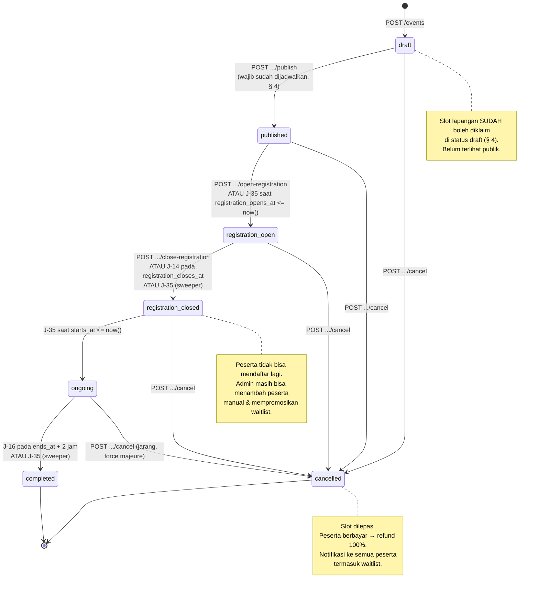
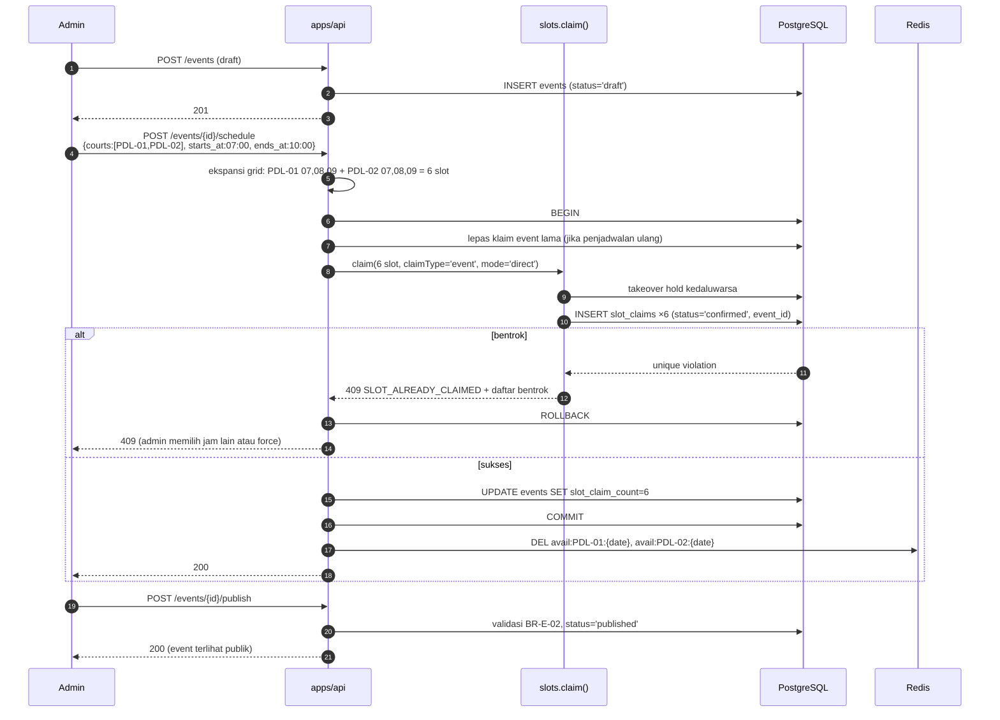
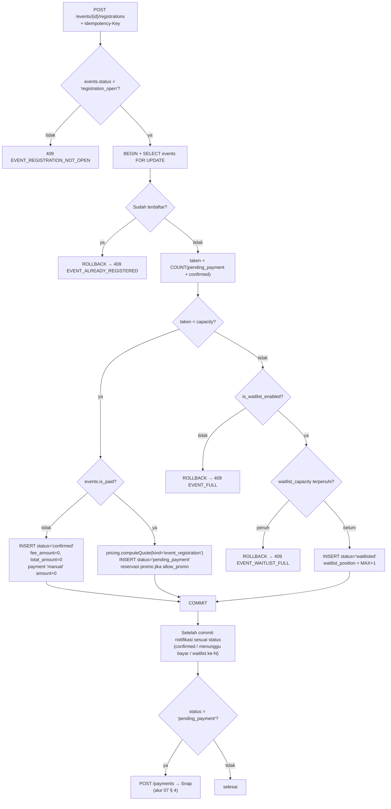

# 10 — MODULE: MANAJEMEN EVENT

> Event **memblokir slot lapangan** lewat mekanisme yang sama dengan booking:
> [03-DATA-MODEL.md § 8 Slot Ownership](03-DATA-MODEL.md#8-slot-ownership-mekanisme-terpadu).
> Event berbayar memakai **pipeline harga yang sama**:
> [07 § 3](07-MODULE-PAYMENT.md#3-pricing-pipeline-satu-satunya-sumber-perhitungan-harga).
> Tidak ada mekanisme slot atau harga khusus event.
>
> Endpoint: [04 § 9.7](04-API-CONTRACT.md#97-event). Izin: [05 § 6.6](05-AUTH.md#66-event).

---

## 1. Tujuan & Ruang Lingkup

Event adalah acara internal Hola yang mengumpulkan orang di lapangan pada waktu tertentu, di
luar penyewaan lapangan biasa dan di luar turnamen berformat bracket.

**Termasuk:** pembuatan & publikasi event, penjadwalan yang mengunci lapangan, pendaftaran
peserta (member & guest), kuota, waitlist berurutan dengan promosi otomatis, event gratis &
berbayar, check-in kehadiran, penyelesaian event, pembatalan event dengan refund, dan pemberian
poin kehadiran.

**Tidak termasuk:** turnamen berbracket (→ [11](11-MODULE-MATCH.md)), penyewaan lapangan biasa
(→ [06](06-MODULE-BOOKING.md)), kalkulasi harga (→ [07](07-MODULE-PAYMENT.md)).

### Kapan memakai Event vs Booking vs Tournament

| Kebutuhan | Modul yang benar |
|---|---|
| Satu orang/kelompok menyewa lapangan untuk bermain sendiri | [Booking](06-MODULE-BOOKING.md) |
| Hola mengumpulkan banyak orang untuk bermain bersama, tanpa bracket & tanpa pemenang | **Event** (`open_play`) |
| Hola mengadakan pelatihan/klinik dengan coach | **Event** (`coaching_clinic`) |
| Acara komunitas, gathering, nonton bareng | **Event** (`community_gathering`) |
| Kompetisi dengan bracket, skor, dan juara | [Tournament](11-MODULE-MATCH.md) |

---

## 2. Jenis Event & Field

### Jenis (`event_type`)

| Nilai | Deskripsi | Karakter tipikal |
|---|---|---|
| `open_play` | Sesi bermain terbuka; peserta datang sendiri-sendiri dan dipasangkan di tempat | Berbayar per orang, kuota = kapasitas lapangan × jumlah lapangan, sering |
| `coaching_clinic` | Pelatihan dengan coach | Berbayar, kuota kecil (6–12), level tertentu |
| `community_gathering` | Acara komunitas non-kompetitif | Sering gratis, kuota besar |
| `other` | Sisanya | — |

### Field kunci

| Field | Arti | Aturan |
|---|---|---|
| `slug` | URL publik, UNIQUE | Dibuat dari `title` + suffiks jika bentrok. Tidak berubah setelah `published` |
| `title`, `description` | Konten publik | `description` mendukung markdown sederhana |
| `type` | `event_type` | — |
| `sport_id` | Olahraga | Menentukan leaderboard scope poin |
| `status` | `event_status` | Lihat § 3 |
| `poster_media_id` | Poster | Bucket `hola-media`, `kind='event_poster'` |
| `starts_at`, `ends_at` | Waktu acara | `starts_at < ends_at` (CHECK) |
| `registration_opens_at`, `registration_closes_at` | Jendela pendaftaran | `registration_opens_at < registration_closes_at <= starts_at` (CHECK) |
| `capacity` | Kuota peserta `confirmed` | ≥ 1 |
| `min_participants` | Minimum agar event jalan | Default 0. Jika tidak tercapai saat pendaftaran ditutup, admin diberi peringatan (bukan pembatalan otomatis) |
| `is_waitlist_enabled` | Aktifkan daftar tunggu | Default `true` |
| `waitlist_capacity` | Batas daftar tunggu | Default = `capacity`. `0` = waitlist **mati**; `NULL` = **tak terbatas**. Jangan tukar arti keduanya |
| `is_paid`, `fee_amount` | Berbayar & nominalnya | CHECK: `is_paid = false OR fee_amount > 0` |
| `allow_promo` | Boleh pakai promo | Default `false` untuk event; `true` harus disetel sadar |
| `location_note` | Keterangan lokasi tambahan | Mis. "Kumpul di lobi 06:45" |
| `version` | Optimistic locking | Wajib `If-Match` saat `PATCH` |

---

## 3. Lifecycle Event

### Business rules lifecycle

| # | Aturan | Error |
|---|---|---|
| BR-E-01 | Event dibuat dengan `status='draft'`. Draft **tidak** terlihat publik (`GET /events` untuk customer memfilternya) | — |
| BR-E-02 | Publikasi (`POST /events/{id}/publish`) mensyaratkan: minimal satu `slot_claims` bertipe `event` sudah dibuat (event sudah dijadwalkan), `poster_media_id` terisi, `capacity >= 1`, dan jendela pendaftaran valid | `422 EVENT_SCHEDULE_REQUIRED` / `422 VALIDATION_ERROR` |
| BR-E-03 | `slug` tidak dapat diubah setelah `published`. Alasan: tautan yang sudah disebar tidak boleh mati | `409 CONFLICT` |
| BR-E-04 | `capacity` **dapat dinaikkan** kapan saja; menaikkannya memicu J-15 `commerce.promoteEventWaitlist` | — |
| BR-E-05 | `capacity` **tidak dapat diturunkan** di bawah jumlah peserta `confirmed` saat ini | `409 CONFLICT` |
| BR-E-06 | `is_paid` dan `fee_amount` **tidak dapat diubah** setelah ada `event_registrations` berstatus selain `cancelled`. Mengubah harga di tengah pendaftaran membuat peserta membayar nominal berbeda untuk hal yang sama | `409 EVENT_HAS_REGISTRATIONS` |
| BR-E-07 | `starts_at`/`ends_at` **dapat** diubah selama status ≤ `registration_closed`, tetapi wajib melalui `POST /events/{id}/schedule` (yang mengklaim ulang slot), bukan `PATCH`. Perubahan jadwal mengirim notifikasi ke semua peserta | — |
| BR-E-08 | Transisi otomatis dilakukan J-14 (`registration_open → registration_closed`) dan J-16 (`ongoing → completed`), dengan sweeper J-35 `commerce.sweepEventStates` setiap 10 menit yang menangani ketiga transisi berbasis waktu ([02 § 5.3](02-INFRASTRUCTURE.md#53-ketahanan-job-terhadap-kehilangan-redis)) |
| BR-E-09 | Semua transisi otomatis bersifat **kondisional** (`UPDATE ... WHERE status = <status asal>`) sehingga aman diulang | — |
| BR-E-10 | `min_participants` tidak tercapai saat pendaftaran ditutup → notifikasi peringatan ke admin. **Tidak** membatalkan event otomatis. Alasan: membatalkan acara adalah keputusan bisnis dengan konsekuensi reputasi | — |
| BR-E-11 | Pembatalan event (`POST /events/{id}/cancel`) wajib `reason` dan dalam satu transaksi: `status='cancelled'`, semua `slot_claims` event → `released` (`release_reason='event_cancelled'`), semua `event_registrations` aktif → `cancelled`. Setelah commit: refund 100% untuk peserta berbayar + notifikasi ke seluruh peserta (termasuk waitlist) | `422` jika `reason` kosong |
| BR-E-12 | Refund pembatalan event **selalu 100% tanpa potongan apa pun** (termasuk biaya gateway), berstatus `approved` otomatis, karena pembatalan berasal dari pihak Hola (BR-P-53, BR-P-54) | — |
| BR-E-13 | Event `completed` maupun `cancelled` bersifat terminal. Event yang perlu diulang = event baru | — |
| BR-E-14 | Event tidak pernah dihapus | — |
| BR-E-15 | Perubahan status oleh admin mencatat `audit_logs` dengan `action='event.<transisi>'` | — |

---

## 4. Relasi ke Slot Lapangan

### 4.1 Aturan inti

> Event mengklaim slot melalui **`slots.claim()`** yang sama dengan booking, dengan
> `claim_type='event'` dan `mode='direct'`. Tidak ada tabel `event_courts`, tidak ada kolom
> "blocked" di `courts`, tidak ada pengecekan overlap khusus event.

| # | Aturan |
|---|---|
| BR-E-20 | Slot event diklaim lewat `POST /events/{id}/schedule` dengan body `{ courts: [court_id...], starts_at, ends_at, force? }`. Service mengekspansi rentang `starts_at..ends_at` menjadi daftar slot pada grid masing-masing court |
| BR-E-21 | Klaim event memakai `mode='direct'` → `slot_claims.status='confirmed'` langsung, `hold_expires_at = NULL`. Tidak ada hold, karena tidak ada pembayaran yang perlu ditunggu ([03 § 8.10](03-DATA-MODEL.md#810-tabel-ringkas-siapa-mengklaim-bagaimana)) |
| BR-E-22 | **Event boleh mengklaim slot saat masih `draft`.** Ini disengaja: admin perlu mengamankan lapangan sebelum mengumumkan acara. Slot yang diklaim event draft **tetap** tampak tidak tersedia bagi customer |
| BR-E-23 | `starts_at`/`ends_at` event wajib rata terhadap grid setiap court yang dipilih. Court dengan `slot_duration_minutes` berbeda dapat membuat rentang yang sama tidak rata di salah satunya → `422 SLOT_NOT_ALIGNED` dengan `details` menunjuk court mana |
| BR-E-24 | Klaim event yang bentrok dengan klaim lain → `409 SLOT_ALREADY_CLAIMED` dengan `details` berisi daftar `{ court_id, starts_at, claim_type }` |
| BR-E-25 | `force=true` (hanya `admin`) menimpa klaim bertipe `booking` saja. Bentrok dengan `event`/`match`/`maintenance` **tidak** dapat di-force ([03 § 8.8](03-DATA-MODEL.md#88-force-release-hanya-admin)) |
| BR-E-26 | Penjadwalan ulang (`POST /events/{id}/schedule` untuk event yang sudah punya slot) melepas semua klaim lama dan membuat klaim baru **dalam satu transaksi**. Jika klaim baru gagal, klaim lama tetap utuh |
| BR-E-27 | `events.slot_claim_count` didenormalisasi untuk UI daftar; dihitung ulang setiap penjadwalan |
| BR-E-28 | Slot event **tidak** dijual sebagai slot. Ia hanya memblokir. Yang dijual adalah `event_registrations` |
| BR-E-29 | `capacity` event **tidak** otomatis terkait jumlah slot/court. Admin menentukannya. Sistem memberi **saran** (`suggested_capacity = Σ courts.max_players`) di UI, tetapi tidak memaksakan. Alasan: open play sering memakai sistem rotasi sehingga peserta bisa lebih banyak dari kapasitas lapangan sesaat |

### 4.2 Alur penjadwalan

---

## 5. Kuota & Waitlist

### 5.1 Aturan kuota

| # | Aturan | Error |
|---|---|---|
| BR-E-30 | Kuota dihitung dari peserta berstatus `confirmed` **dan** `pending_payment`. Alasan: peserta yang sedang membayar sudah "memegang" kursi, sama seperti hold slot | — |
| BR-E-31 | Formula: `taken = COUNT(status IN ('pending_payment','confirmed'))`. Kursi tersedia = `capacity − taken` | — |
| BR-E-32 | Pendaftaran hanya diterima saat `events.status = 'registration_open'` | `409 EVENT_REGISTRATION_NOT_OPEN` |
| BR-E-33 | Satu user hanya boleh punya **satu** registrasi aktif per event (UNIQUE partial C-14). Guest dibedakan dengan `guest_phone` | `409 EVENT_ALREADY_REGISTERED` |
| BR-E-34 | Kursi penuh + waitlist aktif & belum penuh → registrasi masuk `waitlisted` (bukan error) | — |
| BR-E-35 | Kursi penuh + waitlist mati (`is_waitlist_enabled=false` atau `waitlist_capacity=0`) → `409 EVENT_FULL` | `409 EVENT_FULL` |
| BR-E-36 | Kursi penuh + waitlist aktif tetapi penuh → `409 EVENT_WAITLIST_FULL` | `409 EVENT_WAITLIST_FULL` |
| BR-E-37 | Pemeriksaan kuota **wajib** dilakukan di dalam transaksi dengan `SELECT ... FROM events WHERE id=? FOR UPDATE`. Ini yang mencegah over-booking kursi saat pendaftaran serentak. **Tidak** memakai pengecekan di aplikasi tanpa lock | — |
| BR-E-38 | Alternatif yang **ditolak**: menambahkan constraint UNIQUE atas nomor kursi. Kursi event tidak bernomor, jadi tidak ada kolom yang bisa di-unique-kan. Row lock pada `events` adalah mekanisme yang benar dan cukup — volume pendaftaran event jauh lebih kecil daripada booking slot | — |

### 5.2 Aturan waitlist

| # | Aturan |
|---|---|
| BR-E-40 | Waitlist **berurutan** (FIFO). `event_registrations.waitlist_position` diisi `MAX(position) + 1` di dalam transaksi ber-lock (BR-E-37), dimulai dari 1 |
| BR-E-41 | UNIQUE partial `(event_id, waitlist_position) WHERE status='waitlisted'` (C-15) menjamin tidak ada dua peserta di posisi sama |
| BR-E-42 | Promosi dari waitlist terjadi otomatis lewat J-15 `commerce.promoteEventWaitlist`, dipicu oleh: (a) registrasi `confirmed`/`pending_payment` dibatalkan, (b) `capacity` dinaikkan, (c) registrasi `pending_payment` kedaluwarsa |
| BR-E-43 | J-15 memproses dalam transaksi ber-lock pada baris `events`: hitung kursi tersedia, ambil `waitlisted` dengan `waitlist_position` terkecil sebanyak kursi tersedia, promosikan |
| BR-E-44 | **Event gratis:** promosi langsung ke `confirmed`. **Event berbayar:** promosi ke `pending_payment` dengan tenggat pembayaran **60 menit** (`app_settings.event_waitlist_payment_window_minutes`), bukan 10 menit seperti slot. Alasan: peserta waitlist tidak sedang menunggu di depan layar — ia perlu waktu membaca notifikasi |
| BR-E-45 | `waitlist_position` peserta yang dipromosikan diset `NULL`. Posisi peserta lain **tidak** dikompaksi (tidak digeser). Urutan tetap benar karena selalu diambil `MIN(position)` |
| BR-E-46 | Peserta yang dipromosikan tetapi tidak membayar dalam tenggat → `cancelled` (`cancellation_reason='waitlist_payment_expired'`), dan J-15 dipicu lagi untuk peserta berikutnya. Peserta itu **tidak** kembali ke waitlist |
| BR-E-47 | Promosi mengirim notifikasi push + email dengan template `event.waitlist_promoted` yang memuat tenggat pembayaran |
| BR-E-48 | Peserta dapat keluar dari waitlist sendiri (`POST /event-registrations/{id}/cancel`) → `cancelled` |
| BR-E-49 | Admin dapat mempromosikan peserta tertentu di luar urutan (`POST /event-registrations/{id}/promote`) — mencatat `audit_logs` karena melewati FIFO |
| BR-E-50 | Peserta tier `platinum` mendapat **prioritas waitlist** ([07 § 3.3 P6](07-MODULE-PAYMENT.md#33-detail-per-step)): saat J-15 mengurutkan kandidat, urutannya `tier_priority DESC, waitlist_position ASC`. `tier_priority` = 1 untuk platinum, 0 untuk lainnya. Ini satu-satunya benefit tier yang mempengaruhi logika bisnis di v1 |
| BR-E-51 | Waitlist **tidak** ada untuk slot lapangan biasa — hanya untuk event ([06 § 12](06-MODULE-BOOKING.md#12-out-of-scope)) |

### 5.3 Alur pendaftaran & waitlist

---

## 6. Event Berbayar & Pipeline Payment

### Aturan

| # | Aturan |
|---|---|
| BR-E-60 | Event berbayar memakai **pipeline harga yang sama** dengan booking, cabang `kind='event_registration'` ([07 § 3.3 P1](07-MODULE-PAYMENT.md#33-detail-per-step)). Satu baris `type='fee'`, `unit_price_amount = events.fee_amount` |
| BR-E-61 | Event **tidak** memakai `price_rules`. Slot yang diblokir event bukan barang yang dijual |
| BR-E-62 | Promo hanya berlaku jika `events.allow_promo = true` dan promo ber-`applies_to ∈ {event, all}`. Default `allow_promo = false` — promo untuk event harus keputusan sadar |
| BR-E-63 | Payment memakai `payments.event_registration_id`. Alur pembayaran, webhook, idempotency, dan rekonsiliasi **identik** dengan booking ([07 § 4](07-MODULE-PAYMENT.md#4-flow-pembayaran-end-to-end)) |
| BR-E-64 | Tenggat pembayaran registrasi biasa = `PAYMENT_EXPIRY_MINUTES` (15 menit). Tenggat untuk promosi waitlist = 60 menit (BR-E-44). Nilai tenggat disimpan di `event_registrations.payment_due_at` |
| BR-E-65 | Registrasi `pending_payment` yang kedaluwarsa → `cancelled` oleh J-35 (`payment_due_at < now()`), memicu J-15 untuk waitlist berikutnya |
| BR-E-66 | Event gratis (`is_paid=false`) tetap membuat baris `payments` dengan `amount=0`, `provider='manual'`, `status='paid'` (BR-P-18) agar jejak audit & jurnal seragam. Pendapatan Rp 0 tidak dijurnal, tetapi registrasi tetap terlacak |
| BR-E-67 | Pendapatan event dijurnal ke `4-1300 Pendapatan Event` ([14 § 5](14-MODULE-FINANCE.md#5-sumber-transaksi-otomatis)) |
| BR-E-68 | Peserta membatalkan sendiri event berbayar: kebijakan refund event **sama dengan booking** (D-01), dihitung terhadap `events.starts_at`. Ini disengaja agar hanya ada satu kebijakan refund untuk dipahami customer & staff |
| BR-E-69 | Pembatalan oleh **Hola** (event dibatalkan) → refund 100% tanpa potongan (BR-E-12) |

---

## 7. Kehadiran & Poin

| # | Aturan |
|---|---|
| BR-E-70 | Check-in peserta dilakukan `staff`/`admin` lewat `POST /event-registrations/{id}/check-in` → `status='attended'`, `attended_at = now()` |
| BR-E-71 | Check-in diizinkan dari 60 menit sebelum `events.starts_at` sampai `events.ends_at + 2 jam` |
| BR-E-72 | J-16 `commerce.finalizeEvent` (2 jam setelah `ends_at`) mengubah peserta `confirmed` yang belum check-in menjadi `no_show`, lalu event → `completed` |
| BR-E-73 | **Poin hanya diberikan untuk peserta `attended`**, bukan `confirmed`. Ini pilar anti-abuse: mendaftar tanpa datang tidak menghasilkan poin ([12 § 8](12-MODULE-GAMIFICATION.md#8-anti-abuse)) |
| BR-E-74 | Poin diberikan lewat outbox: `INSERT point_events` dengan `rule_code='EVENT_ATTENDED'`, `source_type='event'`, `source_id = event_registrations.id`. Idempoten lewat UNIQUE `(user_id, rule_code, source_type, source_id)` |
| BR-E-75 | `source_id` memakai **id registrasi**, bukan id event. Alasan: satu user satu registrasi per event, dan ini membuat kunci idempotency alami tanpa perlu kolom tambahan |
| BR-E-76 | Guest (tanpa `user_id`) tidak mendapat poin. Tidak error — hanya tidak ada `point_events` |
| BR-E-77 | Peserta `attended` juga otomatis mendapat baris `activities` (`type` sesuai `event_type`, `verification_source='checkin'`, `is_verified=true`) sehingga event ikut menghitung statistik aktivitas mobile |
| BR-E-78 | Membatalkan check-in (koreksi staff) hanya `admin`, mencatat `audit_logs`, dan memicu J-20 `gamification.reversePoints` |

---

## 8. Integrasi ke Modul Lain

| Modul | Arah | Kontrak |
|---|---|---|
| [Slot Ownership](03-DATA-MODEL.md#8-slot-ownership-mekanisme-terpadu) | Event → Slot | `slots.claim({ claimType:'event', mode:'direct' })` dan `slots.release()`. **Tidak** menyentuh `slot_claims` langsung |
| [Booking](06-MODULE-BOOKING.md) | Event ↔ Booking | Tidak ada kode integrasi. Slot event otomatis tampak tidak tersedia di `GET /courts/{id}/availability` karena keduanya membaca `slot_claims` yang sama |
| [Payment](07-MODULE-PAYMENT.md) | Event → Payment | `payments.event_registration_id`; pipeline harga `kind='event_registration'` |
| [Promo](08-MODULE-PROMO.md) | Event → Promo | Hanya jika `allow_promo=true`; promo `applies_to ∈ {event, all}` |
| [Gamification](12-MODULE-GAMIFICATION.md) | Event → Points | `point_events` dengan `rule_code='EVENT_ATTENDED'` saat `attended` |
| [Finance](14-MODULE-FINANCE.md) | Event → Finance | `finance_events` `source_type='event_registration'`, `kind ∈ {revenue, discount, refund}` |
| [Mobile](15-MOBILE.md) | Event → Mobile | Daftar event, detail, pendaftaran, dan `activities` otomatis dari kehadiran |
| [Notifikasi](02-INFRASTRUCTURE.md#7-notifikasi) | Event → Notif | Template: `event.registered`, `event.payment_pending`, `event.waitlist_added`, `event.waitlist_promoted`, `event.reminder`, `event.rescheduled`, `event.cancelled` |
| [Tournament](11-MODULE-MATCH.md) | tidak ada | Event dan turnamen **terpisah**. Turnamen tidak dibangun di atas event |

---

## 9. Edge Cases

| # | Kondisi | Perilaku yang diharapkan |
|---|---|---|
| E-1 | 20 orang mendaftar serentak untuk event berkapasitas 10 | `SELECT events FOR UPDATE` (BR-E-37) menyerialkan mereka. 10 pertama `confirmed`/`pending_payment`, sisanya `waitlisted` dengan posisi 1..10 (atau `409 EVENT_FULL` jika waitlist mati). Tidak pernah 11 peserta confirmed |
| E-2 | Peserta ke-11 mendaftar tepat saat peserta ke-3 membatalkan | Urutan diserialkan oleh row lock. Salah satu terjadi lebih dulu; hasil akhirnya selalu konsisten dengan `capacity` |
| E-3 | Peserta `pending_payment` tidak membayar | J-35 menandai `cancelled` setelah `payment_due_at`. J-15 mempromosikan waitlist berikutnya. Kursi tidak hangus |
| E-4 | Waitlist dipromosikan tetapi peserta tidak membayar dalam 60 menit | `cancelled` dengan `cancellation_reason='waitlist_payment_expired'`; J-15 lanjut ke peserta berikutnya (BR-E-46). Peserta itu tidak kembali ke waitlist |
| E-5 | Semua peserta waitlist gagal membayar | Kursi tetap kosong. Admin dapat menambah peserta manual atau membiarkan |
| E-6 | Admin menaikkan `capacity` dari 10 ke 16 | J-15 mempromosikan 6 peserta waitlist teratas (dengan prioritas tier, BR-E-50). Notifikasi terkirim ke masing-masing |
| E-7 | Admin mencoba menurunkan `capacity` di bawah jumlah `confirmed` | `409 CONFLICT`. Admin harus membatalkan peserta secara eksplisit lebih dulu |
| E-8 | Event dijadwalkan menabrak booking customer berbayar | `409 SLOT_ALREADY_CLAIMED` dengan daftar bentrok. Admin memilih jam lain, atau `force=true` yang membatalkan booking + refund 100% + notifikasi ([03 § 8.8](03-DATA-MODEL.md#88-force-release-hanya-admin)) |
| E-9 | Event dijadwalkan menabrak jadwal pertandingan turnamen | `409 SLOT_ALREADY_CLAIMED`. **Tidak ada** force antar-klaim internal (BR-E-25). Admin memindahkan salah satunya manual |
| E-10 | Event `draft` mengunci lapangan selama berbulan-bulan lalu dilupakan | Slot tetap terblokir. Mitigasi: J-35 mengirim alert untuk event `draft` yang punya `slot_claims` dengan `starts_at` sudah lewat, dan untuk event `draft` berumur > 60 hari |
| E-11 | Event dibatalkan 1 jam sebelum mulai | Slot dilepas (bisa dijual lagi meski peluangnya kecil), semua peserta `cancelled`, refund 100% berstatus `approved` otomatis, notifikasi push + email segera ke semua peserta termasuk waitlist |
| E-12 | Event dijadwalkan ulang ke tanggal lain | Klaim lama dilepas, klaim baru dibuat dalam satu transaksi (BR-E-26). Semua peserta diberi notifikasi `event.rescheduled`. Peserta yang tidak bisa hadir membatalkan sendiri; refund dihitung terhadap `starts_at` **baru** — dan karena perubahan jadwal berasal dari Hola, refundnya **100%** tanpa potongan (kasus khusus, `policy_applied='hola_fault_100pct'`) |
| E-13 | Peserta mendaftar dua kali dengan `Idempotency-Key` sama | Response tersimpan diputar ulang; satu registrasi |
| E-14 | Peserta mendaftar dua kali dengan `Idempotency-Key` berbeda | UNIQUE partial C-14 menolak yang kedua → `409 EVENT_ALREADY_REGISTERED` |
| E-15 | Peserta membatalkan lalu mendaftar lagi | Diizinkan: registrasi lama `cancelled` (keluar dari unique partial), registrasi baru dibuat. Jika kursi sudah penuh, ia masuk waitlist di posisi belakang |
| E-16 | Guest mendaftar dengan nomor HP yang sama dua kali | UNIQUE partial hanya berlaku untuk `user_id`. Untuk guest, service memeriksa `guest_phone` yang sama pada event yang sama dan menolak `409 EVENT_ALREADY_REGISTERED` (validasi aplikasi, bukan constraint — karena nomor HP bisa dibagi dalam satu keluarga, admin dapat menimpanya) |
| E-17 | Event gratis dengan kuota 50, hanya 5 yang datang | Event `completed`. 45 peserta → `no_show`. Tidak ada penalti di v1; tercatat di CRM |
| E-18 | Coach berhalangan sehari sebelum coaching clinic | Admin membatalkan event (refund 100%) atau menjadwalkan ulang (E-12). Tidak ada entitas "coach" di v1 — nama coach ditulis di `description` |
| E-19 | Peserta datang tetapi staff lupa check-in | Poin tidak diberikan. Admin dapat mengubah status ke `attended` sampai 7 hari setelah event (`PATCH` khusus admin) yang memicu pemberian poin. Setelah 7 hari, penyesuaian manual poin (`POST /admin/points/adjust`) |
| E-20 | Redis mati saat pendaftaran serentak | Tidak berpengaruh. Kuota dijaga row lock PostgreSQL, bukan Redis. Hanya rate limit yang fail-open |
| E-21 | Event `ongoing` tetapi worker mati sehingga tidak pernah `completed` | J-35 (sweeper 10 menit) menyelesaikannya begitu worker hidup. Poin kehadiran tertunda, tidak hilang |
| E-22 | Dua event dijadwalkan pada court yang sama, jam berbeda, hari sama | Sah. Keduanya punya `slot_claims` masing-masing yang tidak bertabrakan |
| E-23 | Event memakai 4 court, salah satunya rusak mendadak | Admin menjadwalkan ulang event dengan 3 court (BR-E-26) lalu membuat `court_maintenances` untuk court yang rusak. `capacity` mungkin perlu diturunkan — jika di bawah jumlah `confirmed`, admin harus membatalkan sebagian peserta secara eksplisit dengan refund 100% |
| E-24 | Peserta membayar setelah `payment_due_at` lewat | Sama seperti booking ([06 § 11 E-6](06-MODULE-BOOKING.md#11-edge-cases)): payment tetap `paid`; sistem mencoba memulihkan registrasi. Jika kursi masih ada → `confirmed`. Jika sudah diisi waitlist → refund 100% otomatis + notifikasi |

---

## 10. Out of Scope

- **Turnamen berbracket** — modul terpisah ([11](11-MODULE-MATCH.md)).
- **Entitas coach/instruktur** dengan profil, jadwal, dan honor. Nama coach hanya teks di
  `description`.
- **Tiket bernomor / kursi tertentu.** Kuota event tanpa nomor kursi.
- **Tiket QR untuk check-in mandiri.** Check-in dilakukan staff.
- **Event berulang (recurring)** — mis. open play setiap Sabtu otomatis. Admin membuat satu per
  satu. Kandidat v2 dengan prioritas tinggi.
- **Pendaftaran tim/grup dalam satu transaksi** (satu orang mendaftarkan 4 orang sekaligus).
- **Harga tiket bertingkat** (early bird, member vs non-member, on-the-spot). Satu
  `fee_amount` per event; diskon hanya lewat promo.
- **Kapasitas per level** (mis. 6 slot beginner + 6 intermediate dalam satu clinic).
- **Sertifikat / e-certificate kehadiran.**
- **Umpan balik/rating peserta setelah event.**
- **Live scoring atau papan skor untuk open play.**
- **Integrasi kalender (ICS / Google Calendar).**
- **Streaming atau rekaman event.**
- **Pembatalan otomatis** ketika `min_participants` tidak tercapai (BR-E-10).
- **Waitlist untuk slot lapangan biasa** (BR-E-51).
