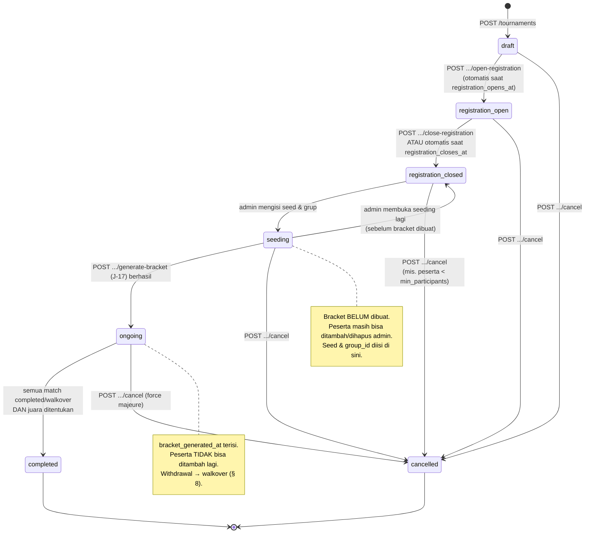
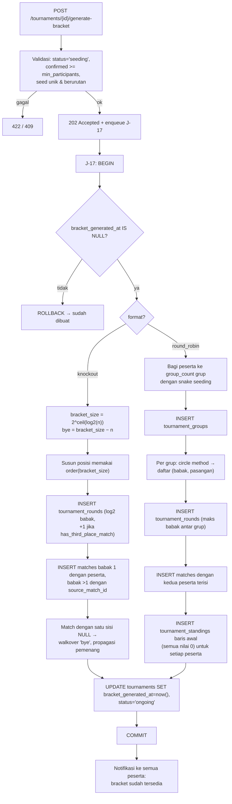
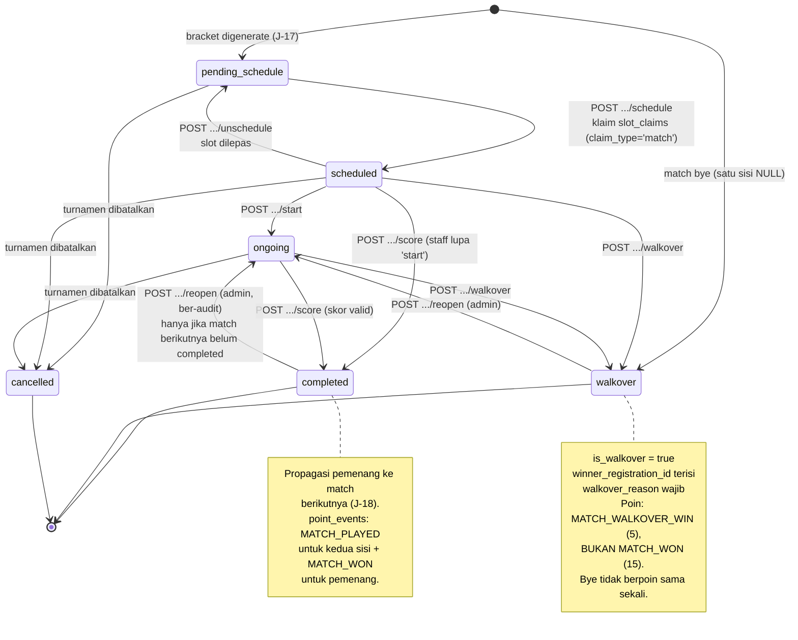

# 11 — MODULE: PERTANDINGAN & TURNAMEN

> Jadwal pertandingan **memblokir slot lapangan** lewat mekanisme yang sama dengan booking dan
> event: [03-DATA-MODEL.md § 8 Slot Ownership](03-DATA-MODEL.md#8-slot-ownership-mekanisme-terpadu).
> Entry fee memakai **pipeline harga yang sama**:
> [07 § 3](07-MODULE-PAYMENT.md#3-pricing-pipeline-satu-satunya-sumber-perhitungan-harga).
>
> **Hanya dua format di v1: `knockout` dan `round_robin`.** Format lain
> ([§ 12](#12-out-of-scope)) tidak dibangun.
>
> Endpoint: [04 § 9.8](04-API-CONTRACT.md#98-tournament--match). Izin: [05 § 6.7](05-AUTH.md#67-tournament--match).

---

## 1. Tujuan & Ruang Lingkup

**Termasuk:** pembuatan turnamen, pendaftaran peserta (single/double/team) dengan entry fee,
seeding, generasi bracket untuk dua format, penjadwalan pertandingan ke lapangan, pencatatan
skor per set, walkover, pengunduran diri, klasemen round-robin, penentuan juara, dan pemberian
poin ke leaderboard.

**Tidak termasuk:** event non-kompetitif (→ [10](10-MODULE-EVENT.md)), penyewaan lapangan biasa
(→ [06](06-MODULE-BOOKING.md)), rating pemain (Elo/UTR — [§ 12](#12-out-of-scope)).

---

## 2. Format Turnamen v1

### 2.1 Knockout (sistem gugur)

| Aspek | Aturan |
|---|---|
| Struktur | Bracket single-elimination. Ukuran bracket = pangkat dua terkecil ≥ jumlah peserta `confirmed` |
| Bye | Peserta unggulan teratas mendapat bye jika jumlah peserta bukan pangkat dua |
| Jumlah babak | `log2(bracket_size)` |
| Jumlah pertandingan | `bracket_size − 1`, ditambah 1 jika `has_third_place_match = true` |
| Perebutan tempat ke-3 | Opsional (`tournaments.has_third_place_match`). Diisi oleh dua yang kalah di semifinal |
| Double elimination | **Tidak didukung v1** |
| Repechage / consolation bracket | **Tidak didukung v1** |

### 2.2 Round Robin (setengah kompetisi)

| Aspek | Aturan |
|---|---|
| Struktur | Setiap peserta bertemu semua peserta lain **satu kali** dalam grupnya |
| Grup | `tournaments.group_count` (default 1). Peserta dibagi dengan **snake seeding** (§ 4.3) |
| Jumlah pertandingan per grup | `n × (n − 1) / 2` dengan `n` = peserta dalam grup |
| Jumlah babak per grup | `n − 1` jika `n` genap; `n` jika `n` ganjil (satu peserta bye tiap babak) |
| Algoritma penjadwalan babak | **Circle method** (§ 4.4) |
| Double round robin (home-away) | **Tidak didukung v1** |
| Babak gugur setelah grup | **Tidak didukung v1.** Turnamen round-robin berakhir dengan klasemen, bukan final. Menggabungkan grup + knockout adalah format ketiga yang di luar scope |

### 2.3 Konfigurasi skor

Disimpan di `tournaments`, dipakai untuk memvalidasi input skor.

| Field | Default (padel) | Arti |
|---|---|---|
| `sets_to_win` | 2 | Jumlah set yang harus dimenangkan (best-of-3) |
| `games_per_set` | 6 | Game untuk menang set |
| `is_tiebreak_enabled` | true | Tiebreak saat 6–6 |
| `deciding_set_type` | `full` | `full` = set penentu dimainkan penuh; `tiebreak10` = set penentu berupa tiebreak sampai 10 poin |
| `win_points` | 3 | Poin klasemen untuk kemenangan (round robin) |
| `draw_points` | 0 | Poin untuk seri. **Padel tidak mengenal seri** — nilai ini hanya relevan jika kelak dipakai olahraga lain |
| `loss_points` | 0 | Poin untuk kekalahan |

### 2.4 Jenis peserta

| `participant_type` | Isi `tournament_registrations` | Contoh |
|---|---|---|
| `single` | `user_id` saja | Turnamen tunggal |
| `double` | `user_id` + `partner_user_id` | Padel/tenis ganda. **Partner wajib punya akun** (untuk pemberian poin) |
| `team` | `user_id` (kapten) + `team_name` | Futsal/basket. Anggota tim selain kapten **tidak** didata di v1 |

Konsekuensi `team`: poin hanya diberikan ke kapten. Ini keterbatasan sadar
([§ 12](#12-out-of-scope) — roster tim).

---

## 3. Lifecycle Turnamen & Pendaftaran

### 3.1 State machine turnamen

### 3.2 Business rules turnamen

| # | Aturan | Error |
|---|---|---|
| BR-M-01 | `format` hanya `knockout` atau `round_robin` | `422 TOURNAMENT_FORMAT_UNSUPPORTED` |
| BR-M-02 | `format`, `participant_type`, dan konfigurasi skor **tidak dapat diubah** setelah ada registrasi berstatus selain `withdrawn` | `409 CONFLICT` |
| BR-M-03 | `entry_fee_amount` **tidak dapat diubah** setelah ada registrasi | `409 CONFLICT` |
| BR-M-04 | Pendaftaran diterima hanya saat `status='registration_open'` | `409 TOURNAMENT_REGISTRATION_NOT_OPEN` |
| BR-M-05 | Kuota: `COUNT(status IN ('pending_payment','confirmed')) < max_participants`. Diperiksa dalam transaksi dengan `SELECT tournaments FOR UPDATE` | `409 TOURNAMENT_FULL` |
| BR-M-06 | **Tidak ada waitlist untuk turnamen.** Penuh berarti penuh. Alasan: bracket harus tetap sampai dimulai, dan promosi peserta setelah seeding akan merusak struktur | `409 TOURNAMENT_FULL` |
| BR-M-07 | Satu user hanya boleh satu registrasi aktif per turnamen (UNIQUE partial `WHERE status <> 'withdrawn'`) | `409 TOURNAMENT_ALREADY_REGISTERED` |
| BR-M-08 | Untuk `participant_type='double'`, `partner_user_id` wajib, tidak boleh sama dengan `user_id` (CHECK), dan **partner tidak boleh sudah terdaftar** di turnamen itu (baik sebagai `user_id` maupun `partner_user_id` registrasi lain) | `409 TOURNAMENT_ALREADY_REGISTERED` |
| BR-M-09 | Untuk `participant_type='team'`, `team_name` wajib dan unik dalam turnamen | `422 VALIDATION_ERROR` |
| BR-M-10 | Pendaftaran berbayar → `status='pending_payment'` + `payment_due_at = now() + PAYMENT_EXPIRY_MINUTES`. Gratis → langsung `confirmed` |
| BR-M-11 | `pending_payment` yang kedaluwarsa → `withdrawn` (`withdrawn_at` terisi), membebaskan kuota. Disapu J-35 pola yang sama dengan event |
| BR-M-12 | `POST /tournaments/{id}/close-registration` mensyaratkan `COUNT(confirmed) >= min_participants` — kecuali admin mengirim `{ "force": true }` yang mencatat `audit_logs` | `422 TOURNAMENT_MIN_PARTICIPANTS_NOT_MET` |
| BR-M-13 | `min_participants` minimum yang sah: **knockout ≥ 2**, **round_robin ≥ 3**. Divalidasi saat membuat turnamen | `422 VALIDATION_ERROR` |
| BR-M-14 | Pembatalan turnamen: semua `matches` → `cancelled`, semua `slot_claims` match → `released`, semua registrasi aktif → `withdrawn`, entry fee → refund **100% tanpa potongan** (pembatalan dari pihak Hola) | — |
| BR-M-15 | Turnamen `completed` saat **semua** match berstatus `completed`/`walkover`/`cancelled` **dan** juara dapat ditentukan (knockout: pemenang final; round robin: peringkat 1 klasemen tanpa seri di puncak). Ditetapkan otomatis oleh J-18 setelah match terakhir | — |
| BR-M-16 | Turnamen & match tidak pernah dihapus | — |

### 3.3 Entry fee

| # | Aturan |
|---|---|
| BR-M-20 | Entry fee memakai pipeline harga cabang `kind='tournament_registration'` ([07 § 3.3 P1](07-MODULE-PAYMENT.md#33-detail-per-step)). Satu baris `type='fee'` senilai `tournaments.entry_fee_amount` |
| BR-M-21 | Untuk `double`/`team`, entry fee dibayar **satu kali per registrasi** (bukan per orang). `payer_user_id` = pendaftar |
| BR-M-22 | Promo berlaku jika promo ber-`applies_to ∈ {tournament, all}`. Tidak ada flag `allow_promo` di level turnamen (berbeda dari event) — kontrolnya di sisi promo |
| BR-M-23 | Pendapatan entry fee dijurnal ke `4-1400 Pendapatan Turnamen` |
| BR-M-24 | **Aturan refund entry fee (rujukan utama).** Pengunduran diri sukarela **sebelum** bracket dibuat: refund mengikuti kebijakan D-01, dihitung terhadap `tournaments.starts_date`. **Setelah** bracket dibuat: **tanpa refund** — slot lapangan dan jadwal sudah dialokasikan. Diskualifikasi: tanpa refund. Turnamen dibatalkan Hola: refund 100% tanpa potongan |

---

## 4. Bracket Generation

### 4.1 Aturan umum

| # | Aturan |
|---|---|
| BR-M-30 | Bracket digenerate oleh J-17 `commerce.generateBracket`, dipicu `POST /tournaments/{id}/generate-bracket` (response `202`) |
| BR-M-31 | **Sekali saja.** Diperiksa `tournaments.bracket_generated_at IS NULL` di dalam transaksi. Percobaan kedua → `409 TOURNAMENT_BRACKET_ALREADY_GENERATED` |
| BR-M-32 | Prasyarat: `status='seeding'`, `COUNT(confirmed) >= min_participants`, dan setiap peserta `confirmed` punya `seed` yang unik dan berurutan 1..n |
| BR-M-33 | Seluruh generasi terjadi dalam **satu transaksi**: `tournament_rounds`, `tournament_groups` (round robin), `matches`, lalu `tournaments.bracket_generated_at = now()` dan `status='ongoing'`. Kegagalan = rollback total, tidak ada bracket setengah jadi |
| BR-M-34 | J-17 memakai `attempts: 1` (tanpa retry otomatis). Kegagalan ditampilkan ke admin untuk diperbaiki lalu di-retry manual. Alasan: retry otomatis atas operasi yang menghasilkan struktur besar berisiko membingungkan; lebih baik admin melihat penyebabnya |
| BR-M-35 | Generasi bersifat **deterministik**: seed yang sama menghasilkan bracket yang sama. Tidak ada `Math.random()`. Peserta tanpa seed eksplisit diberi seed berdasarkan `confirmed_at` ASC |
| BR-M-36 | Match dibuat berstatus `pending_schedule` (belum punya court & waktu). Penjadwalan terpisah (§ 5) |
| BR-M-37 | `matches.match_number` unik per turnamen (C-17), diberikan berurutan mulai 1, diurutkan `round_number` lalu `bracket_position` |

### 4.2 Knockout: seeding & bye

Ukuran bracket = pangkat dua terkecil ≥ n. Jumlah bye = `bracket_size − n`.

**Penempatan seed** memakai urutan bracket standar (standard seeding order) sehingga unggulan
teratas terpisah sejauh mungkin:

| `bracket_size` | Urutan posisi (seed di slot 1..size) |
|---|---|
| 2 | 1, 2 |
| 4 | 1, 4, 3, 2 |
| 8 | 1, 8, 5, 4, 3, 6, 7, 2 |
| 16 | 1, 16, 9, 8, 5, 12, 13, 4, 3, 14, 11, 6, 7, 10, 15, 2 |

Aturan pembentukan urutan untuk ukuran berapa pun (rekursif, tanpa tabel keras):
`order(2) = [1,2]`; `order(2k) = interleave(order(k), 2k+1 − reverse(order(k)))` —
untuk setiap nilai `v` di `order(k)`, sisipkan `v` lalu `2k + 1 − v`.

Contoh `order(8)` dari `order(4) = [1,4,3,2]`: `1, 8, 4, 5, 3, 6, 2, 7`.

> **Catatan penting:** ada dua konvensi urutan bracket yang sama-sama sah dan menghasilkan
> pasangan babak pertama yang identik (1v8, 4v5, 3v6, 2v7) tetapi urutan posisi berbeda.
> **v1 memakai formula rekursif di atas sebagai definisi tunggal**, dan test menegaskan
> hasilnya. Jangan mencampur dengan tabel dari sumber lain.

**Bye:** slot yang nomor seed-nya > n diisi `NULL`. Match dengan satu sisi `NULL` langsung
`status='walkover'`, `is_walkover=true`, `walkover_reason='bye'`, `winner_registration_id` =
peserta yang ada, dan pemenang langsung dipropagasi ke babak berikutnya. Match bye
**tidak** dijadwalkan ke lapangan dan **tidak** menghasilkan poin `MATCH_WON`.

**Propagasi pemenang:** setiap match babak > 1 punya `home_source_match_id` dan
`away_source_match_id`. Saat sebuah match `completed`/`walkover`, J-18 mengisi
`home_registration_id`/`away_registration_id` match tujuan sesuai kolom sumbernya.

`loser_to_match_id` dipakai **hanya** untuk mengarahkan dua yang kalah di semifinal ke match
perebutan tempat ke-3 (jika `has_third_place_match = true`).

### 4.3 Round robin: pembagian grup (snake seeding)

Dengan `group_count = g` dan peserta terurut seed 1..n, pembagian memakai pola ular:

| Seed | Grup (g = 3) |
|---|---|
| 1, 2, 3 | A, B, C |
| 4, 5, 6 | C, B, A |
| 7, 8, 9 | A, B, C |
| 10, 11, 12 | C, B, A |

Tujuan: kekuatan grup seimbang. Aturan: `g` harus membagi `n` dengan sisa ≤ `g − 1`; grup
boleh berbeda ukuran maksimal 1 peserta. `g > n / 3` ditolak `422` (grup terlalu kecil untuk
round robin bermakna).

### 4.4 Round robin: penjadwalan babak (circle method)

Untuk grup berisi `n` peserta:
- Jika `n` ganjil, tambahkan peserta bayangan `BYE` sehingga `n' = n + 1`.
- Peserta ditempatkan pada dua baris; peserta pertama **tetap**, sisanya dirotasi satu posisi
  setiap babak.
- Jumlah babak = `n' − 1`. Pertandingan per babak = `n' / 2`.
- Pasangan yang melibatkan `BYE` **tidak** dibuat sebagai match.

Contoh `n = 5` (`n' = 6`, 5 babak, tiap babak 2 match nyata + 1 bye):

| Babak | Pertandingan |
|---|---|
| 1 | 1–5, 2–4 (3 bye) |
| 2 | 1–4, 5–3 (2 bye) |
| 3 | 1–3, 4–2 (5 bye) |
| 4 | 1–2, 3–5 (4 bye) |
| 5 | 1–bye → tidak dibuat; 2–5, 3–4 |

`tournament_rounds` untuk round robin diberi `stage='group'` dan `name = "Babak N"`.
Untuk knockout, `stage='knockout'` dan `name` mengikuti konvensi:

| Peserta di babak | `name` |
|---|---|
| 2 | `Final` |
| 4 | `Semifinal` |
| 8 | `Perempat Final` |
| 16 | `16 Besar` |
| 32 | `32 Besar` |
| > 32 | `Babak {round_number}` |
| perebutan ke-3 | `Perebutan Tempat 3` (round_number = round final) |

### 4.5 Diagram alur generasi

---

## 5. Penjadwalan Match & Slot Lapangan

### Aturan

| # | Aturan |
|---|---|
| BR-M-40 | Match dijadwalkan lewat `POST /matches/{id}/schedule` dengan `{ court_id, starts_at, force? }`. Service memanggil `slots.claim({ claimType:'match', mode:'direct' })` — mekanisme yang sama dengan booking & event |
| BR-M-41 | Durasi match = **satu slot** court (`slot_duration_minutes`) secara default. Jika match butuh lebih lama, admin mengirim `slot_count` (1..4) dan seluruh slot berurutan diklaim; `matches.slot_claim_id` menunjuk klaim **pertama**, dan klaim berikutnya juga ber-`match_id` sama |
| BR-M-42 | UNIQUE partial `matches (slot_claim_id) WHERE slot_claim_id IS NOT NULL` (C-18) mencegah satu klaim dipakai dua match |
| BR-M-43 | Match yang pesertanya belum ditentukan (menunggu pemenang babak sebelumnya) **tetap boleh dijadwalkan**. Jadwal babak lanjutan biasanya sudah ditetapkan sebelum peserta diketahui. `matches.status` menjadi `scheduled` meskipun `home_registration_id` masih NULL |
| BR-M-44 | `POST /matches/{id}/unschedule` melepas klaim (`release_reason='match_rescheduled'`) dan mengembalikan status ke `pending_schedule` |
| BR-M-45 | Penjadwalan ulang = `unschedule` + `schedule` dalam satu transaksi. Jika klaim baru gagal, klaim lama tetap utuh |
| BR-M-46 | Bentrok dengan klaim lain → `409 SLOT_ALREADY_CLAIMED`. `force=true` (hanya `admin`) hanya menimpa klaim `booking`; bentrok dengan `event`/`match`/`maintenance` **tidak** dapat di-force |
| BR-M-47 | Match `bye` (walkover otomatis) **tidak** dijadwalkan → `409 MATCH_NOT_SCHEDULABLE` |
| BR-M-48 | Match `completed`/`walkover`/`cancelled` tidak dapat dijadwalkan | `409 MATCH_ALREADY_COMPLETED` |
| BR-M-49 | Penjadwalan mengirim notifikasi ke peserta kedua sisi (jika sudah diketahui) dengan template `match.scheduled` |
| BR-M-50 | Slot match tampak tidak tersedia di `GET /courts/{id}/availability` dengan `unavailable_reason='match'` — otomatis, tanpa kode integrasi |

---

## 6. Input Skor — Siapa yang Berhak

> **Keputusan v1: hanya `staff` dan `admin` yang dapat menginput dan mengubah skor.**
> Peserta **tidak** dapat melaporkan skor sendiri.

### Alasan

1. **Integritas kompetisi.** Skor menentukan poin leaderboard dan juara. Laporan mandiri
   memerlukan mekanisme konfirmasi lawan, sengketa, dan verifikasi — tiga alur tambahan yang
   masing-masing punya edge case sendiri.
2. **Anti-abuse gamification.** Poin `MATCH_WON` bernilai tinggi (15). Kalau peserta bisa
   memasukkan skor, dua orang dapat berkolusi mencatat kemenangan palsu.
3. **Realitas operasional.** Turnamen Hola berlangsung di venue dengan staff hadir. Court
   marshal memang menyaksikan pertandingan.

### Aturan

| # | Aturan | Error |
|---|---|---|
| BR-M-60 | `POST /matches/{id}/score` hanya `staff`/`admin`. Peserta → `403 FORBIDDEN` | `403` |
| BR-M-61 | Skor hanya dapat diinput untuk match `status='ongoing'` atau `status='scheduled'` (jika staff lupa menekan "mulai") | `409` |
| BR-M-62 | Kedua peserta wajib sudah ditentukan | `409 MATCH_PARTICIPANTS_INCOMPLETE` |
| BR-M-63 | Body berisi `sets: [{ set_number, home_games, away_games, home_tiebreak_points?, away_tiebreak_points? }]`. Validasi konsistensi terhadap konfigurasi turnamen (§ 6.1) | `422 MATCH_SCORE_INVALID` |
| BR-M-64 | Pemenang **dihitung sistem** dari set, bukan dikirim client. `winner_registration_id` diisi service. Jika hasil hitungan tidak menghasilkan pemenang (set belum cukup), `422 MATCH_SCORE_INVALID` |
| BR-M-65 | Match `completed` hanya dapat diubah setelah `POST /matches/{id}/reopen` oleh **`admin`** (bukan `staff`), yang wajib `reason` dan mencatat `audit_logs` | `409 MATCH_ALREADY_COMPLETED` |
| BR-M-66 | `reopen` memicu: pembatalan propagasi pemenang ke babak berikutnya (**hanya** jika match berikutnya belum `completed` — jika sudah, reopen ditolak `409 CONFLICT` karena akan merusak bracket), reversal poin (J-20), dan rekomputasi standings (J-18) |
| BR-M-67 | Penyimpanan skor, penentuan pemenang, propagasi ke match berikutnya, dan `INSERT point_events` terjadi dalam **satu transaksi**. Enqueue J-18 setelah commit |
| BR-M-68 | `matches.recorded_by_user_id` wajib terisi (dari token) |
| BR-M-69 | `POST /matches/{id}/start` mengubah `scheduled → ongoing` dan mengisi `started_at`. Opsional secara alur, tetapi berguna untuk papan skor live sederhana |

### 6.1 Validasi skor

Untuk setiap set:

| # | Validasi |
|---|---|
| S-1 | `home_games >= 0`, `away_games >= 0` (CHECK di DB juga) |
| S-2 | Set dianggap selesai jika salah satu mencapai `games_per_set` dengan selisih ≥ 2, **atau** mencapai `games_per_set + 1` (mis. 7–5), **atau** `games_per_set`–`games_per_set` diikuti tiebreak (jika `is_tiebreak_enabled`) |
| S-3 | Jika skor `6–6` (atau `games_per_set` seri), `home_tiebreak_points`/`away_tiebreak_points` **wajib** terisi, salah satunya ≥ 7 dengan selisih ≥ 2 |
| S-4 | `set_number` berurutan mulai 1, tanpa celah (UNIQUE `(match_id, set_number)`) |
| S-5 | Jumlah set tidak boleh melebihi `2 × sets_to_win − 1` |
| S-6 | Pertandingan berhenti begitu satu sisi mencapai `sets_to_win`. Set setelah itu → `422 MATCH_SCORE_INVALID` |
| S-7 | Jika `deciding_set_type='tiebreak10'`, set penentu (set terakhir yang mungkin) divalidasi sebagai tiebreak: pemenang ≥ 10 dengan selisih ≥ 2, dicatat di kolom `home_games`/`away_games` (bukan kolom tiebreak) |
| S-8 | Skor seri di level match **tidak diizinkan** untuk padel/tenis. Jika `draw_points > 0` (olahraga lain), `winner_registration_id` boleh NULL dan match tetap `completed` — tetapi ini **tidak dipakai v1** karena semua turnamen v1 berbasis set |

### 6.2 State machine pertandingan

---

## 7. Standings (Round Robin)

### 7.1 Kolom & perhitungan

Dihitung ulang penuh oleh J-18 `commerce.recomputeStandings` setiap kali sebuah match menjadi
`completed`/`walkover`/`cancelled`.

| Kolom | Perhitungan |
|---|---|
| `played_count` | Jumlah match `completed` + `walkover` yang melibatkan peserta ini |
| `won_count` | Jumlah match yang dimenangkan (termasuk walkover) |
| `lost_count` | `played_count − won_count` |
| `sets_won`, `sets_lost` | Jumlah set. Untuk walkover: pemenang dianggap menang `sets_to_win`–0 |
| `games_won`, `games_lost` | Jumlah game. Untuk walkover: pemenang dianggap `games_per_set × sets_to_win`–0 |
| `points` | `won_count × win_points + draw_count × draw_points + lost_count × loss_points` |
| `rank` | Hasil pengurutan tiebreaker (§ 7.2) |
| `computed_at` | Waktu perhitungan |

### 7.2 Tiebreaker (urutan definitif)

Diterapkan **dalam urutan ini**. Setiap tingkat harus punya test.

| Prioritas | Kriteria |
|---|---|
| 1 | `points` **DESC** |
| 2 | **Head-to-head**: hasil pertandingan langsung antar peserta yang seri. Jika lebih dari dua peserta seri, dihitung mini-klasemen di antara mereka (poin dari pertandingan antar-mereka saja) |
| 3 | Selisih set: `(sets_won − sets_lost)` **DESC** |
| 4 | `sets_won` **DESC** |
| 5 | Selisih game: `(games_won − games_lost)` **DESC** |
| 6 | `games_won` **DESC** |
| 7 | `seed` **ASC** (unggulan lebih tinggi menang) |
| 8 | `tournament_registrations.id` **ASC** (penentu terakhir agar 100% deterministik) |

> **Catatan:** tingkat 7–8 adalah pemutus mekanis, bukan aturan olahraga. Dalam turnamen nyata,
> seri sampai tingkat itu biasanya diselesaikan dengan pertandingan tambahan atau undian.
> Sistem **tetap** memberi peringkat deterministik dan menandai `has_unresolved_tie: true` di
> response standings agar admin tahu perlu keputusan manual. Admin dapat menimpa peringkat
> lewat `PATCH /tournaments/{id}/standings` (hanya `admin`, ber-`audit_logs`) — kolom
> `rank_override` (int, nullable) pada `tournament_standings`.

### 7.3 Aturan standings

| # | Aturan |
|---|---|
| BR-M-70 | J-18 melakukan **rekomputasi penuh** untuk turnamen (atau grup) terdampak, bukan penambahan inkremental. `INSERT ... ON CONFLICT DO UPDATE`. Hasil deterministik → aman diulang |
| BR-M-71 | Baris standings dibuat saat bracket digenerate (semua nilai 0), sehingga klasemen dapat ditampilkan sejak sebelum match pertama |
| BR-M-72 | Standings hanya bermakna untuk `format='round_robin'`. Untuk `knockout`, endpoint `GET /tournaments/{id}/standings` mengembalikan `data: []` dengan `meta.warnings: [STANDINGS_NOT_APPLICABLE]` — bukan `404`, agar UI tidak perlu bercabang |
| BR-M-73 | Match `cancelled` **tidak** dihitung di standings |
| BR-M-74 | Match yang belum dimainkan tidak mempengaruhi `points` |
| BR-M-75 | Juara turnamen round-robin = peserta dengan `rank = 1` (setelah `rank_override` jika ada) pada grup tunggal. Untuk `group_count > 1`, **tidak ada juara tunggal** — hanya juara per grup. Ini konsekuensi tidak adanya babak gugur pasca-grup (§ 2.2) dan wajib dikomunikasikan di UI |

---

## 8. Walkover & Withdrawal

| # | Aturan |
|---|---|
| BR-M-80 | `POST /matches/{id}/walkover` dengan `{ winner_registration_id, reason }`. `reason` wajib → `422 MATCH_WALKOVER_REQUIRES_REASON` |
| BR-M-81 | Nilai `walkover_reason` yang dipakai: `bye` (otomatis), `opponent_absent`, `opponent_withdrew`, `opponent_injured`, `disqualified`, `other` |
| BR-M-82 | Walkover mengisi `is_walkover=true`, `winner_registration_id`, `status='walkover'`, `completed_at`. **Tidak** ada baris `match_sets` |
| BR-M-83 | Walkover dipropagasi ke babak berikutnya sama seperti `completed` |
| BR-M-84 | **Poin walkover berbeda dari kemenangan normal:** pemenang mendapat `MATCH_WALKOVER_WIN` (5 poin), **bukan** `MATCH_WON` (15). Yang kalah **tidak** mendapat `MATCH_PLAYED`. Ini anti-abuse — walkover tidak boleh menjadi cara mudah mengumpulkan poin ([12 § 8](12-MODULE-GAMIFICATION.md#8-anti-abuse)) |
| BR-M-85 | Match `bye` (`walkover_reason='bye'`) **tidak** memberi poin apa pun |
| BR-M-86 | Walkover melepas `slot_claims` match jika sudah dijadwalkan (lapangan bisa dipakai hal lain) |
| BR-M-87 | `POST /tournament-registrations/{id}/withdraw` sebelum bracket dibuat: registrasi → `withdrawn`, kuota bebas, `seed` peserta lain **dirapikan** oleh admin (sistem tidak otomatis mengurutkan ulang seed — admin memutuskan) |
| BR-M-88 | Withdraw **setelah** bracket dibuat: registrasi → `withdrawn`, dan **semua** match mendatang peserta itu (status `pending_schedule`/`scheduled`) otomatis menjadi `walkover` dengan lawan sebagai pemenang, `walkover_reason='opponent_withdrew'`. Match yang sudah `completed` tetap seperti apa adanya |
| BR-M-89 | Untuk round robin, withdraw setelah bracket dibuat berarti sisa pertandingannya menjadi walkover — yang mempengaruhi klasemen. Alternatif (menghapus semua hasilnya) **tidak** dipakai v1 karena akan membatalkan pertandingan yang sudah benar-benar dimainkan |
| BR-M-90 | Refund atas withdraw/diskualifikasi mengikuti **BR-M-24** (§ 3.3) sebagai rujukan tunggal. Jangan menuliskan aturan refund kedua di modul ini |
| BR-M-91 | Diskualifikasi (`status='disqualified'`) hanya `admin`, wajib `reason`, efeknya sama dengan withdraw setelah bracket (match mendatang → walkover), tanpa refund, dan mencatat `audit_logs` |

---

## 9. Integrasi Poin ke Leaderboard

Aturan poin lengkap: [12 § 3](12-MODULE-GAMIFICATION.md#3-tabel-aturan-poin).

| Kejadian | `rule_code` | Poin | `source_type` | `source_id` | Penerima |
|---|---|---|---|---|---|
| Match `completed` | `MATCH_PLAYED` | +5 | `match` | `matches.id` | **kedua** peserta |
| Match `completed` | `MATCH_WON` | +15 | `match` | `matches.id` | pemenang |
| Match `walkover` (bukan bye) | `MATCH_WALKOVER_WIN` | +5 | `match` | `matches.id` | pemenang saja |
| Registrasi `confirmed` & turnamen `ongoing` | `TOURNAMENT_PARTICIPATION` | +20 | `tournament` | `tournament_registrations.id` | peserta |
| Turnamen `completed`, juara 1 | `TOURNAMENT_CHAMPION` | +100 | `tournament` | `tournament_registrations.id` | juara |
| Turnamen `completed`, juara 2 | `TOURNAMENT_RUNNER_UP` | +60 | `tournament` | `tournament_registrations.id` | runner-up |
| Turnamen `completed`, semifinalis / peringkat 3–4 | `TOURNAMENT_SEMIFINALIST` | +30 | `tournament` | `tournament_registrations.id` | dua semifinalis |

### Aturan

| # | Aturan |
|---|---|
| BR-M-100 | Poin diberikan lewat **outbox**: `INSERT point_events` dalam transaksi yang sama dengan perubahan match/turnamen. J-19 memindahkannya ke `point_ledger`. Kehilangan Redis tidak menghilangkan poin |
| BR-M-101 | Idempotency: UNIQUE `(user_id, rule_code, source_type, source_id)` di `point_ledger` dan `point_events`. Memproses match yang sama dua kali tidak memberi poin dua kali |
| BR-M-102 | Untuk `participant_type='double'`, poin diberikan ke **`user_id` dan `partner_user_id`** — dua baris `point_ledger` dengan `source_id` sama. Itulah mengapa kunci idempotency menyertakan `user_id` |
| BR-M-103 | Untuk `participant_type='team'`, poin hanya ke `user_id` (kapten). Keterbatasan sadar |
| BR-M-104 | `reopen` match memicu J-20 `gamification.reversePoints` yang menulis baris negatif dengan `rule_code` bersuffiks `:REVERSAL`, lalu poin baru diberikan sesuai hasil koreksi |
| BR-M-105 | Poin `TOURNAMENT_*` diberikan saat turnamen `completed` (bukan saat match final selesai), agar penentuan peringkat 3–4 sudah pasti |
| BR-M-106 | Scope leaderboard: poin match/turnamen masuk `global` **dan** `sport:{sportCode}` sesuai `tournaments.sport_id` |

---

## 10. Integrasi ke Modul Lain

| Modul | Arah | Kontrak |
|---|---|---|
| [Slot Ownership](03-DATA-MODEL.md#8-slot-ownership-mekanisme-terpadu) | Match → Slot | `slots.claim({ claimType:'match', mode:'direct' })`, `slots.release()` |
| [Booking](06-MODULE-BOOKING.md) / [Event](10-MODULE-EVENT.md) | Match ↔ keduanya | Tidak ada kode integrasi. Semua membaca `slot_claims` yang sama |
| [Payment](07-MODULE-PAYMENT.md) | Turnamen → Payment | `payments.tournament_registration_id`; pipeline `kind='tournament_registration'` |
| [Promo](08-MODULE-PROMO.md) | Turnamen → Promo | Promo `applies_to ∈ {tournament, all}` |
| [Gamification](12-MODULE-GAMIFICATION.md) | Match/Turnamen → Points | § 9 |
| [Finance](14-MODULE-FINANCE.md) | Turnamen → Finance | `finance_events` `source_type='tournament_registration'` |
| [Mobile](15-MOBILE.md) | Turnamen → Mobile | Daftar turnamen, bracket read-only, jadwal match sendiri, notifikasi |
| [Notifikasi](02-INFRASTRUCTURE.md#7-notifikasi) | Match → Notif | Template: `tournament.registered`, `tournament.bracket_ready`, `match.scheduled`, `match.rescheduled`, `match.result`, `tournament.completed` |

---

## 11. Edge Cases

| # | Kondisi | Perilaku yang diharapkan |
|---|---|---|
| E-1 | Knockout dengan 5 peserta | `bracket_size = 8`, 3 bye. Seed 1, 2, 3 mendapat bye (posisi bracket yang lawannya kosong). Bye langsung `walkover` dengan `reason='bye'`, tanpa poin, tanpa jadwal lapangan |
| E-2 | Knockout dengan 2 peserta | Satu babak (`Final`), satu match. Sah |
| E-3 | Knockout dengan 1 peserta | Ditolak: `min_participants` minimum knockout = 2 (BR-M-13) |
| E-4 | Round robin dengan 3 peserta | 3 match, 3 babak (n ganjil → tiap babak satu bye). Sah |
| E-5 | Round robin `group_count=2` dengan 5 peserta | Validasi § 4.3 menolaknya: syaratnya `group_count <= n/3`, dan `5/3 = 1,67` sehingga maksimum grup yang sah adalah **1**. Response `422 VALIDATION_ERROR` dengan pesan "peserta tidak cukup untuk 2 grup (maksimal 1)". Admin memakai `group_count=1`. Dengan 6 peserta, `group_count=2` sah (2 ≤ 2) dan menghasilkan dua grup berisi 3 peserta |
| E-6 | Dua peserta serentak mendaftar untuk kursi terakhir | `SELECT tournaments FOR UPDATE` menyerialkan. Satu `confirmed`/`pending_payment`, satu `409 TOURNAMENT_FULL` |
| E-7 | Peserta mendaftarkan partner yang sudah terdaftar sebagai peserta lain | `409 TOURNAMENT_ALREADY_REGISTERED` (BR-M-08) |
| E-8 | Admin men-generate bracket dua kali (double click) | `409 TOURNAMENT_BRACKET_ALREADY_GENERATED`. `bracket_generated_at` diperiksa di dalam transaksi |
| E-9 | J-17 gagal di tengah | Rollback total, tidak ada bracket setengah jadi (BR-M-33). Tanpa retry otomatis; admin melihat error dan mencoba lagi |
| E-10 | Match dijadwalkan tetapi bentrok dengan booking customer | `409 SLOT_ALREADY_CLAIMED` + daftar bentrok. `force=true` (admin) membatalkan booking + refund 100% |
| E-11 | Match dijadwalkan bentrok dengan event | `409` tanpa opsi force (BR-M-46). Admin memindahkan salah satunya manual |
| E-12 | Staff menginput skor 6-4, 6-4 untuk best-of-3 | Valid: home menang 2 set = `sets_to_win`. `winner_registration_id` = home, status `completed` |
| E-13 | Staff menginput skor 6-4, 4-6 (baru 1-1) lalu menyimpan | `422 MATCH_SCORE_INVALID` — belum ada yang mencapai `sets_to_win`. Untuk menyimpan skor sementara, staff memakai `POST .../start` dan papan skor live (**tidak ada di v1** — skor hanya disimpan saat final) |
| E-14 | Staff menginput 3 set padahal salah satu sudah menang 2-0 | `422 MATCH_SCORE_INVALID` (S-6) |
| E-15 | Skor 7-6 tanpa data tiebreak | `422 MATCH_SCORE_INVALID` (S-3) |
| E-16 | Skor 8-6 | `422` — melebihi `games_per_set + 1` (S-2). Padel/tenis tidak memakai advantage set di v1 |
| E-17 | Staff salah input skor, match sudah `completed`, babak berikutnya belum dimainkan | `POST /matches/{id}/reopen` (admin) → koreksi. Propagasi pemenang dibatalkan, poin di-reverse, standings dihitung ulang |
| E-18 | Staff salah input skor, tetapi babak berikutnya **sudah** `completed` | `reopen` **ditolak** `409 CONFLICT` (BR-M-66). Alasan: mengubahnya akan membuat bracket tidak konsisten. Koreksi dilakukan dengan `reopen` berurutan dari match paling akhir, atau (jika tidak praktis) turnamen dibatalkan dan hasilnya dicatat di luar sistem. Ini keterbatasan yang diterima sadar |
| E-19 | Peserta mengundurkan diri di tengah round robin setelah memainkan 2 dari 4 match | 2 match yang sudah dimainkan **tetap** dihitung; 2 match mendatang menjadi walkover untuk lawannya (BR-M-88/89). Klasemen terpengaruh — ini realitas turnamen, bukan bug |
| E-20 | **Kedua** peserta tidak datang | Walkover mensyaratkan satu pemenang, dan v1 tidak menyediakan pembatalan per-match ([§ 12](#12-out-of-scope)). Aturan v1: staff menandai walkover dengan `winner_registration_id` = peserta ber-`seed` lebih tinggi (unggulan), `walkover_reason='other'`, dan catatan penjelasan. Poin yang diberikan tetap `MATCH_WALKOVER_WIN` (5), bukan `MATCH_WON`. Ini keterbatasan yang diterima sadar; pembatalan per-match adalah kandidat v2 |
| E-21 | Turnamen dibatalkan setelah 3 dari 7 match dimainkan | Semua match → `cancelled`, slot dilepas, refund 100% ke semua peserta, poin yang sudah diberikan **tidak** di-reverse (pertandingan benar-benar dimainkan). Ini keputusan sadar |
| E-22 | Klasemen seri sampai tiebreaker tingkat 8 | Peringkat tetap deterministik; `has_unresolved_tie: true` di response. Admin dapat mengisi `rank_override` |
| E-23 | Round robin dengan `group_count=3` selesai | **Tidak ada juara tunggal** (BR-M-75). UI menampilkan juara per grup. Poin `TOURNAMENT_CHAMPION` diberikan ke juara **setiap** grup — dengan `source_id` = registrasi masing-masing sehingga idempotency tetap benar |
| E-24 | Worker mati saat J-18 belum jalan | Standings basi sampai worker hidup. Rekomputasi penuh membuatnya benar tanpa intervensi. Poin tertunda di outbox `point_events`, tidak hilang |
| E-25 | Redis mati saat pendaftaran turnamen | Tidak berpengaruh pada kebenaran (kuota dijaga row lock PostgreSQL) |
| E-26 | Match dijadwalkan pada slot yang court-nya kemudian di-maintenance | Klaim match sudah ada, jadi `POST /court-maintenances` akan `409` dan admin harus memindahkan match lebih dulu |
| E-27 | Peserta `double` yang partnernya menghapus akunnya | Akun tidak dihapus, hanya `status='deleted'` ([03 § 20 DM-1](03-DATA-MODEL.md#20-edge-cases-data-model)). Registrasi tetap sah; poin untuk partner tetap tercatat tetapi tidak tampil di leaderboard karena user non-aktif difilter |
| E-28 | `has_third_place_match=true` tetapi bracket hanya 2 peserta | Tidak ada semifinal → match perebutan tempat 3 **tidak** dibuat. Tidak error |

---

## 12. Out of Scope

- **Format selain knockout & round robin:** double elimination, grup + babak gugur, Swiss
  system, ladder, Americano/Mexicano (format sosial padel yang populer — kandidat v2 dengan
  prioritas tinggi untuk open play).
- **Double round robin** (home-away).
- **Babak gugur setelah fase grup.**
- **Rating pemain** (Elo, UTR, atau sistem peringkat berbasis kekuatan lawan).
- **Roster tim lengkap** untuk `participant_type='team'` (hanya kapten yang didata).
- **Pelaporan skor oleh peserta** + konfirmasi lawan + alur sengketa (§ 6).
- **Papan skor live / skor per game real-time.** Skor hanya disimpan saat pertandingan selesai.
- **Pembatalan satu match** tanpa membatalkan turnamen (E-20).
- **Statistik pertandingan detail** (ace, winner, unforced error, durasi rally).
- **Penjadwalan bracket otomatis** (auto-assign court & waktu untuk semua match sekaligus).
  Penjadwalan dilakukan admin per match.
- **Aturan istirahat minimum antar match** untuk satu peserta (mis. minimal 30 menit).
  Divalidasi manual oleh admin.
- **Hadiah/prize pool** dan pencatatan distribusinya.
- **Sertifikat juara.**
- **Turnamen berkategori usia/level** dalam satu turnamen (buat turnamen terpisah).
- **Streaming atau rekaman pertandingan.**
- **Referee/umpire sebagai entitas** dengan penugasan.
- **Bracket yang dapat diedit manual** (drag & drop peserta ke posisi lain setelah generate).
