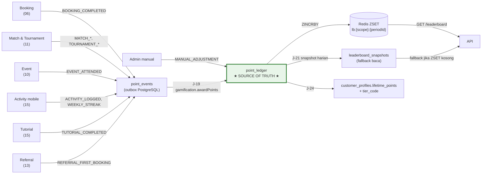
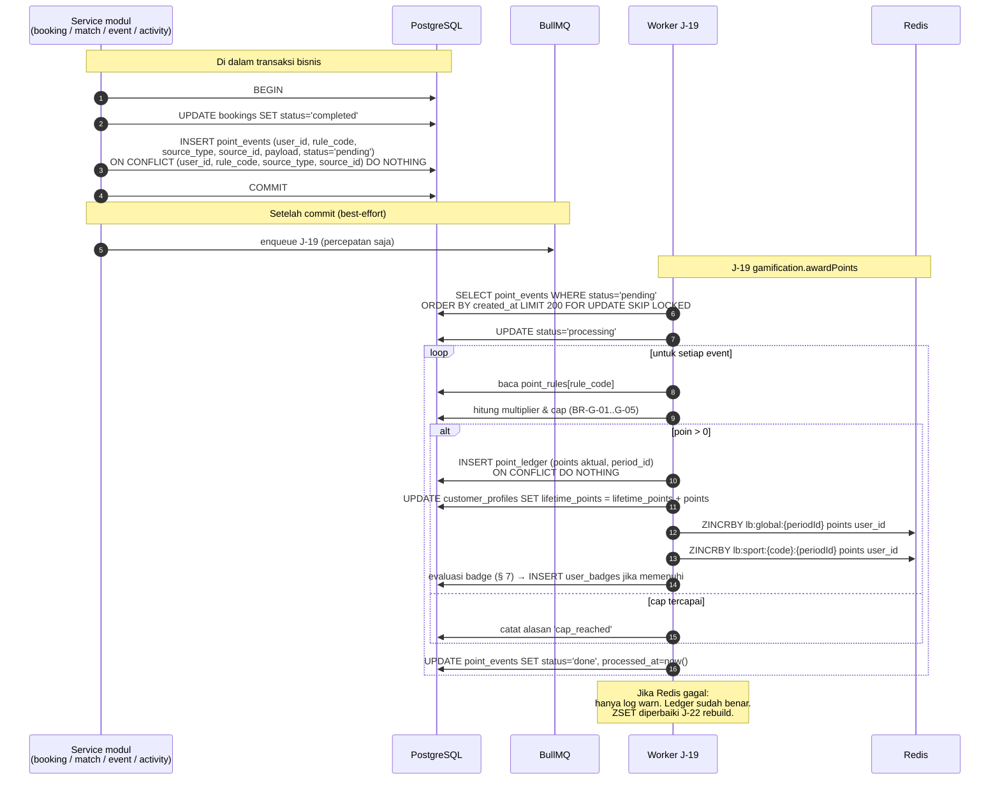
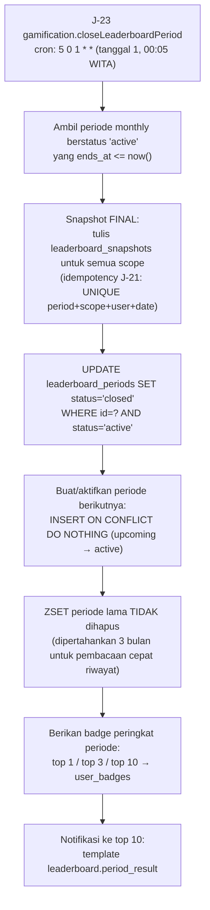
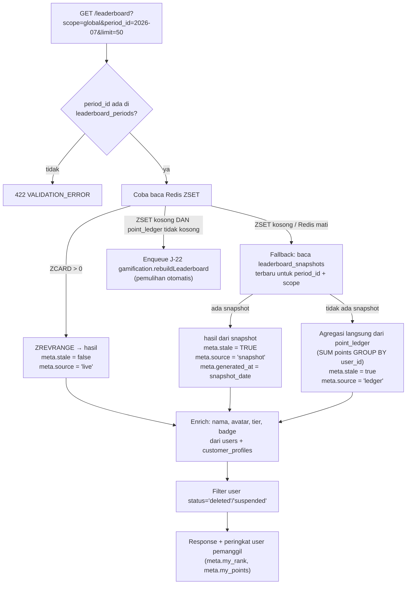

# 12 — MODULE: GAMIFICATION & LEADERBOARD

> **`point_ledger` di PostgreSQL adalah source of truth.** Redis sorted set hanyalah indeks
> peringkat yang dapat dibangun ulang kapan saja. Jika Redis hilang, tidak ada satu poin pun
> yang hilang.
>
> Prasyarat: [03-DATA-MODEL.md § 13](03-DATA-MODEL.md#13-entitas-gamification),
> [02-INFRASTRUCTURE.md § 4](02-INFRASTRUCTURE.md#4-aturan-penggunaan-redis).
> Endpoint: [04 § 9.9](04-API-CONTRACT.md#99-gamification). Izin: [05 § 6.8](05-AUTH.md#68-gamification).

---

## 1. Tujuan & Ruang Lingkup

**Termasuk:** aturan perolehan poin dari booking, pertandingan, event, dan aktivitas mobile;
ledger poin yang append-only dan auditable; leaderboard periodik (bulanan) plus peringkat
sepanjang masa; tier loyalitas; badge; anti-abuse; penyesuaian manual oleh admin.

**Tidak termasuk:** sumber poin itu sendiri (dimiliki modul masing-masing), penukaran poin
menjadi uang/diskon ([§ 9](#9-nilai-tukar-poin-butuh-keputusan-client) — belum diputuskan),
rating kekuatan pemain ([11 § 12](11-MODULE-MATCH.md#12-out-of-scope)).

### Sumber data poin

---

## 2. Prinsip Arsitektur Poin

| # | Prinsip | Konsekuensi |
|---|---|---|
| G-1 | **`point_ledger` append-only.** Tidak ada UPDATE, tidak ada DELETE | Koreksi dilakukan dengan baris bernilai **negatif** (reversal), bukan mengubah baris lama. Riwayat lengkap selalu dapat diaudit |
| G-2 | **Idempotency lewat constraint, bukan logika aplikasi.** UNIQUE `(user_id, rule_code, source_type, source_id)` di `point_ledger` (C-8) | Job yang dieksekusi dua kali tidak memberi poin dua kali. Tidak perlu "cek sudah ada belum" yang rawan race |
| G-3 | **Poin diberikan lewat outbox `point_events`, bukan enqueue langsung** | Poin tidak pernah hilang karena Redis di-flush atau job hilang. Enqueue hanya percepatan; J-19 juga memindai outbox setiap 30 detik |
| G-4 | **Poin diberikan atas kejadian yang sudah pasti terjadi**, bukan atas niat | `BOOKING_COMPLETED` bukan `BOOKING_PAID`; `EVENT_ATTENDED` bukan `EVENT_REGISTERED`; `MATCH_PLAYED` bukan `MATCH_SCHEDULED`. Ini fondasi anti-abuse |
| G-5 | **Redis hanya indeks peringkat** | Semua nilai di Redis dapat direkonstruksi dari `point_ledger`. API punya fallback ke `leaderboard_snapshots` |
| G-6 | **Agregat boleh basi, ledger tidak** | `customer_profiles.lifetime_points` adalah cache yang dihitung ulang harian (J-24). Jika berbeda dari ledger, **ledger yang benar** |
| G-7 | **Poin tidak punya nilai moneter di v1** | Tidak ada liability di neraca. Jika client memutuskan poin dapat ditukar ([§ 9](#9-nilai-tukar-poin-butuh-keputusan-client)), ia **wajib** dicatat sebagai liability di [14](14-MODULE-FINANCE.md) |
| G-8 | **Semua penyesuaian manual wajib beralasan dan tercatat** | `POST /admin/points/adjust` menuntut `reason` non-kosong dan menulis `audit_logs` |

---

## 3. Tabel Aturan Poin

Data ini adalah **seed** tabel `point_rules`. Nilainya dapat diubah admin (lewat migration atau
endpoint admin), tetapi `code` bersifat kanonik dan **tidak boleh** berubah karena dipakai
sebagai bagian kunci idempotency.

| `code` | `source_type` | `points` | `unit` | `max_multiplier` | `cap_per_day` | `cap_per_period` | `is_once_per_user` | Kapan diberikan |
|---|---|---|---|---|---|---|---|---|
| `BOOKING_COMPLETED` | `booking` | **10** | `per_slot` | 4 | 40 | — | ✗ | Booking → `completed` (sudah check-in, jadwal lewat). `source_id` = `bookings.id` |
| `EVENT_ATTENDED` | `event` | **15** | `per_event` | 1 | 30 | — | ✗ | `event_registrations.status='attended'`. `source_id` = `event_registrations.id` |
| `MATCH_PLAYED` | `match` | **5** | `per_event` | 1 | 30 | — | ✗ | Match `completed`, untuk **kedua** peserta. `source_id` = `matches.id` |
| `MATCH_WON` | `match` | **15** | `per_event` | 1 | 60 | — | ✗ | Match `completed`, untuk pemenang. `source_id` = `matches.id` |
| `MATCH_WALKOVER_WIN` | `match` | **5** | `per_event` | 1 | 20 | — | ✗ | Match `walkover` bukan `bye`, untuk pemenang saja. `source_id` = `matches.id` |
| `TOURNAMENT_PARTICIPATION` | `tournament` | **20** | `per_event` | 1 | — | 100 | ✗ | Registrasi `confirmed` & turnamen `ongoing`. `source_id` = `tournament_registrations.id` |
| `TOURNAMENT_SEMIFINALIST` | `tournament` | **30** | `per_event` | 1 | — | — | ✗ | Turnamen `completed`, peringkat 3–4 |
| `TOURNAMENT_RUNNER_UP` | `tournament` | **60** | `per_event` | 1 | — | — | ✗ | Turnamen `completed`, peringkat 2 |
| `TOURNAMENT_CHAMPION` | `tournament` | **100** | `per_event` | 1 | — | — | ✗ | Turnamen `completed`, peringkat 1 (per grup untuk round robin multi-grup) |
| `ACTIVITY_LOGGED` | `activity` | **2** | `per_event` | 1 | **2** | 40 | ✗ | Aktivitas mobile dicatat sendiri (`verification_source IN ('manual','none')`). `cap_per_day = 2` berarti **maksimal satu aktivitas berpoin per hari**. `source_id` = `activities.id` |
| `WEEKLY_STREAK` | `activity` | **10** | `per_event` | 1 | — | 50 | ✗ | ≥ 3 hari dengan aktivitas apa pun dalam satu minggu ISO. `source_id` = uuid deterministik dari `(user_id, iso_year, iso_week)` |
| `TUTORIAL_COMPLETED` | `activity` | **3** | `per_event` | 1 | 6 | 30 | ✗ | `tutorial_progress.completed_at` pertama kali. `source_id` = `tutorials.id` |
| `PROFILE_COMPLETED` | `profile` | **25** | `per_event` | 1 | — | — | **✓** | Profil lengkap: nama, telepon terverifikasi, tanggal lahir, olahraga favorit, avatar. `source_id` = `users.id` |
| `REFERRAL_FIRST_BOOKING` | `referral` | **50** | `per_event` | 1 | — | 250 | ✗ | Orang yang direferensikan menyelesaikan booking pertamanya. Diberikan ke **pemberi referral**. `source_id` = `users.id` orang yang direferensikan |
| `MANUAL_ADJUSTMENT` | `manual` | **0** | `per_event` | — | — | — | ✗ | Penyesuaian admin. `points` aktual dikirim di request (boleh negatif). `source_id` = uuid baru per penyesuaian |

### Aturan perhitungan

| # | Aturan |
|---|---|
| BR-G-01 | Poin aktual = `points × multiplier`, dengan `multiplier` = jumlah unit (untuk `per_slot`: `bookings.slot_count`) dibatasi `max_multiplier`. Untuk `per_event`, `multiplier = 1` |
| BR-G-02 | Contoh: booking 3 slot → `10 × 3 = 30` poin. Booking 6 slot → `10 × min(6, 4) = 40` poin |
| BR-G-03 | `cap_per_day` dihitung atas **jumlah poin** dari rule itu untuk user itu pada tanggal WITA berjalan, bukan jumlah kejadian. Kalau cap terlampaui, poin dipotong sampai batas; jika sudah mencapai batas, baris `point_ledger` **tidak** dibuat dan `point_events` ditandai `done` dengan alasan `cap_reached` |
| BR-G-04 | `cap_per_period` dihitung atas periode `leaderboard_periods` yang aktif (bulanan) |
| BR-G-05 | Pemotongan karena cap **tidak** error. Ia perilaku normal yang dicatat |
| BR-G-06 | `is_once_per_user = true` ditegakkan oleh UNIQUE `(user_id, rule_code, source_type, source_id)` dengan `source_id` yang stabil (mis. `users.id`), sehingga otomatis hanya bisa sekali |
| BR-G-07 | Poin **tidak pernah** diberikan untuk booking `no_show`, `cancelled`, atau `expired` |
| BR-G-08 | Poin **tidak pernah** diberikan untuk registrasi event `confirmed` tanpa `attended` |
| BR-G-09 | Poin `MANUAL_ADJUSTMENT` boleh negatif; semua rule lain wajib positif |
| BR-G-10 | Perubahan nilai `point_rules.points` **tidak** retroaktif. Baris `point_ledger` lama tetap seperti apa adanya |
| BR-G-11 | Semua poin masuk ke scope leaderboard `global` **dan** `sport:{sportCode}` bila sumbernya punya `sport_id` (booking → `courts.sport_id`; match/turnamen → `tournaments.sport_id`; event → `events.sport_id`; aktivitas → `activities.sport_id`). Poin tanpa sport (`PROFILE_COMPLETED`, `REFERRAL_FIRST_BOOKING`, `MANUAL_ADJUSTMENT`) hanya masuk `global` |

---

## 4. Alur Pemberian Poin (Outbox)

### Aturan alur

| # | Aturan |
|---|---|
| BR-G-20 | `INSERT point_events` terjadi **di dalam transaksi bisnis**, bukan setelahnya. Ini yang membuat poin tidak bisa hilang meskipun proses mati setelah commit |
| BR-G-21 | Enqueue BullMQ dilakukan **setelah commit** dan bersifat opsional. J-19 juga berjalan `repeat:30s` memindai outbox |
| BR-G-22 | J-19 memakai `FOR UPDATE SKIP LOCKED` sehingga aman jika kelak ada > 1 worker |
| BR-G-23 | UNIQUE `(user_id, rule_code, source_type, source_id)` ada di **kedua** tabel (`point_events` dan `point_ledger`). Yang pertama mencegah outbox ganda, yang kedua mencegah ledger ganda |
| BR-G-24 | `point_events` yang gagal 5 kali → `status='failed'`, `last_error` terisi, alert Sentry. Admin dapat memicu ulang lewat `POST /admin/jobs/gamification.awardPoints/trigger` setelah memperbaiki penyebabnya |
| BR-G-25 | Kegagalan `ZINCRBY` **tidak** menggagalkan pemberian poin. Hanya `warn` + metrik. Peringkat diperbaiki J-21/J-22 |
| BR-G-26 | Update `lifetime_points` dilakukan inkremental di J-19 **dan** dihitung ulang penuh harian oleh J-24. Yang kedua adalah koreksi, bukan duplikasi |
| BR-G-27 | `point_events` yang sudah `done` dibersihkan setelah 90 hari (bagian J-33 `system.pruneAuditLogs`). `point_ledger` **tidak pernah** dibersihkan |

### Reversal

| # | Aturan |
|---|---|
| BR-G-30 | Reversal dilakukan J-20 `gamification.reversePoints`, dipicu oleh: booking `completed` dibatalkan admin, refund atas booking berpoin, `reopen` match, pembatalan check-in event, penghapusan aktivitas |
| BR-G-31 | Reversal menulis baris `point_ledger` **baru** dengan `points` negatif dan `rule_code = '{RULE}:REVERSAL'`, `source_type` & `source_id` sama dengan baris aslinya |
| BR-G-32 | `rule_code` reversal terdaftar sebagai baris `point_rules` sendiri (mis. `BOOKING_COMPLETED:REVERSAL`) dengan `points = 0` — nilainya selalu dari baris asli, bukan dari rule |
| BR-G-33 | Idempotency reversal: UNIQUE `(user_id, rule_code, source_type, source_id)` dengan `rule_code` bersuffiks `:REVERSAL` → hanya bisa satu kali per baris asli |
| BR-G-34 | Reversal mengurangi `lifetime_points` dan `ZINCRBY` dengan nilai negatif |
| BR-G-35 | Reversal **hanya** membalik poin dalam periode yang sama. Jika periode asli sudah `closed`, reversal tetap dicatat di ledger (untuk kebenaran `lifetime_points`) tetapi **tidak** mengubah ZSET/snapshot periode yang sudah ditutup. Peringkat historis tidak berubah — lihat BR-G-52 |
| BR-G-36 | Nilai `lifetime_points` tidak boleh negatif; di-floor ke 0 saat dihitung ulang J-24 |

---

## 5. Periode & Reset Leaderboard

### 5.1 Definisi periode

| Aspek | Nilai |
|---|---|
| Tipe aktif v1 | **`monthly`** saja. `seasonal` ada di enum untuk masa depan, tidak dipakai |
| `id` periode | String `YYYY-MM` dalam zona WITA, mis. `2026-07` |
| Batas periode | `starts_at` = tanggal 1 pukul 00:00:00 WITA; `ends_at` = tanggal 1 bulan berikutnya 00:00:00 WITA (eksklusif) |
| Peringkat sepanjang masa | **Bukan** periode. Dibaca dari `customer_profiles.lifetime_points`, bukan dari ZSET periode |
| Status | `upcoming` → `active` → `closed` |
| Hanya satu `active` per tipe | UNIQUE partial `(type) WHERE status='active'` |

### 5.2 Penutupan periode

### 5.3 Aturan periode

| # | Aturan |
|---|---|
| BR-G-40 | Poin **tidak dihapus** saat periode berganti. "Reset" berarti leaderboard bulan baru dimulai dari nol karena ia mengagregasi `point_ledger` **yang ber-`period_id` bulan itu** — bukan karena ledger dikosongkan |
| BR-G-41 | `point_ledger.period_id` diisi saat baris dibuat, dari periode `monthly` yang `active` pada saat itu. Baris **tidak** dipindahkan periode meskipun diproses terlambat |
| BR-G-42 | Konsekuensi BR-G-41: `point_events` yang tertunda melewati batas bulan tetap masuk periode **saat kejadiannya**, karena `period_id` ditentukan dari `point_events.created_at`, bukan dari waktu J-19 memprosesnya. Ini penting agar keterlambatan worker tidak memindahkan poin ke bulan berikutnya |
| BR-G-43 | Periode `closed` tidak dapat menerima poin baru → `409 LEADERBOARD_PERIOD_CLOSED` untuk penyesuaian manual yang menargetkan periode lama. Penyesuaian manual selalu masuk periode aktif |
| BR-G-44 | Periode `upcoming` dibuat otomatis 3 bulan ke depan oleh J-23 agar tidak pernah ada celah |
| BR-G-45 | Jika J-23 tidak berjalan (worker mati saat pergantian bulan), periode lama tetap `active` dan poin baru masuk ke sana — **salah bulan**. Mitigasi: J-19 memvalidasi `now() < period.ends_at` sebelum memakai periode aktif; jika sudah lewat, ia membuat/mengaktifkan periode yang benar terlebih dahulu (fungsi `resolvePeriodForDate(date)` yang idempoten). Dengan begitu, kegagalan J-23 tidak menyebabkan poin masuk periode salah |
| BR-G-46 | ZSET periode disimpan **3 bulan terakhir** di Redis. Periode lebih lama dibaca dari `leaderboard_snapshots` |

---

## 6. Arsitektur Leaderboard

### 6.1 Struktur Redis

| Key | Tipe | Isi | TTL |
|---|---|---|---|
| `hola:{env}:lb:global:{periodId}` | ZSET | member = `user_id`, score = poin periode | tanpa TTL (dihapus manual saat > 3 bulan) |
| `hola:{env}:lb:sport:{sportCode}:{periodId}` | ZSET | idem, difilter per olahraga | idem |

Operasi:
- Tambah poin: `ZINCRBY key <points> <user_id>`
- Peringkat top N: `ZREVRANGE key 0 N-1 WITHSCORES`
- Peringkat seorang user: `ZREVRANK key <user_id>` (+1 karena 0-indexed)
- Poin seorang user: `ZSCORE key <user_id>`

### 6.2 Snapshot ke PostgreSQL

| Aspek | Nilai |
|---|---|
| Job | J-21 `gamification.snapshotLeaderboard`, `cron: 10 0 * * *` (00:10 WITA harian) |
| Isi | Top **200** per scope per periode aktif → `leaderboard_snapshots` |
| Idempotency | UNIQUE `(period_id, scope, user_id, snapshot_date)` + upsert |
| Snapshot final | Dibuat J-23 saat periode ditutup, dengan `snapshot_date` = hari terakhir periode |
| Retensi | Snapshot harian dibersihkan setelah 35 hari; **snapshot final periode disimpan permanen** |

### 6.3 Pembacaan `GET /leaderboard`

### 6.4 Aturan leaderboard

| # | Aturan |
|---|---|
| BR-G-50 | **Jika ZSET hilang:** API otomatis jatuh ke `leaderboard_snapshots`, lalu ke agregasi langsung `point_ledger`. Tidak ada skenario di mana leaderboard gagal total selama PostgreSQL hidup |
| BR-G-51 | Deteksi ZSET kosong padahal `point_ledger` untuk periode itu tidak kosong → **otomatis** enqueue J-22 `gamification.rebuildLeaderboard`. Dibatasi satu kali per 5 menit per periode (lock Redis; jika Redis mati, admin memicu manual) |
| BR-G-52 | J-22 membangun ulang ZSET dari nol: `DEL key` lalu `ZADD` batch dari `SELECT user_id, SUM(points) FROM point_ledger WHERE period_id=? GROUP BY user_id`. Deterministik dan idempoten |
| BR-G-53 | Agregasi langsung dari `point_ledger` (fallback terakhir) dibatasi `limit ≤ 100` dan memakai index `idx_point_ledger_period_points`. Ia lebih lambat tetapi benar |
| BR-G-54 | Response **wajib** menyertakan `meta.stale` dan `meta.source` agar UI dapat menampilkan penanda "data mungkin tertunda" |
| BR-G-55 | User berstatus `deleted` atau `suspended` **tidak** ditampilkan di leaderboard, tetapi poinnya tetap ada di ledger. Filter dilakukan setelah pengambilan peringkat, sehingga nomor peringkat bisa "melompat" — diterima, dan UI menampilkan peringkat berurutan hasil filter |
| BR-G-56 | Seri poin: peringkat ditentukan `points DESC`, lalu `point_ledger` terakhir yang lebih **awal** menang (siapa mencapai poin itu lebih dulu), lalu `user_id` ASC. Karena ZSET tidak menyimpan waktu, tie-break waktu **hanya** diterapkan pada jalur snapshot/ledger. Pada jalur ZSET, tie-break memakai urutan leksikografis `user_id` (perilaku Redis). Perbedaan ini **diterima** dan didokumentasikan; ia hanya mempengaruhi urutan di antara pemain berpoin identik |
| BR-G-57 | `GET /leaderboard` tanpa `period_id` memakai periode `monthly` yang `active` |
| BR-G-58 | Scope `alltime` **bukan** ZSET. `GET /leaderboard?scope=global&period_id=alltime` membaca `customer_profiles.lifetime_points` dengan `ORDER BY lifetime_points DESC LIMIT n` |
| BR-G-59 | Leaderboard bersifat **publik** (tanpa autentikasi). Data yang ditampilkan: nama tampilan, avatar, tier, poin, peringkat. **Tidak** menampilkan email, telepon, atau rincian booking |
| BR-G-60 | `meta.my_rank`/`meta.my_points` hanya diisi jika request terautentikasi |

---

## 7. Tier & Badge

### 7.1 Tier (loyalitas berbasis `lifetime_points`)

| `code` | Nama | `min_lifetime_points` | Benefit v1 |
|---|---|---|---|
| `bronze` | Bronze | 0 | — |
| `silver` | Silver | **500** | Badge profil |
| `gold` | Gold | **1500** | Badge + horizon booking **90 hari** (default 60) |
| `platinum` | Platinum | **4000** | Badge + horizon booking **120 hari** + **prioritas waitlist event** ([10 BR-E-50](10-MODULE-EVENT.md#52-aturan-waitlist)) |

| # | Aturan |
|---|---|
| BR-G-70 | Tier dihitung dari `lifetime_points` (poin positif sepanjang masa, setelah reversal), **bukan** dari poin periode |
| BR-G-71 | Tier **tidak turun** kecuali `lifetime_points` benar-benar turun karena reversal. Tidak ada mekanisme "harus mempertahankan poin per tahun" di v1 |
| BR-G-72 | J-24 `gamification.recalculateTiers` (cron 00:30 harian) menghitung ulang `lifetime_points` dari `point_ledger` dan memperbarui `tier_code` bila berbeda. Idempoten |
| BR-G-73 | Kenaikan tier mengirim notifikasi `tier.upgraded` dan memberi badge tier |
| BR-G-74 | **Benefit tier tidak berupa diskon** di v1 ([07 § 3.3 P6](07-MODULE-PAYMENT.md#33-detail-per-step)). `tier_discount_amount` selalu 0 |
| BR-G-75 | Dua benefit tier yang **benar-benar mempengaruhi logika**: horizon booking (dipakai BR-B-06) dan prioritas waitlist (BR-E-50). Keduanya wajib punya test |

### 7.2 Badge

Seed `badges`. `criteria` (jsonb) dievaluasi J-19 setelah poin diberikan, dan oleh J-24 untuk
kriteria berbasis agregat.

| `code` | Nama | Kriteria |
|---|---|---|
| `first_booking` | Langkah Pertama | Booking pertama `completed` |
| `booking_10` | Reguler | 10 booking `completed` |
| `booking_50` | Pelanggan Setia | 50 booking `completed` |
| `booking_100` | Legenda Lapangan | 100 booking `completed` |
| `early_bird` | Ayam Berkokok | 10 booking `completed` dengan slot mulai < 08:00 |
| `night_owl` | Kalong | 10 booking `completed` dengan slot mulai ≥ 21:00 |
| `first_match_win` | Kemenangan Pertama | 1 `MATCH_WON` |
| `match_win_25` | Petarung | 25 `MATCH_WON` |
| `tournament_champion` | Juara | 1 `TOURNAMENT_CHAMPION` |
| `tournament_regular` | Kompetitor | 5 `TOURNAMENT_PARTICIPATION` |
| `event_social` | Sosialita | 10 `EVENT_ATTENDED` |
| `streak_4week` | Konsisten | 4 `WEEKLY_STREAK` berturut-turut |
| `student` | Murid Rajin | 10 `TUTORIAL_COMPLETED` |
| `tier_silver` / `tier_gold` / `tier_platinum` | Tier | Mencapai tier itu |
| `leaderboard_top1` | Puncak Bulan | Peringkat 1 pada snapshot final periode |
| `leaderboard_top3` | Podium Bulan | Peringkat 1–3 pada snapshot final |
| `leaderboard_top10` | Sepuluh Besar | Peringkat 1–10 pada snapshot final |
| `referrer_5` | Pembawa Teman | 5 `REFERRAL_FIRST_BOOKING` |

| # | Aturan |
|---|---|
| BR-G-80 | Badge **permanen**. UNIQUE `(user_id, badge_code)`; sekali diberikan tidak dicabut, bahkan jika kriterianya kelak tidak terpenuhi lagi karena reversal |
| BR-G-81 | Badge peringkat leaderboard diberikan **hanya** dari snapshot final periode (J-23), bukan dari peringkat sesaat |
| BR-G-82 | Evaluasi badge dilakukan setelah pemberian poin (J-19) dan pada J-24. Evaluasi ganda tidak masalah karena UNIQUE |
| BR-G-83 | Badge tidak memberi benefit fungsional apa pun — murni pengakuan |
| BR-G-84 | Menambah badge baru = menambah baris `badges` + logika evaluasi. Badge baru **tidak** diberikan retroaktif secara otomatis; admin dapat menjalankan `POST /admin/jobs/gamification.recalculateTiers/trigger` yang juga mengevaluasi badge berbasis agregat |

---

## 8. Anti-Abuse

Ini bagian yang menentukan apakah gamification bermanfaat atau menjadi celah kerugian.

### 8.1 Ancaman & mitigasi

| # | Ancaman | Mitigasi |
|---|---|---|
| AB-1 | **Booking lalu cancel demi poin** | Poin hanya dari status `completed`, yang mensyaratkan **check-in oleh staff** dan jadwal sudah lewat (BR-B-83). Booking yang dibatalkan atau `no_show` tidak berpoin. Ini mitigasi terpenting |
| AB-2 | **Booking murah berulang untuk mengejar poin** | `cap_per_day = 40` untuk `BOOKING_COMPLETED` (setara 4 slot). Ditambah BR-B-15: maksimal 2 booking `confirmed` per hari per customer |
| AB-3 | **Booking banyak slot sekaligus** | `max_multiplier = 4` — booking 8 slot tetap dihitung 4 |
| AB-4 | **Kolusi dua pemain mencatat kemenangan palsu** | Skor **hanya** dapat diinput `staff`/`admin` ([11 § 6](11-MODULE-MATCH.md#6-input-skor--siapa-yang-berhak)). Peserta tidak punya jalur input |
| AB-5 | **Walkover sebagai cara mudah menang** | `MATCH_WALKOVER_WIN` = 5 poin, bukan 15. Bye = 0 poin. `cap_per_day = 20` |
| AB-6 | **Mendaftar banyak event tanpa datang** | Poin hanya dari `attended` (check-in staff), bukan `confirmed` |
| AB-7 | **Spam aktivitas mobile self-reported** | `ACTIVITY_LOGGED` = 2 poin dengan `cap_per_day = 2` → **maksimal satu aktivitas berpoin per hari**. Aktivitas ke-2 dan seterusnya tercatat (berguna untuk statistik pribadi) tetapi tidak berpoin |
| AB-8 | **Aktivitas dengan durasi tidak masuk akal** | Validasi: `duration_minutes` 10..300; `started_at` tidak boleh > `now()`; tidak boleh > 30 hari ke belakang. Dua aktivitas yang waktunya bertumpang-tindih untuk satu user → `422` |
| AB-9 | **Akun ganda untuk referral** | `REFERRAL_FIRST_BOOKING` hanya diberikan setelah orang yang direferensikan menyelesaikan booking **berbayar** yang `completed` (bukan sekadar registrasi). `cap_per_period = 250` (maks 5 referral berpoin per bulan). Nomor HP terverifikasi diperlukan untuk referral berpoin |
| AB-10 | **Self-referral** | `customer_profiles.referred_by_user_id <> user_id` (validasi), dan nomor HP yang sama tidak boleh dipakai dua akun (UNIQUE `users.phone`) |
| AB-11 | **Menyelesaikan tutorial berulang** | UNIQUE `(user_id, 'TUTORIAL_COMPLETED', 'activity', tutorial_id)` → satu tutorial hanya berpoin sekali. `cap_per_day = 6` |
| AB-12 | **Streak palsu dengan mencatat aktivitas retroaktif** | `WEEKLY_STREAK` dievaluasi dari aktivitas yang `started_at`-nya di dalam minggu itu, dan hanya dievaluasi **setelah minggu berakhir** (dijalankan J-24 pada hari Senin). Aktivitas retroaktif > 7 hari ditolak (AB-8) |
| AB-13 | **Penyesuaian manual disalahgunakan** | `POST /admin/points/adjust` hanya `admin`, wajib `reason` non-kosong (min 10 karakter), tercatat `audit_logs`, dan dibatasi ±1000 poin per penyesuaian. Laporan bulanan menampilkan total penyesuaian manual |
| AB-14 | **Refund setelah mendapat poin** | Refund atas booking berpoin memicu J-20 reversal (BR-P-58) |
| AB-15 | **Menaikkan poin lewat manipulasi harga** | Poin **tidak** bergantung nominal transaksi sama sekali. Booking Rp 150.000 dan Rp 300.000 memberi poin sama. Ini keputusan sadar: mengikat poin ke rupiah akan memberi keuntungan berlipat pada jam peak dan mendorong perilaku yang aneh |

### 8.2 Aturan struktural anti-abuse

| # | Aturan |
|---|---|
| BR-G-90 | **Poin tidak pernah bergantung pada nominal uang.** Tidak ada rule "1 poin per Rp 10.000" |
| BR-G-91 | Semua rule berpoin tinggi (> 20) bersumber dari kejadian yang **diverifikasi staff** (check-in, input skor) |
| BR-G-92 | Semua rule yang bersumber dari **input mandiri user** (aktivitas, tutorial) bernilai ≤ 3 poin dan ber-cap harian ketat |
| BR-G-93 | Setiap rule **wajib** punya `cap_per_day` atau `cap_per_period` atau `is_once_per_user`, kecuali rule yang secara struktural tidak dapat diulang (`TOURNAMENT_CHAMPION` dibatasi jumlah turnamen) |
| BR-G-94 | Deteksi anomali: laporan harian menandai user dengan > 100 poin dalam sehari untuk direview admin. Bukan pemblokiran otomatis — hanya peninjauan |
| BR-G-95 | Semua nilai cap dan poin disimpan di `point_rules` (data), bukan di kode, sehingga dapat disesuaikan cepat jika pola abuse ditemukan tanpa deploy |

---

## 9. Nilai Tukar Poin `[BUTUH KEPUTUSAN CLIENT]`

Ini keputusan **D-03**, dan konsekuensinya jauh lebih besar daripada tampaknya.

### Keputusan v1 (default)

> **Poin TIDAK memiliki nilai tukar.** Poin hanya menentukan peringkat leaderboard, tier, dan
> badge. Tidak ada penukaran poin menjadi diskon, uang, atau barang.

Konsekuensi: **tidak ada liability keuangan.** Poin adalah angka pengakuan, bukan kewajiban
Hola kepada customer.

### Opsi

| Opsi | Aturan | Kelebihan | Kekurangan & konsekuensi |
|---|---|---|---|
| **A. Tanpa nilai tukar** *(default)* | Poin = peringkat + tier + badge saja | Tidak ada liability keuangan; tidak ada risiko penyalahgunaan bernilai uang; anti-abuse jauh lebih sederhana; tidak perlu modul penukaran | Daya tarik gamification lebih rendah bagi customer yang berorientasi manfaat nyata |
| **B. Poin dapat ditukar diskon booking** | Mis. 1.000 poin = potongan Rp 50.000 (rasio Rp 50/poin). Penukaran menghasilkan promo bertipe `fixed` sekali pakai untuk user itu | Insentif kuat; mendorong retensi & frekuensi | **Poin menjadi liability keuangan** dan **WAJIB** dicatat di [14](14-MODULE-FINANCE.md): akun `2-1300 Liabilitas Poin`, dijurnal saat poin diberikan (debit beban marketing, kredit liabilitas) dan dilepas saat ditukar. Butuh: kebijakan kedaluwarsa poin, batas penukaran per transaksi, modul penukaran, laporan liabilitas. Menambah scope signifikan |
| **C. Poin dapat ditukar hadiah non-tunai** | Mis. 2.000 poin = 1 jam gratis; 5.000 poin = merchandise | Insentif kuat dengan biaya yang lebih mudah dikendalikan (biaya = slot kosong / harga pokok merchandise) | Tetap **liability**, tetapi nilainya lebih mudah dibatasi (mis. hanya slot off-peak). Butuh modul katalog hadiah + stok merchandise. Menambah scope |

**Rekomendasi: Opsi A untuk v1.** Alasannya bukan hanya kesederhanaan: begitu poin punya nilai
tukar, **setiap** aturan anti-abuse di § 8 berubah dari "menjaga keadilan peringkat" menjadi
"menjaga uang", dan standarnya jauh lebih tinggi. Jalankan v1 dengan Opsi A, amati pola
perolehan poin nyata selama beberapa bulan, lalu tentukan rasio penukaran berdasarkan data —
bukan berdasarkan perkiraan.

### Jika client memilih B atau C, yang WAJIB diputuskan bersamaan

1. **Rasio penukaran** (Rp per poin) dan apakah dapat berubah.
2. **Kedaluwarsa poin** (mis. poin hangus 12 bulan setelah diperoleh). Tanpa kedaluwarsa,
   liability tumbuh tanpa batas.
3. **Batas penukaran** per transaksi (mis. maksimal 30% dari total).
4. **Perlakuan akuntansi**: kapan liability diakui (saat poin diberikan — konservatif dan benar)
   dan berapa **tingkat penukaran yang diasumsikan** (breakage rate).
5. **Apakah poin dapat ditukar bersamaan dengan promo** — ini pertanyaan stacking kedua
   ([08 § 4](08-MODULE-PROMO.md#4-aturan-stacking-butuh-keputusan-client)).
6. **Apakah poin dapat dipindahkan** antar user (rekomendasi kuat: **tidak**).

Schema sudah menampung ini tanpa migration besar: akun `2-1300 Liabilitas Poin` sudah ada di
chart of accounts ([14 § 4](14-MODULE-FINANCE.md#4-chart-of-accounts-minimal)), dan penukaran
akan diimplementasikan sebagai pembuatan `promos` bertipe `fixed` + baris `point_ledger`
negatif — bukan mekanisme diskon baru.

---

## 10. Integrasi ke Modul Lain

| Modul | Arah | Kontrak |
|---|---|---|
| [Booking](06-MODULE-BOOKING.md) | Booking → Points | `INSERT point_events` `rule_code='BOOKING_COMPLETED'`, `source_id=bookings.id`, saat status `completed`. Reversal saat dibatalkan/di-refund |
| [Event](10-MODULE-EVENT.md) | Event → Points | `EVENT_ATTENDED`, `source_id=event_registrations.id`, saat `attended` |
| [Match](11-MODULE-MATCH.md) | Match → Points | `MATCH_*` & `TOURNAMENT_*` ([11 § 9](11-MODULE-MATCH.md#9-integrasi-poin-ke-leaderboard)) |
| [Mobile](15-MOBILE.md) | Activity → Points | `ACTIVITY_LOGGED`, `WEEKLY_STREAK`, `TUTORIAL_COMPLETED` |
| [CRM](13-MODULE-CRM-HRIS.md) | Points → CRM | `tier_code` & `lifetime_points` tampil di profil customer; `REFERRAL_FIRST_BOOKING` memakai `referred_by_user_id` |
| [Promo](08-MODULE-PROMO.md) | Points → Promo | Hanya lewat `promos.min_tier_code`. **Tidak** ada diskon berbasis poin di v1 |
| [Payment](07-MODULE-PAYMENT.md) | Points ↔ Payment | Tidak ada. `tier_discount_amount = 0` |
| [Finance](14-MODULE-FINANCE.md) | Points → Finance | **Tidak ada di v1** (Opsi A). Jika D-03 berubah, akun `2-1300` diaktifkan |
| [Notifikasi](02-INFRASTRUCTURE.md#7-notifikasi) | Points → Notif | Template: `tier.upgraded`, `badge.awarded`, `leaderboard.period_result` |

---

## 11. Edge Cases

| # | Kondisi | Perilaku yang diharapkan |
|---|---|---|
| E-1 | **Redis di-flush total** | Tidak ada poin hilang. `GET /leaderboard` jatuh ke `leaderboard_snapshots` dengan `meta.stale=true`, dan otomatis memicu J-22 yang membangun ulang ZSET dari `point_ledger`. Dalam beberapa detik leaderboard kembali `live` |
| E-2 | Redis mati saat poin diberikan | `ZINCRBY` gagal → hanya `warn`. `point_ledger` sudah benar. ZSET diperbaiki J-21/J-22 |
| E-3 | J-19 memproses `point_events` yang sama dua kali | UNIQUE `(user_id, rule_code, source_type, source_id)` di `point_ledger` menolak; `lifetime_points` tidak ikut naik dua kali karena update dilakukan hanya jika insert ledger benar-benar terjadi (`ON CONFLICT DO NOTHING RETURNING id`) |
| E-4 | Worker mati 3 hari | `point_events` menumpuk berstatus `pending` di PostgreSQL. Begitu worker hidup, semuanya diproses. `period_id` tetap benar karena diambil dari `point_events.created_at` (BR-G-42) |
| E-5 | Worker mati saat pergantian bulan | BR-G-45: J-19 memanggil `resolvePeriodForDate()` yang membuat/mengaktifkan periode yang benar. Poin tidak masuk bulan salah |
| E-6 | `lifetime_points` tidak sinkron dengan ledger | J-24 menghitung ulang harian. Ledger yang benar (G-6). Admin dapat memicu manual |
| E-7 | Booking `completed` lalu dibatalkan admin | J-20 menulis reversal `BOOKING_COMPLETED:REVERSAL` bernilai negatif sama besar. `lifetime_points` turun, ZSET turun, tier dihitung ulang J-24 |
| E-8 | Reversal untuk poin dari periode yang sudah `closed` | Ledger mencatat reversal (agar `lifetime_points` benar), tetapi ZSET & snapshot periode tertutup **tidak** diubah (BR-G-35). Peringkat historis dan badge yang sudah diberikan tetap. Konsekuensi: total poin periode tertutup bisa berbeda dari agregasi ledger — **diterima**, dan snapshot final adalah catatan resmi peringkat |
| E-9 | User mencapai cap harian di tengah booking besar | Poin dipotong sampai batas. Baris `point_ledger` dibuat dengan `points` = sisa kuota (bisa < nilai penuh), `reason='capped'`. Jika sisa kuota 0, tidak ada baris dan `point_events` ditandai `done` dengan alasan `cap_reached` |
| E-10 | Dua booking selesai bersamaan, keduanya akan melewati cap | J-19 memproses berurutan (satu worker, `FOR UPDATE SKIP LOCKED`). Perhitungan cap membaca `point_ledger` di dalam transaksi yang sama, jadi tidak double-count. Dengan > 1 worker, kedua transaksi bisa membaca cap sebelum yang lain commit — mitigasi: perhitungan cap memakai `SELECT ... FROM point_ledger WHERE user_id=? AND rule_code=? AND created_at >= <awal hari> FOR UPDATE` pada baris user di `customer_profiles` sebagai lock koordinasi |
| E-11 | Match di-`reopen` dan pemenangnya berubah | J-20 me-reverse `MATCH_WON` pemenang lama; J-19 memberi `MATCH_WON` ke pemenang baru. `MATCH_PLAYED` tidak berubah (keduanya tetap bermain) |
| E-12 | Turnamen dibatalkan setelah beberapa match dimainkan | Poin match yang sudah diberikan **tidak** di-reverse ([11 § 11 E-21](11-MODULE-MATCH.md#11-edge-cases)) — pertandingan benar-benar terjadi. Poin `TOURNAMENT_*` (juara dll.) tidak pernah diberikan karena turnamen tidak `completed` |
| E-13 | User menghapus aktivitas mobile yang sudah berpoin | J-20 me-reverse `ACTIVITY_LOGGED`. Kuota harian **tidak** dipulihkan (mencegah pola catat-hapus-catat untuk mencari aktivitas "terbaik") |
| E-14 | User dengan tier Platinum turun ke Gold karena reversal besar | Tier dihitung ulang J-24 dan **turun**. Badge `tier_platinum` yang sudah diberikan **tetap** (BR-G-80). Benefit (horizon 120 hari) hilang. Notifikasi penurunan tier **tidak** dikirim (menghindari pengalaman negatif); user melihatnya di profil |
| E-15 | Leaderboard diminta untuk periode yang belum ada | `422 VALIDATION_ERROR` dengan daftar periode yang tersedia |
| E-16 | Leaderboard diminta untuk periode `upcoming` | `200` dengan `data: []` — belum ada poin. Bukan error |
| E-17 | 5.000 user aktif dalam satu periode | ZSET 5.000 member ≈ beberapa ratus KB — tidak masalah. Snapshot menyimpan top 200 saja; user di luar 200 tetap dapat melihat peringkatnya sendiri lewat `ZREVRANK` (jalur live) atau agregasi ledger (jalur fallback) |
| E-18 | Dua user berpoin sama persis | Tie-break berbeda antara jalur ZSET dan snapshot (BR-G-56). Diterima; hanya mempengaruhi urutan di antara mereka |
| E-19 | Admin menaikkan `BOOKING_COMPLETED` dari 10 ke 15 | Berlaku untuk poin **berikutnya** saja. Poin lampau tidak berubah (BR-G-10). Leaderboard bulan berjalan menjadi campuran nilai lama & baru — diterima, dan admin sebaiknya melakukan perubahan pada awal bulan |
| E-20 | Badge baru ditambahkan | Tidak retroaktif otomatis (BR-G-84). Admin memicu J-24 untuk badge berbasis agregat |
| E-21 | `point_events` gagal terus karena `rule_code` tidak ada di `point_rules` | Setelah 5 percobaan → `status='failed'`, alert Sentry. Ini menandakan bug: modul mengirim rule yang tidak terdaftar. Ada test yang memverifikasi seluruh `rule_code` yang dipakai kode ada di seed `point_rules` |
| E-22 | User yang di-suspend tetap mendapat poin | Poin tetap masuk ledger (ia mungkin di-unsuspend). Ia tidak tampil di leaderboard (BR-G-55) |
| E-23 | Guest (booking tanpa akun) menyelesaikan booking | Tidak ada `user_id` → tidak ada `point_events`. Bukan error |
| E-24 | Peserta `double` menang; keduanya harus dapat poin | Dua baris `point_events` dengan `user_id` berbeda dan `source_id` sama. UNIQUE menyertakan `user_id`, jadi keduanya lolos ([11 BR-M-102](11-MODULE-MATCH.md#9-integrasi-poin-ke-leaderboard)) |
| E-25 | `WEEKLY_STREAK` dievaluasi untuk minggu yang belum selesai | Tidak dievaluasi. Hanya dijalankan J-24 pada hari Senin untuk minggu ISO sebelumnya (AB-12) |

---

## 12. Out of Scope

- **Penukaran poin** menjadi uang, diskon, atau hadiah (Opsi B & C § 9).
- **Kedaluwarsa poin.** Poin tidak pernah hangus di v1 (konsekuensi Opsi A: tidak ada liability
  yang perlu dibatasi).
- **Transfer poin antar user.**
- **Rating kekuatan pemain** (Elo/UTR) — berbeda dari poin gamification.
- **Leaderboard mingguan atau harian.** Hanya bulanan + sepanjang masa.
- **Leaderboard per court, per gender, per kelompok umur, atau per level.** Hanya `global` dan
  `sport:{code}`.
- **Leaderboard teman / grup privat.**
- **Tantangan (challenge) atau misi harian.**
- **Tier berbayar** (membership premium) — lihat D-09.
- **Tier yang dapat turun karena tidak aktif** (BR-G-71).
- **Poin berbasis nominal transaksi** (BR-G-90).
- **Notifikasi perubahan peringkat real-time.** Hanya hasil akhir periode.
- **Berbagi pencapaian ke media sosial.**
- **Musim (season) dengan tema dan hadiah.**
- **Pencabutan badge.**
