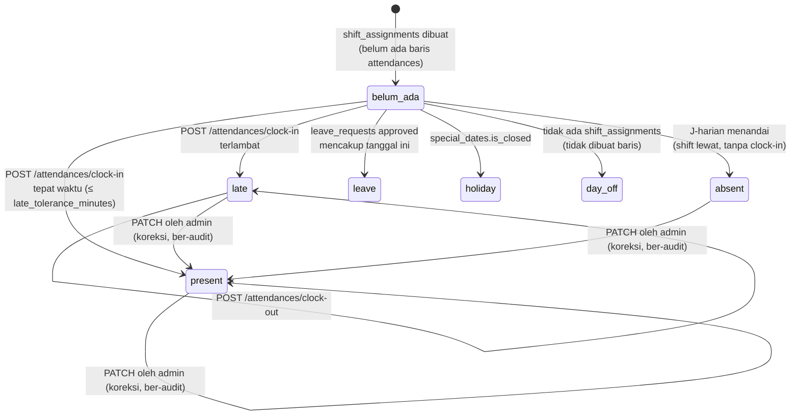

# 13 — MODULE: CRM & HRIS RINGAN

> Dua modul kecil digabung dalam satu dokumen karena keduanya **sengaja dibuat minimal**.
> Bagian terpenting dari dokumen ini adalah daftar **apa yang TIDAK termasuk**
> ([§ 4](#4-crm-apa-yang-tidak-termasuk) dan [§ 7](#7-hris-apa-yang-tidak-termasuk)) — keduanya
> adalah domain yang sangat mudah membengkak.
>
> Prasyarat: [03-DATA-MODEL.md § 14](03-DATA-MODEL.md#14-entitas-crm--hris).
> Endpoint: [04 § 9.12](04-API-CONTRACT.md#912-crm) & [§ 9.13](04-API-CONTRACT.md#913-hris).
> Izin: [05 § 6.11](05-AUTH.md#611-crm) & [§ 6.12](05-AUTH.md#612-hris).

---

## 1. Tujuan & Ruang Lingkup

### CRM

**Tujuan:** memberi admin & staff gambaran utuh tentang seorang customer saat berinteraksi
dengannya — siapa dia, apa riwayatnya, dan catatan apa yang perlu diketahui.

CRM Hola adalah **tampilan terkonsolidasi**, bukan mesin pemasaran. Ia tidak menyimpan data
baru yang belum ada di modul lain, kecuali tiga hal: **tag**, **catatan internal**, dan
**preferensi notifikasi**.

### HRIS

**Tujuan:** mencatat siapa yang bekerja, kapan mereka dijadwalkan, dan apakah mereka hadir.
Cukup untuk menjalankan operasional harian gedung olahraga dengan 5–20 karyawan.

HRIS Hola **bukan** sistem penggajian. Ia menghasilkan data yang dipakai untuk menghitung gaji
di luar sistem.

---

## 2. CRM: Scope Minimal

### 2.1 Yang termasuk

| # | Kemampuan | Sumber data | Endpoint |
|---|---|---|---|
| CRM-1 | Daftar customer dengan pencarian & filter | `users` + `customer_profiles` | `GET /customers` |
| CRM-2 | Profil 360° satu customer | agregasi lintas modul | `GET /customers/{user_id}` |
| CRM-3 | Riwayat booking | `bookings` | `GET /customers/{user_id}/bookings` |
| CRM-4 | Riwayat pembayaran | `payments` | `GET /customers/{user_id}/payments` |
| CRM-5 | Tag customer | `customer_tags`, `customer_tag_assignments` | `PUT /customers/{user_id}/tags` |
| CRM-6 | Catatan internal | `customer_notes` | `GET/POST /customers/{user_id}/notes` |
| CRM-7 | Tier & poin | `customer_profiles`, `point_ledger` | ditampilkan di CRM-2 |
| CRM-8 | Referral | `customer_profiles.referral_code`, `referred_by_user_id` | ditampilkan di CRM-2 |
| CRM-9 | Preferensi notifikasi | `customer_profiles.notification_prefs` | `PUT /me/notification-prefs` (oleh customer sendiri) |
| CRM-10 | Edit data profil oleh staff | `customer_profiles`, `users` | `PATCH /customers/{user_id}` |

### 2.2 Isi profil 360° (`GET /customers/{user_id}`)

Field yang **dihitung on-demand** (tidak didenormalisasi — volume data per customer kecil):

| Field | Perhitungan |
|---|---|
| `total_bookings_count` | `COUNT(bookings WHERE status='completed')` |
| `total_spent_amount` | `SUM(payments.amount WHERE status='paid')` untuk semua payable milik user |
| `total_refunded_amount` | `SUM(refunds.amount WHERE status='completed')` |
| `no_show_count_90d` | `COUNT(bookings WHERE status='no_show' AND booking_date >= today − 90)` |
| `cancelled_count_90d` | `COUNT(bookings WHERE status='cancelled' AND booking_date >= today − 90)` |
| `last_booking_at` | `MAX(bookings.created_at)` |
| `last_visit_date` | `MAX(bookings.booking_date WHERE status='completed')` |
| `favorite_court` | Court dengan `COUNT(booking_items)` terbanyak |
| `favorite_time_band` | Jam mulai paling sering (dibulatkan ke jam) |
| `avg_booking_value_amount` | `total_spent_amount / total_bookings_count` |
| `tier_code`, `lifetime_points`, `current_period_points` | dari [12](12-MODULE-GAMIFICATION.md) |
| `badges_count` | `COUNT(user_badges)` |
| `events_attended_count` | `COUNT(event_registrations WHERE status='attended')` |
| `tournaments_count` | `COUNT(tournament_registrations WHERE status='confirmed')` |
| `referred_count` | `COUNT(customer_profiles WHERE referred_by_user_id = user_id)` |
| `tags` | dari `customer_tag_assignments` |
| `is_new_customer` | `total_bookings_count = 0` — dipakai promo `is_new_customer_only` |

### 2.3 Tag

| # | Aturan |
|---|---|
| BR-C-01 | Tag adalah label bebas yang dikelola admin (`customer_tags`: `code`, `name`, `color`). Contoh: `vip`, `komunitas-padel`, `perusahaan`, `high_no_show`, `hati-hati` |
| BR-C-02 | Penugasan tag: `PUT /customers/{user_id}/tags` **mengganti seluruh set** (bukan menambah satu-satu). Alasan: UI berupa multi-select, dan operasi "ganti set" bebas dari masalah urutan |
| BR-C-03 | Tag `high_no_show` diberikan **otomatis** ketika `no_show_count_90d >= 3` (dievaluasi J-24 bersama rekalkulasi tier). Tag otomatis ditandai `is_system = true` dan **tidak dapat** dihapus manual selama kondisinya masih benar |
| BR-C-04 | Tag tidak mempengaruhi logika bisnis apa pun di v1 — murni untuk mata manusia. Satu-satunya pengecualian adalah `high_no_show` yang ditampilkan sebagai peringatan di layar booking staff |
| BR-C-05 | Membuat/menghapus jenis tag hanya `admin`. Menugaskan tag ke customer juga hanya `admin` (bukan `staff`) untuk menjaga konsistensi label |

### 2.4 Catatan internal

| # | Aturan |
|---|---|
| BR-C-10 | `customer_notes` bersifat **append-only**: dibuat, tidak diedit, tidak dihapus. Setiap catatan menyimpan `created_by_user_id` dan `created_at` |
| BR-C-11 | Catatan **tidak pernah** terlihat customer. Ini data internal |
| BR-C-12 | `staff` dan `admin` dapat membuat & membaca catatan |
| BR-C-13 | Catatan **tidak boleh** memuat data kesehatan, keyakinan, atau informasi sensitif lain yang tidak relevan dengan layanan. Peringatan ini ditampilkan di UI form catatan |
| BR-C-14 | `customer_profiles.internal_notes` (kolom teks tunggal) dipakai untuk **ringkasan** yang selalu tampil di header profil; `customer_notes` untuk kronologi. Keduanya tidak terlihat customer |

### 2.5 Aturan data customer

| # | Aturan |
|---|---|
| BR-C-20 | CRM **tidak** membuat entitas customer baru. Customer lahir dari `POST /auth/register` atau dari booking guest yang kemudian dikonversi |
| BR-C-21 | **Konversi guest → customer:** booking guest menyimpan `guest_name` + `guest_phone`. Jika kemudian ada `users` dengan `phone` yang sama, staff dapat menautkan booking historis lewat `PATCH /customers/{user_id}` dengan `link_guest_phone`. Ini operasi **manual**, tercatat `audit_logs`, dan tidak dilakukan otomatis (nomor HP bisa berpindah pemilik) |
| BR-C-22 | Staff dapat mengubah: `full_name`, `phone`, `email`, `birth_date`, `gender`, `skill_level`, `preferred_sport_id`, `internal_notes`. Staff **tidak** dapat mengubah `tier_code`, `lifetime_points`, `referral_code`, `role`, `status` |
| BR-C-23 | Mengubah `email` atau `phone` menghapus status verifikasinya (`email_verified_at`/`phone_verified_at` → NULL) dan mencatat `audit_logs` |
| BR-C-24 | Penghapusan customer = `users.status='deleted'` + anonimisasi PII ([03 § 20 DM-1](03-DATA-MODEL.md#20-edge-cases-data-model)). Riwayat transaksi tetap utuh untuk akuntansi |
| BR-C-25 | Ekspor data customer: `POST /admin/reports/customers/export` menghasilkan CSV di bucket privat + presigned link. Hanya `admin`, tercatat `audit_logs` |

---

## 3. Loyalty & Membership

### Keputusan v1

> **Loyalty = tier berbasis poin** ([12 § 7.1](12-MODULE-GAMIFICATION.md#71-tier-loyalitas-berbasis-lifetime_points)).
> **Tidak ada membership berbayar** (langganan) di v1.

Ini keputusan **D-09**.

| Opsi | Aturan | Kelebihan | Kekurangan |
|---|---|---|---|
| **A. Loyalty gratis berbasis tier poin** *(default v1)* | Tier otomatis dari `lifetime_points`; benefit non-moneter (horizon booking, prioritas waitlist, badge) | Tanpa biaya, tanpa liability, tanpa modul langganan. Mendorong frekuensi tanpa mengorbankan margin | Tidak menghasilkan pendapatan berulang |
| **B. Membership berbayar bulanan** | Mis. Rp 200.000/bulan → diskon 15% semua booking + horizon 120 hari + 1 jam gratis/bulan | Pendapatan berulang & prediktabilitas kas; mengikat customer | Butuh: modul langganan (pembayaran berulang, perpanjangan, pembatalan, prorata), **diskon tier yang aktif** (mengubah keputusan P6 pipeline harga), pertanyaan stacking dengan promo, dan penanganan kegagalan pembayaran berulang. Menambah scope besar. Midtrans mendukung recurring tetapi menambah kompleksitas webhook |
| **C. Paket kuota jam prabayar** | Mis. beli 10 jam Rp 2.000.000 (hemat 20%), berlaku 6 bulan | Kas masuk di muka; sederhana dipahami customer | **Liability keuangan** (jam yang belum dipakai adalah kewajiban Hola) dengan pencatatan pendapatan diterima dimuka; butuh modul saldo jam, aturan kedaluwarsa, dan integrasi ke pipeline harga |

**Rekomendasi: Opsi A untuk v1.** Opsi B dan C keduanya menambah **liability** dan **modul
baru**, dan keduanya mengubah keputusan yang sudah dikunci di pipeline harga
([07 § 3.3 P6](07-MODULE-PAYMENT.md#33-detail-per-step)). Jalankan v1 dengan Opsi A, ukur
frekuensi kunjungan nyata, lalu tentukan harga membership berdasarkan data.

Yang sudah disiapkan agar Opsi B/C tidak butuh perombakan:
- `Quote.tier_discount_amount` sudah ada di struktur snapshot (nilai 0).
- `promos.min_tier_code` sudah ada untuk promo eksklusif tier.
- Chart of accounts sudah punya `2-1100 Pendapatan Diterima Dimuka`.

---

## 4. CRM: Apa yang TIDAK Termasuk

Daftar ini **eksplisit** karena CRM adalah domain yang paling mudah membengkak. Jika sebuah
kemampuan ada di daftar ini, **jangan dibangun** meskipun tampak mudah.

| Tidak termasuk | Alasan |
|---|---|
| **Email campaign builder / newsletter** | Butuh editor template, daftar penerima, unsubscribe, deliverability. Pakai layanan terpisah (Mailchimp) dengan ekspor CSV |
| **Marketing automation / drip campaign** | Butuh mesin aturan & penjadwalan per user |
| **Segmentasi dinamis tersimpan** ("semua customer yang belum booking 60 hari") | v1 hanya filter ad-hoc di `GET /customers`. Segmen tersimpan butuh evaluasi berkala & versioning |
| **Sales pipeline / deal stage** | Hola tidak menjual B2B lewat pipeline |
| **Tiket bantuan / helpdesk** | Keluhan ditangani lewat WhatsApp/telepon |
| **Log komunikasi otomatis** (rekaman panggilan, riwayat chat) | Butuh integrasi telepon/chat |
| **Skor kepuasan (NPS/CSAT) & survei** | Modul survei tersendiri |
| **Prediksi churn / skor lifetime value berbasis model** | Butuh data historis panjang |
| **Program referral berhadiah uang** | Referral hanya memberi **poin** ([12](12-MODULE-GAMIFICATION.md)) |
| **Kartu member fisik / barcode** | Identifikasi memakai nama/telepon |
| **Portal customer untuk mengelola data perusahaan** (booking korporat) | Bukan v1 |
| **Riwayat perubahan data customer yang dapat dilihat customer** | `audit_logs` hanya untuk admin |
| **Penggabungan (merge) dua akun customer duplikat** | Operasi berisiko yang menyentuh booking, payment, poin, dan jurnal. Duplikat ditangani dengan menautkan manual (BR-C-21) dan menonaktifkan salah satu |
| **Ulang tahun otomatis dengan promo hadiah** | Butuh promo per-user (voucher personal) yang ada di [08 § 10](08-MODULE-PROMO.md#10-out-of-scope) |
| **Import customer massal dari CSV** | Data customer lahir dari registrasi |

---

## 5. HRIS: Scope Minimal

### 5.1 Yang termasuk

| # | Kemampuan | Tabel | Endpoint |
|---|---|---|---|
| HR-1 | Data karyawan | `employees` | `GET/POST/PATCH /employees` |
| HR-2 | Direktori internal (nama, posisi, telepon) | `employees` | `GET /employees` (staff `◐`) |
| HR-3 | Definisi shift | `shifts` | `GET/POST/PATCH /shifts` |
| HR-4 | Penjadwalan shift per tanggal | `shift_assignments` | `GET/POST/DELETE /shift-assignments` |
| HR-5 | Absensi clock-in/clock-out | `attendances` | `POST /attendances/clock-in`, `/clock-out` |
| HR-6 | Rekap absensi (hadir, telat, absen) | `attendances` | `GET /attendances` |
| HR-7 | Pencatatan pengajuan izin/cuti | `leave_requests` | `GET/POST /leave-requests`, `POST .../decide` |
| HR-8 | Tautan ke akun aplikasi | `employees.user_id` | — |

### 5.2 Data karyawan

| Field | Keterangan | Terlihat oleh |
|---|---|---|
| `employee_number` | `EMP-{seq4}`, UNIQUE | semua (staff, admin) |
| `full_name`, `position`, `department`, `phone` | Direktori | semua |
| `employment_type` | `fulltime` \| `parttime` \| `contract` \| `intern` | semua |
| `join_date`, `end_date` | Masa kerja | semua |
| `status` | `active` \| `inactive` \| `resigned` \| `terminated` | semua |
| `user_id` | Tautan ke akun aplikasi (opsional) | admin |
| `base_salary_amount` | Gaji pokok | **`admin` saja** |
| `emergency_contact_name`, `emergency_contact_phone` | Kontak darurat | **`admin` saja** |

| # | Aturan |
|---|---|
| BR-H-01 | `base_salary_amount` dan kontak darurat difilter di **serializer**, bukan disembunyikan di UI ([05 § 7](05-AUTH.md#7-otorisasi-berbasis-kepemilikan)). Ada test yang memverifikasi `staff` tidak menerima field itu |
| BR-H-02 | Perubahan `base_salary_amount` **wajib** mencatat `audit_logs` dengan nilai lama & baru |
| BR-H-03 | Satu `employees` boleh ditautkan ke maksimal satu `users` (UNIQUE partial `user_id`). Tautan dipakai untuk: absensi mandiri dan pengajuan izin |
| BR-H-04 | Karyawan tidak dihapus. `status` diubah menjadi `resigned`/`terminated` + `end_date`. Riwayat absensi tetap |
| BR-H-05 | Menonaktifkan karyawan yang punya `user_id` **tidak** otomatis menonaktifkan akunnya. Itu dua tindakan terpisah dan keduanya harus dilakukan sadar. Dashboard menampilkan peringatan konsistensi ("karyawan `resigned` tetapi akun masih `active`") |

---

## 6. HRIS: Shift & Absensi

### 6.1 Shift

| # | Aturan |
|---|---|
| BR-H-10 | `shifts` mendefinisikan **template** jam kerja: `code`, `name`, `starts_time`, `ends_time`, `break_minutes`, `late_tolerance_minutes`. Contoh: `PAGI` 06:00–14:00, `SIANG` 14:00–22:00, `MALAM` 22:00–06:00 |
| BR-H-11 | Shift yang melewati tengah malam (`ends_time < starts_time`) **didukung**: `ends_time` ditafsirkan sebagai hari berikutnya. Ini berbeda dari slot lapangan yang tidak mendukungnya |
| BR-H-12 | `shift_assignments` menugaskan satu karyawan ke satu shift pada satu `work_date`. UNIQUE `(employee_id, work_date, shift_id)` |
| BR-H-13 | Satu karyawan boleh punya **lebih dari satu** shift pada satu tanggal (mis. shift pengganti), tetapi jam-nya **tidak boleh bertabrakan** → `409 SHIFT_ASSIGNMENT_CONFLICT`. Validasi dilakukan di service dengan membandingkan rentang waktu efektif (termasuk shift lintas tengah malam) |
| BR-H-14 | `POST /shift-assignments` menerima **array** (maks 200) karena penjadwalan selalu dilakukan per minggu. Ini satu-satunya endpoint batch di API ([04 § 12](04-API-CONTRACT.md#12-out-of-scope-api-v1)) |
| BR-H-15 | Penjadwalan hanya `admin`. `staff` dapat **melihat** jadwal seluruh tim (perlu untuk koordinasi) |
| BR-H-16 | Menghapus `shift_assignments` yang sudah punya `attendances` → `409 CONFLICT`. Absensi yang sudah tercatat tidak boleh kehilangan konteksnya |
| BR-H-17 | Shift **tidak** terkait dengan `slot_claims` atau jadwal lapangan. Tidak ada validasi "harus ada staff saat ada booking" di v1 |

### 6.2 Absensi

| # | Aturan |
|---|---|
| BR-H-20 | UNIQUE `(employee_id, work_date)` — **satu baris absensi per karyawan per hari**, meskipun ia punya dua shift. Jika ada dua shift, `shift_assignment_id` menunjuk shift **pertama** dan `work_minutes` menjumlahkan seluruh waktu kerja |
| BR-H-21 | `POST /attendances/clock-in` membuat baris jika belum ada, mengisi `clock_in_at = now()`. Clock-in kedua → `409 ATTENDANCE_ALREADY_CLOCKED_IN` |
| BR-H-22 | `POST /attendances/clock-out` mensyaratkan `clock_in_at` sudah ada → `409 ATTENDANCE_NOT_CLOCKED_IN` jika belum. Clock-out mengisi `clock_out_at` dan menghitung `work_minutes = (clock_out − clock_in) − shift.break_minutes`, minimum 0 |
| BR-H-23 | `late_minutes = max(0, clock_in_at − (work_date + shift.starts_time))`. Status `late` jika `late_minutes > shift.late_tolerance_minutes` |
| BR-H-24 | `early_leave_minutes = max(0, (work_date + shift.ends_time) − clock_out_at)` |
| BR-H-25 | `clock_in_source` ∈ `kiosk` (tablet di front desk, dioperasikan staff), `admin` (dicatat admin), `mobile` (dari akun sendiri). **Tidak ada geofencing atau selfie** di v1 |
| BR-H-26 | Karyawan tanpa `user_id` di-clock-in oleh `staff`/`admin` lewat `kiosk`. Karyawan dengan `user_id` dapat clock-in sendiri |
| BR-H-27 | J-37 `system.markMissingAttendance` (cron 01:00 WITA) menandai `absent` untuk `shift_assignments` yang tanggalnya sudah lewat dan tidak punya baris `attendances`, kecuali tanggal itu tercakup `leave_requests` berstatus `approved` (→ `leave`) atau `special_dates.is_closed` (→ `holiday`) |
| BR-H-28 | Koreksi absensi hanya `admin` (`PATCH /attendances/{id}`), **wajib** mencatat `audit_logs` dengan nilai lama & baru. `staff` tidak dapat mengoreksi absensinya sendiri |
| BR-H-29 | Absensi **tidak** menghitung upah, lembur, atau tunjangan. Ia hanya menyediakan `work_minutes`, `late_minutes`, `early_leave_minutes` yang dipakai penghitungan gaji **di luar sistem** |
| BR-H-30 | Ekspor rekap absensi bulanan: `POST /admin/reports/attendance/export` → CSV. Ini jembatan resmi ke penggajian |

### 6.3 Izin & cuti

| # | Aturan |
|---|---|
| BR-H-40 | `leave_requests` mencatat: `type` (`annual`/`sick`/`unpaid`/`other`), `start_date`, `end_date`, `reason`, `status` |
| BR-H-41 | Alur persetujuan **satu tingkat**: `pending` → `approved` \| `rejected` oleh `admin`. Tidak ada persetujuan berjenjang |
| BR-H-42 | **Tidak ada saldo/kuota cuti** di v1. Sistem tidak menghitung "sisa 8 hari". Ia hanya mencatat pengajuan & keputusan. Penghitungan hak cuti dilakukan di luar sistem |
| BR-H-43 | Izin `approved` mempengaruhi absensi: tanggal yang tercakup ditandai `status='leave'` (BR-H-27), bukan `absent` |
| BR-H-44 | Izin yang bertabrakan dengan izin lain yang sudah `approved` untuk karyawan yang sama → `409 CONFLICT` |
| BR-H-45 | Pembatalan pengajuan oleh karyawan hanya untuk `status='pending'` (`status='cancelled'`) |
| BR-H-46 | `staff` dapat membuat & melihat pengajuannya sendiri (`○`); `admin` melihat semua dan memutuskan |
| BR-H-47 | Keputusan izin mencatat `audit_logs` dan mengirim notifikasi ke karyawan (jika punya `user_id`) |

---

## 7. HRIS: Apa yang TIDAK Termasuk

| Tidak termasuk | Alasan |
|---|---|
| **Penggajian (payroll)** | Perhitungan gaji, potongan, dan slip gaji butuh aturan pajak & ketenagakerjaan yang berubah dan berisiko tinggi jika salah. Sistem hanya mengekspor data absensi |
| **PPh 21 / perhitungan pajak karyawan** | idem |
| **BPJS Kesehatan & Ketenagakerjaan** | idem |
| **Slip gaji digital** | idem |
| **Perhitungan lembur (overtime) & upah lembur** | `work_minutes` disediakan; perhitungan tarif lembur di luar sistem |
| **Saldo & kuota cuti** (BR-H-42) | Butuh aturan hak cuti per masa kerja & carry-over |
| **Persetujuan berjenjang** (supervisor → HR → direktur) | Organisasi Hola datar |
| **Geofencing / GPS check-in / selfie absensi** | Butuh penanganan privasi lokasi & biometrik. Absensi memakai kiosk di lokasi |
| **Integrasi mesin fingerprint / face recognition** | Hardware & integrasi terpisah |
| **Manajemen kinerja / KPI / penilaian karyawan** | Domain terpisah |
| **Rekrutmen / ATS / lowongan** | Domain terpisah |
| **Onboarding checklist & pelatihan karyawan** | Domain terpisah |
| **Struktur organisasi / hierarki atasan-bawahan** | Tidak dibutuhkan pada skala ini |
| **Pengelolaan aset yang dipegang karyawan** | Domain terpisah |
| **Shift swap / tukar jadwal antar karyawan** | Admin mengubah jadwal langsung |
| **Notifikasi pengingat shift ke karyawan** | Kandidat v2; jadwal dikomunikasikan lewat grup pesan |
| **Perhitungan komisi / insentif berbasis penjualan** | Domain terpisah |
| **Kontrak kerja digital & tanda tangan** | Dokumen di luar sistem |
| **Validasi "harus ada staff saat ada booking"** (BR-H-17) | Menghubungkan shift ke slot menambah kompleksitas tanpa manfaat jelas pada skala ini |

---

## 8. Privasi & Akses Data

| # | Aturan |
|---|---|
| BR-PRIV-01 | Data yang **hanya** boleh dilihat `admin`: `base_salary_amount`, kontak darurat karyawan, `birth_date` lengkap customer (staff hanya bulan-tanggal), rincian biaya gateway, dokumen kontrak tenant |
| BR-PRIV-02 | Filtering dilakukan di **serializer per role**, bukan di frontend. Ada test per entitas yang memverifikasi field terlarang tidak ada di payload |
| BR-PRIV-03 | Semua akses ke daftar customer (`GET /customers`) **tidak** dicatat di `audit_logs` (volume terlalu tinggi). Yang dicatat: **ekspor** data customer, perubahan data customer, dan pembuatan catatan |
| BR-PRIV-04 | Ekspor CSV apa pun yang memuat PII hanya `admin`, disimpan di bucket **privat**, diakses lewat presigned URL TTL 15 menit, dan mencatat `audit_logs` |
| BR-PRIV-05 | Nomor telepon customer terlihat `staff` (dibutuhkan untuk menghubungi terkait booking). Alamat email juga. Keduanya **tidak** boleh diekspor `staff` |
| BR-PRIV-06 | Data karyawan yang sudah `resigned` tetap tersimpan minimal 2 tahun (kebutuhan administrasi), lalu dapat dianonimkan atas permintaan |
| BR-PRIV-07 | Customer dapat meminta datanya dihapus. Yang dihapus: PII di `users` & `customer_profiles`, `customer_notes`, `push_tokens`. Yang **tidak** dihapus: `bookings`, `payments`, `journal_entries`, `point_ledger` — dibutuhkan akuntansi. Nama pada dokumen historis menjadi "Pengguna Terhapus" |
| BR-PRIV-08 | Tidak ada data pembayaran kartu yang disimpan Hola. Semuanya di sisi Midtrans |

---

## 9. Edge Cases

| # | Kondisi | Perilaku yang diharapkan |
|---|---|---|
| E-1 | Satu orang punya dua akun customer (email berbeda) | Tidak digabung otomatis. Staff dapat menautkan booking guest ke satu akun (BR-C-21) dan menonaktifkan akun duplikat (`status='suspended'`) dengan catatan. Merge otomatis di luar scope |
| E-2 | Karyawan juga customer | Perlu **dua akun** dengan email berbeda ([05 § 2](05-AUTH.md#2-role--definisi)). `employees.user_id` menunjuk akun kerjanya; akun pribadinya punya `customer_profiles` sendiri |
| E-3 | Staff mencoba melihat gaji rekan | Field tidak ada di response (BR-H-01). Bukan error, hanya tidak ada |
| E-4 | Customer meminta datanya dihapus tetapi punya booking mendatang | Booking mendatang dibatalkan dengan refund sesuai kebijakan, lalu akun dianonimkan (BR-PRIV-07) |
| E-5 | Karyawan lupa clock-out | `clock_out_at` NULL, `work_minutes` NULL. Job harian **tidak** mengisinya otomatis (menebak jam keluar adalah data palsu). Admin mengoreksi manual (`PATCH`, ber-audit). Rekap menandainya "clock-out belum tercatat" |
| E-6 | Karyawan clock-in dua kali | `409 ATTENDANCE_ALREADY_CLOCKED_IN`. `clock_in_at` pertama tetap dipakai |
| E-7 | Karyawan shift malam (22:00–06:00) clock-out pukul 05:30 | `work_date` = tanggal **mulai** shift. `clock_out_at` di tanggal berikutnya. Perhitungan `early_leave_minutes` memperhitungkan shift lintas tengah malam (BR-H-11) |
| E-8 | Dua shift bertabrakan ditugaskan ke satu karyawan | `409 SHIFT_ASSIGNMENT_CONFLICT` |
| E-9 | Izin `approved` untuk tanggal yang sudah punya absensi `present` | Diizinkan (mis. izin diajukan retroaktif untuk setengah hari). Status absensi **tidak** diubah otomatis; admin memutuskan. Peringatan ditampilkan |
| E-10 | Tag `high_no_show` diberikan otomatis lalu customer memperbaiki perilakunya | J-24 mengevaluasi ulang; jika `no_show_count_90d < 3`, tag otomatis **dihapus**. Ini satu-satunya tag yang dihapus otomatis |
| E-11 | `GET /customers?q=` dengan 5.000 customer | Pagination offset (`page`/`per_page`), pencarian `ILIKE` pada nama/email/telepon. Jika lambat, ditambahkan index trigram — bukan mesin pencarian baru |
| E-12 | Staff menambahkan catatan yang salah | Catatan tidak dapat dihapus (BR-C-10). Staff menambahkan catatan koreksi. Admin dapat menghapus catatan dalam kasus luar biasa (mis. berisi data sensitif) dengan `audit_logs` |
| E-13 | `total_spent_amount` dihitung ulang setiap membuka profil dan terasa lambat | Perhitungan memakai index `idx_payments_paid_at` + filter user. Jika terbukti lambat pada > 500 booking per customer, ditambahkan kolom denormalisasi yang di-update job harian — **bukan** cache Redis, karena ini data bisnis yang ditampilkan sebagai fakta |
| E-14 | Karyawan `resigned` tetapi akunnya masih dipakai login | BR-H-05: dashboard menampilkan peringatan konsistensi. Admin menonaktifkan akun (`PATCH /admin/users/{id}` → `status='suspended'`) yang mencabut semua sesi |
| E-15 | Customer meminta daftar semua data yang Hola miliki tentangnya | `POST /admin/reports/customers/export` dengan filter satu user, dijalankan admin. Tidak ada endpoint self-service di v1 |

---

## 10. Out of Scope

Ringkasan gabungan (detail & alasan di [§ 4](#4-crm-apa-yang-tidak-termasuk) dan
[§ 7](#7-hris-apa-yang-tidak-termasuk)):

**CRM:** email campaign, marketing automation, segmen tersimpan, sales pipeline, helpdesk, log
komunikasi, NPS/survei, prediksi churn, referral berhadiah uang, kartu member fisik, portal
korporat, merge akun, promo ulang tahun otomatis, import CSV customer.

**HRIS:** payroll, PPh 21, BPJS, slip gaji, perhitungan lembur, saldo cuti, persetujuan
berjenjang, geofencing/selfie/fingerprint, manajemen kinerja, rekrutmen, onboarding, struktur
organisasi, manajemen aset, shift swap, notifikasi shift, komisi, kontrak digital.

**Membership:** langganan berbayar (Opsi B) dan paket kuota jam prabayar (Opsi C) — lihat
[§ 3](#3-loyalty--membership).
