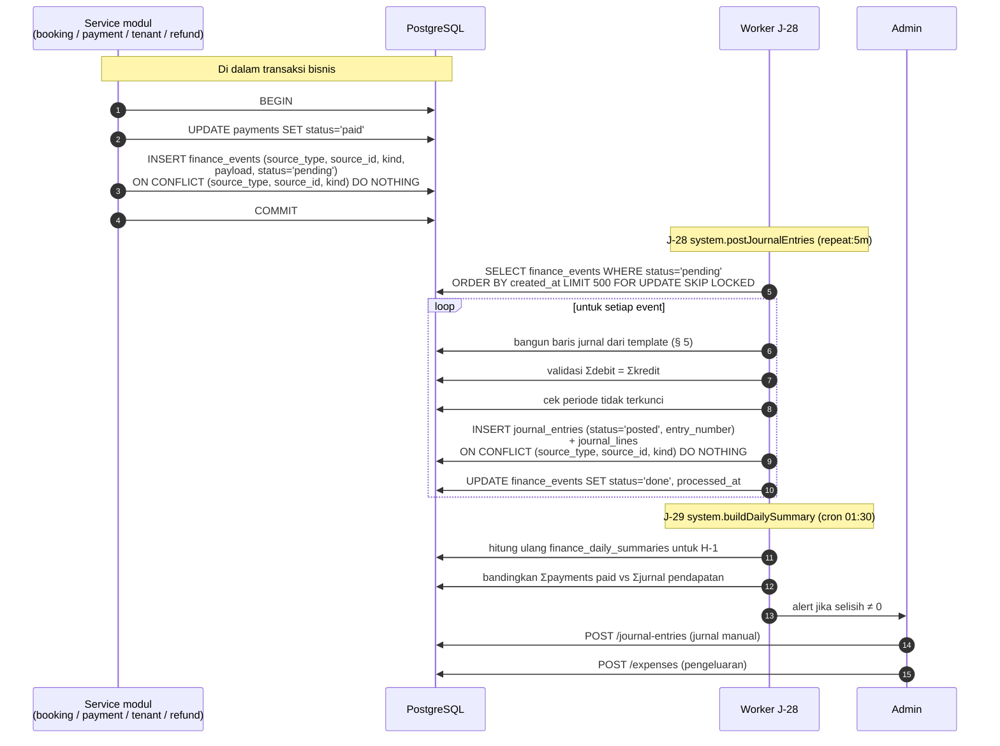

# 14 — MODULE: JURNAL KEUANGAN

> Ini **bukan** sistem akuntansi lengkap. Ia jurnal berpasangan sederhana yang mencatat arus
> uang bisnis secara otomatis, cukup untuk melihat kesehatan usaha dan menyerahkan data yang
> bersih ke akuntan. Batasannya eksplisit di [§ 2](#2-prinsip-jurnal-sederhana-bukan-full-accounting)
> dan [§ 9](#9-out-of-scope).
>
> Prasyarat: [03-DATA-MODEL.md § 16](03-DATA-MODEL.md#16-entitas-finance),
> [07-MODULE-PAYMENT.md](07-MODULE-PAYMENT.md).
> Endpoint: [04 § 9.14](04-API-CONTRACT.md#914-finance). Izin: [05 § 6.13](05-AUTH.md#613-finance).

---

## 1. Tujuan & Ruang Lingkup

**Termasuk:** chart of accounts minimal, jurnal berpasangan (debit = kredit) yang dibuat
**otomatis** dari kejadian bisnis, pencatatan pengeluaran manual, jurnal manual untuk hal yang
tidak tercakup otomatis, penutupan periode, dan sekumpulan laporan operasional.

**Tidak termasuk:** perpajakan, penyusutan aset, rekonsiliasi bank otomatis, konsolidasi,
anggaran, dan semua hal di [§ 9](#9-out-of-scope).

**Siapa yang memakai:** hanya `admin` (dengan pengecualian sempit: `staff` boleh mencatat
pengeluaran kas kecil — lihat [§ 6](#6-pengeluaran-expenses)).

---

## 2. Prinsip: Jurnal Sederhana, Bukan Full Accounting

| # | Prinsip | Konsekuensi |
|---|---|---|
| F-1 | **Berpasangan (double-entry) dan selalu seimbang.** CHECK `total_debit_amount = total_credit_amount` (C-11) | Kesalahan hitung tertangkap database, bukan ditemukan berbulan-bulan kemudian |
| F-2 | **Setiap jurnal punya sumber yang dapat dilacak.** `source_type` + `source_id` + `kind`, UNIQUE (C-13) | Dari satu baris jurnal, selalu bisa dilacak ke booking/tagihan/refund asalnya. Dan satu sumber tidak bisa menghasilkan jurnal ganda |
| F-3 | **Jurnal dibuat otomatis lewat outbox `finance_events`** | Jurnal tidak hilang meskipun Redis di-flush atau worker mati. J-28 memindai outbox tiap 5 menit |
| F-4 | **Jurnal tidak pernah diedit atau dihapus.** Koreksi = entri pembalik + entri baru | Jejak audit utuh. `status='voided'` + `voided_by_entry_id` |
| F-5 | **Pendapatan dicatat bruto; diskon sebagai contra-revenue** | Laporan dapat menjawab "berapa pendapatan seharusnya" dan "berapa yang dikorbankan untuk promo" secara terpisah. Ini alasan akun `4-9000` ada |
| F-6 | **Basis pencatatan: kas untuk booking/event/turnamen, akrual untuk tenant** | Booking dicatat saat uang masuk (tidak ada piutang customer). Tagihan tenant dicatat saat diterbitkan (ada piutang). Pencampuran ini disengaja dan didokumentasikan — ia mencerminkan realitas bisnis, bukan kelalaian |
| F-7 | **Uang di payment gateway bukan uang di bank.** Akun terpisah `1-1300` | Posisi kas nyata dapat dibedakan dari dana yang belum settle. Ini pertanyaan pertama pemilik setiap pagi |
| F-8 | **Sistem tidak menghitung pajak** | Ia menyediakan angka pendapatan & beban yang bersih untuk dihitung akuntan |
| F-9 | **Tidak ada nilai negatif di `debit_amount`/`credit_amount`** | Satu baris jurnal adalah debit **atau** kredit (C-12). Pengurangan dinyatakan dengan sisi berlawanan |
| F-10 | **Semua nominal `bigint` rupiah utuh** | Tidak ada pembulatan tersembunyi. `rounding_adjustment_amount` dari pipeline harga sudah tercermin di `total_amount` yang dijurnal |

---

## 3. Entitas & Alur Posting

### 3.1 Alur

### 3.2 Aturan posting

| # | Aturan |
|---|---|
| BR-F-01 | `INSERT finance_events` terjadi **di dalam transaksi bisnis**. Ini yang menjamin jurnal tidak pernah hilang |
| BR-F-02 | UNIQUE `(source_type, source_id, kind)` ada di **kedua** tabel (`finance_events` dan `journal_entries`) → idempoten berlapis |
| BR-F-03 | Jurnal otomatis langsung `status='posted'` (bukan `draft`). Alasan: ia berasal dari kejadian yang sudah pasti; menyisakannya sebagai draft berarti laporan selalu tidak lengkap sampai seseorang mengklik |
| BR-F-04 | Jurnal **manual** dibuat `draft` dan harus di-`post` eksplisit. Alasan sebaliknya: input manusia perlu diperiksa |
| BR-F-05 | `entry_number` (`JE-{YYYYMM}-{seq5}`) dibuat dari sequence PostgreSQL di dalam transaksi |
| BR-F-06 | `entry_date` = tanggal bisnis kejadian (WITA), **bukan** tanggal posting. Booking dibayar 31 Juli 23:50 tetapi dijurnal 1 Agustus 00:05 tetap ber-`entry_date` 31 Juli |
| BR-F-07 | Jika `entry_date` berada di periode yang sudah terkunci (`app_settings.finance_locked_until_date`), posting **gagal** → `finance_events.status='failed'` dengan `last_error='period_locked'`, dan alert ke admin. Admin membuka kunci atau memposting ke periode berjalan secara manual. **Tidak** ada pemindahan tanggal otomatis |
| BR-F-08 | `finance_events` yang gagal 5 kali → `status='failed'` + alert Sentry. Admin memicu ulang lewat `POST /admin/jobs/system.postJournalEntries/trigger` setelah memperbaiki penyebabnya |
| BR-F-09 | Void jurnal (`POST /journal-entries/{id}/void`) membuat **entri baru** ber-`kind='reversal'` dengan baris debit/kredit terbalik, lalu menandai entri lama `status='voided'` dan `voided_by_entry_id`. Wajib `reason` + `audit_logs` |
| BR-F-10 | Jurnal `voided` **tidak** ikut laporan; entri `reversal` ikut (agar total tetap nol) |
| BR-F-11 | `finance_events` yang sudah `done` dibersihkan setelah 180 hari. `journal_entries` & `journal_lines` **tidak pernah** dibersihkan |

---

## 4. Chart of Accounts Minimal

Seed tabel `accounts`. `code` adalah PK dan bersifat kanonik — **jangan diubah**. Akun induk
(`parent_code` NULL, tanpa transaksi langsung) ditandai *induk*.

### Aset (`asset`)

| `code` | Nama | Keterangan |
|---|---|---|
| `1-1000` | Kas & Bank | *induk* |
| `1-1100` | Kas Operasional | Uang tunai di kasir |
| `1-1200` | Bank | Rekening operasional |
| `1-1300` | Dana di Payment Gateway | Uang customer yang sudah dibayar tetapi belum settle ke bank. **Kunci untuk membaca posisi kas dengan benar** |
| `1-2000` | Piutang | *induk* |
| `1-2100` | Piutang Tenant | Tagihan tenant yang sudah diterbitkan & belum dibayar |
| `1-3000` | Aset Lainnya | *induk* |
| `1-3100` | Biaya Dibayar Dimuka | Mis. sewa/asuransi dibayar di muka |

### Liabilitas (`liability`)

| `code` | Nama | Keterangan |
|---|---|---|
| `2-1000` | Liabilitas | *induk* |
| `2-1100` | Pendapatan Diterima Dimuka | Disiapkan untuk paket prabayar (D-09 Opsi C). **Tidak dipakai v1** |
| `2-1200` | Deposit Tenant | Uang jaminan tenant yang dipegang Hola ([09 § 8](09-MODULE-TENANT.md#8-deposit-butuh-keputusan-client)) |
| `2-1300` | Liabilitas Poin | Disiapkan untuk poin bernilai tukar (D-03 Opsi B/C). **Tidak dipakai v1** |
| `2-1400` | Utang Refund | Refund yang sudah disetujui tetapi belum dibayarkan |
| `2-1500` | Utang Usaha | Tagihan vendor yang belum dibayar |

### Ekuitas (`equity`)

| `code` | Nama |
|---|---|
| `3-1000` | Ekuitas — *induk* |
| `3-1100` | Modal Disetor |
| `3-9000` | Laba Ditahan |

### Pendapatan (`revenue`)

| `code` | Nama | Sumber |
|---|---|---|
| `4-1000` | Pendapatan | *induk* |
| `4-1100` | Pendapatan Booking Lapangan | `bookings.subtotal_amount` |
| `4-1200` | Pendapatan Sewa Tenant | `cafe_invoices` (sewa + service charge) |
| `4-1300` | Pendapatan Event | `event_registrations` |
| `4-1400` | Pendapatan Turnamen | `tournament_registrations` |
| `4-1500` | Pendapatan Add-on | `booking_addons` (sewa raket, bola) |
| `4-1900` | Pendapatan Lain-lain | Denda keterlambatan tenant, pendapatan tak terduga |

### Contra-revenue (`contra_revenue`)

| `code` | Nama | Keterangan |
|---|---|---|
| `4-9000` | Diskon & Promo | **Pengurang pendapatan.** Didebit sebesar `discount_amount` setiap transaksi berpromo |
| `4-9100` | Retur & Refund | Didebit sebesar nilai refund |

> Kedua akun ini bertipe `contra_revenue`, bukan `expense`. Alasan: diskon dan refund
> mengurangi **pendapatan**, bukan menambah beban. Menaruhnya sebagai beban akan membuat
> margin pendapatan tampak lebih tinggi dari kenyataan.

### Beban (`expense`)

| `code` | Nama |
|---|---|
| `5-1000` | Beban Operasional — *induk* |
| `5-1100` | Beban Gaji & Tunjangan |
| `5-1200` | Beban Listrik & Air |
| `5-1300` | Beban Pemeliharaan Lapangan |
| `5-1400` | Beban Biaya Payment Gateway |
| `5-1500` | Beban Marketing & Promosi |
| `5-1600` | Beban Sewa & Bangunan |
| `5-1700` | Beban Perlengkapan & Peralatan |
| `5-1800` | Beban Internet & Software |
| `5-1900` | Beban Lain-lain |

### Aturan chart of accounts

| # | Aturan |
|---|---|
| BR-F-20 | Akun **induk** tidak boleh dipakai di `journal_lines` (divalidasi service: akun harus tidak punya anak). Alasan: total induk selalu hasil penjumlahan anaknya |
| BR-F-21 | Akun tidak dihapus, hanya `is_active=false`. Akun yang pernah dipakai `journal_lines` tidak dapat dinonaktifkan jika masih dipakai jurnal periode berjalan |
| BR-F-22 | `accounts.code` mengikuti pola `{tipe}-{4 digit}` dengan digit pertama menandai tipe: 1=aset, 2=liabilitas, 3=ekuitas, 4=pendapatan, 5=beban. Akun `4-9xxx` khusus contra-revenue |
| BR-F-23 | Admin dapat menambah akun **anak** baru (mis. `5-1210 Beban Listrik Lapangan`), tetapi tidak boleh mengubah `code` atau `type` akun yang sudah dipakai |
| BR-F-24 | Menambah akun tidak memerlukan perubahan kode selama template jurnal otomatis (§ 5) memetakan ke akun yang sudah ada. Akun baru dipakai untuk pengeluaran manual & jurnal manual |

---

## 5. Sumber Transaksi Otomatis

Setiap baris di bawah adalah **template jurnal** yang wajib diimplementasikan persis. Semua
contoh memakai kasus dari [07 § 3.4](07-MODULE-PAYMENT.md#34-contoh-perhitungan-lengkap):
booking 2 slot Rp 600.000 + addon Rp 25.000 − diskon Rp 50.000 = **Rp 575.000**, dibayar QRIS
dengan biaya gateway Rp 4.025.

### T-1. Booking dibayar (gateway) — `source_type='booking'`, `kind='revenue'`

Dipicu: `payments.markPaid()` untuk payment ber-`booking_id` dan `provider='midtrans'`.

| Akun | Debit | Kredit |
|---|---|---|
| `1-1300` Dana di Payment Gateway | 575.000 | |
| `4-9000` Diskon & Promo | 50.000 | |
| `4-1100` Pendapatan Booking Lapangan | | 600.000 |
| `4-1500` Pendapatan Add-on | | 25.000 |
| **Total** | **625.000** | **625.000** |

Aturan: `4-9000` hanya muncul jika `discount_amount > 0`. `4-1500` hanya jika
`addon_amount > 0`. Jika `tax_amount > 0` (D-06 aktif), tambahkan kredit ke akun pajak yang
akan dibuat saat keputusan itu diambil — **belum ada di v1**.

### T-2. Booking dibayar tunai — `kind='revenue'`

Sama seperti T-1, tetapi baris pertama mendebit `1-1100` Kas Operasional. `provider='manual'`
dan `method='cash'`. Tidak ada jurnal settlement (T-3) karena uangnya sudah di kas.

Untuk `method='manual_transfer'`, debit `1-1200` Bank.

### T-3. Settlement gateway — `source_type='booking'` (atau payable lain), `kind='settlement'`

Dipicu: admin mengisi `gateway_fee_amount` & `settled_amount` dari laporan settlement
([07 BR-P-45](07-MODULE-PAYMENT.md#62-aturan-rekonsiliasi)).

| Akun | Debit | Kredit |
|---|---|---|
| `1-1200` Bank | 570.975 | |
| `5-1400` Beban Biaya Payment Gateway | 4.025 | |
| `1-1300` Dana di Payment Gateway | | 575.000 |
| **Total** | **575.000** | **575.000** |

Aturan: selama T-3 belum dibuat, `1-1300` menumpuk. Saldo `1-1300` yang terus membesar adalah
indikator bahwa admin belum memasukkan data settlement — ditampilkan sebagai peringatan di
laporan posisi kas.

### T-4. Event / turnamen dibayar — `source_type='event_registration'` / `'tournament_registration'`, `kind='revenue'`

Sama struktur dengan T-1, dengan akun pendapatan `4-1300` (event) atau `4-1400` (turnamen).
Tidak ada baris add-on.

Untuk registrasi **gratis** (`total_amount = 0`): **tidak ada jurnal** ([10 BR-E-66](10-MODULE-EVENT.md#6-event-berbayar--pipeline-payment)).
Untuk registrasi berdiskon 100%: jurnal **tetap dibuat** — debit `4-9000` sebesar nilai penuh,
kredit `4-1300`/`4-1400` sebesar nilai penuh, tanpa baris kas. Total tetap seimbang, dan
laporan diskon tetap akurat.

### T-5. Tagihan tenant diterbitkan — `source_type='cafe_invoice'`, `kind='accrual'`

Dipicu: `cafe_invoices.status → 'issued'`. Contoh: sewa Rp 5.000.000 + service charge
Rp 500.000.

| Akun | Debit | Kredit |
|---|---|---|
| `1-2100` Piutang Tenant | 5.500.000 | |
| `4-1200` Pendapatan Sewa Tenant | | 5.500.000 |

Jika tagihan memuat `late_fee_amount` (dari J-11), jurnal **terpisah** ber-`kind='accrual'`
tidak dapat dibuat lagi (UNIQUE per `(source, kind)`), sehingga denda memakai
`kind='accrual_late_fee'`:

| Akun | Debit | Kredit |
|---|---|---|
| `1-2100` Piutang Tenant | 275.000 | |
| `4-1900` Pendapatan Lain-lain | | 275.000 |

> `accrual_late_fee` adalah nilai `kind` tambahan yang sah, terdaftar bersama daftar di
> [03 § 16](03-DATA-MODEL.md#16-entitas-finance).

### T-6. Pembayaran tenant diterima — `source_type='payment'`, `source_id=payments.id`, `kind='payment'`

Dipicu: `POST /cafe-invoices/{id}/payments`. Sumber jurnal adalah **baris `payments`**, bukan
tagihannya, karena satu tagihan boleh dibayar beberapa kali secara parsial
([09 BR-T-71](09-MODULE-TENANT.md#53-pencatatan-pembayaran)) dan UNIQUE
`(source_type, source_id, kind)` harus tetap membolehkan semuanya.

| Akun | Debit | Kredit |
|---|---|---|
| `1-1200` Bank (atau `1-1100` jika tunai) | 3.000.000 | |
| `1-2100` Piutang Tenant | | 3.000.000 |

### T-7. Deposit tenant diterima — `source_type='cafe_contract'`, `kind='deposit'`

| Akun | Debit | Kredit |
|---|---|---|
| `1-1200` Bank | 10.000.000 | |
| `2-1200` Deposit Tenant | | 10.000.000 |

Deposit **bukan pendapatan**. Ia liability sampai dikembalikan atau dipotong
([09 BR-T-90](09-MODULE-TENANT.md#8-deposit-butuh-keputusan-client)).

### T-8. Deposit tenant dikembalikan — `source_type='cafe_contract'`, `kind='deposit_return'`

| Akun | Debit | Kredit |
|---|---|---|
| `2-1200` Deposit Tenant | 10.000.000 | |
| `1-1200` Bank | | 10.000.000 |

Jika deposit dipotong tunggakan, jurnal dipecah: bagian yang dipotong mendebit `2-1200` dan
mengkredit `1-2100` Piutang Tenant; sisanya seperti tabel di atas.

### T-9. Refund disetujui — `source_type='refund'`, `kind='refund_accrual'`

Dipicu: `refunds.status → 'approved'`. Contoh refund Rp 496.500.

| Akun | Debit | Kredit |
|---|---|---|
| `4-9100` Retur & Refund | 496.500 | |
| `2-1400` Utang Refund | | 496.500 |

### T-10. Refund dibayarkan — `source_type='refund'`, `kind='refund_settlement'`

Dipicu: `refunds.status → 'completed'`.

| Akun | Debit | Kredit |
|---|---|---|
| `2-1400` Utang Refund | 496.500 | |
| `1-1300` Dana di Payment Gateway (jika `channel='gateway'`) atau `1-1200` Bank (`manual_transfer`) atau `1-1100` Kas (`cash`) | | 496.500 |

Memisahkan T-9 dan T-10 memberi jawaban atas pertanyaan "berapa refund yang sudah disetujui
tetapi belum dibayarkan" — saldo `2-1400`.

### T-11. Pengeluaran dicatat — `source_type='expense'`, `kind='expense'`

| Akun | Debit | Kredit |
|---|---|---|
| `5-xxxx` (dari `expenses.account_code`) | 1.250.000 | |
| `1-1100` Kas / `1-1200` Bank / `2-1500` Utang Usaha (dari `expenses.paid_with`) | | 1.250.000 |

### T-12. Hapus buku piutang tenant — `source_type='cafe_invoice'`, `kind='write_off'`

| Akun | Debit | Kredit |
|---|---|---|
| `5-1900` Beban Lain-lain | 5.500.000 | |
| `1-2100` Piutang Tenant | | 5.500.000 |

### T-13. Pembalikan (void) — `kind='reversal'`

Baris debit dan kredit entri asal ditukar posisinya. `source_type`/`source_id` sama dengan
entri asal.

### Tabel ringkas pemicu

| Kejadian bisnis | Modul | `source_type` | `source_id` | `kind` | Template |
|---|---|---|---|---|---|
| Booking dibayar (gateway) | [06](06-MODULE-BOOKING.md)/[07](07-MODULE-PAYMENT.md) | `booking` | `bookings.id` | `revenue` | T-1 |
| Booking dibayar tunai/transfer | [07](07-MODULE-PAYMENT.md) | `booking` | `bookings.id` | `revenue` | T-2 |
| Settlement gateway dicatat | [07](07-MODULE-PAYMENT.md) | `booking`/`event_registration`/`tournament_registration` | id payable | `settlement` | T-3 |
| Registrasi event dibayar | [10](10-MODULE-EVENT.md) | `event_registration` | `event_registrations.id` | `revenue` | T-4 |
| Registrasi turnamen dibayar | [11](11-MODULE-MATCH.md) | `tournament_registration` | `tournament_registrations.id` | `revenue` | T-4 |
| Tagihan tenant `issued` | [09](09-MODULE-TENANT.md) | `cafe_invoice` | `cafe_invoices.id` | `accrual` | T-5 |
| Denda tenant ditambahkan | [09](09-MODULE-TENANT.md) | `cafe_invoice` | `cafe_invoices.id` | `accrual_late_fee` | T-5 |
| Pembayaran tenant dicatat | [09](09-MODULE-TENANT.md) | `payment` | `payments.id` | `payment` | T-6 |
| Deposit tenant diterima | [09](09-MODULE-TENANT.md) | `cafe_contract` | `cafe_contracts.id` | `deposit` | T-7 |
| Deposit dikembalikan | [09](09-MODULE-TENANT.md) | `cafe_contract` | `cafe_contracts.id` | `deposit_return` | T-8 |
| Refund disetujui | [07](07-MODULE-PAYMENT.md) | `refund` | `refunds.id` | `refund_accrual` | T-9 |
| Refund dibayarkan | [07](07-MODULE-PAYMENT.md) | `refund` | `refunds.id` | `refund_settlement` | T-10 |
| Pengeluaran dicatat | ini | `expense` | `expenses.id` | `expense` | T-11 |
| Piutang dihapus buku | [09](09-MODULE-TENANT.md) | `cafe_invoice` | `cafe_invoices.id` | `write_off` | T-12 |
| Jurnal di-void | ini | sama dengan asal | sama | `reversal` | T-13 |

### Aturan template

| # | Aturan |
|---|---|
| BR-F-30 | Template jurnal diimplementasikan sebagai fungsi **pure** `buildJournal(financeEvent) -> { lines[] }` yang dapat diuji tanpa database. Setiap template wajib punya test yang memeriksa keseimbangan dan akun yang benar |
| BR-F-31 | Fungsi builder **wajib** melempar error jika Σdebit ≠ Σkredit, sebelum menyentuh database |
| BR-F-32 | Baris jurnal bernilai 0 **tidak** dibuat (mis. `4-9000` saat tanpa diskon) |
| BR-F-33 | `journal_lines.memo` diisi keterangan yang dapat dibaca manusia, mis. `"HB-260728-0042 — 2 slot PDL-01 28 Jul 2026"` |
| BR-F-34 | Perubahan template jurnal (mis. memisahkan akun baru) **tidak** retroaktif. Jurnal lama tetap seperti apa adanya |
| BR-F-35 | Pendapatan **selalu** bruto. Tidak boleh ada template yang mengkredit pendapatan sebesar nilai setelah diskon |

---

## 6. Pengeluaran (Expenses)

| # | Aturan |
|---|---|
| BR-F-40 | `expenses` mencatat: `expense_date`, `account_code` (harus bertipe `expense`), `vendor_name`, `description`, `amount`, `paid_with` (`cash`/`manual_transfer`), `receipt_media_id`, `recorded_by_user_id` |
| BR-F-41 | Setiap `expenses` menghasilkan `finance_events` `kind='expense'` → jurnal T-11 |
| BR-F-42 | `admin` dapat mencatat pengeluaran apa pun. **`staff` dapat mencatat pengeluaran kas kecil** dengan batas `app_settings.staff_expense_limit_amount` (default Rp 500.000) dan hanya melihat pengeluaran yang ia catat sendiri ([05 § 6.13](05-AUTH.md#613-finance)) |
| BR-F-43 | Pengeluaran > batas oleh `staff` → `403 FORBIDDEN` dengan pesan yang menyebut batas |
| BR-F-44 | `receipt_media_id` **wajib** untuk pengeluaran > Rp 100.000 (`app_settings.expense_receipt_required_above_amount`) |
| BR-F-45 | Pengeluaran hanya dapat diedit `admin`, dan hanya jika jurnalnya belum `posted` atau periodenya belum terkunci. Selain itu: void jurnal + catat pengeluaran baru |
| BR-F-46 | `expense_date` maksimal 90 hari ke belakang; lebih dari itu butuh jurnal manual oleh `admin` |
| BR-F-47 | Beban gaji (`5-1100`) dicatat sebagai **satu** pengeluaran bulanan agregat, bukan per karyawan. HRIS tidak menghitung gaji ([13 § 7](13-MODULE-CRM-HRIS.md#7-hris-apa-yang-tidak-termasuk)) |
| BR-F-48 | Beban biaya payment gateway (`5-1400`) **tidak** dicatat lewat `expenses` — ia otomatis dari jurnal settlement T-3. Mencatatnya manual akan menghitung ganda |

---

## 7. Laporan

Semua laporan hanya untuk `admin`. Rentang tanggal maksimal **366 hari**
([04 § 11 E-10](04-API-CONTRACT.md#11-edge-cases-api)).

### R-1. Ringkasan harian — `GET /admin/reports/daily-summary`

Sumber: `finance_daily_summaries`, dihitung J-29 `system.buildDailySummary` (cron 01:30 untuk
H-1). Kolom: `summary_date`, `revenue_booking_amount`, `revenue_cafe_amount`,
`revenue_event_amount`, `revenue_tournament_amount`, `discount_amount`, `refund_amount`,
`expense_amount`, `net_amount`.

| # | Aturan |
|---|---|
| BR-F-50 | Dihitung **ulang penuh** untuk tanggal itu setiap kali job berjalan (upsert), sehingga jurnal yang terlambat masuk tetap tercermin |
| BR-F-51 | J-29 juga membandingkan `SUM(payments.amount WHERE status='paid' AND date(paid_at)=D)` dengan total kredit akun pendapatan pada `entry_date=D` (dikurangi contra-revenue). **Selisih ≠ 0 memicu alert** — deteksi dini jurnal yang gagal ([07 BR-P-46](07-MODULE-PAYMENT.md#62-aturan-rekonsiliasi)) |
| BR-F-52 | `net_amount` = total pendapatan − diskon − refund − beban. Ini **bukan** laba akuntansi (tidak ada penyusutan, tidak ada akrual beban) dan labelnya di UI harus "Surplus Kas Operasional", bukan "Laba" |

### R-2. Pendapatan — `GET /admin/reports/revenue`

Query: `date_from`, `date_to`, `group_by` ∈ `day` | `week` | `month` | `source`.
Sumber: `journal_lines` pada akun `4-1xxx` (kredit) dan `4-9xxx` (debit).

Menyajikan: pendapatan bruto per sumber, diskon, refund, pendapatan neto, jumlah transaksi,
nilai rata-rata transaksi.

### R-3. Okupansi lapangan — `GET /admin/reports/occupancy`

Bukan laporan keuangan, tetapi ada di kelompok laporan karena dipakai bersama R-2.

| Metrik | Perhitungan |
|---|---|
| `available_slot_count` | Total slot pada grid (dari `court_operating_hours`) dikurangi slot `maintenance` |
| `claimed_slot_count` | `slot_claims` `status='confirmed'` bertipe `booking`/`event`/`match` |
| `occupancy_rate` | `claimed_slot_count / available_slot_count` |
| `effective_occupancy_rate` | Mengecualikan booking `no_show` — okupansi yang benar-benar dipakai |
| Pecahan | Per court, per `rate_class` (peak/off-peak), per hari dalam minggu, per jam |

### R-4. Rekap diskon — `GET /admin/reports/discounts`

Sumber: `promo_redemptions` (status `applied`) + `journal_lines` akun `4-9000`.
Per promo: jumlah pemakaian, total diskon, kuota terpakai/total, nilai transaksi yang
dihasilkan, dan **rasio diskon terhadap pendapatan bruto**. Ini laporan yang menjawab "apakah
promo ini menguntungkan".

### R-5. Aging piutang tenant — `GET /admin/reports/tenant-ar`

Sumber: `cafe_invoices` berstatus `issued`/`partially_paid`/`overdue`.
Kelompok umur dari `due_date`: `belum jatuh tempo`, `1–30 hari`, `31–60 hari`, `61–90 hari`,
`> 90 hari`. Per tenant dan total. Saldo total wajib **sama** dengan saldo akun `1-2100` —
ketidakcocokan ditampilkan sebagai peringatan.

### R-6. Laba/rugi sederhana — `GET /admin/reports/profit-loss`

| Bagian | Isi |
|---|---|
| Pendapatan bruto | Σ kredit `4-1xxx` |
| Diskon & promo | Σ debit `4-9000` |
| Retur & refund | Σ debit `4-9100` |
| **Pendapatan neto** | pendapatan bruto − diskon − refund |
| Beban per akun | Σ debit `5-1xxx`, dirinci per akun |
| **Surplus/deficit operasional** | pendapatan neto − total beban |

| # | Aturan |
|---|---|
| BR-F-53 | Laporan ini **wajib** memuat catatan kaki: "Laporan ini tidak memuat penyusutan aset, akrual beban, dan pajak. Bukan laporan keuangan untuk pelaporan resmi." Tanpa catatan itu, angkanya bisa disalahartikan |
| BR-F-54 | Basis pencatatan campuran (F-6) juga dinyatakan di catatan kaki: pendapatan booking berbasis kas, pendapatan tenant berbasis akrual |

### R-7. Posisi kas — `GET /admin/reports/cash-position`

| Baris | Sumber |
|---|---|
| Kas Operasional | saldo `1-1100` |
| Bank | saldo `1-1200` |
| Dana di Payment Gateway (belum settle) | saldo `1-1300` |
| **Total dana tersedia** | penjumlahan tiga di atas |
| Piutang Tenant | saldo `1-2100` |
| Utang Refund | saldo `2-1400` |
| Deposit Tenant (bukan milik Hola) | saldo `2-1200` |
| **Posisi kas bersih** | total dana − utang refund − deposit tenant |

| # | Aturan |
|---|---|
| BR-F-55 | Laporan ini menampilkan peringatan jika saldo `1-1300` > Rp 10.000.000 **atau** ada payment `paid` berumur > 7 hari tanpa jurnal `settlement` — indikasi data settlement belum dimasukkan |
| BR-F-56 | Deposit tenant ditampilkan sebagai pengurang "posisi kas bersih" karena uang itu bukan milik Hola |

### R-8. Buku besar per akun — `GET /journal-entries?account_code=`

Daftar baris jurnal untuk satu akun dengan saldo berjalan. Untuk audit dan penelusuran.

### R-9. Ekspor — `POST /admin/reports/{report}/export`

Menghasilkan CSV di bucket `hola-private` + presigned link (TTL 15 menit). `202` lalu link
dikirim lewat notifikasi in-app saat siap. Semua ekspor mencatat `audit_logs`.

### Penutupan periode

| # | Aturan |
|---|---|
| BR-F-60 | `app_settings.finance_locked_until_date` mengunci semua `entry_date` ≤ tanggal itu. Jurnal baru dengan `entry_date` di dalam periode terkunci → `409 JOURNAL_PERIOD_LOCKED` |
| BR-F-61 | Penguncian hanya oleh `admin`, mencatat `audit_logs`. Membuka kunci juga |
| BR-F-62 | Sebelum mengunci, sistem menampilkan pemeriksaan: apakah ada `finance_events` `pending`/`failed` dengan `entry_date` dalam periode itu, dan apakah selisih R-1 (BR-F-51) nol untuk semua tanggal di periode itu. Mengunci dengan pemeriksaan gagal diizinkan tetapi butuh konfirmasi eksplisit |
| BR-F-63 | Tidak ada jurnal penutup otomatis ke `3-9000 Laba Ditahan` di v1. Itu pekerjaan akuntan |

---

## 8. Edge Cases

| # | Kondisi | Perilaku yang diharapkan |
|---|---|---|
| E-1 | J-28 memproses `finance_events` yang sama dua kali | UNIQUE `(source_type, source_id, kind)` di `journal_entries` menolak; event ditandai `done` |
| E-2 | Worker mati 2 hari | `finance_events` menumpuk `pending` di PostgreSQL. Begitu worker hidup, semuanya diposting dengan `entry_date` **kejadian aslinya** (BR-F-06), bukan tanggal posting. Laporan harian dihitung ulang penuh (BR-F-50) sehingga otomatis benar |
| E-3 | Redis di-flush | Tidak ada jurnal hilang — outbox di PostgreSQL (F-3) |
| E-4 | Booking dibayar 31 Juli 23:58, jurnal diposting 1 Agustus 00:03 | `entry_date` = 31 Juli. Ringkasan harian 31 Juli dihitung ulang J-29 pada 1 Agustus 01:30 dan sudah memuatnya |
| E-5 | `entry_date` masuk periode yang sudah dikunci | Posting gagal, `finance_events.status='failed'`, `last_error='period_locked'`, alert admin (BR-F-07). Admin memutuskan: buka kunci sementara, atau buat jurnal manual di periode berjalan dengan keterangan |
| E-6 | Diskon 100% (transaksi Rp 0) | Jurnal tetap dibuat: debit `4-9000` penuh, kredit `4-1xxx` penuh, tanpa baris kas. Seimbang, dan laporan diskon akurat (T-4) |
| E-7 | Event gratis (`fee_amount = 0`) | **Tidak ada** jurnal. Tidak ada nilai ekonomi yang dipertukarkan |
| E-8 | Admin belum pernah memasukkan data settlement | Saldo `1-1300` terus naik; `1-1200` Bank tidak mencerminkan uang yang sebenarnya sudah masuk. R-7 menampilkan peringatan (BR-F-55). **Ini keterbatasan v1 yang harus dikomunikasikan ke client** |
| E-9 | Refund disetujui tetapi tidak pernah dibayarkan | Saldo `2-1400` Utang Refund tidak nol. R-7 menampilkannya. Tidak ada penyelesaian otomatis |
| E-10 | Refund gagal di gateway setelah T-9 dibuat | T-10 tidak dibuat. `refunds.status='failed'`. Jika refund akhirnya dibatalkan (`rejected`), T-9 di-void (T-13) agar `4-9100` dan `2-1400` kembali nol |
| E-11 | Selisih R-1 tidak nol | Alert ke admin. Penyebab paling umum: `finance_events` `failed`, atau payment `paid` yang payable-nya tidak dikenali. Investigasi memakai R-8 dan `GET /journal-entries?source_type=` |
| E-12 | Jurnal manual tidak balance | Ditolak `422 JOURNAL_NOT_BALANCED` sebelum insert. CHECK database adalah lapisan kedua |
| E-13 | Admin memakai akun induk di jurnal manual | Ditolak `422` (BR-F-20) |
| E-14 | Admin memakai akun `is_active=false` | Ditolak `422 ACCOUNT_INACTIVE` |
| E-15 | Void jurnal yang sudah di-void | `409 CONFLICT`. Void hanya untuk `status='posted'` |
| E-16 | Void jurnal pendapatan booking yang uangnya sudah settle | Diizinkan (mis. kesalahan pencatatan), tetapi admin harus juga meninjau jurnal settlement-nya. UI menampilkan daftar jurnal terkait (`source_id` sama) sebelum konfirmasi |
| E-17 | Pengeluaran dicatat dua kali oleh staff berbeda | Tidak ada constraint yang mencegahnya (dua pengeluaran identik bisa sah). Mitigasi: UI memperingatkan jika ada pengeluaran dengan `vendor_name` + `amount` + `expense_date` sama dalam 7 hari terakhir |
| E-18 | Denda tenant ditambahkan setelah tagihan sudah punya jurnal `accrual` | Memakai `kind='accrual_late_fee'` yang unik (T-5). Tidak bertabrakan |
| E-19 | Tagihan tenant di-void setelah jurnal `accrual` dibuat | Jurnal `accrual` di-void (T-13). Piutang kembali nol |
| E-20 | Satu tagihan tenant dibayar 3 kali (parsial) | Tiga jurnal T-6, masing-masing dengan `source_type='payment'` dan `source_id` payment berbeda. Tidak bertabrakan dengan UNIQUE |
| E-21 | Poin diberi nilai tukar (D-03 berubah) | Akun `2-1300` diaktifkan, dan **dua template jurnal baru** ditambahkan: pengakuan liability saat poin diberikan (debit `5-1500` Beban Marketing, kredit `2-1300`) dan pelepasan saat ditukar (debit `2-1300`, kredit `4-9000`). Ini pekerjaan tambahan yang harus direncanakan, bukan efek samping |
| E-22 | Client meminta laporan yang bisa langsung dipakai lapor pajak | Tidak tersedia (F-8). Sistem menyediakan ekspor CSV yang bersih untuk diolah akuntan |
| E-23 | Rentang laporan 2 tahun | `422 VALIDATION_ERROR` (maks 366 hari). Admin menjalankan dua kali dan menggabungkan, atau memakai R-1 yang sudah teragregasi harian |
| E-24 | Booking dibatalkan sebelum dibayar | Tidak ada jurnal sama sekali (tidak ada uang bergerak). Ini benar |

---

## 9. Out of Scope

- **Perhitungan & pelaporan pajak** (PPN, PB1/PBJT, PPh). Sistem hanya menyediakan data.
- **e-Faktur / faktur pajak resmi.**
- **Penyusutan aset tetap** (lapangan, peralatan) dan register aset.
- **Rekonsiliasi bank otomatis** (impor mutasi rekening & pencocokan).
- **Impor otomatis file settlement gateway** — data settlement dimasukkan admin
  ([07 § 9](07-MODULE-PAYMENT.md#9-out-of-scope)).
- **Utang usaha dengan jadwal jatuh tempo & pengingat.** Akun `2-1500` ada tetapi tanpa modul
  manajemen utang.
- **Anggaran (budget) & analisis varians.**
- **Cost center / departemen** untuk alokasi beban.
- **Multi-mata uang.**
- **Jurnal penutup otomatis & laporan neraca formal.** v1 menyediakan posisi kas, bukan neraca.
- **Laporan arus kas metode langsung/tidak langsung.**
- **Persetujuan berjenjang untuk pengeluaran.**
- **Purchase order & manajemen vendor.**
- **Payroll & jurnal gaji per karyawan** (BR-F-47).
- **Integrasi ke software akuntansi** (Accurate, Zahir, Xero). Jembatan resminya CSV.
- **Liabilitas poin** — hanya aktif jika D-03 berubah (E-21).
- **Pendapatan diterima dimuka** — hanya aktif jika D-09 Opsi C dipilih.
- **Bagi hasil / revenue sharing dengan tenant** ([09 § 10](09-MODULE-TENANT.md#10-out-of-scope)).
