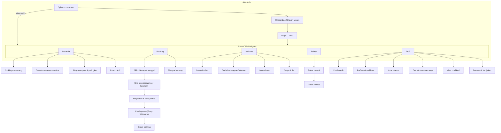
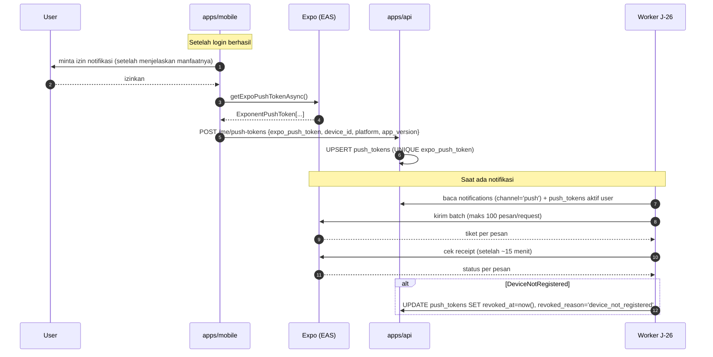
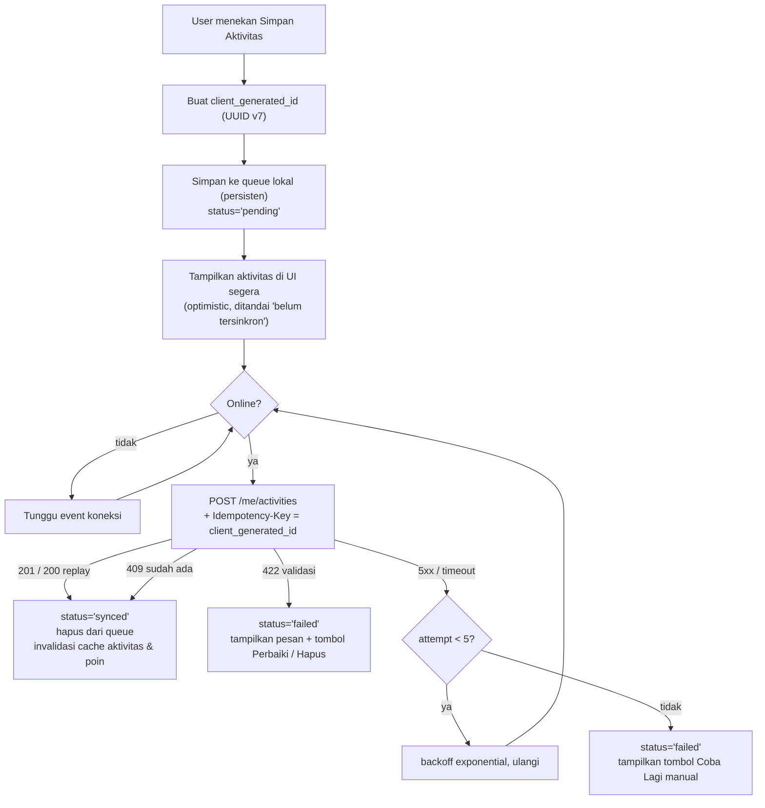

# 15 — MOBILE APP (React Native + Expo)

> Aplikasi mobile adalah **client** dari `apps/api`, sama seperti web. Ia **tidak** punya
> business rule sendiri, **tidak** mengakses database, dan **tidak** menghitung harga.
> Satu-satunya hal yang khusus mobile adalah: pencatatan aktivitas (dengan queue offline),
> push notification, dan perilaku offline.
>
> Prasyarat: [01-ARCHITECTURE.md § 3.4](01-ARCHITECTURE.md#34-appsmobile--react-native-expo),
> [04-API-CONTRACT.md](04-API-CONTRACT.md), [05-AUTH.md](05-AUTH.md).

---

## 1. Tujuan & Ruang Lingkup

Mobile app ditujukan untuk **customer/pemain saja**. Tidak ada fungsi admin, staff, atau tenant
di mobile.

**Termasuk:**

| # | Fitur | Dokumen aturan |
|---|---|---|
| M-1 | Booking lapangan (lihat ketersediaan → checkout → bayar → riwayat) | [06](06-MODULE-BOOKING.md) |
| M-2 | Pencatatan aktivitas olahraga + statistik pribadi | [§ 4](#4-modul-aktivitas-olahraga) |
| M-3 | Konten tutorial (video + teks) | [§ 5](#5-modul-tutorial) |
| M-4 | Leaderboard, poin, tier, badge | [12](12-MODULE-GAMIFICATION.md) |
| M-5 | Daftar & pendaftaran event | [10](10-MODULE-EVENT.md) |
| M-6 | Daftar turnamen, bracket, jadwal match sendiri | [11](11-MODULE-MATCH.md) |
| M-7 | Push notification | [§ 7](#7-push-notification) |
| M-8 | Profil & preferensi notifikasi | [13](13-MODULE-CRM-HRIS.md) |

**Tidak termasuk:** [§ 12](#12-out-of-scope).

### Target platform

| Aspek | Nilai |
|---|---|
| Framework | Expo (managed workflow), SDK terbaru yang stabil saat implementasi dimulai |
| Platform | iOS 15+, Android 8+ (API 26+) |
| Orientasi | Portrait saja |
| Bahasa | Bahasa Indonesia |
| Tema | Light & dark mengikuti sistem |
| Distribusi | App Store & Google Play, dengan EAS Update untuk perbaikan cepat |

---

## 2. Struktur Aplikasi & Navigasi

### Aturan navigasi

| # | Aturan |
|---|---|
| BR-MB-01 | Lima tab, tidak lebih. Fitur baru masuk ke tab yang ada atau ke Profil |
| BR-MB-02 | Booking dapat dilihat tanpa login (tab Booking sampai layar B2). Login diminta saat menekan "Lanjut Bayar" — bukan di awal. Alasan: mengurangi hambatan eksplorasi |
| BR-MB-03 | Leaderboard dan tutorial dapat diakses tanpa login (endpoint publik) |
| BR-MB-04 | Deep link didukung untuk: `hola://booking/{booking_code}`, `hola://event/{slug}`, `hola://tournament/{slug}`, `hola://match/{match_id}`, `hola://leaderboard`. Dipakai push notification |
| BR-MB-05 | Universal/App Link dari domain `hola.id` mengarah ke halaman yang sama bila app terpasang |

---

## 3. Modul Booking di Mobile

Alurnya **identik** dengan web karena memakai endpoint yang sama. Yang berbeda hanya
presentasi dan penanganan pembayaran.

| # | Aturan |
|---|---|
| BR-MB-10 | Ketersediaan dibaca dari `GET /courts/{id}/availability` atau `GET /availability`. Mobile **tidak** menghitung slot atau harga sendiri |
| BR-MB-11 | Harga selalu dari `POST /bookings/quote`. Tidak ada perkalian harga di kode mobile |
| BR-MB-12 | `POST /bookings` wajib mengirim `Idempotency-Key` (UUID v7 dibuat client, disimpan sampai request berhasil) — melindungi dari tap ganda dan retry jaringan |
| BR-MB-13 | Countdown hold dihitung dari `bookings.hold_expires_at` dikurangi offset waktu server (`GET /config/public` → `server_time`). Countdown yang habis **tidak** membatalkan apa pun di client — ia hanya menutup layar checkout dan memuat ulang status booking dari server |
| BR-MB-14 | Pembayaran memakai **Snap** di dalam WebView (`expo-web-browser` mode `openAuthSessionAsync` atau `react-native-webview`). Setelah WebView ditutup, app **wajib** memanggil `GET /payments/{id}` — jangan pernah menganggap pembayaran sukses hanya karena WebView ditutup |
| BR-MB-15 | Setelah kembali dari Snap, app melakukan polling `GET /payments/{id}` tiap 3 detik selama maksimal 90 detik, lalu menampilkan status apa adanya dengan tombol "Periksa lagi". Sumber kebenaran tetap server (webhook + J-06) |
| BR-MB-16 | `X-Client-Platform` diisi `mobile-ios`/`mobile-android`; `X-Client-Version` diisi versi app. Dipakai gate versi minimum |
| BR-MB-17 | Pembatalan booking memakai endpoint yang sama dan **wajib** menampilkan `refund_estimate_amount` + teks kebijakan dari `GET /config/public` sebelum konfirmasi |
| BR-MB-18 | Layar checkout **wajib** menampilkan rincian quote (subtotal, addon, diskon, total) persis seperti response, tanpa perhitungan ulang |

---

## 4. Modul Aktivitas Olahraga

Fitur pencatatan aktivitas pribadi — satu-satunya fitur yang **hanya** ada di mobile.

### 4.1 Tujuan

Memberi pemain buku catatan sederhana: kapan bermain, berapa lama, seberapa intens. Data ini
juga menjadi salah satu sumber poin gamification (dengan nilai kecil dan cap ketat —
[12 § 8 AB-7](12-MODULE-GAMIFICATION.md#81-ancaman--mitigasi)).

### 4.2 Field

| Field | Tipe | Aturan |
|---|---|---|
| `client_generated_id` | uuid | **Dibuat client** (UUID v7), UNIQUE di server. Inti mekanisme sinkronisasi offline |
| `sport_id` | uuid | Wajib |
| `type` | `match` \| `practice` \| `training` \| `other` | Wajib |
| `started_at` | timestamptz | Wajib. Tidak boleh > `now()`, tidak boleh > 30 hari ke belakang |
| `duration_minutes` | int | 10..300 |
| `intensity` | int | 1..5 (skala mandiri) |
| `notes` | text | Maks 500 karakter |
| `booking_id` | uuid | Diisi **server**, bukan client (lihat BR-MB-24) |
| `is_verified` | bool | Diisi **server** |
| `verification_source` | `booking` \| `checkin` \| `manual` \| `none` | Diisi **server** |

### 4.3 Aturan

| # | Aturan |
|---|---|
| BR-MB-20 | `POST /me/activities` wajib mengirim `client_generated_id` dan `Idempotency-Key` (boleh nilai yang sama). UNIQUE `activities.client_generated_id` menjamin pencatatan tidak dobel meskipun request diulang berkali-kali dari queue offline |
| BR-MB-21 | Validasi anti-abuse: dua aktivitas milik user yang sama dengan rentang waktu **bertumpang-tindih** → `422 VALIDATION_ERROR`. Seseorang tidak bisa bermain di dua tempat sekaligus |
| BR-MB-22 | Aktivitas dapat diedit user sendiri (`PATCH`) hanya dalam **7 hari** sejak `started_at`, dan hanya field `duration_minutes`, `intensity`, `notes`, `type`. `started_at` **tidak** dapat diubah |
| BR-MB-23 | Menghapus aktivitas yang sudah berpoin memicu J-20 `gamification.reversePoints`. Kuota harian **tidak** dipulihkan ([12 § 11 E-13](12-MODULE-GAMIFICATION.md#11-edge-cases)) |
| BR-MB-24 | **Aktivitas otomatis dari booking.** Saat booking → `completed`, server membuat baris `activities` dengan `verification_source='booking'`, `is_verified=true`, `booking_id` terisi, `started_at`/`duration_minutes` dari slot — **kecuali** user sudah punya aktivitas yang waktunya bertumpang-tindih (menghindari duplikat) |
| BR-MB-25 | Aktivitas otomatis dari kehadiran event dibuat dengan `verification_source='checkin'` ([10 BR-E-77](10-MODULE-EVENT.md#7-kehadiran--poin)) |
| BR-MB-26 | J-34 `system.reindexActivityVerification` (repeat 1 jam) menandai `is_verified=true` untuk aktivitas mandiri yang **ternyata** cocok dengan booking `completed` milik user itu (court & rentang waktu). Idempoten |
| BR-MB-27 | Poin: hanya aktivitas ber-`verification_source IN ('manual','none')` mendapat `ACTIVITY_LOGGED` (+2, maks 1 aktivitas berpoin per hari). Aktivitas dari booking/event tidak berpoin lagi karena poinnya sudah diberikan `BOOKING_COMPLETED`/`EVENT_ATTENDED` — mencegah hitung ganda |
| BR-MB-28 | `GET /me/activities/summary` mengembalikan agregat siap tampil: total sesi & durasi per minggu/bulan, streak hari aktif berjalan, pecahan per olahraga, dan perbandingan dengan periode sebelumnya. **Dihitung server**, bukan di mobile |

### 4.4 Statistik yang ditampilkan

| Metrik | Sumber |
|---|---|
| Sesi minggu ini / bulan ini | `GET /me/activities/summary` |
| Total durasi (jam) | idem |
| Streak hari aktif berjalan | idem |
| Rata-rata intensitas | idem |
| Pecahan per olahraga | idem |
| Grafik 12 minggu terakhir | idem (array siap plot) |

---

## 5. Modul Tutorial

### 5.1 Konten

| Field | Keterangan |
|---|---|
| `title`, `slug`, `description` | Konten publik |
| `sport_id` | Filter |
| `level` | `beginner` \| `intermediate` \| `advanced` |
| `thumbnail_media_id` | Gambar dari bucket `hola-media` |
| `video_provider` | `youtube` \| `r2` \| `stream` |
| `video_ref` | Video ID YouTube, atau object key R2, atau UID Stream |
| `duration_seconds` | Untuk menampilkan durasi & menghitung progres |
| `sort_order`, `status`, `published_at` | Kurasi |

### 5.2 Hosting video `[BUTUH KEPUTUSAN CLIENT]` (D-05)

Opsi & trade-off lengkap ada di
[02 § 6](02-INFRASTRUCTURE.md#video-tutorial--butuh-keputusan-client-d-05). Ringkas:

| Opsi | Biaya | Ringkas |
|---|---|---|
| **A. YouTube unlisted + embed** *(default v1)* | Rp 0 | Tanpa biaya bandwidth, adaptive bitrate otomatis, player matang (`react-native-youtube-iframe`). Ada branding YouTube; butuh internet; tidak bisa ditonton offline |
| **B. Self-host HLS di R2 + Cloudflare** | Storage murah, egress gratis, **effort transcode besar** | Kontrol penuh, tanpa branding. Butuh pipeline ffmpeg & player HLS |
| **C. Cloudflare Stream** | ~$5/1.000 menit tersimpan + ~$1/1.000 menit ditonton | Transcode & player siap, signed URL. Biaya tumbuh dengan penonton |

**Rekomendasi: Opsi A untuk v1.** Skema data sudah menampung migrasi tanpa perubahan schema:
ganti `video_provider` + `video_ref` dan komponen player.

### 5.3 Aturan

| # | Aturan |
|---|---|
| BR-MB-30 | Mobile memilih komponen player berdasarkan `video_provider`. Kode player diisolasi di satu komponen `<TutorialPlayer provider ref />` sehingga penggantian provider menyentuh satu file |
| BR-MB-31 | Progres menonton dikirim `POST /tutorials/{id}/progress` dengan `watched_seconds` — **maksimal setiap 15 detik** (throttle) dan sekali lagi saat player ditutup. Jangan mengirim per detik |
| BR-MB-32 | Tutorial dianggap `completed` jika `watched_seconds >= 0.9 × duration_seconds`. Server yang memutuskan, bukan client |
| BR-MB-33 | Penyelesaian tutorial memberi `TUTORIAL_COMPLETED` (+3, maks 6/hari, sekali per tutorial) |
| BR-MB-34 | Daftar tutorial dapat dibaca tanpa login; progres & poin butuh login |
| BR-MB-35 | Untuk Opsi A, thumbnail **tetap** diambil dari `hola-media` (bukan dari YouTube) agar tampilan konsisten dan tidak bergantung pihak ketiga |
| BR-MB-36 | Tutorial **tidak** dapat diunduh untuk ditonton offline di v1 (konsekuensi Opsi A) |

---

## 6. Modul Leaderboard

| # | Aturan |
|---|---|
| BR-MB-40 | Membaca `GET /leaderboard?scope=&period_id=&limit=`. Mobile **tidak** mengagregasi poin sendiri |
| BR-MB-41 | Jika response `meta.stale = true`, UI menampilkan penanda "Data mungkin tertunda" + `meta.generated_at`. Ini bagian kontrak, bukan opsional ([12 BR-G-54](12-MODULE-GAMIFICATION.md#64-aturan-leaderboard)) |
| BR-MB-42 | Peringkat sendiri diambil dari `meta.my_rank`/`meta.my_points` — **tidak** dicari dengan menggulir daftar |
| BR-MB-43 | Pemilih scope: `global` dan satu entri per olahraga aktif (`sport:{code}`), dibangun dari `GET /sports` |
| BR-MB-44 | Pemilih periode menampilkan periode aktif + 3 periode tertutup terakhir + `alltime`, dari `GET /leaderboard-periods` |
| BR-MB-45 | Layar poin sendiri memakai `GET /me/points/summary` (poin periode, `lifetime_points`, tier, progres ke tier berikutnya) dan `GET /me/points` (riwayat, cursor pagination) |
| BR-MB-46 | Aturan poin ditampilkan transparan dari `GET /point-rules` — user harus bisa tahu cara mendapat poin tanpa menebak |
| BR-MB-47 | Badge ditampilkan dari `GET /me/badges` + katalog `GET /badges` (badge yang belum diperoleh ditampilkan redup dengan kriterianya) |

---

## 7. Push Notification

### 7.1 Alur registrasi token

### 7.2 Daftar notifikasi push

| Template | Kapan | Kanal | `dedupe_key` | Deep link |
|---|---|---|---|---|
| `booking.confirmed` | Pembayaran booking lunas | push + email | `booking:{id}:confirmed` | `hola://booking/{code}` |
| `booking.reminder_2h` | 2 jam sebelum `starts_at` (J-03) | push | `booking:{id}:reminder2h` | `hola://booking/{code}` |
| `booking.cancelled` | Booking dibatalkan | push + email | `booking:{id}:cancelled` | `hola://booking/{code}` |
| `booking.force_cancelled` | Dibatalkan Hola (force release) | push + email | `booking:{id}:force_cancelled` | `hola://booking/{code}` |
| `payment.refund_completed` | Refund selesai | push + email | `refund:{id}:completed` | `hola://booking/{code}` |
| `event.waitlist_promoted` | Naik dari waitlist | push + email | `event_reg:{id}:promoted` | `hola://event/{slug}` |
| `event.reminder` | 1 hari sebelum event | push | `event:{id}:reminder1d` | `hola://event/{slug}` |
| `event.rescheduled` | Jadwal event berubah | push + email | `event:{id}:rescheduled:{n}` | `hola://event/{slug}` |
| `event.cancelled` | Event dibatalkan | push + email | `event:{id}:cancelled` | `hola://event/{slug}` |
| `tournament.bracket_ready` | Bracket digenerate | push | `tournament:{id}:bracket` | `hola://tournament/{slug}` |
| `match.scheduled` | Match dijadwalkan | push | `match:{id}:scheduled` | `hola://match/{id}` |
| `match.rescheduled` | Jadwal match berubah | push | `match:{id}:rescheduled:{n}` | `hola://match/{id}` |
| `match.result` | Hasil match dicatat | push | `match:{id}:result` | `hola://match/{id}` |
| `tier.upgraded` | Naik tier | push | `tier:{code}` | `hola://profil` |
| `badge.awarded` | Badge baru | push | `badge:{code}` | `hola://profil` |
| `leaderboard.period_result` | Periode ditutup, masuk top 10 | push | `lb:{period_id}` | `hola://leaderboard` |
| `promo.new` | Promo baru dipublikasikan | push | `promo:{id}` | `hola://booking` |

### 7.3 Aturan push

| # | Aturan |
|---|---|
| BR-MB-50 | Izin notifikasi diminta **setelah** login dan **setelah** menampilkan penjelasan singkat manfaatnya — bukan pada peluncuran pertama. Penolakan izin tidak memblokir fitur apa pun |
| BR-MB-51 | Satu user boleh punya beberapa `push_tokens` (beberapa perangkat). Semua yang aktif dikirimi |
| BR-MB-52 | Token dengan `revoked_at` tidak dikirimi. `DeviceNotRegistered` dari Expo → token dicabut otomatis |
| BR-MB-53 | Notifikasi **transaksional** (`booking.*`, `payment.*`, `event.cancelled`, `event.waitlist_promoted`) **tidak dapat** dimatikan lewat preferensi ([02 § 7](02-INFRASTRUCTURE.md#7-notifikasi)) |
| BR-MB-54 | Notifikasi **non-transaksional** (`promo.new`, `badge.awarded`, `tier.upgraded`, `leaderboard.period_result`, `event.reminder`) tunduk `notification_prefs` dan **quiet hours 22:00–07:00 WITA** (ditunda, bukan dibatalkan) |
| BR-MB-55 | Dedupe wajib lewat UNIQUE `(user_id, template_code, dedupe_key)`. Ini yang mencegah spam saat job di-retry |
| BR-MB-56 | Setiap push **juga** menulis baris `inapp` sehingga user punya inbox permanen (`GET /me/notifications`). Push bisa terlewat; inbox tidak |
| BR-MB-57 | Badge count aplikasi = jumlah `notifications` `channel='inapp'` dengan `read_at IS NULL`. Dikirim di payload push sebagai `badge` |
| BR-MB-58 | Payload push memuat `data.deep_link` yang **wajib** ditangani app: buka layar yang tepat, atau layar utama jika rute tidak dikenali (mis. app versi lama) |
| BR-MB-59 | Payload push **tidak boleh** memuat data sensitif. Isinya ringkasan + id |
| BR-MB-60 | Saat app di foreground, notifikasi ditampilkan sebagai banner in-app, bukan notifikasi sistem |
| BR-MB-61 | `POST /me/push-tokens` dipanggil setiap kali app dibuka jika token berubah, dan `last_seen_at` diperbarui. Token yang `last_seen_at` > 90 hari dicabut J-31 |
| BR-MB-62 | Logout memanggil `DELETE /me/push-tokens/{id}` untuk perangkat itu, agar user berikutnya di perangkat yang sama tidak menerima notifikasi orang lain |

---

## 8. Offline Behavior

Prinsip: **baca boleh offline, tulis tidak — dengan tepat satu pengecualian.**

### 8.1 Yang di-cache untuk dibaca offline

Memakai TanStack Query dengan persister ke `expo-sqlite`/`AsyncStorage`.

| Data | TTL cache | Perilaku offline |
|---|---|---|
| Daftar olahraga & lapangan | 24 jam | Tampil dari cache |
| Booking mendatang & riwayat (`/me/bookings`) | 1 jam | Tampil dari cache dengan penanda "terakhir diperbarui …" |
| Detail booking sendiri | 1 jam | idem |
| Daftar tutorial + metadata | 24 jam | Tampil; **video tidak dapat diputar** (butuh internet) |
| Leaderboard | 15 menit | Tampil dari cache dengan penanda basi |
| Poin & badge sendiri | 1 jam | idem |
| Aktivitas sendiri | 24 jam | Tampil, termasuk yang masih di queue |
| Daftar event & turnamen | 1 jam | Tampil dari cache |
| Inbox notifikasi | 1 jam | Tampil dari cache |
| **Ketersediaan slot** | **tidak di-cache untuk offline** | Layar menampilkan "Butuh koneksi internet" |

### 8.2 Aturan offline

| # | Aturan |
|---|---|
| BR-MB-70 | **Ketersediaan slot tidak pernah ditampilkan dari cache offline.** Menampilkan slot yang mungkin sudah diambil orang lain akan membuat user memilih slot dan gagal saat checkout. Layar booking memerlukan koneksi |
| BR-MB-71 | Semua data cache ditampilkan dengan penanda waktu pengambilan bila umurnya melebihi TTL |
| BR-MB-72 | **Tidak ada penulisan offline** untuk: booking, pembayaran, pembatalan, pendaftaran event/turnamen, reschedule. Semua menampilkan "Butuh koneksi internet" |
| BR-MB-73 | **Satu pengecualian: pencatatan aktivitas.** Aktivitas yang dicatat offline masuk queue lokal dan disinkronkan otomatis saat koneksi kembali |
| BR-MB-74 | Queue aktivitas: setiap item punya `client_generated_id` (UUID v7 dibuat client) yang dikirim sebagai body **dan** `Idempotency-Key`. UNIQUE di server menjamin tidak dobel meskipun dikirim berkali-kali |
| BR-MB-75 | Queue disimpan di penyimpanan persisten (bertahan setelah app ditutup), diproses berurutan (FIFO) saat online, dengan retry exponential backoff maksimum 5 kali per item |
| BR-MB-76 | Item queue yang gagal karena `422` (validasi) **tidak** di-retry — ia ditandai gagal dan ditampilkan ke user untuk diperbaiki/dihapus. Retry hanya untuk kegagalan jaringan/5xx |
| BR-MB-77 | UI menampilkan jumlah item queue yang belum tersinkron di tab Aktivitas |
| BR-MB-78 | Batas queue: 50 item. Melebihi itu, pencatatan baru ditolak dengan pesan agar user online lebih dulu |
| BR-MB-79 | Access token yang kedaluwarsa saat offline tidak dapat di-refresh. App menampilkan konten cache dan meminta koneksi saat user melakukan aksi yang butuh server. **Tidak** memaksa logout hanya karena offline |
| BR-MB-80 | Deteksi konektivitas memakai `expo-network` + hasil request nyata. Status "online" dari OS tidak selalu berarti API dapat dihubungi (captive portal), jadi kegagalan request juga memicu mode offline |

### 8.3 Diagram queue aktivitas

---

## 9. Event & Turnamen di Mobile

| # | Aturan |
|---|---|
| BR-MB-90 | Daftar & detail event dibaca dari endpoint publik yang sama dengan web. Mobile hanya melihat event berstatus ≥ `published` |
| BR-MB-91 | Pendaftaran event memakai `POST /events/{id}/registrations` + `Idempotency-Key`. Response menyatakan apakah `confirmed`, `pending_payment`, atau `waitlisted` — UI **wajib** menampilkan ketiga kemungkinan itu dengan jelas, termasuk **posisi waitlist** |
| BR-MB-92 | Event berbayar memakai alur Snap yang sama dengan booking (BR-MB-14/15). Tenggat pembayaran waitlist 60 menit ditampilkan sebagai countdown |
| BR-MB-93 | Bracket turnamen ditampilkan **read-only**, dengan gulir horizontal per babak. Mobile tidak menggambar bracket dari data mentah — endpoint `GET /tournaments/{id}/bracket` sudah mengembalikan struktur siap render (rounds → matches → peserta) |
| BR-MB-94 | Klasemen round-robin ditampilkan dari `GET /tournaments/{id}/standings`. Jika `meta.warnings` memuat `STANDINGS_NOT_APPLICABLE` (format knockout), tab klasemen disembunyikan |
| BR-MB-95 | "Match saya" dari `GET /me/matches` menampilkan jadwal, lapangan, lawan, dan hasil |
| BR-MB-96 | Mobile **tidak** dapat menginput skor ([11 § 6](11-MODULE-MATCH.md#6-input-skor--siapa-yang-berhak)) |

---

## 10. Rilis & Versioning

| Aspek | Aturan |
|---|---|
| Build & submit | EAS Build + EAS Submit. Profil: `development`, `preview` (internal distribution), `production` |
| Versi | `version` (semver, mis. `1.3.0`) untuk rilis store; `runtimeVersion` mengikuti kebijakan `appVersion` sehingga EAS Update hanya menyentuh build yang kompatibel |
| Nomor build | `ios.buildNumber` & `android.versionCode` dinaikkan otomatis oleh EAS |
| **EAS Update (OTA)** | Untuk perbaikan JS/aset saja. **Tidak** untuk perubahan native, izin baru, atau perubahan `runtimeVersion` |
| Gate versi minimum | `GET /config/public` mengembalikan `min_supported_mobile_version`. App yang lebih lama menampilkan layar blocking "Perbarui aplikasi" dengan tautan store. Ini satu-satunya cara memaksa update |
| Kapan menaikkan `min_supported_mobile_version` | Hanya jika API melakukan perubahan yang tidak kompatibel dan versi `v1` lama tidak dapat dipertahankan. Karena API memakai versioning path ([04 § 2](04-API-CONTRACT.md#2-versioning)), ini seharusnya jarang |
| Toleransi enum baru | App **wajib** menangani nilai enum yang tidak dikenal secara aman (label = nilai mentah, ikon default). Diuji ([04 § 11 E-9](04-API-CONTRACT.md#11-edge-cases-api)) |
| Sentry | `release` = `{version}+{buildNumber}`, `dist` = `runtimeVersion`. Source map diunggah saat build |
| CI | `mobile-preview.yml` (manual) membuat build `preview`. Mobile **tidak** ikut pipeline deploy Dokploy |
| Rollback OTA | EAS Update mendukung `republish` versi sebelumnya. Ini jalur perbaikan tercepat |

---

## 11. Edge Cases

| # | Kondisi | Perilaku yang diharapkan |
|---|---|---|
| E-1 | App dibuka tanpa koneksi | Tab Beranda, Aktivitas, Belajar, Profil menampilkan cache dengan penanda basi. Tab Booking menampilkan "Butuh koneksi internet". Tidak ada crash, tidak ada logout |
| E-2 | Koneksi hilang di tengah checkout | `POST /bookings` gagal → tidak ada booking terbentuk (atau terbentuk tetapi response hilang). App mengirim ulang dengan `Idempotency-Key` yang sama; jika booking sudah ada, response tersimpan diputar ulang dan user melanjutkan. Ini alasan `Idempotency-Key` wajib |
| E-3 | Koneksi hilang setelah membuka Snap | Pembayaran tetap berjalan di sisi Midtrans. Saat app kembali online, `GET /payments/{id}` menunjukkan status sebenarnya. Webhook + J-06 tetap mengonfirmasi booking meskipun app tidak pernah dibuka lagi |
| E-4 | User menutup Snap tanpa membayar | Payment tetap `pending` sampai `expires_at`. Hold slot habis dalam 10 menit dan booking → `expired`. User dapat memulai checkout ulang |
| E-5 | User membayar tetapi app di-kill sebelum polling | Server tetap mengonfirmasi (webhook). Saat app dibuka lagi, booking sudah `confirmed`. Push `booking.confirmed` juga terkirim |
| E-6 | Hold habis saat user masih di layar pembayaran | Countdown mencapai nol → app memuat ulang status booking, menampilkan "Waktu pembayaran habis" + tombol pesan ulang. Jika pembayaran ternyata masuk terlambat, jalur pemulihan server berlaku ([06 § 11 E-6](06-MODULE-BOOKING.md#11-edge-cases)) |
| E-7 | Jam perangkat tidak akurat | Countdown dihitung dengan offset dari `server_time` (BR-MB-13). Kalaupun tampilan salah, hold sebenarnya ditentukan server |
| E-8 | User mencatat 20 aktivitas offline | Queue memproses berurutan saat online; semuanya tersimpan. Hanya **satu** yang berpoin (cap harian, BR-MB-27) — sisanya tetap tercatat untuk statistik pribadi |
| E-9 | Item queue aktivitas ditolak `422` karena tumpang-tindih waktu | Item ditandai gagal, user diberi pesan spesifik dan pilihan memperbaiki durasi/waktu atau menghapus. **Tidak** di-retry otomatis (BR-MB-76) |
| E-10 | App di-uninstall lalu di-install ulang | Queue lokal hilang. Aktivitas yang belum tersinkron **hilang** — ini keterbatasan yang diterima; queue bukan penyimpanan permanen. Aktivitas yang sudah tersinkron tetap ada di server |
| E-11 | User login di perangkat kedua | Kedua perangkat punya `push_tokens` sendiri; keduanya menerima notifikasi. Batas 10 refresh token aktif berlaku ([05 T-5](05-AUTH.md#5-siklus-hidup-token)) |
| E-12 | User menolak izin notifikasi | Tidak ada `push_tokens` dibuat. Notifikasi transaksional tetap terkirim lewat email. Inbox in-app tetap terisi. App menampilkan pengingat lembut sekali di Profil, tidak berulang |
| E-13 | Token push kedaluwarsa/tidak valid | Expo mengembalikan `DeviceNotRegistered` → token dicabut server (BR-MB-52). Registrasi ulang terjadi otomatis saat app dibuka |
| E-14 | Video tutorial tidak dapat diputar (YouTube diblokir jaringan) | Player menampilkan pesan gagal + tombol "Buka di YouTube" (deep link eksternal). Tidak ada fallback lain di Opsi A |
| E-15 | Response API memuat nilai enum yang tidak dikenal app | Ditangani sebagai nilai mentah dengan tampilan default — bagian kontrak API di [04 § 11 E-9](04-API-CONTRACT.md#11-edge-cases-api). Tidak crash, tidak menampilkan layar error |
| E-16 | Server mengembalikan `stale: true` untuk leaderboard | UI menampilkan penanda basi (BR-MB-41). Bukan error |
| E-17 | Access token kedaluwarsa saat app di background lama | Request pertama setelah dibuka mendapat `401 TOKEN_EXPIRED`; client melakukan refresh single-flight lalu mengulang. Transparan bagi user |
| E-18 | Refresh token dicabut karena deteksi reuse | Semua request `401 TOKEN_REVOKED` → app membersihkan `expo-secure-store` dan mengarahkan ke login dengan pesan "Sesi berakhir, silakan masuk kembali" |
| E-19 | App versi lama memanggil endpoint yang sudah berubah | API `v1` dipertahankan minimal 6 bulan. Jika benar-benar tidak kompatibel, `min_supported_mobile_version` dinaikkan dan app menampilkan layar update paksa |
| E-20 | Deep link ke event yang sudah dibatalkan | Layar event tetap dibuka dan menampilkan status `cancelled` beserta informasi refund. Bukan error 404 di UI |
| E-21 | Deep link ke booking milik orang lain | API mengembalikan `404` ([04 § 11 E-3](04-API-CONTRACT.md#11-edge-cases-api)). App menampilkan "Booking tidak ditemukan" |
| E-22 | User berperan `admin`/`staff`/`tenant` login di mobile | Login **berhasil** (API tidak membedakan), tetapi app hanya menampilkan fitur customer. Endpoint `/me/*` yang butuh `customer_profiles` mengembalikan data kosong. Layar Profil menampilkan catatan bahwa fungsi admin ada di dashboard web. **Tidak** memblokir login, agar tidak ada kebingungan "password saya salah" |
| E-23 | Tarik-untuk-menyegarkan di layar ketersediaan | Menginvalidasi query dan memuat ulang. Cache Redis sisi server tetap 60 detik, jadi hasilnya bisa sama — UI menampilkan `generated_at` |
| E-24 | Pendaftaran event penuh saat user menekan Daftar | `409 EVENT_FULL` atau otomatis `waitlisted` bergantung konfigurasi event. UI menampilkan hasilnya, tidak menganggapnya error teknis |

---

## 12. Out of Scope

- **Fungsi admin/staff/tenant di mobile.** Dashboard hanya di web.
- **Pembayaran dengan SDK native Midtrans.** Memakai Snap WebView.
- **Menonton tutorial offline / unduh video.**
- **Chat / pesan antar pemain, atau chat dengan admin.**
- **Mencari partner bermain / matchmaking.**
- **Feed sosial, komentar, like.**
- **Berbagi pencapaian ke media sosial.**
- **Integrasi wearable / HealthKit / Google Fit** untuk mengimpor aktivitas otomatis.
- **Pelacakan GPS atau sensor gerak** saat bermain.
- **Widget layar utama.**
- **Apple Watch / Wear OS.**
- **Tablet layout khusus** (app tetap berjalan, tetap layout ponsel).
- **Bahasa selain Indonesia.**
- **Login biometrik** (Face ID / fingerprint) untuk membuka app.
- **Input skor pertandingan oleh pemain.**
- **QR code check-in mandiri.**
- **Penulisan offline** selain queue aktivitas (BR-MB-72).
- **Notifikasi realtime perubahan ketersediaan slot.**
- **In-app purchase / langganan lewat store** (pembayaran lewat payment gateway lokal).
