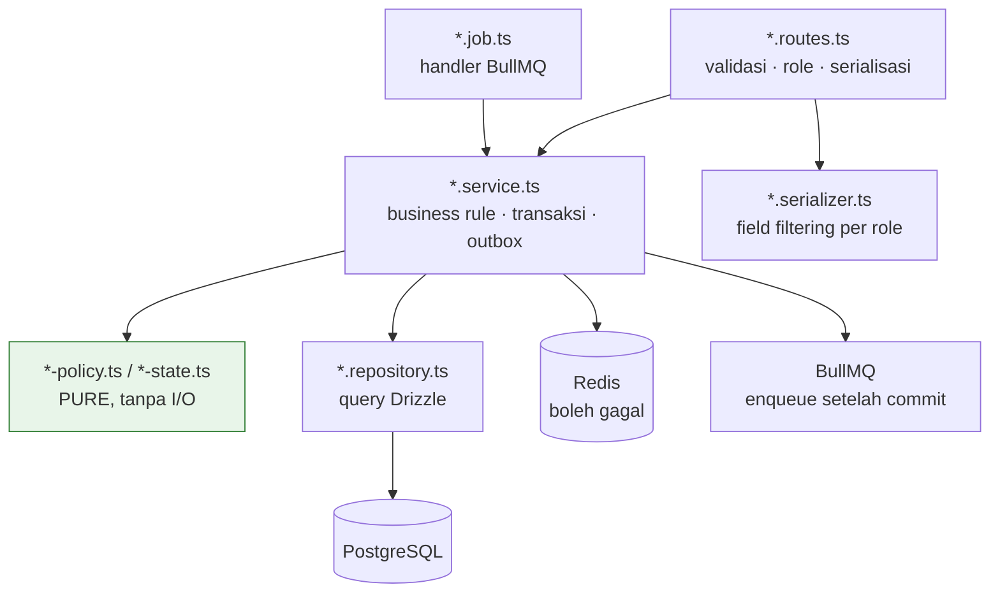

# 16 — CONVENTIONS (Kode & Struktur)

> Baca ini **sebelum** menulis file pertama. Konvensi di sini bukan preferensi gaya — ia
> menentukan apakah aturan arsitektur di [01-ARCHITECTURE.md](01-ARCHITECTURE.md) benar-benar
> ditegakkan.
>
> Nama tabel/kolom: [03-DATA-MODEL.md § 1](03-DATA-MODEL.md#1-aturan-umum--konvensi-penamaan).
> Nama endpoint: [04-API-CONTRACT.md § 3](04-API-CONTRACT.md#3-konvensi-url-metode--penamaan).
> Nama job: [02-INFRASTRUCTURE.md § 5](02-INFRASTRUCTURE.md#5-daftar-lengkap-bullmq-jobs).

---

## 1. TypeScript

### 1.1 Konfigurasi

Satu `tsconfig.base.json` di root; setiap app/package meng-`extends` darinya.

| Opsi | Nilai | Alasan |
|---|---|---|
| `strict` | `true` | Non-negosiabel |
| `noUncheckedIndexedAccess` | `true` | `arr[0]` bertipe `T \| undefined`. Menangkap kelas bug indeks yang nyata (mis. `sets[0]` pada match tanpa set) |
| `exactOptionalPropertyTypes` | `true` | Membedakan "tidak ada" dari "ada bernilai undefined" — penting untuk `PATCH` parsial |
| `noImplicitOverride` | `true` | — |
| `noFallthroughCasesInSwitch` | `true` | Penting untuk `switch` atas enum status |
| `verbatimModuleSyntax` | `true` | Memastikan `import type` benar-benar hilang saat compile. Ini yang menjaga `packages/api-client` tidak menarik runtime `apps/api` ke bundle frontend |
| `moduleResolution` | `bundler` | — |
| `target` | `ES2022` | Node 20+ dan Hermes mendukungnya |
| `skipLibCheck` | `true` | Kecepatan; tipe kita sendiri tetap diperiksa penuh |
| `isolatedModules` | `true` | — |

### 1.2 Aturan tipe

| # | Aturan |
|---|---|
| BR-TS-01 | **`any` dilarang.** Pakai `unknown` lalu sempitkan. Biome menandainya error, bukan warning |
| BR-TS-02 | Type assertion (`as`) hanya untuk: hasil `JSON.parse` yang sudah divalidasi zod, dan interop library tanpa tipe. Setiap `as` di luar itu butuh komentar satu baris yang menjelaskan mengapa aman |
| BR-TS-03 | **`!` (non-null assertion) dilarang** kecuali langsung setelah pemeriksaan yang tidak bisa dipahami compiler, dengan komentar. Umumnya: pakai guard eksplisit yang melempar error bermakna |
| BR-TS-04 | Tipe domain **selalu** diturunkan dari zod (`z.infer<typeof schema>`) atau dari Drizzle (`InferSelectModel`). Jangan menulis `interface` manual yang menduplikasi bentuk yang sudah ada |
| BR-TS-05 | Enum TypeScript (`enum`) **dilarang**. Pakai `as const` object + union type, agar sejalan dengan zod dan enum PostgreSQL |
| BR-TS-06 | Semua fungsi yang diekspor punya tipe return **eksplisit**. Fungsi lokal boleh diinferensi |
| BR-TS-07 | **Uang bertipe `number` di TypeScript**, meskipun kolomnya `bigint` di PostgreSQL. Nilai rupiah yang realistis jauh di bawah `Number.MAX_SAFE_INTEGER` (2^53), jadi aman sebagai integer JS dan jauh lebih nyaman dipakai. Drizzle mengembalikan `bigint` sebagai `string` secara default — konfigurasikan kolom uang agar dipetakan ke `number` dengan mode integer, dan validasi dengan `z.number().int()`. Yang **dilarang** adalah desimal/float untuk uang |
| BR-TS-08 | Tanggal/waktu lintas batas (API, DB) selalu **string ISO 8601** atau `Date`. **Tidak** memakai timestamp numerik. Konversi WITA hanya di lapisan presentasi |
| BR-TS-09 | ID selalu `string` (uuid). Jangan pakai branded type di v1 — biayanya melebihi manfaatnya pada ukuran tim ini |
| BR-TS-10 | Fungsi yang bergantung waktu **wajib** menerima `now: Date` sebagai parameter, bukan memanggil `new Date()` di dalamnya. Ini prasyarat pengujian pipeline harga, kebijakan refund, dan cap poin |

---

## 2. Biome

Satu `biome.json` di root, dengan override per app.

### Aturan yang wajib aktif

| Aturan | Level | Alasan |
|---|---|---|
| `suspicious/noExplicitAny` | error | BR-TS-01 |
| `suspicious/noConsole` | error di `apps/api` | API memakai pino, bukan `console` |
| `style/noNonNullAssertion` | error | BR-TS-03 |
| `correctness/noUnusedVariables` | error | — |
| `correctness/noUnusedImports` | error | — |
| `complexity/noBannedTypes` | error | — |
| `nursery/noFloatingPromises` (atau padanan) | error | Promise yang tidak di-await adalah sumber bug senyap di service & job |
| `style/useConst` | error | — |
| `style/noParameterAssign` | error | — |
| **`style/noRestrictedImports`** | **error** | **Inti penegakan batas arsitektur — lihat di bawah** |

### `noRestrictedImports` per app

| App/package | Pola yang dilarang | Alasan |
|---|---|---|
| `apps/web`, `apps/admin`, `apps/mobile` | `@hola/db`, `drizzle-orm`, `postgres`, `pg`, `ioredis`, `bullmq`, `argon2`, `midtrans-client` | [01 § 2](01-ARCHITECTURE.md#2-aturan-keras-semua-akses-database-lewat-appsapi) |
| `packages/shared` | `fs`, `path`, `crypto` (Node), `pg`, `ioredis`, `@hola/db`, apa pun yang menyentuh `process.env` | Harus jalan di React Native |
| `packages/api-client` | `@hola/db`, `drizzle-orm`, dan **runtime** import dari `apps/api` (hanya `import type` yang diizinkan) | Menjaga bundle frontend bersih |
| `apps/api` | `next`, `react`, `react-native`, `expo*` | API tidak boleh menarik dependensi UI |

### Format

| Aspek | Nilai |
|---|---|
| Indent | 2 spasi |
| Lebar baris | 100 |
| Quote | single (`'`) untuk TS/JS, double untuk JSX attribute |
| Semicolon | `asNeeded` |
| Trailing comma | `all` |
| Import organizing | aktif (Biome mengurutkan otomatis) |

CI menjalankan `biome ci .` (tanpa write). Developer memakai `pnpm lint:fix`.

---

## 3. Penamaan File & Folder

| Jenis | Konvensi | Contoh |
|---|---|---|
| Folder | `kebab-case` | `slot-claims/`, `price-rules/` |
| File TypeScript umum | `kebab-case.ts` | `pricing-pipeline.ts` |
| File berperan khusus | `kebab-case.<peran>.ts` | `booking.service.ts`, `booking.repository.ts`, `booking.routes.ts`, `booking.schema.ts` |
| Test | `<nama>.test.ts` di samping file yang diuji | `pricing-pipeline.test.ts` |
| Test integrasi | `<nama>.integration.test.ts` | `booking-claim.integration.test.ts` |
| Komponen React | `PascalCase.tsx` | `SlotGrid.tsx`, `BookingSummary.tsx` |
| Hook React | `use-<nama>.ts` | `use-availability.ts` |
| Next.js App Router | mengikuti konvensi framework | `app/(customer)/booking/page.tsx` |
| Job BullMQ | `<jobName>.job.ts` di folder queue-nya | `jobs/booking/release-expired-holds.job.ts` |
| Migration | dihasilkan drizzle-kit, jangan di-rename | `0007_add_slot_claims.sql` |
| Konstanta | `kebab-case.ts` di `constants/` | `constants/error-codes.ts` |

### Peran file (suffiks) di `apps/api`

| Suffiks | Isi | Boleh import |
|---|---|---|
| `.routes.ts` | Definisi route Hono, middleware, `zValidator`, pemanggilan service, serialisasi response | service, schema, serializer |
| `.service.ts` | Business rule, orkestrasi transaksi, enqueue job | repository, service lain, shared |
| `.repository.ts` | Query Drizzle. **Satu-satunya** tempat `db.select`/`insert`/`update` | `@hola/db`, drizzle |
| `.serializer.ts` | Memetakan entity → DTO response, termasuk field-level filtering per role | shared |
| `.schema.ts` | Re-export zod schema dari `packages/shared` + schema khusus internal | shared |
| `.job.ts` | Handler job BullMQ | service |
| `.mapper.ts` | Konversi bentuk data (mis. payload Midtrans → domain) | shared |

**Aturan aliran dependensi:** `routes → service → repository → db`. Tidak boleh membalik arah.
Repository **tidak boleh** memanggil service. Service **tidak boleh** menyentuh objek
`Request`/`Response` Hono.

---

## 4. Struktur Folder

### 4.1 Root

```
hola-platform/
├── apps/
│   ├── api/
│   ├── web/
│   ├── admin/
│   └── mobile/
├── packages/
│   ├── db/
│   ├── shared/
│   └── api-client/
├── docs/                      ← dokumen ini
├── docker-compose.yml         ← infra lokal (postgres, redis, RustFS, mailpit)
├── biome.json
├── turbo.json
├── pnpm-workspace.yaml
├── tsconfig.base.json
└── package.json
```

### 4.2 `apps/api`

```
apps/api/
├── src/
│   ├── index.ts                  ← entry HTTP (Hono app + serve)
│   ├── worker.ts                 ← entry worker (semua BullMQ Worker)
│   ├── bullboard.ts              ← entry dashboard queue
│   ├── app.ts                    ← komposisi Hono: middleware global + mount routes, ekspor AppType
│   ├── env.ts                    ← validasi env dengan zod (gagal keras saat boot)
│   ├── config/
│   │   ├── db.ts                 ← koneksi Drizzle (satu instance)
│   │   ├── redis.ts              ← koneksi ioredis (satu instance + satu untuk BullMQ)
│   │   ├── storage.ts            ← klien S3
│   │   ├── logger.ts             ← pino
│   │   └── sentry.ts
│   ├── middleware/
│   │   ├── request-id.ts
│   │   ├── logger.ts
│   │   ├── error-handler.ts      ← satu-satunya tempat error → response
│   │   ├── rate-limit.ts
│   │   ├── authenticate.ts
│   │   ├── require-role.ts
│   │   └── idempotency.ts
│   ├── lib/
│   │   ├── errors.ts             ← kelas AppError + factory per error code
│   │   ├── response.ts           ← helper envelope {data} / {error}
│   │   ├── pagination.ts         ← cursor encode/decode, offset helper
│   │   ├── transaction.ts        ← helper withTransaction
│   │   ├── outbox.ts             ← helper insert point_events / finance_events
│   │   ├── codes.ts              ← generator booking_code, invoice_number, dst.
│   │   └── time.ts               ← konversi WITA, slot grid, ISO week
│   ├── modules/
│   │   ├── auth/
│   │   ├── users/
│   │   ├── courts/
│   │   ├── pricing/              ← SATU-SATUNYA pipeline harga (07 § 3)
│   │   ├── slots/                ← SATU-SATUNYA mekanisme klaim slot (03 § 8)
│   │   ├── bookings/
│   │   ├── payments/
│   │   ├── refunds/
│   │   ├── promos/
│   │   ├── events/
│   │   ├── tournaments/
│   │   ├── gamification/
│   │   ├── activities/
│   │   ├── tutorials/
│   │   ├── cafe/
│   │   ├── crm/
│   │   ├── hris/
│   │   ├── finance/
│   │   ├── media/
│   │   ├── notifications/
│   │   └── admin/
│   ├── jobs/
│   │   ├── index.ts              ← registrasi semua Worker + JobScheduler
│   │   ├── booking/
│   │   ├── payment/
│   │   ├── commerce/
│   │   ├── gamification/
│   │   ├── notification/
│   │   └── system/
│   └── providers/
│       ├── payment/              ← port PaymentProvider + MidtransProvider + ManualProvider
│       ├── mail/                 ← port MailAdapter + Resend/SMTP/console
│       ├── push/                 ← ExpoPushAdapter
│       └── whatsapp/             ← port + NoopAdapter (flag off)
├── Dockerfile
├── .env.example
└── package.json
```

Isi satu folder modul (contoh `bookings/`):

```
modules/bookings/
├── booking.routes.ts
├── booking.service.ts
├── booking.repository.ts
├── booking.serializer.ts
├── booking.schema.ts             ← re-export dari @hola/shared + schema internal
├── booking-state.ts             ← fungsi transisi status (pure)
├── booking-refund.ts            ← computeRefundAmount (pure)
├── booking.service.test.ts
├── booking-state.test.ts
├── booking-refund.test.ts
└── booking-claim.integration.test.ts
```

### 4.3 `packages/shared`

```
packages/shared/src/
├── index.ts
├── constants/
│   ├── enums.ts                  ← semua enum (harus identik dengan enum PostgreSQL)
│   ├── error-codes.ts            ← katalog ERROR_CODE (04 § 5)
│   ├── queues.ts                 ← QUEUE.* dan JOB.* (02 § 5)
│   ├── point-rules.ts            ← POINT_RULE_CODE
│   ├── notification-templates.ts ← TEMPLATE_CODE
│   ├── limits.ts                 ← batas numerik (durasi hold, maks slot, dst.)
│   └── settings-keys.ts          ← kunci app_settings
├── schemas/
│   ├── common.ts                 ← paginationQuery, idParam, dateRange, money, isoDateTime
│   ├── auth.ts
│   ├── booking.ts
│   ├── payment.ts
│   ├── promo.ts
│   ├── event.ts
│   ├── tournament.ts
│   ├── gamification.ts
│   ├── cafe.ts
│   ├── crm.ts
│   ├── hris.ts
│   ├── finance.ts
│   ├── media.ts
│   └── activity.ts
├── types/
│   └── quote.ts                  ← tipe Quote (07 § 3.1)
├── format/
│   ├── money.ts                  ← formatIDR
│   ├── date.ts                   ← formatWita, formatDateRange
│   └── duration.ts
├── redis-keys.ts                 ← builder key Redis (02 § 4.1)
└── utils/
    ├── slot-grid.ts              ← isSlotAligned, buildSlotGrid (pure)
    ├── round.ts                  ← roundTo100
    └── iso-week.ts
```

### 4.4 `apps/web` & `apps/admin`

```
apps/<web|admin>/src/
├── app/                          ← Next.js App Router
│   ├── (public)/ | (customer)/ | (dashboard)/
│   ├── layout.tsx
│   └── api/                      ← HANYA route handler yang tidak menyentuh DB
│                                    (mis. proxy webhook Sentry). Tidak ada query DB.
├── components/
│   ├── ui/                       ← primitif (Button, Input, Dialog)
│   └── <domain>/                 ← komponen per domain (booking/, promo/)
├── features/
│   └── <domain>/
│       ├── use-<query>.ts        ← hook TanStack Query
│       ├── <Domain>Form.tsx
│       └── <Domain>Table.tsx
├── lib/
│   ├── api-client.ts             ← instance dari @hola/api-client
│   ├── auth.ts                   ← penyimpanan access token di memori + refresh
│   └── query-client.ts
└── styles/
```

### 4.5 `apps/mobile`

```
apps/mobile/
├── app/                          ← Expo Router
│   ├── (tabs)/
│   │   ├── index.tsx             ← Beranda
│   │   ├── booking.tsx
│   │   ├── activity.tsx
│   │   ├── learn.tsx
│   │   └── profile.tsx
│   ├── (auth)/
│   ├── booking/[code].tsx
│   ├── event/[slug].tsx
│   ├── tournament/[slug].tsx
│   └── _layout.tsx
├── src/
│   ├── features/<domain>/
│   ├── components/
│   ├── lib/
│   │   ├── api-client.ts
│   │   ├── secure-store.ts       ← refresh token
│   │   ├── offline-queue.ts      ← queue aktivitas (15 § 8)
│   │   ├── push.ts
│   │   └── query-persist.ts
│   └── theme/
├── app.config.ts
└── eas.json
```

---

## 5. Pola Service / Repository di Hono

### 5.1 Bentuk route

Aturan, bukan kode:

| # | Aturan |
|---|---|
| BR-SV-01 | Route handler maksimal melakukan **empat** hal: validasi (`zValidator`), ambil konteks (user, role), panggil **satu** fungsi service, serialisasi response. Tidak ada `if` business rule di route |
| BR-SV-02 | Route **tidak boleh** mengimpor repository atau `@hola/db` |
| BR-SV-03 | Setiap route punya `requireRole([...])` eksplisit, kecuali yang terdaftar di allowlist publik (`app.ts`). Route tanpa keduanya **gagal saat boot** — ada pemeriksaan di `app.ts` yang membandingkan daftar route terdaftar dengan daftar route yang punya guard |
| BR-SV-04 | Error dilempar sebagai `AppError` dari service; route **tidak** menangkapnya. Satu `error-handler` middleware memetakannya ke response ([04 § 5](04-API-CONTRACT.md#5-format-error)) |
| BR-SV-05 | `AppType` diekspor dari `app.ts` untuk `packages/api-client`. Route baru otomatis bertipe di client tanpa langkah tambahan |

### 5.2 Bentuk service

| # | Aturan |
|---|---|
| BR-SV-10 | Service adalah **fungsi**, bukan class dengan state. Dependensi diterima sebagai parameter pertama (`ctx`) yang memuat `db`, `redis`, `queues`, `logger`, `now`, `actor` |
| BR-SV-11 | Service menerima input yang **sudah tervalidasi & bertipe**. Ia tidak memvalidasi bentuk ulang, tetapi **wajib** memvalidasi aturan bisnis (yang butuh data) |
| BR-SV-12 | Satu operasi bisnis = satu fungsi service dengan nama verba: `createBooking`, `cancelBooking`, `claimSlots`, `computeQuote`, `markPaid` |
| BR-SV-13 | Transaksi dimulai dan diakhiri di **service**, bukan di repository. Repository menerima `tx` opsional sebagai parameter pertama sehingga dapat dikomposisi |
| BR-SV-14 | Enqueue job dilakukan **setelah** transaksi commit (lewat callback `afterCommit` dari helper `withTransaction`). Untuk pekerjaan yang tidak boleh hilang, tulis outbox **di dalam** transaksi ([01 § 5](01-ARCHITECTURE.md#5-alur-request-standar)) |
| BR-SV-15 | Service yang bergantung waktu memakai `ctx.now` (BR-TS-10) |
| BR-SV-16 | Service yang memanggil Redis **wajib** menanganinya sebagai operasi yang boleh gagal (§ 7) |
| BR-SV-17 | Perhitungan murni (state machine, kebijakan refund, pipeline harga, seeding bracket, tiebreaker klasemen) dipisahkan ke file `*-state.ts` / `*-policy.ts` yang **tanpa I/O**, sehingga dapat diuji dengan tabel kasus |
| BR-SV-18 | Service lintas modul dipanggil langsung sebagai fungsi (mis. `bookings.service` memanggil `slots.claim` dan `pricing.computeQuote`). **Tidak** lewat HTTP internal, **tidak** lewat event bus |
| BR-SV-19 | Ketergantungan sirkular antar service dilarang. Jika A dan B saling butuh, ekstrak bagian bersamanya ke modul ketiga (mis. `slots` dipakai `bookings`, `events`, `tournaments` — dan `slots` tidak memanggil ketiganya) |

### 5.3 Bentuk repository

| # | Aturan |
|---|---|
| BR-SV-20 | Repository adalah kumpulan fungsi query. Setiap fungsi menerima `(tx \| db, params)` dan mengembalikan baris/array baris |
| BR-SV-21 | Repository **tidak** melempar `AppError` bisnis. Ia mengembalikan `null`/`[]`; service yang memutuskan itu error apa |
| BR-SV-22 | Pengecualian: kesalahan constraint database (unique violation) **diterjemahkan** di repository menjadi error bertipe (`UniqueViolationError` dengan nama constraint), agar service dapat memetakannya ke error bisnis yang tepat (mis. `uq_slot_claims_active` → `SLOT_ALREADY_CLAIMED`) |
| BR-SV-23 | Query dengan otorisasi kepemilikan punya varian terpisah: `findByIdForUser(tx, id, userId)` vs `findByIdAdmin(tx, id)` ([05 § 7 O-2](05-AUTH.md#7-otorisasi-berbasis-kepemilikan)) |
| BR-SV-24 | Tidak ada `SELECT *` implisit yang dikirim ke client. Serializer selalu memilih field secara eksplisit |
| BR-SV-25 | Raw SQL (`sql\`\``) diizinkan untuk: partial index, `ON CONFLICT` kompleks, agregasi laporan, dan `FOR UPDATE SKIP LOCKED`. Wajib memakai parameter binding, **tidak pernah** interpolasi string |
| BR-SV-26 | Query yang mengembalikan koleksi **wajib** punya `LIMIT`. Tidak ada query tanpa batas |

### 5.4 Diagram lapisan



---

## 6. Pola BullMQ

### 6.1 Struktur

| # | Aturan |
|---|---|
| BR-BQ-01 | Nama queue & job **hanya** dari konstanta di `packages/shared/src/constants/queues.ts`. String literal dilarang. Tipenya union sehingga typo tertangkap compiler |
| BR-BQ-02 | Satu file per job: `jobs/<queue>/<job-name>.job.ts`, mengekspor `{ name, handler, options }` |
| BR-BQ-03 | `jobs/index.ts` mendaftarkan semua `Worker` dan `JobScheduler`. Daftar job **wajib** lengkap — ada test yang membandingkan konstanta `JOB.*` dengan job yang terdaftar; ketidaksesuaian = test gagal |
| BR-BQ-04 | Job repeatable/cron didaftarkan dengan `upsertJobScheduler` memakai `jobId` **tetap**, sehingga restart worker memulihkan jadwal tanpa duplikasi ([02 § 5.3](02-INFRASTRUCTURE.md#53-ketahanan-job-terhadap-kehilangan-redis)) |
| BR-BQ-05 | Semua job cron memakai `{ tz: 'Asia/Makassar' }` eksplisit |
| BR-BQ-06 | `Queue` (producer) dibuat di `config/redis.ts` dan dibagikan lewat `ctx.queues`. `Worker` **hanya** dibuat di proses worker (`worker.ts`), tidak pernah di proses HTTP |
| BR-BQ-07 | Payload job **hanya** id + nilai skalar minimal. Handler membaca ulang dari PostgreSQL ([02 § 5.4](02-INFRASTRUCTURE.md#54-aturan-umum-job)) |
| BR-BQ-08 | Payload job punya zod schema sendiri dan divalidasi di awal handler. Payload yang tidak valid → gagal permanen (tanpa retry) + Sentry, karena retry tidak akan memperbaikinya |
| BR-BQ-09 | **Setiap handler wajib idempoten**, dengan mekanisme yang tertulis di kolom "Idempotency" [02 § 5.2](02-INFRASTRUCTURE.md#52-tabel-job). Ini bagian kontrak — ada test per job |
| BR-BQ-10 | Handler memakai service layer yang sama dengan route. Tidak ada duplikasi business rule di job |
| BR-BQ-11 | `jobId` deterministik untuk job yang tidak boleh dobel (`wh:{provider}:{eventId}`, `expire:{paymentId}`, `reminder:{bookingId}`). BullMQ menolak `jobId` duplikat — lapisan idempotency kedua |
| BR-BQ-12 | `attempts` & `backoff` diambil dari tabel [02 § 5.2](02-INFRASTRUCTURE.md#52-tabel-job), tidak dikarang di kode |
| BR-BQ-13 | `removeOnComplete: { count: 1000 }`, `removeOnFail: { count: 5000 }` |
| BR-BQ-14 | Handler mencatat log terstruktur di awal & akhir dengan `job_name`, `job_id`, `attempt`, `duration_ms`, `outcome` |
| BR-BQ-15 | Job yang memproses batch memakai `LIMIT` + `FOR UPDATE SKIP LOCKED` dan **tidak** membungkus seluruh batch dalam satu transaksi. Satu item gagal tidak boleh menggagalkan sisanya ([09 § 9 E-2](09-MODULE-TENANT.md#9-edge-cases)) |
| BR-BQ-16 | Graceful shutdown: worker menutup dengan `worker.close()` pada `SIGTERM`, memberi job berjalan waktu menyelesaikan (maks 30 detik) |
| BR-BQ-17 | Job **tidak boleh** memanggil endpoint HTTP milik sendiri. Ia memanggil service langsung |

### 6.2 Pola outbox

| # | Aturan |
|---|---|
| BR-BQ-20 | Outbox dipakai untuk **tepat dua** hal di v1: pemberian poin (`point_events`) dan jurnal keuangan (`finance_events`). Keduanya tidak boleh hilang |
| BR-BQ-21 | Insert outbox terjadi **di dalam** transaksi bisnis, memakai helper `outbox.enqueue(tx, event)` yang melakukan `ON CONFLICT DO NOTHING` atas kunci idempotency-nya |
| BR-BQ-22 | Job pemroses outbox berjalan `repeat` (J-19 30 detik, J-28 5 menit) **dan** dapat dipicu langsung setelah commit sebagai percepatan. Keduanya memakai handler yang sama |
| BR-BQ-23 | Baris outbox punya `status` (`pending`/`processing`/`done`/`failed`), `attempt_count`, `last_error`, `processed_at` |
| BR-BQ-24 | Notifikasi **tidak** memakai outbox (best-effort), tetapi baris `notifications` di PostgreSQL berfungsi sebagai jejaknya dan disapu J-36 |

---

## 7. Pola Redis Client

| # | Aturan |
|---|---|
| BR-RD-01 | **Dua** koneksi ioredis: satu untuk pemakaian umum (cache, hold, rate limit, leaderboard), satu khusus BullMQ (BullMQ butuh `maxRetriesPerRequest: null`). Jangan berbagi |
| BR-RD-02 | Semua key dibentuk lewat builder di `packages/shared/src/redis-keys.ts`. **Tidak ada** string key literal di service. Ini yang menjaga prefiks env konsisten dan memungkinkan audit key |
| BR-RD-03 | **Setiap** operasi Redis dibungkus helper `safeRedis(op, fallback)` yang menangkap error, mencatat `warn` + metrik `redis_degraded_total{feature}`, dan mengembalikan `fallback`. Kegagalan Redis **tidak boleh** menggagalkan request |
| BR-RD-04 | Pengecualian BR-RD-03: tidak ada. Termasuk rate limiter — ia fail-open ([02 § 4.5](02-INFRASTRUCTURE.md#45-konfigurasi-rate-limit)) |
| BR-RD-05 | **Setiap** `SET` wajib punya TTL eksplisit, kecuali ZSET leaderboard (yang dihapus manual saat > 3 bulan). Tanpa TTL, `maxmemory-policy noeviction` akan menyebabkan kegagalan write |
| BR-RD-06 | Hold slot memakai `SET key value NX EX <ttl>` — satu perintah atomik, bukan `EXISTS` lalu `SET` |
| BR-RD-07 | Penghapusan berpola prefiks memakai `SCAN` bertahap (`COUNT 200`), **bukan** `KEYS` |
| BR-RD-08 | Operasi multi-langkah yang butuh atomisitas memakai Lua script (`EVALSHA`), bukan `MULTI/EXEC` beruntun. Di v1 hanya rate limiter yang membutuhkannya |
| BR-RD-09 | **Redis tidak pernah menjadi satu-satunya sumber kebenaran.** Setiap pemakaian baru wajib menjawab tertulis "apa yang terjadi jika key ini hilang?" di [02 § 4](02-INFRASTRUCTURE.md#4-aturan-penggunaan-redis) sebelum diimplementasikan |
| BR-RD-10 | Jangan menyimpan objek besar. Cache ketersediaan satu court satu hari (≈ 17 slot) adalah batas atas ukuran nilai yang wajar |
| BR-RD-11 | Serialisasi nilai memakai `JSON.stringify`; pembacaan **wajib** divalidasi zod sebelum dipakai. Cache yang bentuknya berubah antar deploy tidak boleh menyebabkan crash — validasi gagal = perlakukan sebagai cache miss |

---

## 8. Testing (Vitest)

### 8.1 Tiga tingkat

| Tingkat | Cakupan | Butuh infra? | Nama file |
|---|---|---|---|
| **Unit** | Fungsi pure: pipeline harga, state machine, kebijakan refund, seeding bracket, tiebreaker klasemen, cap poin, slot grid, `roundTo100` | Tidak | `*.test.ts` |
| **Integrasi** | Service + PostgreSQL nyata (+ Redis nyata bila relevan). Menguji transaksi, constraint, dan race condition | Ya (docker-compose) | `*.integration.test.ts` |
| **Kontrak API** | Route lewat `app.request()` Hono dengan DB nyata: status code, bentuk envelope, error code, RBAC | Ya | `*.api.test.ts` |

Test end-to-end browser/mobile **tidak ada** di v1 ([§ 11](#11-out-of-scope)).

### 8.2 Aturan test

| # | Aturan |
|---|---|
| BR-TT-01 | **Setiap business rule bernomor (`BR-*`) di dokumen modul wajib punya minimal satu test** yang menyebut nomornya di judul test, mis. `it('BR-B-14: menolak booking ke-4 yang pending_payment', ...)`. Ini yang membuat PRD dapat diverifikasi |
| BR-TT-02 | **Setiap edge case (`E-*`) wajib punya test atau catatan eksplisit "diterima sebagai perilaku"** di kode dengan komentar yang merujuk nomornya |
| BR-TT-03 | Test race condition **wajib** ada untuk: klaim slot bersamaan, reservasi kuota promo bersamaan, pendaftaran event pada kursi terakhir, pencatatan pembayaran tenant bersamaan. Memakai `Promise.all` atas request nyata |
| BR-TT-04 | Test anti double-booking **wajib** dijalankan dua kali: dengan Redis hidup dan **dengan Redis dimatikan** (T-B-02 di [06 § 4.5](06-MODULE-BOOKING.md#45-test-yang-wajib-ada)). Lapis PostgreSQL harus berdiri sendiri |
| BR-TT-05 | Test integrasi memakai database terpisah (`TEST_DATABASE_URL`), dengan migration dijalankan sekali sebelum suite. Isolasi antar test memakai **transaksi yang di-rollback** bila memungkinkan; untuk test yang butuh commit (race condition), memakai truncate selektif |
| BR-TT-06 | **Tidak ada mock untuk PostgreSQL.** Constraint database adalah bagian dari business rule; men-mock-nya menghilangkan hal yang paling ingin diuji |
| BR-TT-07 | Yang **di-mock**: Midtrans (adapter provider), Resend, Expo Push, object storage. Semua di balik port interface sehingga mock adalah implementasi alternatif, bukan monkey-patch |
| BR-TT-08 | Waktu **selalu** disuntikkan (BR-TS-10). Tidak ada `vi.useFakeTimers()` untuk logika bisnis — hanya untuk menguji timer/debounce di UI |
| BR-TT-09 | Fixture data dibuat lewat factory function (`makeBooking(overrides)`), bukan file JSON besar. Factory memakai ID deterministik |
| BR-TT-10 | Test wajib **deterministik**. Tanpa `Math.random()`, tanpa `Date.now()`, tanpa ketergantungan urutan eksekusi |
| BR-TT-11 | Test webhook memakai payload nyata yang disanitasi + `signature_key` yang dihitung benar, lewat endpoint `POST /dev/simulate-webhook` ([02 § 11](02-INFRASTRUCTURE.md#cara-menguji-webhook-midtrans-di-lokal)) |
| BR-TT-12 | Test RBAC: untuk setiap endpoint, ada test bahwa role yang **tidak** berhak menerima 403/404 sesuai [05 § 6](05-AUTH.md#6-rbac-matrix-per-endpoint). Dibuat sebagai test tabel-driven dari matriks, bukan satu per satu manual |
| BR-TT-13 | Test serializer: untuk setiap field yang difilter per role ([05 § 7](05-AUTH.md#7-otorisasi-berbasis-kepemilikan)), ada test bahwa field itu **tidak ada** di payload role yang tidak berhak |
| BR-TT-14 | Test idempotency job: jalankan handler dua kali dengan input sama, verifikasi state akhir identik dan tidak ada baris ganda |
| BR-TT-15 | Cakupan (coverage) **bukan** target. Yang wajib: setiap `BR-*` tertutup. Ambang minimal yang ditegakkan CI: 100% pada folder `pricing/`, `slots/`, dan file `*-policy.ts`/`*-state.ts` — bagian yang paling mahal jika salah |
| BR-TT-16 | Test frontend: hanya komponen dengan logika non-trivial (grid ketersediaan, form dengan validasi kondisional, countdown). Tidak menguji tampilan |

### 8.3 Yang wajib ada test sejak hari pertama

| Area | Alasan |
|---|---|
| `pricing.computeQuote` — semua step P0–P10, semua tie-break P2, semua contoh di [07 § 3.4](07-MODULE-PAYMENT.md#34-contoh-perhitungan-lengkap) | Salah harga = kerugian uang langsung |
| `slots.claim` — race, takeover, force release, semua edge case S-1..S-12 | Double booking = sengketa dengan customer |
| `promo.reserve` — race kuota total & per user | Over-redemption = kerugian uang |
| `payments.markPaid` + webhook idempotency | Pembayaran ganda/hilang |
| `computeRefundAmount` — semua tier kebijakan | Refund salah = sengketa |
| State machine booking, payment, event, match | Transisi tidak sah = data korup |
| Bracket generation — `order(n)`, bye, propagasi | Bracket salah = turnamen kacau |
| Tiebreaker klasemen — 8 tingkat | Peringkat salah = sengketa |
| Template jurnal T-1..T-13 — keseimbangan debit/kredit | Jurnal tidak balance = laporan salah |
| Cap poin & idempotency `point_ledger` | Poin ganda = leaderboard tidak dipercaya |

---

## 9. Git & Review

| Aspek | Aturan |
|---|---|
| Branch | `main` (deployable) + branch fitur `feat/<ringkas>`, `fix/<ringkas>`, `chore/<ringkas>` |
| Commit | Conventional Commits: `feat(booking): tambah hold slot`, `fix(payment): tangani webhook duplikat`. Scope = nama modul |
| PR | Wajib melewati CI (`typecheck`, `lint`, `test`, `build`, `guard-db-boundary`) |
| Ukuran PR | Satu tujuan per PR. Migration + service + route + test untuk satu fitur boleh satu PR; jangan mencampur dua modul |
| Deskripsi PR | Wajib menyebut nomor `BR-*` yang diimplementasikan atau diubah, dan file dokumen yang perlu diperbarui |
| Migration | Sekali di `main`, **tidak boleh diedit** ([03 § 19](03-DATA-MODEL.md#19-aturan-migration)) |
| Perubahan dokumen | Perubahan business rule **wajib** memperbarui dokumen `docs/` di PR yang sama. Kode dan PRD tidak boleh drift |

---

## 10. Aturan untuk AI Coding Assistant

| # | Aturan |
|---|---|
| AI-1 | Sebelum menulis file baru, cek apakah sudah ada modul yang seharusnya menampungnya ([01 § 8](01-ARCHITECTURE.md#8-aturan-penempatan-kode-di-mana-logika-baru-ditulis)) |
| AI-2 | Jangan membuat abstraksi baru (base class, generic repository, dependency injection container) tanpa diminta. Pola di dokumen ini sudah cukup |
| AI-3 | Jangan menambahkan dependensi npm baru tanpa alasan yang tertulis. Yang sudah diputuskan: Hono, Drizzle, zod, ioredis, BullMQ, pino, argon2, midtrans-client, TanStack Query, Biome, Vitest, Expo |
| AI-4 | Jangan menulis kode implementasi di dalam `docs/`. Dokumen hanya kontrak, schema, dan aturan |
| AI-5 | Jangan menghitung harga, mengklaim slot, atau memberi poin di luar modul yang ditunjuk (`pricing/`, `slots/`, `gamification/`) |
| AI-6 | Jangan memakai string literal untuk nama queue, job, error code, template notifikasi, kunci `app_settings`, atau key Redis. Semuanya konstanta di `packages/shared` |
| AI-7 | Jangan menambah kolom database tanpa menambahkannya lebih dulu di [03-DATA-MODEL.md](03-DATA-MODEL.md) |
| AI-8 | Jangan menambah endpoint tanpa menambahkannya di [04 § 9](04-API-CONTRACT.md#9-katalog-endpoint-v1) **dan** [05 § 6](05-AUTH.md#6-rbac-matrix-per-endpoint) |
| AI-9 | Jangan menambah job BullMQ tanpa menambahkannya di [02 § 5.2](02-INFRASTRUCTURE.md#52-tabel-job) beserta kolom idempotency-nya |
| AI-10 | Jangan menyelesaikan `[BUTUH KEPUTUSAN CLIENT]` sendiri. Pakai default yang tertulis dan tandai dengan komentar `// [D-xx] default sementara — lihat docs/00-OVERVIEW.md § 6` |
| AI-11 | Kalau menemukan kontradiksi antar dokumen, **laporkan** — jangan memilih sendiri secara diam-diam |
| AI-12 | Setiap fitur selesai berarti: schema + zod + endpoint + RBAC + test per `BR-*` + dokumen ter-update ([00 § 8](00-OVERVIEW.md#8-definisi-selesai-untuk-v1)) |

---

## 11. Out of Scope

- **Monorepo generator / codegen** (Nx plugin, custom scaffolding CLI).
- **Dependency injection container** (tsyringe, inversify). Dependensi lewat parameter `ctx`.
- **Repository generik / base class** dengan CRUD otomatis.
- **ORM lain atau query builder tambahan.**
- **GraphQL schema atau codegen.**
- **OpenAPI spec + client codegen.** Type-safety datang dari `hono/client`.
- **Test end-to-end browser** (Playwright/Cypress) dan E2E mobile (Detox/Maestro).
- **Visual regression testing.**
- **Load/performance testing terotomasi.**
- **Mutation testing.**
- **Storybook / component catalog.**
- **Design system package terpisah.** Komponen UI hidup di masing-masing app; duplikasi kecil
  antara web & admin diterima di v1.
- **Changesets / versioning package internal.** Package internal tidak dipublikasikan.
- **Commitlint / husky enforced hooks.** CI yang menegakkan, bukan hook lokal.
- **Coverage threshold global.** Hanya folder kritis (BR-TT-15).
