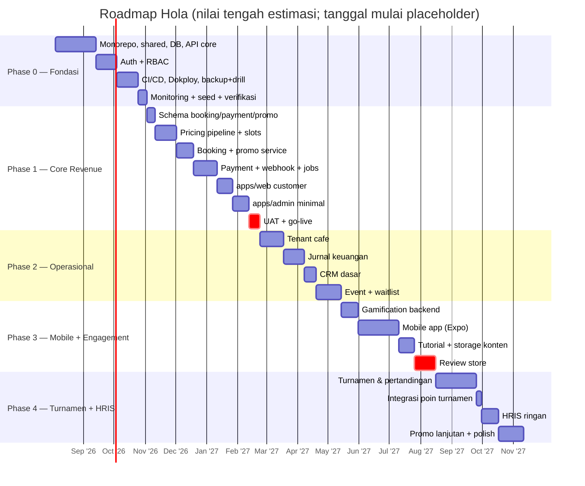
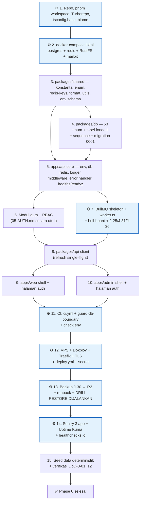
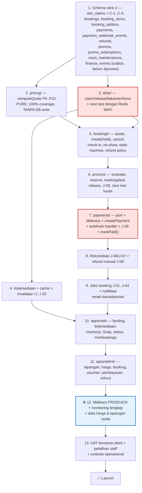

# ROADMAP — Rencana Eksekusi Hola Platform

> Dokumen ini menjawab **kapan** dan **dalam urutan apa** modul di
> [00-OVERVIEW.md § 5](../docs/00-OVERVIEW.md#5-daftar-modul-fitur-v1) dibangun. Ia **tidak** mengubah
> satu pun keputusan teknis di [01-ARCHITECTURE.md](../docs/01-ARCHITECTURE.md) atau business rule di
> dokumen modul. Jika ada perbedaan, **dokumen modul yang menang**.
>
> Working document per-task untuk Phase 0 & 1: [PHASE-1.md](PHASE-1.md).
> Daftar yang **tidak** dibangun: [17-NON-GOALS.md](../docs/17-NON-GOALS.md).
>
> **Status deploy/publish:** pengembangan saat ini berfokus pada lingkungan lokal. Task yang
> membutuhkan VPS/Dokploy, DNS/domain, lifecycle Cloudflare R2, healthcheck/Uptime Kuma, dan
> verifikasi Sentry **produksi** ditunda sampai ada instruksi deploy/publish eksplisit. Task
> tersebut tetap berada di checklist dan DoD agar tidak terlupakan: bukan penghalang untuk
> melanjutkan implementasi Phase 1 lokal, tetapi wajib selesai sebelum staging/produksi,
> akses publik, pembayaran nyata, atau penutupan final Phase 0.

---

## 1. Prinsip Perencanaan

| # | Prinsip | Konsekuensi konkret |
|---|---|---|
| R-1 | **Satu developer, dibantu AI coding.** Tidak ada paralelisasi antar-orang | Estimasi adalah rentang **kalender berurutan**, bukan penjumlahan kapasitas tim. Dua modul tidak pernah dikerjakan bersamaan |
| R-2 | **Prioritas mengikuti revenue impact** | Booking + pembayaran adalah nyawa bisnis → Phase 1. Tenant, event, turnamen, gamification, HRIS adalah pendukung → menyusul |
| R-3 | **Setiap phase menghasilkan increment yang bisa dipakai client** | Tidak ada phase yang berakhir dengan "50% dari semua modul". Akhir Phase 1 = Hola sudah bisa menerima uang dari customer sungguhan |
| R-4 | **Mobile menyusul setelah web stabil** | `apps/mobile` **tidak disentuh sama sekali** sampai Phase 3. Alasan: alur booking & payment harus terbukti benar di produksi sebelum diduplikasi ke surface ketiga yang tidak bisa di-hotfix |
| R-5 | **Infrastruktur bukan "nanti saja"** | Kontrak dan ekuivalen lokal komponen Phase 1 — Redis (hold slot, rate limit, cache), BullMQ (webhook, notifikasi, pelepasan hold), backup PostgreSQL, Sentry, uptime monitoring — berdiri sejak Phase 0/1. Verifikasi layanan eksternal produksi tetap wajib sebelum publish, tetapi ditunda selama mode local-first |
| R-6 | **Schema dulu, lalu API, lalu UI** | Urutan task di setiap phase dependency-aware. UI tidak pernah dimulai sebelum endpoint-nya hijau di test kontrak |
| R-7 | **Definisi selesai mengikuti [00 § 8](../docs/00-OVERVIEW.md#8-definisi-selesai-untuk-v1)** | Sebuah modul "selesai" hanya jika schema + zod + endpoint + RBAC + test per `BR-*` + dokumen ter-update. Tidak ada "nanti test-nya menyusul" |
| R-8 | **Keputusan client yang menggantung ditanyakan SEBELUM phase dimulai** | Lihat [§ 8](#8-keputusan-client-yang-menghambat). Bekerja dengan default yang tertulis boleh; menemukan default itu salah setelah kode jadi adalah rework |

### 1.1 Penyesuaian terhadap struktur phase (wajib dibaca)

Empat hal berikut **menyimpang tipis** dari pembagian phase ideal. Semuanya karena dependensi
teknis nyata, bukan preferensi. Dicatat eksplisit agar tidak tampak sebagai scope creep.

| # | Penyesuaian | Alasan |
|---|---|---|
| A-1 | **Pipeline media (presign/confirm, bucket, J-32) naik ke Phase 1** — bukan Phase 3 | Landing page dan halaman lapangan butuh foto lapangan (`kind='court_photo'`). Yang tetap ditunda ke Phase 3 adalah `tutorial_thumbnail` dan kurasi kontennya; `event_poster` menyusul di Phase 2 bersama modul event. Bucket `hola-media`/`hola-private` tetap berdiri sejak Phase 0 (RustFS lokal + R2 produksi) |
| A-2 | **`finance_events` (outbox) ditulis sejak Phase 1**, meskipun jurnal baru diproses Phase 2 | Menulis satu baris outbox di dalam transaksi `markPaid()` berbiaya hampir nol. Merekonstruksi riwayat jurnal dari `payments` di Phase 2 adalah backfill job + risiko selisih. J-28 (pemroses) baru dibuat Phase 2; baris outbox menunggu berstatus `pending` — itu perilaku normal outbox |
| A-3 | **`point_events` TIDAK ditulis sebelum Phase 3** | Kebalikan dari A-2. Jika outbox poin diisi sejak Phase 1, hidupnya J-19 di Phase 3 akan mengguyurkan poin retroaktif berbulan-bulan sekaligus dan merusak leaderboard periode pertama. Pemberian poin retroaktif adalah keputusan bisnis, bukan efek samping |
| A-4 | **Refund via API gateway ditunda ke Phase 2; Phase 1 hanya `manual_transfer` & `cash`** | [07 § 7.2](../docs/07-MODULE-PAYMENT.md#72-dukungan-refund-per-metode-pembayaran): VA tidak mendukung refund API dan QRIS "anggap tidak kecuali diverifikasi". Untuk mayoritas transaksi launch, jalur `manual_transfer` memang yang dipakai. Membangun `createRefund()` gateway di Phase 1 berarti menulis kode yang tidak bisa diuji sampai Midtrans mengonfirmasi kemampuan merchant |

### 1.2 Evolusi constraint `slot_claims` lintas phase

`ck_slot_claims_single_owner` dan `ck_slot_claims_owner_matches_type`
([03 § 8.4](../docs/03-DATA-MODEL.md#84-constraint-inti-mekanisme)) menyebut **empat** kolom owner,
tetapi `events` baru ada di Phase 2 dan `matches` baru ada di Phase 4. Dua opsi dipertimbangkan:

| Opsi | Isi | Keputusan |
|---|---|---|
| Buat tabel `events`/`matches` sebagai schema kosong sejak Phase 1 | CHECK final sejak awal | **Ditolak** — schema mati yang ikut seed, relasi Drizzle, dan serializer tanpa pemakai |
| Tambah kolom owner + ganti CHECK secara bertahap | Migration per phase | **Dipakai** |

Pola migration yang **wajib** dipakai saat mengganti CHECK pada tabel yang sudah berisi data
(Phase 2 & Phase 4), agar tidak mengunci `slot_claims` lama:

```sql
ALTER TABLE slot_claims DROP CONSTRAINT ck_slot_claims_single_owner;
ALTER TABLE slot_claims ADD CONSTRAINT ck_slot_claims_single_owner CHECK (...) NOT VALID;
ALTER TABLE slot_claims VALIDATE CONSTRAINT ck_slot_claims_single_owner;
```

`uq_slot_claims_active` (C-1 — penjaga final anti double-booking) **tidak pernah** disentuh
setelah Phase 1. Ia dibuat sekali dan tidak berubah.

---

## 2. Ringkasan Phase

| Phase | Tema | Hasil yang bisa dipakai client | Hari kerja | Minggu |
|---|---|---|---|---|
| **0** | Fondasi | Belum ada fitur bisnis. Repo, CI/CD, deploy, auth, backup teruji, monitoring — semuanya hidup di produksi | 58–72 | **12–14** |
| **1** | Core Revenue (MVP, launch) | **Customer bisa memesan lapangan dan membayar online.** Admin bisa mengelola lapangan, harga, booking, dan voucher | 72–88 | **14–18** |
| **2** | Operasional | Tagihan tenant cafe otomatis, jurnal keuangan, CRM dasar, event dengan waitlist | 50–65 | **10–13** |
| **3** | Mobile + Engagement | Aplikasi Android & iOS, gamification & leaderboard, konten tutorial | 45–60 | **9–12** (+2–4 minggu review store) |
| **4** | Turnamen + HRIS + Polish | Turnamen berbracket penuh, HRIS ringan, promo lanjutan | 55–70 | **11–14** |
| | **Total v1** | | **280–355** | **56–71** (±13–17 bulan) |

> **Phase 0 & 1 adalah penjumlahan bottom-up dari 200 task berdurasi ≤ 1 hari** di
> [PHASE-1.md](PHASE-1.md) (nominal: 64,5 + 80,5 = 145 hari), dengan rentang ±10% di sekitarnya.
> Phase 2–4 masih taksiran grup dan **akan dikalibrasi ulang** memakai rasio aktual/estimasi
> Phase 1 (RM-2) — perlakukan sebagai indikasi, bukan komitmen.

> Asumsi konversi: **5 hari kerja/minggu, ±6 jam produktif/hari**. Kalibrasi lengkap dan alasan
> mengapa angkanya tidak boleh lebih kecil ada di [§ 9](#9-kalibrasi-estimasi--jangan-optimis).



### Peta modul → phase

| Modul ([00 § 5](../docs/00-OVERVIEW.md#5-daftar-modul-fitur-v1)) | Phase |
|---|---|
| Auth & RBAC ([05](../docs/05-AUTH.md)) | **0** |
| Booking lapangan ([06](../docs/06-MODULE-BOOKING.md)) | **1** (tanpa reschedule) → reschedule di **2** |
| Pembayaran online ([07](../docs/07-MODULE-PAYMENT.md)) | **1** (refund gateway API di **2**) |
| Diskon & promo ([08](../docs/08-MODULE-PROMO.md)) | **1** dasar → **4** lanjutan |
| Tenant cafe ([09](../docs/09-MODULE-TENANT.md)) | **2** |
| Jurnal keuangan ([14](../docs/14-MODULE-FINANCE.md)) | **2** |
| CRM ([13](../docs/13-MODULE-CRM-HRIS.md)) | **2** |
| Event ([10](../docs/10-MODULE-EVENT.md)) | **2** |
| Gamification & leaderboard ([12](../docs/12-MODULE-GAMIFICATION.md)) | **3** |
| Mobile ([15](../docs/15-MOBILE.md)) | **3** |
| Pertandingan/turnamen ([11](../docs/11-MODULE-MATCH.md)) | **4** |
| HRIS ringan ([13](../docs/13-MODULE-CRM-HRIS.md)) | **4** |

---

## 3. Phase 0 — Fondasi

> **Goal akhir:** menyiapkan seluruh jalur dari laptop developer sampai produksi — repo, tipe,
> database, auth, CI, deploy, backup teruji, dan monitoring — sehingga Phase 1 hanya perlu
> menulis business rule, bukan infrastruktur. **Mode aktif:** validasi fondasi lokal lebih dahulu;
> provisioning dan pembuktian layanan produksi menunggu instruksi deploy/publish.

### 3.1 Definition of Done Phase 0 sebelum publish (terukur, semuanya wajib)

Phase 0 **selesai** hanya jika **kedua belas** butir di bawah dapat didemokan:

> Selama mode local-first, DoD yang membutuhkan keadaan eksternal produksi (DoD-0-05 dan
> DoD-0-07 s.d. DoD-0-12) berstatus **tertunda**, bukan selesai atau dihapus. Implementasi
> Phase 1 lokal boleh berjalan setelah gerbang lokal di [PHASE-1.md](PHASE-1.md) terpenuhi;
> seluruh DoD berikut kembali menjadi gerbang keras sebelum publish.

| # | Kriteria | Cara memverifikasi |
|---|---|---|
| DoD-0-01 | `git clone` → `pnpm setup` → `pnpm dev` berhasil di mesin bersih dalam **< 15 menit** tanpa kredensial cloud | Dijalankan sekali di mesin/VM baru dan waktunya dicatat |
| DoD-0-02 | `pnpm typecheck && pnpm lint && pnpm test && pnpm build` hijau di lokal **dan** di CI | Log CI |
| DoD-0-03 | Job CI `guard-db-boundary` **gagal** ketika `@hola/db` sengaja di-import dari `apps/web` | Commit percobaan di branch throwaway; CI merah; commit dibuang |
| DoD-0-04 | `pnpm check:env` gagal ketika satu kunci dihapus dari `.env.example` | Idem |
| DoD-0-05 | 4 role dapat login di produksi; `POST /auth/refresh` merotasi token; memakai refresh token lama **mencabut seluruh family** dan menaikkan `token_version` | Test integrasi T-4 + verifikasi manual di staging |
| DoD-0-06 | Endpoint tanpa `requireRole()` dan tidak ada di allowlist publik membuat aplikasi **gagal saat boot** | Test unit atas pemeriksaan di `app.ts` ([16 BR-SV-03](../docs/16-CONVENTIONS.md#51-bentuk-route)) |
| DoD-0-07 | Push ke `main` → CI hijau → 4 container ter-deploy otomatis lewat Dokploy; migration jalan **sebagai release step**, sekali | Riwayat deploy + log migration |
| DoD-0-08 | `GET /healthz` dan `GET /readyz` di domain produksi mengembalikan 200; `/readyz` melaporkan `degraded` saat Redis dimatikan | Matikan container redis di staging, cek response, hidupkan lagi |
| DoD-0-09 | **Backup harian berjalan dan objeknya ada di R2**, dengan nama `pg/{YYYY}/{MM}/hola-{YYYYMMDD}-{HHmm}.dump` | Daftar objek bucket `hola-backup` |
| DoD-0-10 | **Restore TERUJI, bukan terdokumentasi**: dump produksi terakhir berhasil di-`pg_restore` ke database bersih, 4 query verifikasi ([02 § 10](../docs/02-INFRASTRUCTURE.md#10-backup--restore) langkah 3) dijalankan dan hasilnya dicatat, lalu `pnpm db:migrate` jalan bersih di atasnya. Waktu aktual dicatat di `docs/runbooks/restore-drill-log.md` | Isi file log drill + tangkapan layar/transkrip |
| DoD-0-11 | Sentry menerima error uji dari `apps/api`, `apps/web`, `apps/admin` (3 event terpisah, source map terbaca) | Dashboard Sentry |
| DoD-0-12 | Uptime Kuma memonitor `/healthz`, `/readyz`, web, admin; dead-man's switch eksternal (healthchecks.io) memicu alert saat sengaja tidak di-ping | Log alert |

### 3.2 Deliverable

**Per app / package**

| Target | Isi |
|---|---|
| `packages/shared` | `constants/` (enums, error-codes, queues, limits, settings-keys, notification-templates), `redis-keys.ts`, `format/` (`formatIDR`, `formatWita`), `utils/` (`roundTo100`, `isSlotAligned`, `buildSlotGrid`, `iso-week`), `env/` (schema zod per app), `schemas/common.ts` + `schemas/auth.ts`. Struktur mengikuti [16 § 4.3](../docs/16-CONVENTIONS.md#43-packagesshared) |
| `packages/db` | Drizzle config, **seluruh 53 enum** PostgreSQL ([03 § 3](../docs/03-DATA-MODEL.md#3-daftar-enum)) dibuat sekali di migration 0001, tabel fondasi (`users`, `refresh_tokens`, `customer_profiles`, `venues`, `sports`, `courts`, `court_operating_hours`, `special_dates`, `addons`, `price_rules`, `app_settings`, `audit_logs`, `media_files`, `notification_templates`, `notifications`, `push_tokens`, `otp_challenges`, `password_reset_tokens`, `idempotency_records`), sequence kode manusia, seed script |
| `apps/api` | `app.ts` + `index.ts` + `worker.ts` + `bullboard.ts`, middleware lengkap ([16 § 4.2](../docs/16-CONVENTIONS.md#42-appsapi)), `lib/` (errors, response, pagination, transaction, codes, time), modul `auth`, `users`, `media` (presign/confirm), `notifications`, `admin/settings`, `admin/audit-logs`, `config/public`, `healthz`/`readyz`/`internal/metrics`, provider `mail` |
| `packages/api-client` | `createHolaClient()`, refresh **single-flight** (T-12), pemetaan `HolaApiError` |
| `apps/web` | Shell: layout, halaman login/daftar/lupa-password, penyimpanan access token **di memori**, TanStack Query, Sentry, security headers (S-4) |
| `apps/admin` | Shell: layout + navigasi per role, halaman login, tabel data primitif (offset pagination), halaman `app_settings` & `audit_logs`, Sentry |
| `apps/mobile` | **Tidak disentuh** (R-4) |

**Per komponen infrastruktur**

| Komponen | Yang berdiri di Phase 0 |
|---|---|
| **PostgreSQL** | Container produksi + volume `pgdata`; migration forward-only sebagai release step |
| **Redis** | Container produksi dengan `appendonly yes`, `appendfsync everysec`, `maxmemory-policy noeviction` ([02 § 2](../docs/02-INFRASTRUCTURE.md#2-daftar-container--sumber-daya)). Dipakai Phase 0 untuk: **rate limit** (Lua, fail-open), **cache user context 60 s**, **denylist `jti`** |
| **BullMQ** | 6 queue terdaftar, `worker.ts` hidup, `upsertJobScheduler` untuk cron, bull-board di balik basic auth + IP allowlist. Job aktif: **J-25** `notification.sendEmail`, **J-31** `system.cleanupExpiredTokens`, **J-36** `notification.retryStuckNotifications`, **J-30** `system.backupDatabase` |
| **Object storage** | Bucket `hola-media`, `hola-private`, `hola-backup` (R2 produksi, RustFS lokal); `POST /media/presign` + `/confirm`; **J-32** `system.cleanupOrphanUploads` |
| **Monitoring** | Sentry di api/web/admin; Uptime Kuma (8 monitor wajib, [02 § 9](../docs/02-INFRASTRUCTURE.md#9-observability)); healthchecks.io dead-man's switch; `GET /internal/metrics` |
| **Backup** | Container `hola-backup`, J-30 harian 03:00 WITA → R2, verifikasi `pg_restore --list`, retensi 7 lokal / 30+12 offsite, workflow `db-restore-drill.yml`, runbook `docs/runbooks/restore.md`, **drill manual pertama sudah dijalankan** |
| **CI/CD** | `ci.yml` (typecheck, lint, test, build, `guard-db-boundary`, `check:env`, service container pg+redis), `deploy.yml` (webhook Dokploy per app, urutan `api → worker → web → admin`) |

### 3.3 Urutan pengerjaan (dependency-aware)

⚙️ = prasyarat infrastruktur lokal; blok berikutnya tidak bisa dimulai sebelum ini hijau.
Prasyarat yang membutuhkan layanan produksi mengikuti status penundaan di atas dan hanya
menjadi gerbang keras untuk deploy/publish.



**Aturan urutan yang tidak boleh dibalik:**

1. `packages/shared` sebelum `packages/db` — enum PostgreSQL dan konstanta TypeScript wajib
   identik; menulis konstanta lebih dulu membuat schema Drizzle tinggal merujuknya.
2. `packages/db` sebelum `apps/api` — repository tidak bisa ditulis tanpa tipe hasil inferensi.
3. `apps/api` core sebelum modul auth — auth butuh `error-handler`, `rate-limit`, dan
   `transaction` helper.
4. Auth sebelum `packages/api-client` — logika refresh single-flight tidak bisa diuji tanpa
   endpoint refresh yang benar.
5. `packages/api-client` sebelum kedua app frontend — keduanya hanya berkomunikasi lewatnya.
6. **CI sebelum deploy** — deploy tanpa gate CI berarti produksi bisa menerima kode merah.
7. **Deploy sebelum backup** — backup mengambil dump dari database produksi; database produksi
   harus ada dulu.
8. **Backup + drill sebelum Phase 1** — Phase 1 adalah phase pertama yang menyimpan data
   bernilai uang. Menunda drill sampai setelah ada data nyata berarti drill pertama dilakukan
   di bawah tekanan.

### 3.4 Risiko teknis Phase 0 & mitigasi

| # | Risiko | Dampak | Mitigasi |
|---|---|---|---|
| RK-0-01 | **Batas `@hola/db` bocor ke frontend** dan baru ketahuan berbulan-bulan kemudian | Dua sumber kebenaran business rule; anti double-booking bisa dilanggar dari `apps/admin` | Tiga lapis sejak hari pertama: dependency tidak dicantumkan di `package.json`, Biome `noRestrictedImports`, dan job CI `guard-db-boundary`. **DoD-0-03 mewajibkan job itu dibuktikan gagal**, bukan sekadar ada |
| RK-0-02 | **Restore backup ternyata tidak berfungsi** saat benar-benar dibutuhkan | Kehilangan seluruh data transaksi | DoD-0-10: drill dijalankan sungguhan sebelum ada data produksi, hasilnya dicatat dengan durasi aktual. Aturan keras [02 § 10](../docs/02-INFRASTRUCTURE.md#uji-restore-drill): *backup yang belum pernah diuji restore dianggap tidak ada* |
| RK-0-03 | **Deteksi reuse refresh token memicu false positive** karena race dua tab | User ter-logout acak; terlihat seperti bug auth yang sulit direproduksi | Refresh **single-flight** wajib di `packages/api-client` (T-12) **sebelum** app frontend memakainya. Test A-5 ([05 § 10](../docs/05-AUTH.md#10-edge-cases)) mensimulasikan dua request paralel |
| RK-0-04 | **Enum PostgreSQL dan konstanta TypeScript drift** | Runtime error `invalid input value for enum` di produksi | Satu test di `packages/shared` membandingkan setiap konstanta enum dengan daftar di [03 § 3](../docs/03-DATA-MODEL.md#3-daftar-enum); satu test integrasi membandingkan enum TS dengan `pg_enum` di database uji |
| RK-0-05 | **`exactOptionalPropertyTypes` + `noUncheckedIndexedAccess` melambatkan pekerjaan** karena setiap akses array perlu guard | Rasa "TypeScript melawan" di minggu pertama | Diterima sebagai biaya di muka. Helper `assertPresent(value, message)` di `lib/errors.ts` dibuat sejak hari pertama agar `!` ([16 BR-TS-03](../docs/16-CONVENTIONS.md#12-aturan-tipe)) tidak pernah dibutuhkan |
| RK-0-06 | **Dokploy/VPS memakan waktu jauh lebih lama dari perkiraan** (TLS, DNS, firewall, disk, resource limit) | Phase 0 molor 1–2 minggu | Diberi alokasi 4 hari penuh dan **tidak** dikerjakan di akhir. Domain final ditanyakan ke client sejak minggu pertama ([§ 8](#8-keputusan-client-yang-menghambat) K-01) karena `COOKIE_DOMAIN`, `CORS_ORIGINS`, dan sertifikat bergantung padanya |
| RK-0-07 | **Deliverability email buruk** (Resend belum terverifikasi domain) sehingga email verifikasi & reset password masuk spam | Terlihat sebagai bug auth di Phase 1 | Verifikasi domain Resend (SPF/DKIM/DMARC) dikerjakan di Phase 0, bukan Phase 1. Mailpit hanya untuk lokal — jangan sampai produksi baru diuji saat launch |
| RK-0-08 | **Migration release step balapan** saat replica API > 1 | Migration jalan dua kali, schema rusak | Migration **tidak pernah** di `CMD` container ([02 § 3](../docs/02-INFRASTRUCTURE.md#aturan-deployment) aturan 3). Diverifikasi di DoD-0-07 |
| RK-0-09 | Rate limiter Redis **fail-closed** karena salah tulis error handling | Seluruh traffic ditolak saat Redis hiccup | `safeRedis(op, fallback)` ([16 BR-RD-03](../docs/16-CONVENTIONS.md#7-pola-redis-client)) dibuat sebagai satu-satunya jalur akses Redis, dengan test yang mematikan koneksi Redis dan memastikan request tetap `200` |

### 3.5 Yang secara eksplisit DITUNDA dari Phase 0

| Ditunda | Ke phase | Catatan |
|---|---|---|
| Semua tabel transaksional (`slot_claims`, `bookings`, `payments`, `promos`, …) | 1 | Phase 0 hanya tabel fondasi & sistem |
| Login OTP | — | Endpoint dibuat & bertipe, tetapi **mengembalikan `403 FEATURE_DISABLED`** ([05 § 8](../docs/05-AUTH.md#8-registrasi--login)) sampai D-04 diputuskan |
| `apps/mobile` | 3 | R-4 |
| Job selain J-25, J-30, J-31, J-32, J-36 | 1–4 | Ditambahkan bersama modulnya |
| Log aggregation terpusat, IaC, blue/green | pasca-v1 | [02 § 13](../docs/02-INFRASTRUCTURE.md#13-out-of-scope-infrastruktur-v1) |
| Staging environment terpisah penuh | 1 | Phase 0 memakai satu VPS produksi + database `hola_staging` di container yang sama. Staging penuh baru bernilai saat ada uang yang mengalir |

### 3.6 Estimasi Phase 0

**58–72 hari kerja ≈ 12–14 minggu** (nominal bottom-up: **64,5 hari, 99 task**).

| Blok ([PHASE-1.md](PHASE-1.md)) | Hari kerja |
|---|---|
| F0.A — Repo, tooling, docker-compose lokal | 4 |
| F0.B — `packages/shared` (53 enum, konstanta, redis-keys, utils, env) | 8 |
| F0.C — `packages/db` (migration 0001, tabel fondasi, sequence, index) | 6 |
| F0.D — `apps/api` core (env, middleware, rate limit Lua, idempotency, lib) | 7 |
| **F0.E — Auth + RBAC** ([05](../docs/05-AUTH.md) secara utuh, termasuk test) | **11** |
| F0.F — BullMQ + notifikasi + mail adapter + bull-board | 4,5 |
| F0.G — `packages/api-client` (refresh single-flight) | 1,5 |
| F0.H — Media: presign/confirm + J-32 (naik dari Phase 3, A-1) | 2 |
| F0.I + F0.J — `apps/web` & `apps/admin` shell | 5,5 |
| F0.K — CI (`ci.yml`, `guard-db-boundary`, `check:env`) | 2 |
| F0.L — VPS + Dokploy + Traefik + `deploy.yml` | 4,5 |
| F0.M — Backup + runbook + **drill restore dijalankan** | 3,5 |
| F0.N — Sentry + Uptime Kuma + dead-man's switch | 1,5 |
| F0.O — Seed deterministik + verifikasi 12 butir DoD | 3,5 |
| **Nominal** | **64,5** |

**Blok terbesar bukan fitur.** Auth (8–10 hari) dan rantai deploy+backup+monitoring (8–11 hari)
menghabiskan sepertiga Phase 0 tanpa menghasilkan satu pun layar yang bisa dilihat client. Ini
alasan utama Phase 0 sering diperkirakan setengah dari kenyataannya.

---

## 4. Phase 1 — Core Revenue (MVP, launch pertama)

> **Goal:** customer dapat memilih slot lapangan, membayar online, dan menerima konfirmasi —
> dan admin dapat mengelola lapangan, harga, booking, serta voucher tanpa menyentuh database.

### 4.1 Definition of Done Phase 1 (terukur)

| # | Kriteria | Cara memverifikasi |
|---|---|---|
| DoD-1-01 | **Transaksi nyata pertama berhasil**: satu customer sungguhan memesan, membayar via QRIS/VA di Midtrans **produksi**, menerima email konfirmasi, dan booking tampil `confirmed` di admin | Dijalankan bersama client sebelum diumumkan |
| DoD-1-02 | **Anti double-booking terbukti**: `Promise.all` dua `POST /bookings` untuk slot identik → tepat satu `201`, satu `409 SLOT_ALREADY_CLAIMED`. Dijalankan **dua kali**: Redis hidup dan **Redis dimatikan** (T-B-01, T-B-02) | Test integrasi di CI |
| DoD-1-03 | **Webhook idempoten**: mengirim payload webhook `settlement` yang sama 5× menghasilkan tepat satu transisi, satu email, satu baris `finance_events` | Test `*.api.test.ts` via `POST /dev/simulate-webhook` |
| DoD-1-04 | **Rekonsiliasi bekerja tanpa webhook**: matikan webhook, bayar di sandbox, J-06 mengonfirmasi booking dalam ≤ 5 menit | Test integrasi + verifikasi manual di staging |
| DoD-1-05 | Coverage **100%** pada `apps/api/src/modules/pricing/`, `modules/slots/`, dan seluruh `*-policy.ts` / `*-state.ts` ([16 BR-TT-15](../docs/16-CONVENTIONS.md#82-aturan-test)) | Laporan coverage CI (ambang ditegakkan, bukan dilaporkan) |
| DoD-1-06 | Setiap `BR-B-*`, `BR-P-*`, dan `BR-PR-*` yang masuk scope Phase 1 punya minimal satu test yang **menyebut nomornya di judul** | `pnpm test -- --reporter=verbose` + checklist di PHASE-1.md |
| DoD-1-07 | Test RBAC tabel-driven ([16 BR-TT-12](../docs/16-CONVENTIONS.md#82-aturan-test)) menutup **seluruh** endpoint Phase 1 dari [05 § 6.2–6.6](../docs/05-AUTH.md#62-katalog--ketersediaan) | Output test |
| DoD-1-08 | **Kuota promo race-safe**: dua request bersamaan atas promo `quota_total=1` → tepat satu berhasil, `quota_used=1`; diulang dengan Redis mati (T-PR-01, T-PR-02) | Test integrasi |
| DoD-1-09 | `quote_snapshot.total_amount` **selalu** sama dengan `payments.amount` dan dengan `gross_amount` yang dikirim ke Midtrans (BR-P-04) | Test + assertion runtime di `createPayment` |
| DoD-1-10 | Uptime monitoring aktif untuk seluruh surface produksi **sebelum** pengumuman ke customer; alert masuk ke kanal yang benar-benar dibaca (bukan email yang tidak dicek) | Uji alert dengan mematikan container api selama 3 menit |
| DoD-1-11 | Data produksi nyata sudah diisi: seluruh court, jam operasional, dan `price_rules` **dari daftar harga client** — bukan nilai seed | Review bersama client |
| DoD-1-12 | Runbook operasional harian ada dan sudah dijalankan staff sekali: cara mencari booking, mencatat pembayaran tunai, membatalkan, dan menyetujui refund | `docs/runbooks/operasional-harian.md` + sesi pelatihan staff |

### 4.2 Deliverable

**`apps/api`**

| Modul | Isi |
|---|---|
| `pricing/` | `computeQuote()` lengkap P0–P10 ([07 § 3](../docs/07-MODULE-PAYMENT.md#3-pricing-pipeline-satu-satunya-sumber-perhitungan-harga)), tie-break P2 enam tingkat, `roundTo100`, `pipeline_version = 1`, `tax_rate=0` (D-06), `fee_amount=0` (D-07), `tier_discount_amount=0` (P6) |
| `slots/` | `slots.claim()` (10 langkah, termasuk **takeover**), `slots.release()`, force release admin ([03 § 8.6–8.8](../docs/03-DATA-MODEL.md#86-prosedur-klaim-satu-fungsi-untuk-semua-pemakai)), pembacaan ketersediaan ([03 § 8.9](../docs/03-DATA-MODEL.md#89-cara-membaca-ketersediaan-satu-query-untuk-semua)) |
| `courts/` | CRUD court, `PUT operating-hours`, `PUT photos`, `special_dates`, `court_maintenances` (blokir slot), penolakan ubah `slot_duration_minutes` bila ada klaim mendatang (S-4) |
| `bookings/` | quote, create (hold), cancel, check-in, no-show, `GET /me/bookings`, `GET /bookings` (admin), receipt, `booking-state.ts` (pure), `booking-refund.ts` (`computeRefundAmount`, pure) |
| `payments/` | port `PaymentProvider`, `MidtransProvider`, `ManualProvider`, `createPayment`, `markPaid()` (satu transaksi), `applyPaymentTransition()`, webhook handler HTTP, `POST /payments/manual`, `POST /payments/{id}/sync` |
| `refunds/` | Pembuatan dari cancel & force release, `approve`/`reject`, `mark-completed` untuk `manual_transfer`/`cash`. **Tanpa** `createRefund()` gateway (A-4) |
| `promos/` | `evaluate()`, `reserve()`, `markApplied()`, `release()`, `computeDiscount()` untuk `percent` & `fixed`, CRUD admin, `POST /promos/validate` |
| `dev/` | `POST /dev/simulate-webhook` (guard gagal-boot bila `APP_ENV !== 'local'`, S-12) |

**`apps/web` (customer)**

Landing page ber-SEO (metadata, sitemap, OG), halaman daftar lapangan + harga, **grid
ketersediaan** dengan `X-Cache`/`generated_at`, checkout (pilih slot → addon → kode promo →
ringkasan quote persis dari response), **countdown hold** berbasis `server_time` (E-23), popup
Snap, halaman status pembayaran dengan polling, `/me/bookings`, pembatalan dengan tampilan
`refund_estimate_amount` + teks kebijakan dari `app_settings.cancellation_policy_text`
(BR-B-71).

**`apps/admin` (minimal, cukup untuk operasional harian)**

Dashboard "hari ini" (booking hari ini per court, pembayaran masuk), kalender slot per lapangan
(`GET /slot-claims`), CRUD lapangan + jam operasional + foto, CRUD `price_rules` + pratinjau
harga, blokir lapangan (maintenance), tabel booking (filter + pencarian `q`), detail booking,
**booking manual** (`channel='admin'`/`walk_in`) + pencatatan tunai, check-in / no-show,
pembatalan dengan alasan, daftar pembayaran + `sync`, daftar refund + approve/reject/complete,
CRUD voucher, `app_settings`, `audit_logs`.

**`apps/mobile`** — tidak disentuh.

**Infrastruktur**

| Komponen | Tambahan di Phase 1 |
|---|---|
| **Redis** | Hold slot `SET NX EX 600` (R-1), cache ketersediaan TTL 60 s + **10 aturan invalidasi I-1…I-10** ([02 § 4.4](../docs/02-INFRASTRUCTURE.md#44-aturan-invalidasi-cache-ketersediaan)), idempotency fast path (R-4), counter kuota promo advisory (R-6) |
| **BullMQ** | **J-01** releaseExpiredHolds, **J-02** autoCompleteBookings (+ sweeper J-03/J-04), **J-03** sendBookingReminder, **J-04** markNoShow, **J-05** processWebhook, **J-06** reconcilePending (+ sweeper J-07 & webhook menganggur), **J-07** expireUnpaid, **J-08** processRefund (jalur manual), **J-09** releaseExpiredPromoReservations |
| **Object storage** | `kind='court_photo'` & `avatar` aktif (A-1); kompresi gambar di client sebelum upload |
| **Monitoring** | Metrik `slot_claim_conflicts_total`, `payment_webhook_total{result}`, `payment_reconcile_fixed_total`, `bull_queue_depth`, `redis_degraded_total`; alert: webhook `invalid_signature` > 10/jam, `payment_reconcile_fixed_total` > 5/jam, `bull_queue_depth` > 500 |
| **Eksternal** | Midtrans **produksi** (onboarding, verifikasi badan usaha, key, notification URL, uji tiap metode pembayaran nyata dengan nominal kecil) |

### 4.3 Urutan pengerjaan (dependency-aware)



**Aturan urutan yang tidak boleh dibalik:**

1. **`pricing/` sebelum `bookings/`.** Booking tidak pernah menghitung harga sendiri
   ([06 BR-B-12](../docs/06-MODULE-BOOKING.md#3-business-rules-umum)). Pipeline harga adalah fungsi
   murni tanpa I/O tulis, jadi ia bisa 100% selesai dan tertest sebelum ada satu baris booking.
2. **`slots/` sebelum `bookings/`.** `slots.claim()` dipakai booking, event, match, dan
   maintenance. Ia dibangun sebagai modul mandiri dengan test race-nya sendiri, **bukan**
   diekstrak dari kode booking belakangan.
3. **`promos/` sebelum `payments/`.** Reservasi kuota terjadi di dalam transaksi pembuatan
   booking, dan `markPaid()` mengubah `reserved → applied` — urutannya sudah harus benar sebelum
   pembayaran ditulis.
4. **`payments/` sebelum UI apa pun.** Webhook dan `markPaid()` diuji lewat
   `POST /dev/simulate-webhook`, tanpa browser. Membangun UI checkout sebelum jalur uang benar
   berarti men-debug dua hal sekaligus.
5. **`apps/web` sebelum `apps/admin`.** Web membuktikan alur uang end-to-end; admin adalah
   pembungkus operasional di atas endpoint yang sudah sama.
6. **⚙️ Midtrans produksi dimulai paling lambat di awal blok 7**, bukan di blok 12. Onboarding
   merchant membutuhkan dokumen badan usaha dan verifikasi manual yang **kalendernya di luar
   kendali developer** (lihat RK-1-07).

### 4.4 Risiko teknis Phase 1 & mitigasi

Ini phase dengan risiko tertinggi di seluruh proyek. Setiap risiko di bawah punya **perilaku
sistem yang sudah ditentukan**, bukan sekadar "dimitigasi".

| # | Risiko | Perilaku sistem yang WAJIB | Mitigasi & verifikasi |
|---|---|---|---|
| RK-1-01 | **Race condition double-booking** — dua customer menekan bayar untuk slot yang sama dalam 200 ms | Yang kedua menerima `409 SLOT_ALREADY_CLAIMED` dengan `details` berisi daftar slot bentrok. **Tidak pernah** dua klaim aktif untuk `(court_id, starts_at)` | Empat lapis ([06 § 4.1](../docs/06-MODULE-BOOKING.md#41-empat-lapisan)); **hanya lapis 4 (`uq_slot_claims_active`) yang menjamin**. DoD-1-02 mewajibkan test dijalankan dengan Redis dimatikan sehingga lapis 4 terbukti berdiri sendiri |
| RK-1-02 | **Redis mati saat checkout** | Klaim tetap benar: langkah `SET NX` dilewati, transaksi PostgreSQL tetap jalan. Cache miss → hitung dari DB. Rate limit fail-open. `/readyz` melaporkan `degraded`. **Tidak ada** request yang gagal karena Redis | Seluruh akses Redis lewat `safeRedis()` (BR-RD-03). Test integrasi menjalankan suite booking penuh dengan container redis dimatikan |
| RK-1-03 | **Webhook Midtrans tidak pernah sampai** (deploy, salah konfigurasi URL, downtime) | Pembayaran **tidak** hilang. J-06 `payment.reconcilePending` menemukannya dalam ≤ 5 menit dengan menanyakan status ke gateway; client juga polling `GET /payments/{id}` selama 5 menit pertama | DoD-1-04: webhook sengaja dimatikan, alur diuji hanya dengan rekonsiliasi. Metrik `payment_reconcile_fixed_total` dipantau — nilai yang terus naik = webhook bermasalah, alert > 5/jam |
| RK-1-04 | **Webhook datang dua kali / di-retry gateway** | Insert kedua ditolak UNIQUE `(provider, provider_event_id)`; J-05 keluar lebih awal karena `processed_at` terisi. Tidak ada notifikasi ganda, tidak ada jurnal ganda | BR-P-30…P-40. DoD-1-03 mengirim payload identik 5× |
| RK-1-05 | **Pembayaran masuk setelah hold lepas** (payment expiry 15 menit > hold 10 menit, BR-B-36) | Wajib jalur pemulihan [06 § 11 E-6](../docs/06-MODULE-BOOKING.md#11-edge-cases): (1) payment tetap `paid`; (2) sistem mencoba klaim ulang mode `direct`; (3a) berhasil → booking `expired → confirmed` + `audit_logs` + notifikasi; (3b) gagal → **refund 100% otomatis tanpa potongan**, berstatus `approved`, + notifikasi permintaan maaf | Test integrasi kedua cabang. Ini satu-satunya jalur sah `expired → confirmed` |
| RK-1-06 | **`gross_amount` webhook ≠ `payments.amount`** (indikasi manipulasi atau bug harga) | Payment **tidak** dikonfirmasi. `process_error='amount_mismatch'`, alert prioritas tinggi, admin menyelidiki manual | BR-P-37. Perbandingan setelah konversi ke integer rupiah; hash signature memakai string mentah apa adanya |
| RK-1-07 | **Onboarding Midtrans produksi molor** (dokumen badan usaha, verifikasi, PKS) | Launch tertunda meskipun kode siap | Dimulai **paling lambat di awal blok 7**, paralel dengan coding. Sandbox dipakai untuk seluruh pengembangan. Jika terlambat, launch dapat dijalankan dengan **pembayaran tunai/transfer manual saja** (`ManualProvider` sudah ada) sebagai jaring pengaman |
| RK-1-08 | **Refund VA/QRIS ternyata tidak didukung API** | Refund otomatis gagal, uang customer tertahan | Sudah menjadi keputusan desain (A-4): Phase 1 memakai `channel='manual_transfer'`. Kemampuan aktual dikonfirmasi ke Midtrans saat onboarding dan disimpan di `app_settings.refund_api_supported_methods` — **tanpa deploy** ([07 § 7.2](../docs/07-MODULE-PAYMENT.md#72-dukungan-refund-per-metode-pembayaran)) |
| RK-1-09 | **Worker mati saat jam sibuk** | Penjualan **tidak** berhenti: query ketersediaan memperlakukan hold kedaluwarsa sebagai tersedia dan `slots.claim()` melakukan takeover (BR-B-35). Yang tertunda hanya transisi `pending_payment → expired`, reminder, dan no-show | Monitor heartbeat worker (grace 5 menit). Test integrasi T-B-03: hold kedaluwarsa langsung bisa dipesan **tanpa menunggu J-01** |
| RK-1-10 | **Cache ketersediaan basi** menampilkan slot yang sudah terjual | Customer memilih slot lalu gagal di checkout dengan `409` — pengalaman buruk, bukan kerusakan data | 10 invalidasi eksplisit I-1…I-10 **wajib** diimplementasikan, bukan mengandalkan TTL 60 detik. Header `X-Cache` + `meta.generated_at` agar bisa didiagnosis. Frontend memuat ulang ketersediaan saat menerima `409` |
| RK-1-11 | **Kuota promo over-redemption** | Tidak boleh terjadi. `UPDATE promos SET quota_used = quota_used + 1 WHERE … AND quota_used < quota_total RETURNING` adalah satu-satunya jaminan (BR-PR-30) | Pola `SELECT → cek → UPDATE` **dilarang** (BR-PR-31). DoD-1-08 menguji race dengan dan tanpa Redis |
| RK-1-12 | **Harga salah** karena tie-break `price_rules` tidak deterministik | Kerugian uang langsung atau sengketa | Tie-break 6 tingkat ([07 § 3.3 P2](../docs/07-MODULE-PAYMENT.md#33-detail-per-step)) dengan test yang membuat dua rule identik kecuali `id`. Tidak ada harga default: slot tanpa rule yang cocok → `422 PRICE_RULE_NOT_FOUND`, **tidak dijual** |
| RK-1-13 | **Client mengubah daftar harga sesaat sebelum launch** | Booking yang sudah ada memakai `quote_snapshot`-nya (immutable, BR-B-13); seluruh cache `avail:*` diinvalidasi (I-7) | Snapshot immutable sejak hari pertama. Perubahan harga tidak pernah menyentuh transaksi lampau |
| RK-1-14 | **Staff tidak siap memakai admin** saat launch | Sistem benar tetapi operasional kacau; booking manual dicatat di kertas | DoD-1-12: runbook operasional + satu sesi pelatihan **sebelum** pengumuman. Admin dirancang untuk operasional harian, bukan untuk kelengkapan fitur |
| RK-1-15 | **Migration Phase 1 mengunci tabel** saat deploy | Downtime tak terduga | Phase 1 masih bertabel kecil, tetapi pola `CREATE INDEX CONCURRENTLY` dan `ADD CONSTRAINT … NOT VALID` + `VALIDATE` dipakai sejak sekarang agar kebiasaannya sudah benar saat data besar ([03 § 19](../docs/03-DATA-MODEL.md#19-aturan-migration)) |

### 4.5 Yang secara eksplisit DITUNDA dari Phase 1

| Ditunda | Ke phase | Alasan |
|---|---|---|
| **Reschedule booking** ([06 § 6](../docs/06-MODULE-BOOKING.md#6-reschedule)) | 2 | Bukan prasyarat menerima uang. Sementara: staff membatalkan + membuat booking baru, tercatat di `audit_logs` (E-16) |
| **Refund via API gateway** (`createRefund`) | 2 | A-4 |
| **Promo `free_slot`, promo otomatis (`is_auto`), stacking, `promo_courts`/`promo_sports`, `valid_rate_classes`, `min_tier_code`** | 4 | Phase 1 hanya kode voucher manual: `percent`/`fixed`, `quota_total`, `quota_per_user`, `valid_from`/`valid_until`, `min_transaction_amount` |
| **Booking guest tanpa akun oleh staff** (BR-B-11) | 1 (tetap ada) | Justru **dipertahankan** di Phase 1 — walk-in tunai adalah kanal pendapatan hari pertama |
| **Addon** (sewa raket) | 1 (opsional) | Pipeline P5 tetap diimplementasikan dan tertest; pengisian data `addons` mengikuti keputusan client. Jika tidak ada addon, tabel kosong dan P5 menghasilkan 0 |
| **Jurnal keuangan** | 2 | Baris `finance_events` **tetap ditulis** (A-2); J-28 dan chart of accounts di Phase 2 |
| **Poin dari booking** | 3 | A-3 — `point_events` tidak ditulis sama sekali |
| **Event, tenant, turnamen, CRM, HRIS** | 2–4 | — |
| **`GET /availability` lintas court** ("cari lapangan kosong") | 2 | `GET /courts/{id}/availability` cukup untuk alur "pilih lapangan → lihat jam" |
| **Notifikasi push & WhatsApp** | 3 / D-04 | Phase 1 hanya email + inbox in-app |
| **Laporan** (occupancy, revenue, dst.) | 2 | Admin Phase 1 hanya menampilkan daftar & detail, bukan agregasi |

### 4.6 Estimasi Phase 1

**72–88 hari kerja ≈ 14–18 minggu** (nominal bottom-up: **80,5 hari, 101 task**).

| Blok ([PHASE-1.md](PHASE-1.md)) | Hari kerja |
|---|---|
| P1.A — Schema slice 2 + constraint C-1…C-7, C-20 + index | 4,5 |
| P1.B — `pricing/` + test coverage 100% | 5,5 |
| P1.C — `slots/` + race test (dengan & tanpa Redis) | 5,5 |
| P1.D — Ketersediaan + cache + 10 invalidasi | 3,5 |
| P1.E — `courts/` API admin (lapangan, harga, maintenance) | 3 |
| P1.F — `bookings/` (tanpa reschedule) | 6,5 |
| P1.G — `promos/` dasar + race kuota | 4,5 |
| **P1.H — `payments/` + webhook + `markPaid()`** | **9** |
| P1.I — Rekonsiliasi J-06/J-07 + refund manual J-08 | 4,5 |
| P1.J — Jobs J-01…J-04 + email transaksional | 4,5 |
| **P1.K — `apps/web`** | **9** |
| **P1.L — `apps/admin`** | **9** |
| P1.M — Midtrans produksi, monitoring, data nyata, UAT, pelatihan | 7,5 |
| P1.N — Buffer (5% dari total) | 4 |
| **Nominal** | **80,5** |

**Dua blok UI = 18–20 hari (±25% Phase 1).** Ini bukan CRUD generik: grid ketersediaan dengan
countdown ber-offset server, checkout yang menampilkan quote tanpa menghitung ulang apa pun,
integrasi Snap dengan tiga jalur konfirmasi (webhook, polling, rekonsiliasi), dan tabel admin
dengan filter + pencarian + pagination offset.

---

## 5. Phase 2 — Operasional

> **Goal:** memindahkan pekerjaan back-office yang masih manual — tagihan tenant, pencatatan
> keuangan, data customer, dan penyelenggaraan event — ke dalam sistem.

### 5.1 Definition of Done Phase 2

| # | Kriteria |
|---|---|
| DoD-2-01 | J-10 menghasilkan tagihan bulanan untuk **seluruh** kontrak aktif pada tanggal 1, 01:00 WITA; menjalankannya dua kali tidak menghasilkan tagihan ganda (C-9) |
| DoD-2-02 | Prorata benar untuk 3 kasus: kontrak mulai pertengahan bulan, kontrak berakhir pertengahan bulan, dan bulan Februari (BR-T-40…T-45) |
| DoD-2-03 | Tenant dapat login, melihat tagihannya, dan mengunggah bukti bayar — **tanpa** bisa melihat data booking, customer, atau keuangan Hola (BR-T-81) |
| DoD-2-04 | Setiap dari 13 template jurnal (T-1…T-13) punya test yang memverifikasi Σdebit = Σkredit dan akun yang benar (BR-F-30) |
| DoD-2-05 | J-29 melaporkan **selisih nol** antara `SUM(payments paid)` dan total kredit pendapatan untuk 7 hari berturut-turut di produksi (BR-F-51) |
| DoD-2-06 | Laporan R-1 … R-8 dapat dibuka admin dan angkanya cocok dengan data booking Phase 1 yang sudah berjalan |
| DoD-2-07 | 20 pendaftaran serentak untuk event berkapasitas 10 → tepat 10 `confirmed`/`pending_payment`, sisanya `waitlisted` dengan posisi 1..10 tanpa duplikasi (E-1, C-15) |
| DoD-2-08 | Event yang dijadwalkan menabrak booking berbayar → `409` dengan daftar bentrok; `force=true` (admin) membatalkan booking + refund 100% + notifikasi (S-6) |
| DoD-2-09 | Backfill jurnal untuk seluruh transaksi Phase 1 selesai dan seimbang | 
| DoD-2-10 | Reschedule booking berfungsi dengan aturan BR-B-50…B-59, termasuk penolakan slot yang lebih mahal (BR-B-55) |

### 5.2 Deliverable

| Target | Isi |
|---|---|
| **`packages/db`** | `cafe_units`, `cafe_tenants`, `cafe_contracts`, `cafe_invoices`, `cafe_invoice_lines`, `accounts`, `journal_entries`, `journal_lines`, `expenses`, `finance_daily_summaries`, `events`, `event_registrations`, `customer_tags`, `customer_tag_assignments`, `customer_notes`. **Migration khusus**: tambah `slot_claims.event_id` + ganti CHECK dengan pola `NOT VALID`/`VALIDATE` ([§ 1.2](#12-evolusi-constraint-slot_claims-lintas-phase)) |
| **`apps/api`** | Modul `cafe/`, `finance/`, `crm/`, `events/`; `bookings/reschedule`; `refunds` jalur gateway (`createRefund`); `GET /availability` lintas court |
| **`apps/web`** | Halaman event publik (daftar, detail, pendaftaran, waitlist), riwayat pendaftaran event di area customer |
| **`apps/admin`** | Modul tenant (unit, tenant, kontrak, tagihan, pencatatan pembayaran), **portal tenant** (role `tenant`), modul keuangan (jurnal, pengeluaran, 8 laporan, penguncian periode), CRM (daftar customer, profil 360°, tag, catatan), modul event (buat, jadwalkan, publikasikan, kelola peserta, check-in) |
| **BullMQ** | **J-10** generateMonthlyInvoices, **J-11** markOverdueInvoices, **J-12** sendInvoiceReminder, **J-13** flagExpiringContracts, **J-14** closeEventRegistration, **J-15** promoteEventWaitlist, **J-16** finalizeEvent, **J-28** postJournalEntries, **J-29** buildDailySummary, **J-33** pruneAuditLogs, **J-35** sweepEventStates |
| **Object storage** | `kind='event_poster'`, `contract_document`, `payment_proof`, `expense_receipt` (bucket `hola-private` untuk tiga terakhir, presigned GET TTL 15 menit) |
| **Monitoring** | Alert selisih R-1 ≠ 0; alert `finance_events` berstatus `failed`; alert tagihan bulan berjalan yang tidak terbit (sweeper J-13) |

### 5.3 Urutan pengerjaan

1. **Schema tenant + finance** (dua-duanya sekaligus — jurnal tenant butuh `accounts`).
2. **Chart of accounts + `buildJournal()` (pure) + J-28** → jalankan **backfill** atas
   `finance_events` yang menumpuk sejak Phase 1 (A-2). Ini butir yang membuktikan keputusan A-2
   membayar dirinya sendiri.
3. **J-29 daily summary + laporan R-1/R-2/R-7** → verifikasi selisih nol atas data nyata Phase 1
   sebelum menambah sumber jurnal baru.
4. **Modul tenant**: kontrak → aktivasi (yang langsung menerbitkan tagihan prorata, E-4) →
   J-10/J-11/J-12/J-13 → pencatatan pembayaran → portal tenant.
5. **Laporan sisa** (R-3 okupansi, R-4 diskon, R-5 AR aging, R-6 L/R, R-8 buku besar) +
   pengeluaran + penguncian periode.
6. **CRM** (paling ringan; hanya agregasi atas data yang sudah ada + 3 entitas baru).
7. ⚙️ **Migration `slot_claims.event_id`** — prasyarat modul event.
8. **Modul event**: schema → `POST /events/{id}/schedule` (memakai `slots.claim` yang sudah
   teruji) → lifecycle + J-14/J-16/J-35 → registrasi + kuota ber-lock → waitlist + J-15 → event
   berbayar lewat pipeline payment yang sama → UI publik → UI admin.
9. **Reschedule booking** + **refund gateway API** (utang teknis Phase 1).

### 5.4 Risiko teknis Phase 2 & mitigasi

| # | Risiko | Perilaku sistem / mitigasi |
|---|---|---|
| RK-2-01 | **Jurnal tidak seimbang** atau template salah akun | `buildJournal()` adalah fungsi **pure** yang melempar error sebelum menyentuh database bila Σdebit ≠ Σkredit (BR-F-31); CHECK C-11 adalah lapis kedua. Setiap template punya test |
| RK-2-02 | **Backfill jurnal Phase 1 menghasilkan selisih** dengan `payments` | Backfill dijalankan ke database **restore** lebih dulu (prosedur DoD-0-10 sudah terbukti), hasilnya dibandingkan dengan J-29, baru dijalankan di produksi |
| RK-2-03 | **J-10 gagal di tengah**, 5 dari 12 kontrak terproses | **Setiap kontrak diproses dalam transaksinya sendiri**, bukan satu transaksi besar (E-2, BR-BQ-15). Retry melewati yang sudah ada karena `ON CONFLICT DO NOTHING` |
| RK-2-04 | **Worker mati sepanjang tanggal 1** sehingga tagihan tidak terbit | Cron yang terlewat **tidak** otomatis dijalankan ulang (E-3). Sweeper resminya J-13 (Senin) memeriksa setiap kontrak `active` punya tagihan bulan berjalan dan memberi alert. Admin memicu `POST /admin/cafe/generate-invoices` |
| RK-2-05 | **Over-booking kursi event** saat pendaftaran serentak | `SELECT … FROM events WHERE id=? FOR UPDATE` di dalam transaksi (BR-E-37). Pengecekan di aplikasi tanpa lock **dilarang**. DoD-2-07 menguji 20 request paralel |
| RK-2-06 | **Waitlist bocor** — dua peserta di posisi sama, atau promosi ganda | UNIQUE partial C-15; J-15 berjalan dalam transaksi ber-lock pada baris event; posisi **tidak** dikompaksi (BR-E-45) sehingga tidak ada operasi geser yang bisa balapan |
| RK-2-07 | **Event `draft` mengunci lapangan berbulan-bulan lalu dilupakan** | Disengaja boleh mengunci (BR-E-22), tetapi J-35 mengirim alert untuk event `draft` berumur > 60 hari atau yang slotnya sudah lewat (E-10) |
| RK-2-08 | **Migration `slot_claims.event_id` mengunci tabel** yang sudah berisi klaim produksi | Pola `NOT VALID` + `VALIDATE CONSTRAINT` ([§ 1.2](#12-evolusi-constraint-slot_claims-lintas-phase)); dijalankan di jendela sepi; diuji lebih dulu di database restore |
| RK-2-09 | **Periode keuangan dikunci** lalu jurnal terlambat masuk ke periode itu | Posting gagal dengan `finance_events.status='failed'`, `last_error='period_locked'` + alert. **Tidak ada** pemindahan tanggal otomatis (BR-F-07) — keputusan manusia |
| RK-2-10 | **Data settlement gateway tidak pernah dimasukkan admin** sehingga saldo `1-1300` menumpuk | Bukan bug — keterbatasan v1 yang wajib dikomunikasikan (E-8). R-7 menampilkan peringatan bila `1-1300` > Rp 10 juta atau ada payment `paid` > 7 hari tanpa jurnal `settlement` (BR-F-55) |

### 5.5 Ditunda dari Phase 2

| Ditunda | Ke phase |
|---|---|
| Turnamen & pertandingan | 4 |
| Gamification, poin, tier, badge, leaderboard | 3 |
| Mobile | 3 |
| HRIS | 4 |
| Promo lanjutan (stacking, auto, `free_slot`) | 4 |
| Pembayaran online mandiri oleh tenant (Xendit Invoice) | pasca-v1 ([09 § 10](../docs/09-MODULE-TENANT.md#10-out-of-scope)) |
| PDF tagihan/kontrak di server | pasca-v1 (BR-T-31) |
| Event berulang (recurring) | pasca-v1 — kandidat **v2-tinggi** |

### 5.6 Estimasi Phase 2

**50–65 hari kerja ≈ 10–13 minggu.** Tenant 14–18, finance 14–18, CRM 6–8, event 16–20,
utang teknis Phase 1 (reschedule + refund gateway) 4–6, buffer 5–7.

---

## 6. Phase 3 — Mobile + Engagement

> **Goal:** memberi pemain aplikasi di ponselnya — booking, catatan latihan, tutorial, dan
> leaderboard — di atas API yang sudah terbukti benar di produksi selama dua phase.

### 6.1 Definition of Done Phase 3

| # | Kriteria |
|---|---|
| DoD-3-01 | Aplikasi terpasang dari App Store **dan** Google Play (bukan TestFlight/internal track) |
| DoD-3-02 | Booking end-to-end dari mobile, termasuk pembayaran Snap di WebView, berhasil di produksi; menutup WebView **tanpa** membayar tidak pernah menandai booking lunas (BR-MB-14) |
| DoD-3-03 | 20 aktivitas dicatat dalam mode pesawat, lalu tersinkron **tanpa duplikasi** saat online (UNIQUE `client_generated_id`, BR-MB-74) |
| DoD-3-04 | **Redis di-flush di staging**: `GET /leaderboard` tetap mengembalikan data dengan `meta.stale=true` dan `meta.source='snapshot'`, lalu J-22 membangun ulang ZSET dan `meta.source` kembali `live` (E-1) |
| DoD-3-05 | Poin **tidak pernah** ganda: J-19 dijalankan dua kali atas `point_events` yang sama → satu baris `point_ledger` (C-8) |
| DoD-3-06 | Setiap cap (`cap_per_day`, `cap_per_period`, `max_multiplier`) punya test; poin tidak pernah diberikan untuk booking `no_show`/`cancelled`/`expired` (BR-G-07) |
| DoD-3-07 | Push notification diterima di perangkat nyata iOS & Android; token `DeviceNotRegistered` dicabut otomatis |
| DoD-3-08 | Layar ketersediaan slot **tidak pernah** ditampilkan dari cache offline (BR-MB-70) |

### 6.2 Deliverable

| Target | Isi |
|---|---|
| **`packages/db`** | `point_rules`, `point_ledger`, `point_events`, `leaderboard_periods`, `leaderboard_snapshots`, `tiers`, `badges`, `user_badges`, `activities`, `tutorials`, `tutorial_progress` |
| **`apps/api`** | Modul `gamification/` (ledger, periode, leaderboard dengan 3 tingkat fallback, tier, badge, penyesuaian admin), `activities/`, `tutorials/`; penulisan `point_events` diaktifkan di modul booking & event (A-3); provider `push` (Expo) |
| **`apps/mobile`** | 5 tab ([15 § 2](../docs/15-MOBILE.md#2-struktur-aplikasi--navigasi)), auth + `expo-secure-store`, booking + Snap WebView, aktivitas + **queue offline**, tutorial + player YouTube, leaderboard/poin/badge, daftar & pendaftaran event, push notification, deep link, gate versi minimum, EAS Build/Submit/Update |
| **`apps/web` / `apps/admin`** | Web: halaman leaderboard publik. Admin: CRUD tutorial, penyesuaian poin manual, rebuild leaderboard, katalog badge |
| **Redis** | ZSET `lb:global:{periodId}` & `lb:sport:{code}:{periodId}` (R-5) — **tanpa TTL**, dihapus manual saat > 3 bulan |
| **BullMQ** | **J-19** awardPoints (outbox), **J-20** reversePoints, **J-21** snapshotLeaderboard, **J-22** rebuildLeaderboard, **J-23** closeLeaderboardPeriod, **J-24** recalculateTiers, **J-26** sendPush, **J-34** reindexActivityVerification |
| **Object storage** | `kind='tutorial_thumbnail'` (A-1); hosting video mengikuti D-05 (default: YouTube unlisted) |
| **Monitoring** | Metrik `leaderboard_rebuilds_total`; Sentry `apps/mobile` (crash native & JS, `release` = versi + `runtimeVersion`) |

### 6.3 Urutan pengerjaan

1. **Schema gamification** + seed `point_rules`, `tiers`, `badges`, dan periode `2026-xx`.
2. **`gamification/` backend lengkap** dengan J-19…J-24, **sebelum** menyentuh mobile. Alasan:
   leaderboard adalah fitur utama di mobile; membangun UI di atas backend yang belum stabil
   berarti men-debug dua lapisan sekaligus.
3. **Aktifkan penulisan `point_events`** di booking (`BOOKING_COMPLETED`) dan event
   (`EVENT_ATTENDED`) — keputusan retroaktif ditanyakan ke client lebih dulu (A-3).
4. **`activities/` + `tutorials/` di API** (endpoint dulu, mobile menyusul).
5. **Leaderboard publik di `apps/web`** — membuktikan endpoint & fallback bekerja di browser
   yang mudah di-debug, sebelum dipakai mobile.
6. ⚙️ **Akun Apple Developer & Google Play + EAS project + kredensial push** — kalendernya di
   luar kendali developer; dimulai bersamaan dengan langkah 1.
7. **`apps/mobile`**: shell + auth → booking (fitur bernilai tertinggi) → aktivitas + queue
   offline → leaderboard → tutorial → event → push.
8. **EAS Build `preview`** → uji internal → **submit ke store** (review 1–3 minggu).

### 6.4 Risiko teknis Phase 3 & mitigasi

| # | Risiko | Perilaku sistem / mitigasi |
|---|---|---|
| RK-3-01 | **Redis di-flush → leaderboard kosong** | Tiga tingkat fallback otomatis: ZSET → `leaderboard_snapshots` → agregasi langsung `point_ledger`, dengan `meta.stale` & `meta.source` di response (BR-G-50…G-53). Deteksi ZSET kosong padahal ledger tidak kosong memicu J-22 otomatis, dibatasi 1×/5 menit per periode. **Tidak ada satu poin pun yang hilang** — ledger adalah source of truth |
| RK-3-02 | **Poin ganda** karena job diproses berulang | UNIQUE `(user_id, rule_code, source_type, source_id)` di **kedua** tabel (`point_events` dan `point_ledger`), G-2/BR-G-23. Idempotency lewat constraint, bukan lewat "cek sudah ada belum" |
| RK-3-03 | **Poin masuk periode yang salah** karena worker mati saat pergantian bulan | `period_id` ditentukan dari `point_events.created_at`, bukan dari waktu pemrosesan (BR-G-42). J-19 memanggil `resolvePeriodForDate()` yang idempoten dan membuat/mengaktifkan periode yang benar bila J-23 tidak sempat jalan (BR-G-45) |
| RK-3-04 | **Aktivitas offline duplikat** saat queue di-retry | `client_generated_id` (UUID v7 dibuat client) UNIQUE di server, dikirim sebagai body **dan** `Idempotency-Key` (BR-MB-74). DoD-3-03 menguji 20 item |
| RK-3-05 | **Pembayaran mobile dianggap sukses** hanya karena WebView ditutup | Dilarang keras (BR-MB-14). Setelah WebView tertutup, app **wajib** `GET /payments/{id}`, polling 3 detik selama maks 90 detik, lalu menampilkan status apa adanya. Sumber kebenaran tetap server |
| RK-3-06 | **Review App Store/Play ditolak** (izin notifikasi, kebijakan privasi, pembayaran pihak ketiga) | Kebijakan privasi & syarat layanan disiapkan **sebelum** submit. Pembayaran memakai gateway lokal untuk layanan fisik (di luar kewajiban IAP) — argumennya disiapkan tertulis. Alokasi kalender 2–4 minggu untuk review + satu siklus perbaikan |
| RK-3-07 | **Kredensial push/signing** (APNs, Google Play signing, D-U-N-S) memakan waktu | Dimulai paralel dengan langkah 1 (§ 6.3 butir 6), bukan menjelang submit |
| RK-3-08 | **App lama menerima nilai enum baru** dari API | Bagian kontrak: app **wajib** menampilkan nilai mentah + ikon default, tidak crash (BR-MB-15 / [04 E-9](../docs/04-API-CONTRACT.md#11-edge-cases-api)). Diuji di mobile |
| RK-3-09 | **Abuse poin dari aktivitas self-reported** | `ACTIVITY_LOGGED` = 2 poin dengan `cap_per_day=2` → maksimal **satu** aktivitas berpoin per hari; aktivitas tumpang-tindih ditolak `422`; retroaktif > 30 hari ditolak (AB-7, AB-8) |
| RK-3-10 | **Poin retroaktif membanjir** saat J-19 pertama hidup | Dicegah oleh A-3: `point_events` tidak pernah ditulis sebelum Phase 3. Jika client ingin poin retroaktif, itu **job backfill terpisah** dengan periode yang ditentukan sadar |

### 6.5 Ditunda dari Phase 3

| Ditunda | Ke phase |
|---|---|
| Turnamen, bracket, skor | 4 |
| Poin turnamen (`MATCH_*`, `TOURNAMENT_*`) | 4 |
| HRIS | 4 |
| Promo lanjutan | 4 |
| Penukaran poin (D-03 Opsi B/C) | pasca-v1 |
| Menonton tutorial offline, chat, matchmaking, wearable | pasca-v1 ([15 § 12](../docs/15-MOBILE.md#12-out-of-scope)) |

### 6.6 Estimasi Phase 3

**45–60 hari kerja ≈ 9–12 minggu**, **ditambah 2–4 minggu kalender** untuk review store yang
berjalan paralel dengan pekerjaan lain. Gamification backend 14–18, `apps/mobile` 26–34,
tutorial + konten 5–8.

---

## 7. Phase 4 — Turnamen + HRIS + Polish

> **Goal:** menyelesaikan modul paling kompleks (turnamen) di atas fondasi slot & payment yang
> sudah teruji berbulan-bulan di produksi, lalu menutup sisa scope v1.

**Mengapa turnamen paling akhir:** ia satu-satunya modul yang bergantung pada **tiga** mekanisme
sekaligus — klaim slot ([03 § 8](../docs/03-DATA-MODEL.md#8-slot-ownership-mekanisme-terpadu)), pipeline
payment ([07](../docs/07-MODULE-PAYMENT.md)), dan ledger poin ([12](../docs/12-MODULE-GAMIFICATION.md)) —
sekaligus punya logika murni paling padat (generasi bracket, propagasi pemenang, tiebreaker 8
tingkat). Mengerjakannya sebelum ketiga fondasi itu terbukti berarti setiap bug ambigu:
apakah salah di bracket, di klaim slot, atau di poin?

### 7.1 Definition of Done Phase 4

| # | Kriteria |
|---|---|
| DoD-4-01 | `order(n)` menghasilkan urutan bracket yang **persis** sama dengan tabel di [11 § 4.2](../docs/11-MODULE-MATCH.md#42-knockout-seeding--bye) untuk n = 2, 4, 8, 16 |
| DoD-4-02 | Knockout 5 peserta → `bracket_size=8`, 3 bye; bye langsung `walkover` dengan `reason='bye'`, **tanpa poin**, **tanpa jadwal lapangan** (E-1) |
| DoD-4-03 | Round robin 5 peserta (circle method) menghasilkan tepat 10 match dan 5 babak sesuai contoh [11 § 4.4](../docs/11-MODULE-MATCH.md#44-round-robin-penjadwalan-babak-circle-method) |
| DoD-4-04 | Kedelapan tingkat tiebreaker klasemen punya test terpisah; dua peserta yang seri sampai tingkat 8 tetap mendapat peringkat deterministik + `has_unresolved_tie: true` |
| DoD-4-05 | Seluruh validasi skor S-1…S-8 punya test, termasuk penolakan 8–6 dan 7–6 tanpa data tiebreak |
| DoD-4-06 | Generasi bracket dua kali (double click) → `409 TOURNAMENT_BRACKET_ALREADY_GENERATED`, tidak ada bracket setengah jadi (BR-M-31, BR-M-33) |
| DoD-4-07 | Absensi: J-37 menandai `absent`/`leave`/`holiday` dengan benar; `base_salary_amount` **tidak ada** di payload role `staff` (BR-H-01) |
| DoD-4-08 | Promo lanjutan: aturan pemilihan promo terbaik deterministik untuk 3 kandidat bernominal sama (T-PR-08); jika stacking diaktifkan (D-02 Opsi B), plafon total diskon ditegakkan |
| DoD-4-09 | Satu turnamen nyata dijalankan Hola dari pendaftaran sampai juara, memakai sistem — bukan spreadsheet |

### 7.2 Deliverable

| Target | Isi |
|---|---|
| **`packages/db`** | `tournaments`, `tournament_registrations`, `tournament_rounds`, `tournament_groups`, `matches`, `match_sets`, `tournament_standings`, `employees`, `shifts`, `shift_assignments`, `attendances`, `leave_requests`. **Migration khusus**: tambah `slot_claims.match_id` + CHECK final (pola `NOT VALID`/`VALIDATE`) |
| **`apps/api`** | Modul `tournaments/` (lifecycle, registrasi, seeding, `bracket-generator.ts` **pure**, penjadwalan match, `score-validator.ts` **pure**, walkover, `standings-tiebreaker.ts` **pure**), `hris/`; promo lanjutan (`free_slot`, `is_auto`, stacking bila D-02 berubah, `promo_courts`/`promo_sports`, `valid_rate_classes`, `min_tier_code`) |
| **`apps/web` / `apps/mobile`** | Halaman turnamen publik: bracket read-only, klasemen, jadwal match, "match saya" |
| **`apps/admin`** | Modul turnamen penuh (buat, kelola peserta, seeding, generate bracket, jadwalkan match ke lapangan, input skor per set, walkover, reopen, `rank_override`), modul HRIS (karyawan, shift, penjadwalan mingguan batch, absensi, izin, ekspor CSV) |
| **BullMQ** | **J-17** generateBracket, **J-18** recomputeStandings, **J-37** markMissingAttendance |
| **Polish** | Audit performa query (`EXPLAIN` atas endpoint terberat), penyelesaian utang teknis yang tercatat, pemutakhiran seluruh dokumen `docs/` agar cocok dengan kode |

### 7.3 Urutan pengerjaan

1. **Fungsi murni lebih dulu, tanpa database**: `order(n)`, snake seeding, circle method,
   validasi skor, tiebreaker 8 tingkat. Semuanya dapat 100% tertest sebelum ada satu tabel.
   Ini yang membuat modul paling kompleks menjadi paling mudah diverifikasi.
2. **Schema turnamen** + migration `slot_claims.match_id` ⚙️.
3. **Lifecycle + registrasi + entry fee** (memakai pipeline payment yang sudah ada, tanpa kode
   pembayaran baru).
4. **J-17 generate bracket** (satu transaksi, rollback total bila gagal) → **J-18 standings**.
5. **Penjadwalan match → `slots.claim({ claimType:'match' })`** (mekanisme yang sudah teruji dua
   phase).
6. **Input skor + walkover + reopen** + integrasi `point_events` turnamen.
7. **UI admin turnamen** → **UI publik bracket**.
8. **HRIS** (independen dari semua di atas; bisa disisipkan bila menunggu keputusan client soal
   turnamen).
9. **Promo lanjutan** + polish + pemutakhiran dokumen.

### 7.4 Risiko teknis Phase 4 & mitigasi

| # | Risiko | Perilaku sistem / mitigasi |
|---|---|---|
| RK-4-01 | **Urutan bracket salah** karena mencampur dua konvensi seeding yang sama-sama beredar | [11 § 4.2](../docs/11-MODULE-MATCH.md#42-knockout-seeding--bye) menetapkan **satu** definisi: formula rekursif `order(2k) = interleave(order(k), 2k+1 − reverse(order(k)))`. DoD-4-01 menguncinya dengan test atas tabel n = 2/4/8/16. Jangan menyalin tabel dari sumber lain |
| RK-4-02 | **Propagasi pemenang merusak bracket** saat skor dikoreksi | `reopen` **ditolak** `409` bila match berikutnya sudah `completed` (BR-M-66). Koreksi dilakukan berurutan dari match paling akhir. Keterbatasan yang diterima sadar (E-18) |
| RK-4-03 | **J-17 gagal di tengah** meninggalkan bracket setengah jadi | Seluruh generasi dalam **satu transaksi**; kegagalan = rollback total (BR-M-33). `attempts: 1` tanpa retry otomatis — admin melihat penyebabnya dan mencoba lagi (BR-M-34) |
| RK-4-04 | **Standings salah** karena perhitungan inkremental | J-18 melakukan **rekomputasi penuh** per turnamen/grup, bukan penambahan (BR-M-70). Deterministik → aman diulang |
| RK-4-05 | **Migration `slot_claims.match_id`** pada tabel yang sudah besar | Pola `NOT VALID` + `VALIDATE CONSTRAINT`, dijalankan di jendela sepi, diuji lebih dulu di database restore ([§ 1.2](#12-evolusi-constraint-slot_claims-lintas-phase)) |
| RK-4-06 | **Match dijadwalkan menabrak event/match lain** | `409 SLOT_ALREADY_CLAIMED` **tanpa opsi force** — force hanya berlaku atas klaim `booking` (BR-M-46). Bentrok antar-internal diselesaikan admin manual. Ini disengaja |
| RK-4-07 | **Poin turnamen ganda** untuk peserta `double` | Kunci idempotency menyertakan `user_id`, sehingga dua baris `point_ledger` dengan `source_id` sama tetap sah (BR-M-102). Ada test khusus |
| RK-4-08 | **Mengaktifkan stacking promo (D-02 Opsi B) mengacaukan biaya promo** | Jika client memilih Opsi B, **empat** aturan turunan wajib diputuskan bersamaan ([08 § 4](../docs/08-MODULE-PROMO.md#4-aturan-stacking-butuh-keputusan-client)): urutan penerapan, dasar perhitungan persen, plafon total, dan apakah `free_slot` boleh digabung. Tanpa keempatnya, jangan mulai |
| RK-4-09 | **HRIS membengkak menjadi payroll** | [13 § 7](../docs/13-MODULE-CRM-HRIS.md#7-hris-apa-yang-tidak-termasuk) adalah daftar tolak. Jembatan resmi ke penggajian adalah **ekspor CSV** (BR-H-30), bukan perhitungan gaji |
| RK-4-10 | **Kelelahan proyek** di phase terakhir menurunkan disiplin test | DoD-4-09 adalah gerbang nyata: satu turnamen sungguhan dijalankan dengan sistem. Bug bracket akan terlihat oleh peserta, bukan oleh test saja |

### 7.5 Ditunda dari Phase 4 (= pasca-v1)

Seluruh isi [17-NON-GOALS.md](../docs/17-NON-GOALS.md). Kandidat **v2-tinggi** yang paling mungkin
diminta lebih dulu: booking berulang, event berulang, format Americano/Mexicano, pembayaran
online mandiri tenant (Xendit Invoice), WAL archiving untuk RPO < 24 jam.

### 7.6 Estimasi Phase 4

**55–70 hari kerja ≈ 11–14 minggu.** Turnamen & pertandingan 24–30, integrasi poin turnamen
3–5, HRIS 10–13, promo lanjutan 6–9, polish + dokumen 6–8, buffer 6–7.

---

## 8. Keputusan Client yang Menghambat

Kumpulan seluruh `[BUTUH KEPUTUSAN CLIENT]` dari `docs/` **plus** keputusan operasional yang
tidak bertanda tetapi tetap memblokir. Kolom **Tanyakan sebelum** adalah tenggat nyata: setelah
titik itu, bekerja dengan default berarti menerima risiko rework.

### 8.1 Keputusan bertanda `[BUTUH KEPUTUSAN CLIENT]`

| ID | Keputusan | Sumber | Default sementara | Blocker di | Tanyakan sebelum | Biaya jika berubah setelah dibangun |
|---|---|---|---|---|---|---|
| **D-01** | Kebijakan refund pembatalan booking | [06 § 7](../docs/06-MODULE-BOOKING.md#7-kebijakan-pembatalan--refund-butuh-keputusan-client) | Opsi B — berjenjang (>48j 100% − fee gateway, 24–48j 50%, <24j 0%) | **Phase 1** | **Phase 1 blok 5** (`bookings/`) | **Rendah** jika Opsi A/B (nilai di `app_settings.refund_policy`, tanpa deploy). **Tinggi** jika Opsi C — butuh modul wallet + liability keuangan, non-goal v1 |
| **D-06** | PPN / pajak di harga | [07 § 3.3 P8](../docs/07-MODULE-PAYMENT.md#33-detail-per-step) | `tax_rate = 0`, harga tax-inclusive | **Phase 1** | **Phase 1 blok 2** (`pricing/`) | **Rendah** teknis (`app_settings.tax_rate`), **tinggi** bisnis: mengaktifkan pajak setelah launch mengubah harga yang sudah diumumkan. **Wajib dikonfirmasi ke akuntan/konsultan pajak client sebelum go-live** |
| **D-07** | Biaya gateway dibebankan ke customer? | [07 § 3.3 P9](../docs/07-MODULE-PAYMENT.md#33-detail-per-step) | Opsi A — diserap Hola (`fee_amount = 0`) | **Phase 1** | **Phase 1 blok 2** | **Rendah** untuk Opsi C (flat). **Tinggi** untuk Opsi B — membatalkan manfaat Snap, butuh UI pemilihan metode sendiri |
| **D-08** | Uptime monitoring: Kuma vs Better Stack | [02 § 9](../docs/02-INFRASTRUCTURE.md#uptime-monitoring--butuh-keputusan-client-d-08) | Opsi C — Kuma self-host + healthchecks.io dead-man's switch | **Phase 0** | **Phase 0 blok 14** | **Sangat rendah** — mengganti vendor monitoring tidak menyentuh kode aplikasi |
| **D-04** | Notifikasi WhatsApp | [02 § 7](../docs/02-INFRASTRUCTURE.md#butuh-keputusan-client-d-04--whatsapp) | Tidak aktif (`NOTIF_WHATSAPP_ENABLED=false`) | **Phase 0** (login OTP), **Phase 2** (tagihan tenant) | **Phase 0 blok 6** untuk konsekuensi OTP; **Phase 2** untuk tagihan | **Rendah** — adapter `NotificationChannelAdapter` sudah disiapkan. **Konsekuensi penting:** dengan default off, **login OTP tidak aktif di v1** ([05 § 8](../docs/05-AUTH.md#8-registrasi--login)); client harus setuju login memakai email/HP + password |
| **D-02** | Stacking promo | [08 § 4](../docs/08-MODULE-PROMO.md#4-aturan-stacking-butuh-keputusan-client) | Opsi A — maksimum **satu** promo per transaksi | **Phase 4** (Phase 1 aman dengan default) | **Phase 4** | **Sedang** — jika Opsi B, empat aturan turunan wajib diputuskan bersamaan (RK-4-08); pengujian kombinasi meledak |
| **D-10** | Deposit tenant: mekanisme akhir kontrak | [09 § 8](../docs/09-MODULE-TENANT.md#8-deposit-butuh-keputusan-client) | Opsi A — liability, dikembalikan penuh jika tidak ada tunggakan | **Phase 2** | **Phase 2 blok 4** | **Rendah** — jurnal T-7/T-8 sudah menampung ketiga opsi. Pertanyaan turunan: besaran deposit standar, penyesuaian saat perpanjangan, batas waktu pengembalian, ada/tidaknya revenue sharing |
| **D-03** | Poin punya nilai tukar? | [12 § 9](../docs/12-MODULE-GAMIFICATION.md#9-nilai-tukar-poin-butuh-keputusan-client) | Opsi A — tidak; poin hanya peringkat, tier, badge | **Phase 3** | **Phase 3 blok 1** | **Sangat tinggi** jika berubah — poin menjadi **liability keuangan**, butuh akun `2-1300`, dua template jurnal baru, kebijakan kedaluwarsa, modul penukaran, dan seluruh anti-abuse naik standar dari "menjaga keadilan" ke "menjaga uang" |
| **D-09** | Membership berbayar (langganan) | [13 § 3](../docs/13-MODULE-CRM-HRIS.md#3-loyalty--membership) | Opsi A — loyalty gratis berbasis tier poin | **Phase 3/4** | **Phase 3 blok 1** | **Sangat tinggi** — mengubah P6 pipeline harga (`tier_discount_amount` aktif), membuka pertanyaan stacking, butuh modul langganan + pembayaran berulang |
| **D-05** | Hosting video tutorial | [02 § 6](../docs/02-INFRASTRUCTURE.md#video-tutorial--butuh-keputusan-client-d-05) / [15 § 5.2](../docs/15-MOBILE.md#52-hosting-video-butuh-keputusan-client-d-05) | Opsi A — YouTube unlisted + embed | **Phase 3** | **Phase 3 blok 4** | **Rendah** — `tutorials.video_provider` + `video_ref` sudah menampung migrasi tanpa perubahan schema; yang berubah hanya komponen player |

### 8.2 Keputusan operasional yang juga memblokir (tidak bertanda D-xx)

| ID | Keputusan / data yang dibutuhkan | Blocker di | Tanyakan sebelum | Catatan |
|---|---|---|---|---|
| **K-01** | **Domain final** (`hola.id` di dokumen hanya placeholder) + akses DNS | **Phase 0** | **Minggu 1 Phase 0** | Menentukan `COOKIE_DOMAIN`, `CORS_ORIGINS`, sertifikat TLS Traefik, callback URL Midtrans, `MEDIA_PUBLIC_BASE_URL`. Mengubahnya setelah produksi berjalan = semua user logout + rekonfigurasi Midtrans |
| **K-02** | **Akun & kredensial infrastruktur**: VPS, Cloudflare (DNS + R2), Resend, Sentry, GitHub | **Phase 0** | **Minggu 1 Phase 0** | Tanpa ini Phase 0 blok 12–14 tidak bisa dimulai |
| **K-03** | **Domain pengirim email + akses DNS** untuk verifikasi SPF/DKIM/DMARC Resend | **Phase 0** | **Phase 0 blok 7** | Deliverability buruk akan terlihat seperti bug auth di Phase 1 (RK-0-07) |
| **K-04** | **Onboarding Midtrans produksi**: dokumen badan usaha, verifikasi, PKS, key produksi, **metode pembayaran mana yang diaktifkan**, tarif aktual | **Phase 1** | **Phase 1 blok 7** (kalender di luar kendali; mulai lebih awal) | RK-1-07. Jaring pengaman: launch dengan pembayaran tunai/transfer manual saja |
| **K-05** | **Konfirmasi ke Midtrans: metode mana yang benar-benar mendukung refund API** untuk merchant Hola | **Phase 1** | Saat onboarding K-04 | Disimpan di `app_settings.refund_api_supported_methods`, dapat diubah tanpa deploy ([07 § 7.2](../docs/07-MODULE-PAYMENT.md#72-dukungan-refund-per-metode-pembayaran)) |
| **K-06** | **Inventaris lapangan**: jumlah court, kode (`PDL-01`…), olahraga, jam operasional per hari, `slot_duration_minutes`, `min`/`max_slots_per_booking`, kapasitas pemain | **Phase 1** | **Phase 1 blok 11** (`apps/admin`), idealnya Phase 0 untuk seed | `slot_duration_minutes` **tidak dapat diubah** bila sudah ada klaim mendatang (S-4) — salah di awal berarti melepas semua booking mendatang |
| **K-07** | **Daftar harga resmi**: batas jam peak/off-peak, tarif weekday/weekend/hari libur, per court atau per sport, tanggal berlaku | **Phase 1** | **Phase 1 blok 12** | DoD-1-11. Seed hanya berisi nilai contoh. Slot tanpa `price_rules` yang cocok **tidak dijual** (`422 PRICE_RULE_NOT_FOUND`) |
| **K-08** | **Teks kebijakan pembatalan** yang ditampilkan ke customer di checkout (`app_settings.cancellation_policy_text`) | **Phase 1** | **Phase 1 blok 10** | BR-B-71 mewajibkannya tampil sebelum pembayaran. Ini teks yang mengikat secara komersial |
| **K-09** | **Identitas badan usaha untuk struk & email**: nama legal, alamat, telepon, logo, (NPWP bila ada) | **Phase 1** | **Phase 1 blok 9** | Dipakai e-receipt, email transaksional, dan (Phase 2) tagihan tenant |
| **K-10** | **Rekening bank Hola** untuk refund `manual_transfer` dan penerimaan pembayaran tenant | **Phase 1** | **Phase 1 blok 8** | Tanpa ini refund tidak bisa diselesaikan |
| **K-11** | **Nilai `app_settings` operasional**: `booking_horizon_days` (default 60), `max_confirmed_bookings_per_day` (default 2), maks 3 booking `pending_payment`, `require_contiguous_slots` (default false) | **Phase 1** | **Phase 1 blok 5** | Semuanya ada defaultnya dan dapat diubah tanpa deploy — tetapi client sebaiknya menyadarinya sebelum launch |
| **K-12** | **Daftar addon** (sewa raket, bola, handuk) + harga | **Phase 1** | **Phase 1 blok 10** | Boleh kosong; pipeline P5 tetap ada |
| **K-13** | **Kanal alert yang benar-benar dibaca** (WhatsApp grup? Telegram? email siapa?) | **Phase 1** | **Phase 1 blok 12** | DoD-1-10. Alert ke alamat yang tidak dicek sama dengan tidak ada monitoring |
| **K-14** | **Data tenant cafe**: daftar unit + luas, tenant existing, nominal sewa & service charge, `due_day_of_month` (1–28), `grace_period_days`, kebijakan denda, dokumen kontrak | **Phase 2** | **Phase 2 blok 4** | `due_day_of_month` dibatasi 1–28 (E-7); kontrak existing perlu dimasukkan sebagai data awal |
| **K-15** | **Persetujuan akuntan atas chart of accounts** + saldo awal per akun | **Phase 2** | **Phase 2 blok 2** | Salah akun di awal berarti seluruh jurnal otomatis salah; memperbaikinya = void massal |
| **K-16** | **Kebijakan penguncian periode keuangan** (`finance_locked_until_date`) & siapa yang berwenang | **Phase 2** | **Phase 2 blok 5** | BR-F-60…F-62 |
| **K-17** | **`staff_expense_limit_amount`** (default Rp 500.000) dan siapa yang boleh mencatat kas kecil | **Phase 2** | **Phase 2 blok 5** | BR-F-42 |
| **K-18** | **Akun Apple Developer (+ D-U-N-S untuk badan usaha) & Google Play Developer** | **Phase 3** | **Awal Phase 3** — kalendernya panjang | RK-3-07 |
| **K-19** | **Aset branding mobile**: ikon app, splash, screenshot store, deskripsi, kebijakan privasi & syarat layanan | **Phase 3** | **Phase 3 blok 8** | Kebijakan privasi adalah syarat review store, bukan pelengkap |
| **K-20** | **Persetujuan nilai `point_rules`, ambang tier, dan daftar badge** | **Phase 3** | **Phase 3 blok 1** | Nilainya data (dapat diubah tanpa deploy, BR-G-95), tetapi mengubahnya setelah leaderboard berjalan membuat periode berjalan campuran nilai lama & baru (E-19) |
| **K-21** | **Apakah poin diberikan retroaktif** atas booking Phase 1–2 saat gamification hidup | **Phase 3** | **Phase 3 blok 3** | Konsekuensi A-3. Default yang disarankan: **tidak** |
| **K-22** | **Konfigurasi turnamen nyata**: format yang dipakai, `sets_to_win`, `games_per_set`, `deciding_set_type`, entry fee, ada/tidaknya perebutan tempat 3 | **Phase 4** | **Phase 4 blok 2** | Menentukan validasi skor S-1…S-8 |
| **K-23** | **Data HRIS**: daftar karyawan, posisi, definisi shift (jam, toleransi telat, istirahat), perangkat kiosk absensi | **Phase 4** | **Phase 4 blok 8** | Tidak ada geofencing/selfie di v1 — absensi memakai kiosk di front desk |

### 8.3 Cara memakai bagian ini

1. **Sebelum sebuah phase dimulai**, kirim ke client daftar keputusan yang blocker-nya di phase
   itu, lengkap dengan opsi + trade-off dari dokumen sumbernya.
2. Client boleh menjawab **"pakai default saja"** — itu jawaban yang sah dan mempercepat.
3. Selama belum dijawab, kode memakai default **dan menandainya** dengan komentar
   `// [D-xx] default sementara — lihat docs/00-OVERVIEW.md § 6` (AI-10). Ini yang membuat
   perubahan keputusan bisa dicari dengan `grep`.
4. Keputusan berbiaya **tinggi/sangat tinggi** (D-03, D-09, D-02 Opsi B, D-01 Opsi C, K-06,
   K-07, K-15) **tidak boleh** dijawab "nanti saja". Untuk yang ini, tunggu jawaban.

---

## 9. Kalibrasi Estimasi — Jangan Optimis

### 9.1 Angkanya

**Phase 0 + Phase 1 = 130–160 hari kerja = 26–32 minggu = 6–7,5 bulan** sampai launch pertama.
Nominal bottom-up: **145 hari kerja atas 200 task** ([PHASE-1.md](PHASE-1.md)).

Angka ini jauh **di atas** ambang 3 bulan yang wajar dicurigai sebagai underestimate. Ia bukan
angka bulat yang dipilih lebih dulu lalu dibagi-bagi — ia jumlah dari 200 baris task yang
masing-masing bernilai ½ atau 1 hari.

**Catatan proses (penting untuk dipercaya angkanya).** Taksiran grup pertama untuk Phase 0
adalah 7–9 minggu. Setelah dipecah menjadi task ≤ 1 hari dan dijumlahkan, hasilnya **12–14
minggu** — selisih ±50%. Scope tidak bertambah sedikit pun di antara kedua hitungan itu. Yang
terjadi: taksiran grup hanya menghitung "pekerjaan utamanya" dan melupakan puluhan potongan
setengah hari yang tetap wajib dikerjakan —

- test bahwa enum TypeScript ≡ `pg_enum` (F0-31),
- pemeriksaan gagal-boot untuk route tanpa guard (F0-51),
- **membuktikan** `guard-db-boundary` dan `check:env` benar-benar gagal, bukan sekadar ada
  (F0-79, F0-80),
- runbook restore & deploy (F0-89, F0-99),
- verifikasi 12 butir DoD beserta bukti-buktinya (F0-98).

Semua itu tidak menghasilkan layar baru, dan semuanya wajib. **Angka bottom-up yang dipakai.**

### 9.2 Asumsi yang dipakai

| # | Asumsi | Jika salah |
|---|---|---|
| E-1 | **5 hari kerja/minggu, ±6 jam produktif/hari.** Sisa waktu habis untuk rapat client, konteks-switch, dan administrasi | Kalau realitanya 3 hari/minggu, kalikan ~1,7 |
| E-2 | **Satu orang, satu blok pada satu waktu.** Tidak ada paralelisasi | — |
| E-3 | **AI coding mempercepat ±30–40% pada pekerjaan boilerplate** (schema, konstanta, CRUD, komponen UI, test tabel-driven) dan **±0–10% pada pekerjaan berjudgment** (deploy, race condition, integrasi gateway, debugging produksi). Angka di dokumen ini sudah memperhitungkannya | Kalau diasumsikan AI mempercepat 50% di semua hal, hasilnya underestimate 25–30% |
| E-4 | **Kualitas mengikuti [00 § 8](../docs/00-OVERVIEW.md#8-definisi-selesai-untuk-v1) dan [16 § 8](../docs/16-CONVENTIONS.md#8-testing-vitest)** — test per `BR-*`, test race condition, coverage 100% di `pricing/` & `slots/`, test RBAC tabel-driven. **Ini kira-kira 30–35% dari total waktu Phase 1** | Menghapus test memangkas ~4 minggu dari Phase 1 dan memindahkan biayanya ke bug produksi yang menyentuh uang |
| E-5 | **Developer sudah menguasai stack** (Hono, Drizzle, Next.js App Router, BullMQ, Expo) | Setiap teknologi yang baru dipelajari menambah 3–7 hari |
| E-6 | **Spesifikasi tidak berubah.** 17 dokumen `docs/` sudah final | Perubahan business rule di tengah phase = rework + pemutakhiran dokumen |
| E-7 | **Buffer 8–10% sudah dimasukkan** di setiap phase | Buffer ini untuk hal yang *pasti* muncul tapi belum diketahui bentuknya — bukan untuk perubahan scope |

### 9.3 Mengapa estimasi yang lebih pendek keliru

Empat kesalahan yang paling sering membuat proyek seperti ini diperkirakan 2 bulan:

| # | Kesalahan | Kenyataan |
|---|---|---|
| M-1 | **Menghitung "menulis kode fitur" saja** | Phase 0 tidak punya satu pun fitur bisnis, tetapi memakan 12–14 minggu: auth produksi-grade dengan rotasi & deteksi reuse (11 hari sendiri), CI/CD, VPS, backup dengan restore teruji. Ini bukan pekerjaan opsional |
| M-2 | **Menganggap dua Next.js app "tinggal bikin halaman"** | `apps/web` + `apps/admin` di Phase 1 = 18–20 hari kerja. Grid ketersediaan dengan countdown ber-offset server, checkout dengan quote yang tidak boleh dihitung ulang, integrasi Snap, dan tabel admin dengan filter+pagination bukan CRUD generik |
| M-3 | **Mengabaikan pekerjaan yang bukan mengetik** | Onboarding Midtrans produksi, verifikasi domain email, provisioning VPS, review store, UAT bersama client, pelatihan staff, dan **menunggu jawaban client** ([§ 8](#8-keputusan-client-yang-menghambat)) semuanya memakan kalender |
| M-4 | **Meremehkan modul yang berlomba memperebutkan sumber daya** | `slots/` (5–7 hari) dan `promos/` (3–5 hari) terlihat kecil dari jumlah barisnya, tetapi keduanya butuh test race condition yang dijalankan **dua kali** — dengan Redis hidup dan dengan Redis mati. Menyiapkan harness untuk itu adalah pekerjaan tersendiri |

### 9.4 Kalau harus lebih cepat: tuas yang tersedia

Diurutkan dari **paling aman** ke **paling berbahaya**. Semuanya memindahkan biaya, tidak
menghilangkannya.

| # | Tuas | Hemat | Yang dikorbankan |
|---|---|---|---|
| L-1 | **Launch dengan pembayaran tunai/transfer manual dulu**, gateway menyusul 2–3 minggu kemudian | ~2 minggu di jalur kritis | Konversi online. Tetapi `ManualProvider` memang ada, jadi ini bukan kode terbuang |
| L-2 | **Admin Phase 1 lebih tipis lagi**: hanya kalender booking, booking manual, check-in, dan voucher; pengelolaan harga & lapangan dilakukan developer lewat seed sampai Phase 2 | ~5–7 hari | Client bergantung pada developer untuk mengubah harga — tidak berkelanjutan lebih dari beberapa minggu |
| L-3 | **Landing page memakai template sederhana** (tanpa desain kustom, tanpa OG image dinamis) | ~3–4 hari | Kesan pertama. Bisa diperbaiki kapan saja tanpa menyentuh backend |
| L-4 | **Tunda `apps/admin` daftar pembayaran & refund** (P1-90) ke Phase 2; refund awal ditangani admin lewat dashboard Midtrans + pencatatan manual | ~1 hari | Jejak audit refund tidak lengkap di sistem selama beberapa minggu |
| L-5 | ~~Kurangi test~~ | ~5 minggu | **Jangan.** Test yang dihapus akan selalu yang paling mahal: race condition slot (P1-20), idempotency webhook (P1-57), dan pipeline harga (P1-13). Ketiganya menyentuh uang customer dan menghasilkan sengketa, bukan sekadar bug |
| L-6 | ~~Tunda backup/restore drill sampai setelah launch~~ | ~2 hari | **Jangan.** Phase 1 adalah phase pertama yang menyimpan uang. [02 § 10](../docs/02-INFRASTRUCTURE.md#uji-restore-drill): backup yang belum diuji restore dianggap tidak ada |

**Jalur cepat yang aman:** L-1 + L-2 + L-3 + L-4 bersama-sama memangkas **±13 hari kerja
(±2,5 minggu)** dari jalur kritis, membawa Phase 0 + Phase 1 ke sekitar **5,5–7 bulan** —
tanpa menyentuh test, tanpa menyentuh backup, dan tanpa mengubah satu pun keputusan arsitektur.
Semua yang ditunda tetap masuk Phase 2 dan tidak menghasilkan kode terbuang.

### 9.5 Cara memantau apakah estimasi meleset

| Sinyal | Ambang | Tindakan |
|---|---|---|
| Satu blok melewati estimasi atasnya | > 150% | Berhenti, tulis apa yang tak terduga, sesuaikan estimasi blok **berikutnya** — jangan berharap mengejar |
| Buffer phase terpakai habis sebelum 70% blok selesai | — | Phase akan molor. Pilih tuas dari [§ 9.4](#94-kalau-harus-lebih-cepat-tuas-yang-tersedia) sekarang, bukan di minggu terakhir |
| Menunggu jawaban client > 5 hari kerja untuk keputusan blocker | — | Lanjutkan dengan default **dan** tandai di kode (AI-10); catat sebagai risiko rework di laporan mingguan |
| `pnpm test` mulai dilewati "sementara" | 1× | Ini indikator paling awal bahwa jadwal sedang dikompensasi dengan kualitas. Perbaiki penyebab jadwalnya, bukan test-nya |

---

## 10. Cara Memelihara Dokumen Ini

| # | Aturan |
|---|---|
| RM-1 | Roadmap **tidak** memuat business rule. Kalau sebuah aturan hanya ada di sini, ia ada di tempat yang salah — pindahkan ke dokumen modulnya |
| RM-2 | Estimasi diperbarui **di akhir setiap phase** dengan angka aktual, lalu phase berikutnya dikalibrasi ulang memakai rasio aktual/estimasi phase yang baru selesai |
| RM-3 | Setiap keputusan client yang terjawab dicoret dari [§ 8](#8-keputusan-client-yang-menghambat) dengan tanggal & isi jawaban, **dan** [00 § 6](../docs/00-OVERVIEW.md#6-daftar-keputusan-yang-masih-menggantung) diperbarui di PR yang sama |
| RM-4 | Memindahkan item antar-phase wajib menuliskan **alasannya** di tabel phase asal ("ditunda ke …") dan phase tujuan. Perpindahan tanpa jejak adalah cara scope bergeser tanpa disadari |
| RM-5 | Menambahkan item yang tidak ada di [00 § 5](../docs/00-OVERVIEW.md#5-daftar-modul-fitur-v1) berarti mengubah scope v1 — butuh keputusan client eksplisit dan pemutakhiran [17-NON-GOALS.md](../docs/17-NON-GOALS.md) |
| RM-6 | Checklist per-task Phase 0 & 1 hidup di [PHASE-1.md](PHASE-1.md). Roadmap ini hanya menyimpan gambaran phase; jangan menduplikasi task list di sini |
